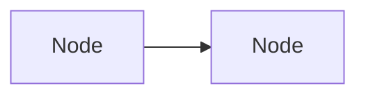

# CLAUDE.md

This file provides guidance to Claude Code (claude.ai/code) when working with code in this repository.

## What This Repo Is

A Jekyll static site published to GitHub Pages at `https://shivajideotale.github.io/system-design-notes`. The theme is [just-the-docs](https://just-the-docs.com/) v0.10.0 loaded via `remote_theme`. Content is organized into phases under `phase-1/` and `phase-2/`. Each `.md` file is a standalone topic page.

## Local Development

Install dependencies (first time):
```bash
bundle install
```

Serve locally with live reload:
```bash
bundle exec jekyll serve --livereload
```

The site runs at `http://localhost:4000/system-design-notes/`.

GitHub Pages builds automatically on push to `main` (via the `github-pages` gem).

## Content Structure

Every content page requires this front matter:
```yaml
---
layout: default
title: "X.Y Topic Name"
parent: "Phase N: Phase Title"
nav_order: N
---
```

Phase index pages (`phase-N/index.md`) use `has_children: true` and no `parent`.

## Styling Architecture

All custom CSS lives in `_sass/custom/custom.scss`. The site uses a custom "Tech Noir" dark palette defined via CSS custom properties on `:root`:

- `--bg-primary` / `--bg-secondary` / `--bg-card` / `--bg-tertiary` — background layers
- `--text-primary` / `--text-secondary` / `--text-muted` — text hierarchy
- `--accent-cyan` (#00c9a7) — primary accent (borders, arrows, highlights)
- `--accent-blue` (#58a6ff) / `--accent-yellow` (#f0b429) / `--accent-red` (#ff7b72) — secondary accents
- `--border-color` (#30363d) — subtle borders

**Known CSS patterns to maintain:**
- Tables use `border-collapse: separate; border-spacing: 0` (not `collapse`) so `border-radius` works. Corner cells get individual `border-radius` overrides.
- Callout badges (`.note`, `.warning`, `.important`) use `::before` positioned *inside* the box (`left: 0.7rem; top: 0.875rem`) with `padding-left: 2.5rem` to make space. Do not move them outside — they get clipped.
- Mermaid diagrams use `theme: "dark"` in `_config.yml` as the base, then `_sass/custom/custom.scss` overrides colors using the Tech Noir palette variables.

## Mermaid Diagrams

Mermaid v10.9.0 is loaded via CDN (configured in `_config.yml`). Use fenced code blocks:

````markdown

````

Diagram types in use: `flowchart` (TD/LR), `sequenceDiagram`, `stateDiagram-v2`. The CSS in `custom.scss` targets SVG internals for all three types. When adding new diagram types, add corresponding CSS rules to the `.mermaid { }` block.

## Content Guidelines

Each topic page follows this pattern:
1. TOC block (collapsible `<details>`)
2. Introduction paragraph
3. `---` divider
4. H2 sections covering: concept, algorithms/patterns, implementation (Java examples), trade-offs
5. "Key Takeaways for Interviews" section
6. "References" section

Java code examples use Spring Boot idioms. Prefer real, runnable snippets over pseudocode.
