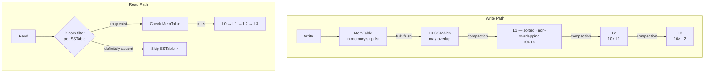

# Data Structures for System Design
{: .no_toc }

<details open markdown="block">
  <summary>Table of Contents</summary>
  {: .text-delta }
1. TOC
{:toc}
</details>

These data structures are the building blocks of large-scale systems. They appear constantly in system design interviews because they solve fundamental problems around distribution, approximation, and efficient storage.

---

## Consistent Hashing

### The Problem

In a distributed cache or database with N nodes, naive `hash(key) % N` routing fails when a node is added or removed — almost every key remaps to a different node. Cache invalidation rate approaches 100%.

### The Solution: Hash Ring

Map both **nodes** and **keys** to positions on a circular hash ring (0 to 2³²-1). Each key is served by the **first node clockwise** from its position.

```
        0
       /
  300 —— 60
  |       |
  240    120
       \
       180
```

**Adding a node:** Only keys between the new node and its predecessor remapping. O(K/N) keys move.

**Removing a node:** Only keys that mapped to the removed node must move to its successor.

### Virtual Nodes

**Problem with basic ring:** Uneven distribution. Node A might own 40% of the ring, Node B only 10%.

**Solution:** Each physical node gets **V virtual nodes** (replicas) placed at V positions on the ring.

```
Ring positions for 3 nodes, V=3:
  NodeA-1, NodeB-2, NodeC-1, NodeA-2, NodeB-1, NodeA-3, NodeC-2, NodeB-3, NodeC-3
```

- More virtual nodes → more even distribution
- Typical V: 100–200 per physical node
- Cassandra uses 256 virtual nodes per node by default

**Java sketch:**
```java
TreeMap<Long, String> ring = new TreeMap<>();

void addNode(String node, int vnodes) {
    for (int i = 0; i < vnodes; i++) {
        long hash = hash(node + "-" + i);
        ring.put(hash, node);
    }
}

String getNode(String key) {
    long hash = hash(key);
    Map.Entry<Long, String> entry = ring.ceilingEntry(hash);
    return entry != null ? entry.getValue() : ring.firstEntry().getValue();
}
```

### Where It's Used

- **Apache Cassandra:** Partitioning data across nodes
- **Amazon DynamoDB:** Internal consistent hashing for partitions
- **Redis Cluster:** 16384 hash slots distributed across nodes
- **CDN routing:** Which edge PoP serves a URL
- **Rendezvous hashing (HRW):** Alternative to consistent hashing used in some CDNs

---

## Bloom Filters

### The Problem

How do you check if an element is in a very large set **without storing the entire set**?

Real scenarios:
- Is this URL already crawled? (web crawler)
- Does this username exist? (avoid expensive DB lookup for new signups)
- Is this Bitcoin address a known bad address?
- Cassandra: is this key in this SSTable before we do the disk read?

### How It Works

A Bloom filter is a bit array of size `m` with `k` hash functions.

**Insert `x`:**
- Compute `h1(x)`, `h2(x)`, ..., `hk(x)` → set those `k` bits to 1

**Query `x`:**
- Compute the same `k` hashes
- If ANY of those bits is 0 → **definitely not in set**
- If ALL bits are 1 → **probably in set** (false positive possible)

**Key property:** No false negatives. False positives are tunable.

### False Positive Rate

```
False positive rate ≈ (1 - e^(-kn/m))^k

Where:
  m = number of bits
  n = number of inserted elements
  k = number of hash functions
```

**Optimal k (minimizes false positive rate):**
```
k = (m/n) × ln(2) ≈ 0.693 × (m/n)
```

**Practical sizing:**
- For 1% false positive rate: ~10 bits per element (m/n = 10)
- For 0.1% false positive rate: ~15 bits per element

| n (elements) | Target FP rate | m (bits) | Memory |
|:-------------|:--------------|:---------|:-------|
| 1,000,000 | 1% | 10,000,000 | ~1.2 MB |
| 10,000,000 | 1% | 100,000,000 | ~12 MB |
| 1,000,000 | 0.1% | 15,000,000 | ~1.8 MB |

**Trade-off:** Small, fixed memory but cannot delete elements (unless Counting Bloom Filter).

### Where It's Used

- **Apache Cassandra:** Each SSTable has a Bloom filter. Before reading from disk, check if the key might be there. Reduces 95%+ of unnecessary disk reads.
- **Google Bigtable:** Row key lookup optimization
- **Redis:** Available via RedisBloom module
- **Web browsers:** Safe Browsing API (Chrome downloads compressed Bloom filter of malicious URLs)
- **CDN:** Check if an asset is in cache before hitting origin

**Java (Guava):**
```java
BloomFilter<String> filter = BloomFilter.create(
    Funnels.stringFunnel(Charset.defaultCharset()),
    10_000_000,   // expected insertions
    0.01          // false positive rate
);
filter.put("user123");
filter.mightContain("user123"); // true
filter.mightContain("user999"); // false (or rare FP)
```

---

## Skip Lists

### The Problem

Binary search trees get complex with concurrency (need balanced rotations, locking). Is there a simpler probabilistic data structure that gives O(log n) search with easier concurrent implementation?

### How It Works

A skip list is a linked list with multiple levels. Each level is a "highway" that skips over many nodes.

```
Level 3: ----1 ----------------------------------------- 100
Level 2: ----1 ----------- 30 ----------- 70 ----------- 100
Level 1: ----1 ----- 15 -- 30 -- 45 -- 60 70 -- 85 ----- 100
Level 0: ----1 - 8 - 15 - 22 - 30 - 38 - 45 - 52 - 60 - 70 - 85 - 92 - 100
```

**Search for 60:** Start at top level, travel right until you overshoot, drop down. ~O(log n) steps.

**Insertion:** Insert at Level 0 always. Probabilistically promote to higher levels (coin flip, p=0.5). Expected O(log n) levels.

**Advantage over B-Trees:** Easier lock-free/concurrent implementation. Insertion/deletion doesn't require rotations or global restructuring.

### Where It's Used

- **Redis Sorted Sets (ZSET):** Implemented as a skip list. O(log n) for add, remove, range queries. This is why `ZADD`, `ZRANGE`, `ZRANGEBYSCORE` are all O(log n) + O(k) for range.
- **LevelDB / RocksDB memtable:** In-memory structure before flush to SSTable
- **Java `ConcurrentSkipListMap`:** Thread-safe sorted map without locks (lock-free)

---

## HyperLogLog

### The Problem

Count distinct elements (cardinality) in a stream of billions of items with minimal memory. Exact count requires O(n) memory. Can we approximate with O(1)?

**Use cases:** Unique visitors per page per day, distinct search queries, unique IP addresses.

### How It Works

**Core insight:** In a uniform hash, the probability of seeing a hash starting with `k` leading zeros is `1/2^k`. If the maximum run of leading zeros you've observed is `k`, a good estimate of cardinality is `2^k`.

HyperLogLog uses many such estimators (m=2^b buckets), each tracking max leading zeros, and combines them using harmonic mean.

**Error rate:** `1.04 / √m`

| Buckets (m) | Memory | Standard Error |
|:------------|:-------|:---------------|
| 16 | 16 bytes | 26% |
| 1024 | 1 KB | 3.25% |
| 16384 | 16 KB | 0.81% |
| 65536 | 64 KB | 0.40% |

**Redis HyperLogLog:** Fixed 12 KB for any cardinality, ~0.81% error.

```bash
# Redis
PFADD daily:visits:2024-01-01 user1 user2 user3
PFCOUNT daily:visits:2024-01-01   # → 3
PFADD daily:visits:2024-01-01 user1 user4
PFCOUNT daily:visits:2024-01-01   # → 4 (deduped)
PFMERGE weekly:visits daily:visits:2024-01-01 daily:visits:2024-01-02
```

### Where It's Used

- **Redis:** `PFADD/PFCOUNT` — unique visitor counts, A/B test user cardinality
- **Apache Spark, Flink:** Cardinality estimation in streaming pipelines
- **Google BigQuery:** `APPROX_COUNT_DISTINCT()` function
- **Cassandra:** Query planner cardinality estimates

---

## Count-Min Sketch

### The Problem

How many times has element `x` appeared in a stream? Exact frequency counting requires O(distinct elements) space. With a sketch, approximate in O(w × d) space.

### How It Works

A 2D array of counters: width `w`, depth `d`, with `d` independent hash functions.

**Increment `x`:**
- For each row `i`: increment `table[i][hi(x)]`

**Query frequency of `x`:**
- For each row `i`: read `table[i][hi(x)]`
- Return the minimum across all rows

**Why minimum?** Collisions can only increase a counter (never decrease). The minimum over independent hash functions minimizes the overcount.

**Error bound:** Frequency estimate ≤ true frequency + ε × N, with probability 1−δ.
- Set w = ⌈e/ε⌉, d = ⌈ln(1/δ)⌉

**Example:** 1% error with 99% confidence → w = 272, d = 5 → 1360 counters

### Where It's Used

- **Counting heavy hitters:** Which items appear most frequently? (Top-K URLs, most queried terms)
- **Networking:** Per-flow packet counting in routers
- **Kafka/Flink:** Frequency estimation in stream processing
- **Redis:** RedisBloom module includes CMS

---

## LSM Trees (Log-Structured Merge Trees)

### The Problem

Random writes to a B-Tree require random disk I/O (update in place). On HDD, random write = ~10ms seek. Can we make writes faster?

### How LSM Works

**Core idea: Convert random writes to sequential writes.**



### Write Amplification vs Read Amplification

**LSM writes:** Always sequential (cheap). Every write goes to MemTable first.

**LSM reads:** Must check MemTable + multiple levels. Bloom filters mitigate this. Point lookups: O(log N). Range scans: potentially slow if data is scattered across levels.

**Compaction writes data multiple times** (write amplification factor ~10–30× in level-based compaction).

| Metric | LSM Tree | B+ Tree |
|:-------|:---------|:--------|
| Write speed | Very fast (sequential) | Slower (random I/O) |
| Read speed | Slower (check multiple levels) | Fast (single tree traversal) |
| Space efficiency | Lower (compaction overhead) | High |
| Write amplification | 10–30× | ~2× |
| Read amplification | High without Bloom filters | Low |
| Best for | Write-heavy workloads | Read-heavy, random reads |

### Where It's Used

- **Apache Cassandra:** Each node stores data in SSTables with LSM
- **RocksDB:** Facebook's embedded KV store (used in Kafka, TiKV, MyRocks)
- **LevelDB:** Google's embedded KV store (predecessor to RocksDB)
- **HBase:** Built on top of HDFS with LSM structure
- **ScyllaDB:** LSM like Cassandra but in C++

---

## B+ Trees

### What It Is

A balanced tree where:
- **All data** is stored in **leaf nodes** (unlike B-Tree where internal nodes also store data)
- Leaf nodes are **linked together** as a doubly-linked list (enables range scans)
- Internal nodes store only keys (for routing)

```
               [20 | 50]          ← Internal nodes (keys only)
              /     |    \
        [10|15]  [25|30]  [60|80] ← Internal nodes
         /    \
     [5|8] [12|14]               ← Leaf nodes (actual data + next-ptr)
      ↑ ↑ ↑ ↑ ↑ ↑
      data records (or pointers to data)
```

### Why B+ Trees Dominate RDBMS

**Range queries are O(log n + k):** Traverse to the first key, then follow the leaf-linked list. No backtracking.

**Node size matches disk page (4KB–16KB):** Minimizes disk I/O. A 4KB page with 4-byte keys can hold ~1000 keys per node → tree height ≈ 3–4 for billions of records.

**Index height example (MySQL InnoDB, 16KB page):**
- 16KB page, 8-byte key, 6-byte pointer = ~1170 keys per internal node
- 3-level B+ Tree: 1170² × leaf records = ~1.7 billion records with only 3 I/Os

### B+ Tree vs LSM Trade-offs (Interview Classic)

**Use B+ Tree (MySQL InnoDB, PostgreSQL):**
- OLTP workloads with many random reads
- Point lookups are fast
- Updates in-place (good for frequent small updates)
- Strong transactional support

**Use LSM (Cassandra, RocksDB):**
- Write-heavy workloads (time-series, log ingestion, event stores)
- Append-mostly data
- Acceptable read overhead (mitigated by Bloom filters)

### Where It's Used

- **MySQL InnoDB:** Primary key index AND secondary indexes
- **PostgreSQL:** Default index type
- **SQLite:** Page-level B-Tree for both table and index storage
- **MongoDB WiredTiger:** Uses B-Tree storage engine

---

## Summary: When to Use What

| Structure | Use When |
|:----------|:---------|
| **Consistent Hashing** | Distributing data/load across N nodes with minimal reshuffling on add/remove |
| **Bloom Filter** | Fast "definitely no" check before expensive DB/disk lookup |
| **Skip List** | Sorted data with concurrent access (Redis ZSETs, Java ConcurrentSkipListMap) |
| **HyperLogLog** | Approximate distinct count in millions/billions with tiny memory |
| **Count-Min Sketch** | Approximate frequency counts, heavy-hitter detection |
| **LSM Tree** | Write-heavy storage engine (Cassandra, RocksDB, Kafka log) |
| **B+ Tree** | Read-heavy RDBMS indexes, range queries |

---

## References

- *Designing Data-Intensive Applications* — Chapter 3 (Storage and Retrieval)
- [Redis data structures documentation](https://redis.io/docs/data-types/)
- [LSM Trees in Cassandra (DataStax)](https://www.datastax.com/blog/storage-engine-cassandra)
- [HyperLogLog paper](https://algo.inria.fr/flajolet/Publications/FlFuGaMe07.pdf) — Flajolet et al.
