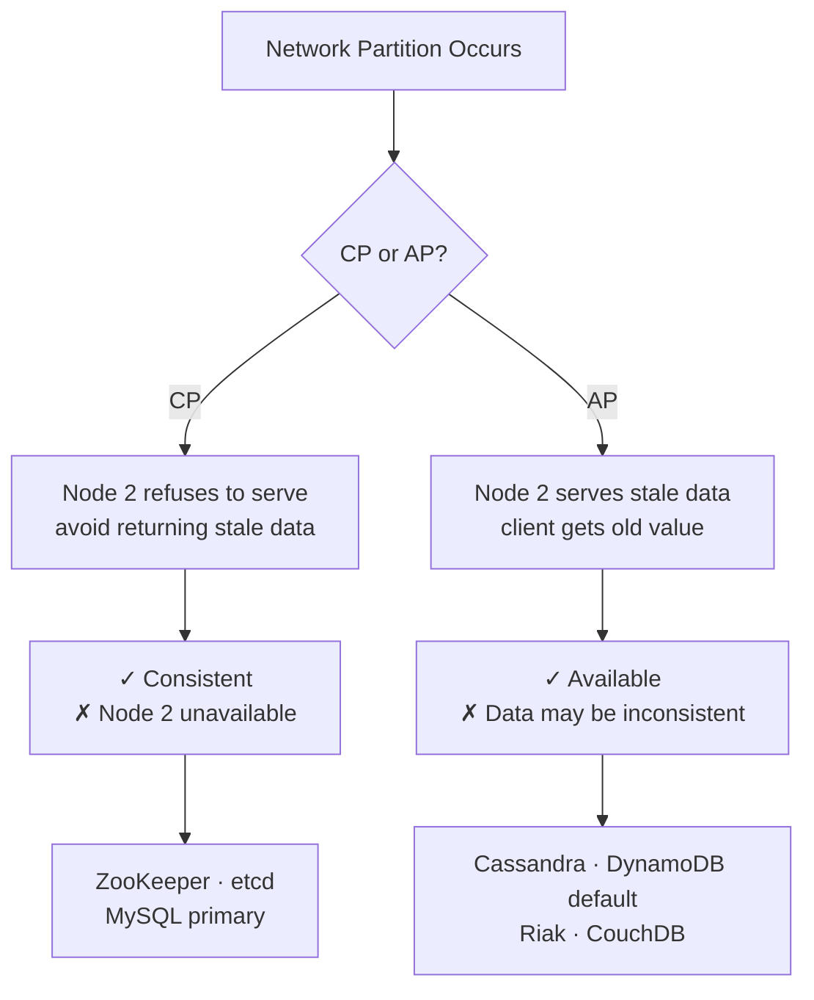
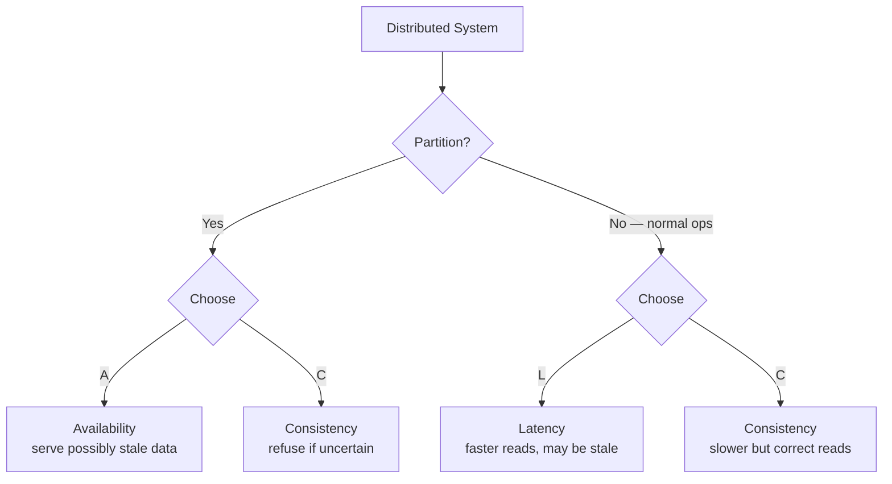

# CAP & PACELC Theorem
{: .no_toc }

<details open markdown="block">
  <summary>Table of Contents</summary>
  {: .text-delta }
1. TOC
{:toc}
</details>

CAP theorem is the most cited concept in distributed systems interviews — and the most misapplied. Most engineers can recite it; few can use it correctly to make design decisions. This page covers the theorem precisely, its real implications, the PACELC extension, and where real-world systems sit.

---

## CAP Theorem

**Theorem (Brewer, 2000):** In the presence of a network partition, a distributed system cannot simultaneously guarantee both **Consistency** and **Availability**. You must choose one.

### The Three Properties

**Consistency (C):** Every read receives the most recent write or an error. All nodes see the same data at the same time. (This is Linearizability, not ACID consistency — the C in CAP ≠ the C in ACID.)

**Availability (A):** Every request receives a response (not an error), though it may be stale. The system is always operational.

**Partition Tolerance (P):** The system continues to operate even when network messages between nodes are delayed or lost.

### Why P is Not Optional

```
Node 1                  Node 2
  │                        │
  │  ←── network cut ───→  │
  │                        │
Client A writes x=2     Client B reads x
```

Network partitions happen in real distributed systems — hardware failures, network misconfigurations, cloud AZ outages. **You cannot build a multi-node distributed system that doesn't have to handle partitions.**

Therefore, the real choice is: **during a network partition, do you prefer CP or AP?**

- **CP system:** During a partition, some nodes refuse to serve requests to avoid returning stale data. Consistent, but less available.
- **AP system:** During a partition, nodes keep serving requests using potentially stale data. Always available, but inconsistent.

### CP vs AP: The Trade-off



{: .important }
The CAP theorem only describes what happens **during a partition**. When the network is healthy, you can have both consistency and availability. The choice is: what do you sacrifice when the network fails?

---

## PACELC Theorem

**PACELC (Abadi, 2012)** extends CAP by noting that **even without a partition**, a distributed system faces a trade-off between **latency and consistency**.



This is more realistic. The Cassandra vs Zookeeper decision isn't just about partition behavior — it's about whether you want millisecond-latency stale reads (Cassandra) or slightly slower consistent reads (Zookeeper) **all the time**, not just during failures.

### PACELC Categorization

| System | Partition: A or C | No Partition: L or C | Description |
|:-------|:-----------------|:--------------------|:------------|
| Cassandra | PA | EL | AP always. Fast, stale reads OK |
| DynamoDB (default) | PA | EL | AP always. Tunable to PC/EC |
| Riak | PA | EL | AP system |
| Couchbase | PA | EL | AP system |
| Zookeeper | PC | EC | CP always. Strong consistency |
| etcd | PC | EC | CP always (Raft-based) |
| HBase | PC | EC | CP (ZooKeeper-based coordination) |
| MySQL (primary) | PC | EC | Single-primary consistency |
| MongoDB (primary) | PC | EC | Reads from primary are consistent |
| CRDT systems | PA | EL | Merge-based conflict resolution |

---

## Consistency Models (Spectrum)

CAP's "C" is linearizability — the strongest model. Real systems offer a spectrum.


**← Weakest** (high availability, low latency) &nbsp;→&nbsp; **Strongest** (high consistency, higher latency)

### Eventual Consistency

All replicas will **eventually** converge to the same value. No guarantee of when.

```
Write: User updates profile → Primary acknowledges
Read: Other users may see old profile for seconds/minutes
Eventually: All replicas have the new profile
```

**Real-world examples:** DNS propagation (up to 48 hours), S3 object updates (now "read-after-write" but historically eventual), social media post visibility.

**Good for:** Comment counts, like counts, social graph edges — where brief inconsistency is acceptable.

### Read-Your-Writes Consistency

A client always sees its own writes, even if other clients see stale data.

```
Client A writes x=2
Client A immediately reads x → sees 2 (not stale)
Client B reads x → may see 1 (hasn't received the write yet)
```

**Implementation:** Route the writing client's reads to the same primary, or use a version token.

### Causal Consistency

Causally related operations are seen in order by all nodes. Unrelated operations may be seen in different orders.

```
Alice posts: "Anyone want coffee?"
Bob replies: "Yes, please!"

Everyone must see Alice's post BEFORE Bob's reply (causal dependency).
Unrelated posts from Carol may appear in any order relative to this exchange.
```

**Used in:** DynamoDB DAX, some MongoDB configurations, collaborative editing.

### Sequential Consistency

All processes see all operations in the same order, though not necessarily in real-time order.

**Stronger than causal, weaker than linearizable.** Cassandra with `QUORUM` consistency is often described as sequential (not strictly linearizable).

### Linearizability (Strict Consistency)

The strongest model. Reads always reflect the most recent write. The system behaves as if there is one copy of the data and operations are instantaneous.

```
Time:    T1        T2        T3
Client A: write(x=5)
Client B:           read(x) → must return 5 (not 4)
```

**Used in:** Zookeeper (for locks and coordination), etcd, single-node databases.

**Cost:** High latency (requires quorum synchronization on every read). Cannot be available during partitions (CP).

### Practical Guidance

```
Use strong consistency (linearizable) when:
  - Financial transactions (account balances)
  - Leader election, distributed locks
  - Inventory decrement (avoid overselling)
  - Configuration management

Use eventual consistency when:
  - Social media feeds, like counts, view counts
  - User profiles (minor delay acceptable)
  - Cache invalidation (content eventually updates)
  - Product catalog (price updates can lag briefly)
```

---

## Real-World System Placement

### Apache Cassandra

**AP/EL: Availability-focused, eventually consistent by default.**

Cassandra uses **tunable consistency** — you choose per-query:

```java
// CQL in Java (DataStax driver)

// Eventually consistent, highest performance
SELECT * FROM users WHERE id = ? 
    USING CONSISTENCY ONE;        // responds from 1 replica

// Consistent (quorum)
SELECT * FROM users WHERE id = ? 
    USING CONSISTENCY QUORUM;     // responds from (N/2)+1 replicas

// Always read from primary (linearizable)  
SELECT * FROM users WHERE id = ? 
    USING CONSISTENCY ALL;        // all replicas must respond
```

With `QUORUM` reads and writes (W+R > N), Cassandra provides strong consistency — but at higher latency cost.

**Key insight:** Cassandra's **design** is AP, but you can configure it toward CP via consistency levels. The default is AP (ONE/LOCAL_ONE) because Cassandra is usually used for workloads where availability matters more than strict consistency.

### Apache ZooKeeper

**CP: Always consistent, may be unavailable during leader election.**

ZooKeeper provides linearizable reads and writes. Used for distributed coordination: leader election, distributed locks, service discovery.

During a leader election (triggered by network partition or leader failure), ZooKeeper is briefly **unavailable** — it refuses requests until a new leader is elected.

**This is the correct choice for a lock service.** A distributed lock that returns stale "locked" state would cause data corruption. Better to be briefly unavailable than to give a wrong answer.

### Amazon DynamoDB

**PA/EL by default, configurable to PC/EC.**

```java
// Default: eventually consistent read (AP, fastest)
GetItemRequest request = GetItemRequest.builder()
    .tableName("Users")
    .key(Map.of("userId", AttributeValue.fromS("123")))
    .consistentRead(false)  // default
    .build();

// Strongly consistent read (CP, higher latency + 2× read cost)
GetItemRequest request = GetItemRequest.builder()
    .tableName("Users")
    .key(Map.of("userId", AttributeValue.fromS("123")))
    .consistentRead(true)
    .build();
```

**DynamoDB Transactions** (TransactWriteItems) provide ACID guarantees across multiple items — strongly consistent.

### MongoDB

**PC/EC by default when reading from primary.**

MongoDB's replica set with reads from **primary** provides linearizable consistency. Reads from **secondaries** are eventually consistent.

```java
// Strongly consistent — read from primary
mongoTemplate.find(query, User.class)
    // default readPreference is PRIMARY → consistent

// Eventual — may read stale data from secondary
mongoTemplate.withReadPreference(ReadPreference.secondaryPreferred())
    .find(query, User.class);
```

### Redis

**CP for single node. AP with replication.**

- Single-node Redis: linearizable (single-threaded, no partitions)
- Redis replication: async → AP during partition
- Redis Sentinel: CP (briefly unavailable during failover)
- Redis Cluster: AP (each shard is independent)

### Comparison Table

| System | Typical Use | Partition choice | Latency vs Consistency |
|:-------|:-----------|:----------------|:-----------------------|
| Cassandra | Wide-column store, writes | Availability | Latency (configurable) |
| DynamoDB | KV/Document, flexible | Availability | Latency (configurable) |
| Zookeeper | Coordination, locks | Consistency | Consistency |
| etcd | K8s config, service discovery | Consistency | Consistency |
| MongoDB (primary) | Document store | Consistency | Consistency |
| HBase | Wide-column, Hadoop | Consistency | Consistency |
| MySQL (primary) | RDBMS | Consistency | Consistency |

---

## Using CAP in System Design Interviews

The right way to use CAP is not to say "we'll use Cassandra because it's AP." It's to identify what the system actually needs:

**Step 1: What's the consistency requirement?**
- Financial transaction? → Need linearizable. Use CP (PostgreSQL, etcd for locks).
- User profile read? → Stale by 1 second is fine. Use AP (Cassandra, DynamoDB eventual).
- Shopping cart? → Need read-your-writes at minimum. Use Dynamo strong or Redis.

**Step 2: What's the availability requirement?**
- If being briefly unavailable during a partition is unacceptable → AP
- If returning wrong data during a partition is unacceptable → CP

**Step 3: State the trade-off explicitly.**
- "We'll use Cassandra with QUORUM reads and writes. This gives us strong consistency at the cost of needing 2 of 3 replicas to be up. During a partition where 2 replicas are isolated, writes will fail."

---

## Key Takeaways for Interviews

1. **P is not a choice.** Network partitions happen. The real choice is CP vs AP during a partition.
2. **CAP only describes partition behavior.** PACELC extends it to normal operation (latency vs consistency).
3. **Tunable consistency is the modern answer.** Cassandra and DynamoDB let you choose per-operation, not system-wide.
4. **"Eventual consistency" is not a single model.** Causal, read-your-writes, and sequential are different points on the spectrum.
5. **Always state why.** "I'll use Cassandra here because user activity feed reads can tolerate 100ms of stale data, and we need the write throughput."

---

## References

- [Brewer's CAP Theorem (2000)](https://people.eecs.berkeley.edu/~brewer/cs262b-2004/PODC-keynote.pdf)
- [Abadi's PACELC (2012)](http://cs-www.cs.yale.edu/homes/dna/papers/abadi-pacelc.pdf)
- *Designing Data-Intensive Applications* — Chapter 9 (Consistency and Consensus)
- [Cassandra consistency levels documentation](https://docs.datastax.com/en/cassandra-oss/3.0/cassandra/dml/dmlConfigConsistency.html)
- [Kyle Kingsbury's Jepsen analyses](https://jepsen.io/analyses) — real-world database consistency testing
