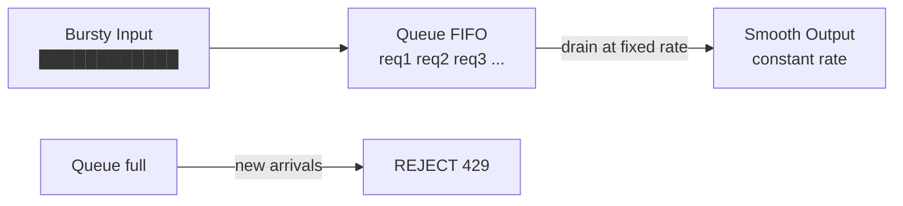
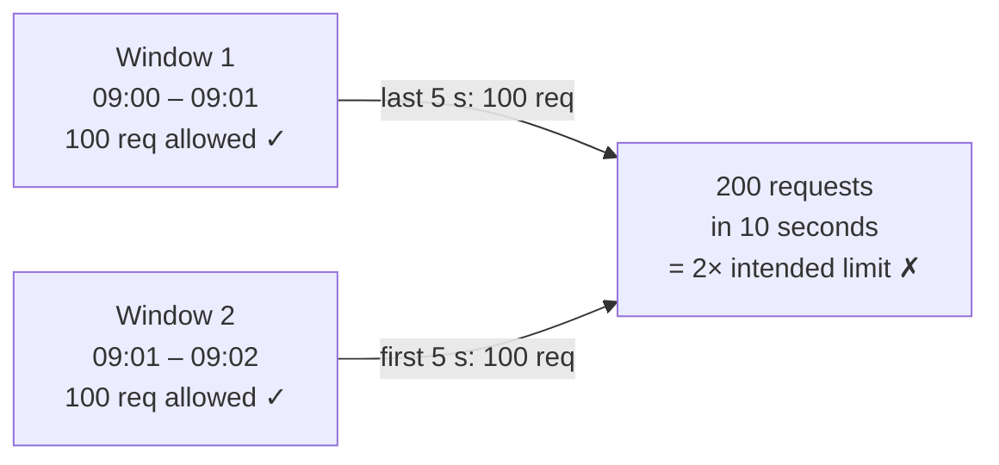
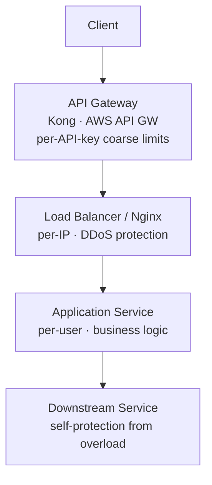

# Rate Limiting & Throttling
{: .no_toc }

<details open markdown="block">
  <summary>Table of Contents</summary>
  {: .text-delta }
1. TOC
{:toc}
</details>

Rate limiting controls how many requests a client can make in a given time window. It protects services from overload, prevents abuse, enforces fair usage, and controls costs. Without it, a single misbehaving client or a DDoS attack can take down your entire system.

---

## Why Rate Limiting Matters

| Goal | Example |
|:-----|:--------|
| **DDoS mitigation** | Block IP sending 100K req/sec |
| **Fair usage** | Free tier: 100 req/min; paid tier: 10K req/min |
| **Cost control** | Limit GPT API calls per user |
| **Cascade failure prevention** | API gateway throttles to protect overloaded backend |
| **Bot prevention** | Limit password reset attempts |

---

## Rate Limiting Algorithms

### Token Bucket

The most widely used algorithm (default for AWS API Gateway).

**Concept:** A bucket holds tokens up to a maximum capacity. Tokens are added at a fixed rate. Each request consumes one token. If the bucket is empty, the request is rejected.

```
bucket_capacity = 100 tokens
refill_rate = 10 tokens/second
current_tokens = 80

Request arrives:
  80 > 0? → allow, consume 1 token → tokens = 79

1 second later: refill → tokens = min(100, 79 + 10) = 89

Burst: 89 requests arrive instantly:
  89 ≤ 89 → all allowed → tokens = 0
  Request 90: tokens = 0 → REJECT (429)
```

**Key property: allows bursting** up to `bucket_capacity`. After a period of inactivity, the bucket fills up — a user who hasn't made requests for 10 seconds can burst 100 requests.

**Pros:** Handles burst traffic gracefully. Simple to implement.  
**Cons:** A burst can still overwhelm a downstream service even if it's within the configured rate.

### Leaky Bucket

**Concept:** Requests enter a queue (the "bucket"). The queue drains at a fixed rate regardless of input rate. If the queue is full, new requests are rejected.



**Key property: shapes traffic to a constant output rate.** Unlike token bucket, burst requests are smoothed out — they queue rather than being immediately served.

**Pros:** Smooth, predictable output. Prevents downstream overload.  
**Cons:** High latency for queued requests. Queue depth limits burst capacity. Lost requests when queue is full.

**Use case:** Outbound request rate shaping (e.g., sending emails at max 100/sec regardless of how many are queued).

### Fixed Window Counter

**Concept:** Count requests in fixed time windows (e.g., per minute). Reset counter when window ends.

```
Window: 09:00:00 – 09:00:59
Limit: 100 requests/minute
Counter: 0

09:00:30: 60 requests arrive → counter = 60, allowed
09:00:55: 50 requests arrive → counter = 110 → 40 allowed, 10 rejected

09:01:00: window resets → counter = 0
09:01:00: 100 requests arrive instantly → counter = 100, all allowed
```

**Critical flaw: boundary burst problem.**



**Pros:** Simple. O(1) space and time.  
**Cons:** Boundary burst allows 2× the intended rate at window boundaries.

### Sliding Window Log

**Concept:** Track the exact timestamp of every request. On each new request, count how many requests fall within the last time window. Reject if count exceeds limit.

```
Limit: 5 requests/minute

Timestamps log: [09:00:10, 09:00:20, 09:00:30, 09:00:40, 09:00:50]

New request at 09:01:05:
  Remove timestamps older than 09:00:05
  → [09:00:10, 09:00:20, 09:00:30, 09:00:40, 09:00:50] (all within 60s)
  Count = 5, limit = 5
  → REJECT (429)

New request at 09:01:15:
  Remove timestamps older than 09:00:15
  → [09:00:20, 09:00:30, 09:00:40, 09:00:50]
  Count = 4 < 5 → ALLOW, add 09:01:15 to log
```

**Pros:** Perfectly accurate. No boundary burst problem.  
**Cons:** High memory usage — stores every request timestamp. Not practical at millions of requests per second.

**Use case:** Low-volume, high-precision rate limiting (e.g., sensitive API operations).

### Sliding Window Counter (Hybrid)

**Concept:** Combines the efficiency of fixed window with the smoothness of sliding window. Use two adjacent fixed-window counters and interpolate.

```
Limit: 100 requests/minute
Current time: 09:01:45 (45% into current window)

Previous window count (09:00–09:01): 80 requests
Current window count (09:01–09:02): 30 requests

Estimated count = (80 × (1 - 0.45)) + 30
               = (80 × 0.55) + 30
               = 44 + 30
               = 74 requests

74 < 100 → ALLOW
```

**This is an approximation**, but it's accurate enough for practical purposes with low memory overhead (just 2 counters per key).

**Pros:** Low memory, smooth approximation, efficient.  
**Cons:** Slight inaccuracy due to interpolation.

**Used by:** Cloudflare, Figma, most modern rate limiters.

### Algorithm Comparison

| Algorithm | Memory | Accuracy | Burst Behavior | Use Case |
|:----------|:-------|:---------|:--------------|:---------|
| Token Bucket | O(1) | High | Allows controlled bursts | API rate limiting (AWS default) |
| Leaky Bucket | O(queue) | High | Smooths bursts | Outbound rate shaping |
| Fixed Window | O(1) | Low (boundary burst) | 2× burst at boundary | Simple, non-critical |
| Sliding Window Log | O(requests) | Perfect | No burst | Low-volume, sensitive ops |
| Sliding Window Counter | O(1) | High (approx) | Smooth | Most production systems |

---

## Implementation

### Single Server (In-Memory)

For single-node or development environments:

```java
// Token bucket with ConcurrentHashMap — not distributed
@Component
public class InMemoryRateLimiter {
    private final ConcurrentHashMap<String, TokenBucket> buckets = new ConcurrentHashMap<>();
    
    public boolean allowRequest(String clientId) {
        TokenBucket bucket = buckets.computeIfAbsent(clientId,
            k -> new TokenBucket(100, 10)); // capacity=100, refill=10/sec
        return bucket.tryConsume();
    }
}

class TokenBucket {
    private final int capacity;
    private final double refillRatePerSecond;
    private double tokens;
    private long lastRefillTimestamp;
    
    public synchronized boolean tryConsume() {
        refill();
        if (tokens >= 1) {
            tokens--;
            return true;
        }
        return false;
    }
    
    private void refill() {
        long now = System.currentTimeMillis();
        double secondsSinceRefill = (now - lastRefillTimestamp) / 1000.0;
        tokens = Math.min(capacity, tokens + secondsSinceRefill * refillRatePerSecond);
        lastRefillTimestamp = now;
    }
}
```

### Distributed Rate Limiting with Redis

For multi-instance deployments, the rate limit state must be shared. Redis is the standard.

#### Fixed Window Counter (INCR + EXPIRE)

```java
@Service
public class RedisRateLimiter {
    @Autowired private RedisTemplate<String, Long> redis;
    
    public boolean isAllowed(String clientId, int limit, Duration window) {
        String key = "rate:" + clientId + ":" + windowKey(window);
        
        Long count = redis.opsForValue().increment(key);
        if (count == 1) {
            // First request in window — set expiry
            redis.expire(key, window);
        }
        return count <= limit;
    }
    
    private String windowKey(Duration window) {
        long windowStart = System.currentTimeMillis() / window.toMillis();
        return String.valueOf(windowStart);
    }
}
```

**Problem:** The INCR and EXPIRE are two separate commands — not atomic. There's a race condition: two instances both see count=1 and both try to set expiry. The second call may reset the TTL.

#### Atomic Sliding Window with Lua Script

Lua scripts execute atomically on Redis — no race conditions.

```java
@Bean
public RedisScript<Long> slidingWindowScript() {
    String script = """
        local key = KEYS[1]
        local now = tonumber(ARGV[1])
        local window = tonumber(ARGV[2])
        local limit = tonumber(ARGV[3])
        local req_id = ARGV[4]
        
        -- Remove entries outside the time window
        redis.call('ZREMRANGEBYSCORE', key, '-inf', now - window)
        
        -- Count entries in the window
        local count = redis.call('ZCARD', key)
        
        if count < limit then
            -- Add this request with current timestamp as score
            redis.call('ZADD', key, now, req_id)
            redis.call('EXPIRE', key, window / 1000 + 1)
            return 1  -- allowed
        else
            return 0  -- rejected
        end
        """;
    return RedisScript.of(script, Long.class);
}

@Service
public class SlidingWindowRateLimiter {
    @Autowired private StringRedisTemplate redis;
    @Autowired private RedisScript<Long> script;
    
    public boolean isAllowed(String clientId, int limit, long windowMs) {
        String key = "ratelimit:" + clientId;
        String reqId = UUID.randomUUID().toString();
        long now = System.currentTimeMillis();
        
        Long allowed = redis.execute(
            script,
            List.of(key),
            String.valueOf(now),
            String.valueOf(windowMs),
            String.valueOf(limit),
            reqId
        );
        return Long.valueOf(1).equals(allowed);
    }
}
```

#### Token Bucket with Redis

```lua
-- Atomic token bucket in Lua
local key = KEYS[1]
local capacity = tonumber(ARGV[1])
local refill_rate = tonumber(ARGV[2])  -- tokens per second
local now = tonumber(ARGV[3])

-- Get current state
local last_refill = tonumber(redis.call('HGET', key, 'last_refill') or now)
local tokens = tonumber(redis.call('HGET', key, 'tokens') or capacity)

-- Refill based on time elapsed
local elapsed = (now - last_refill) / 1000  -- convert ms to seconds
tokens = math.min(capacity, tokens + elapsed * refill_rate)

-- Try to consume
if tokens >= 1 then
    tokens = tokens - 1
    redis.call('HMSET', key, 'tokens', tokens, 'last_refill', now)
    redis.call('EXPIRE', key, 3600)
    return 1  -- allowed
else
    redis.call('HMSET', key, 'tokens', tokens, 'last_refill', now)
    return 0  -- rejected
end
```

### Spring Boot Rate Limiting with Bucket4j

[Bucket4j](https://github.com/bucket4j/bucket4j) is a production-ready Java token bucket library with Redis support.

```java
// pom.xml: bucket4j-core + bucket4j-redis

@Configuration
public class RateLimitConfig {
    @Bean
    public ProxyManager<String> bucketProxyManager(RedissonClient redisson) {
        return Bucket4jRedisson.casBasedBuilder(redisson)
            .build();
    }
}

@RestController
public class ApiController {
    @Autowired private ProxyManager<String> buckets;
    
    private BucketConfiguration bucketConfig() {
        return BucketConfiguration.builder()
            .addLimit(Bandwidth.classic(100, Refill.intervally(100, Duration.ofMinutes(1))))
            .addLimit(Bandwidth.classic(10, Refill.intervally(10, Duration.ofSeconds(1))))
            .build();
    }
    
    @GetMapping("/api/data")
    public ResponseEntity<?> getData(HttpServletRequest request) {
        String clientId = extractClientId(request); // from API key or IP
        
        Bucket bucket = buckets.builder()
            .build(clientId, () -> bucketConfig());
        
        ConsumptionProbe probe = bucket.tryConsumeAndReturnRemaining(1);
        
        if (probe.isConsumed()) {
            HttpHeaders headers = new HttpHeaders();
            headers.add("X-RateLimit-Remaining", String.valueOf(probe.getRemainingTokens()));
            return ResponseEntity.ok().headers(headers).body(fetchData());
        } else {
            long retryAfter = probe.getNanosToWaitForRefill() / 1_000_000_000;
            return ResponseEntity.status(HttpStatus.TOO_MANY_REQUESTS)
                .header("Retry-After", String.valueOf(retryAfter))
                .header("X-RateLimit-Remaining", "0")
                .build();
        }
    }
}
```

---

## Where to Place the Rate Limiter



**API Gateway level (recommended for most cases):**
- AWS API Gateway: built-in rate limiting per usage plan
- Kong: rate-limit plugin with Redis backend
- Envoy/Istio: global rate limiting filter

```yaml
# Kong rate limit plugin
plugins:
  - name: rate-limiting
    config:
      minute: 100        # per minute per consumer
      hour: 1000
      policy: redis      # store counters in Redis (distributed)
      redis_host: redis.example.com
      redis_port: 6379
```

---

## HTTP Response Format

Standardized headers communicate rate limit state to clients.

```http
HTTP/1.1 200 OK
X-RateLimit-Limit: 100
X-RateLimit-Remaining: 43
X-RateLimit-Reset: 1714521600    (Unix timestamp when limit resets)

HTTP/1.1 429 Too Many Requests
Content-Type: application/json
Retry-After: 30                  (seconds until client can retry)
X-RateLimit-Limit: 100
X-RateLimit-Remaining: 0
X-RateLimit-Reset: 1714521600

{
  "error": "rate_limit_exceeded",
  "message": "Too many requests. Retry after 30 seconds.",
  "retry_after": 30
}
```

**Always return `Retry-After`.** Clients that don't know when to retry either spam the API (making the problem worse) or give up entirely.

---

## Distributed Rate Limiting Design Considerations

### Race Conditions

Two instances both check "count < limit" and both allow request N+1 before either increments. **Solution:** Use Lua scripts (atomic on Redis) or Redis transactions.

### Clock Drift

In sliding window implementations, server clocks may differ by milliseconds. Use Redis server time (`TIME` command) as the authoritative timestamp, not client clocks.

```lua
-- Use Redis server time instead of client time
local time = redis.call('TIME')
local now_ms = time[1] * 1000 + math.floor(time[2] / 1000)
```

### Redis Availability

If Redis goes down, what happens to your rate limiter?

**Options:**
- **Fail open:** Allow all requests when Redis is down (avoid taking down your service because Redis is down, but lose rate limiting temporarily)
- **Fail closed:** Reject all requests when Redis is down (safe from abuse, but your service is also unavailable)
- **Local fallback:** Fall back to per-instance in-memory rate limiting (less accurate but functional)

```java
public boolean isAllowed(String clientId) {
    try {
        return redisRateLimiter.isAllowed(clientId);
    } catch (RedisConnectionFailureException e) {
        log.warn("Redis rate limiter unavailable, falling back to local");
        return localRateLimiter.isAllowed(clientId); // in-memory
    }
}
```

---

## Key Takeaways for Interviews

1. **Token Bucket is the default answer.** It allows bursting (good UX) and is simple. AWS API Gateway uses it.
2. **Sliding Window Counter for production.** O(1) memory, no boundary burst problem, accurate enough.
3. **Lua script for atomic Redis operations.** Non-atomic INCR+EXPIRE has race conditions — show you know this.
4. **Always return Retry-After.** Well-behaved clients need to know when to retry.
5. **Decide fail-open vs fail-closed early.** Rate limiter availability failures are a real design concern.
6. **Where to place it matters.** API Gateway for business rate limits, load balancer for DDoS/IP protection.

---

## References

- [AWS API Gateway throttling documentation](https://docs.aws.amazon.com/apigateway/latest/developerguide/api-gateway-request-throttling.html)
- [Cloudflare Rate Limiting](https://developers.cloudflare.com/waf/rate-limiting-rules/)
- [Bucket4j documentation](https://bucket4j.com/)
- *System Design Interview* — Alex Xu, Chapter 4 (Design a Rate Limiter)
- [Redis INCR pattern for rate limiting](https://redis.io/commands/incr/#pattern-rate-limiter)
- [Figma's rate limiting blog post](https://www.figma.com/blog/an-inside-look-at-figmas-infrastructure/)
