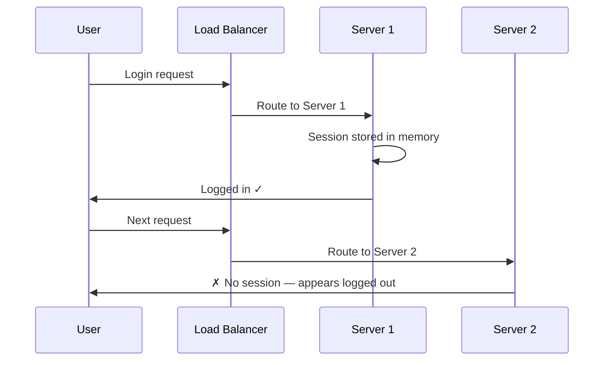
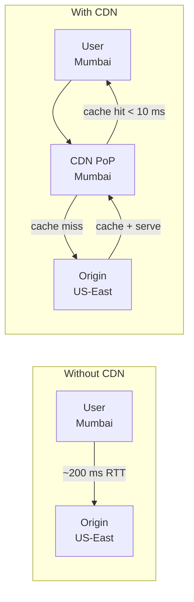

# Scalability Patterns
{: .no_toc }

<details open markdown="block">
  <summary>Table of Contents</summary>
  {: .text-delta }
1. TOC
{:toc}
</details>

---

## Vertical vs Horizontal Scaling

### Vertical Scaling (Scale Up)

Add more resources — CPU, RAM, faster SSD — to a **single machine**.

```
Before:          After:
[Server 4-core]  [Server 32-core, 256GB RAM]
    ↑                    ↑
 8 GB RAM           SSD NVMe storage
```

**When it works well:**
- Databases with complex transactions (hard to shard)
- Applications with shared mutable state
- Low-traffic services where simplicity matters

**Hard limits:**
- Price/performance degrades past a point (a 64-core machine ≠ 8× cheaper than an 8-core)
- Single point of failure — one machine dies, everything stops
- Physical ceiling: you cannot buy a machine with 100 TB RAM
- Downtime required to upgrade hardware

### Horizontal Scaling (Scale Out)

Add more machines. Distribute load across them. This is what the internet runs on.

```
Before:              After:
  [Server 1]           [Server 1]
                  LB → [Server 2]
                       [Server 3]
```

**Requirements for horizontal scaling:**
1. **Stateless servers** — no local session state. Session must be in an external store (Redis, DB).
2. **Externalized configuration** — no config files on local disk.
3. **No local file I/O** — use object storage (S3) for files.
4. **Idempotent operations** — retries must be safe.

### Making Services Stateless

The most common obstacle to horizontal scaling is session state.

**Problem:**


**Solutions:**

| Approach | How | Tradeoff |
|:---------|:----|:---------|
| **Sticky Sessions** | Load balancer always routes user to same server | Breaks if that server dies, uneven load |
| **Shared Session Store** | Store session in Redis | Extra network hop, operational complexity |
| **JWT (Stateless Auth)** | All session state inside signed token | Token can't be invalidated before expiry |
| **Stateless service** | No sessions at all | Clean, but requires auth on every request |

```java
// Spring Boot: distribute session to Redis
// pom.xml: spring-session-data-redis

@Configuration
@EnableRedisHttpSession
public class SessionConfig {
    // Sessions now stored in Redis automatically
    // Any server can handle any request
}
```

### Scaling Comparison

| Dimension | Vertical | Horizontal |
|:----------|:---------|:-----------|
| Cost | Exponential at high end | Linear |
| Complexity | Low (no distribution) | High (distributed state) |
| Failure tolerance | SPOF | Can survive node failures |
| Ceiling | Physical hardware limit | Virtually unlimited |
| Database scaling | Same instance, more RAM | Requires sharding/replication |

{: .important }
**Interview answer:** Start with vertical scaling for databases (simpler), use horizontal scaling for stateless application servers. The real complexity is state — databases are hard to scale horizontally.

---

## Load Balancing

A load balancer distributes incoming requests across a pool of servers. Without it, horizontal scaling doesn't help — clients would hit the same server.

### Layer 4 vs Layer 7 (recap in algorithm context)

| | L4 (TCP/UDP) | L7 (HTTP) |
|:-|:------------|:---------|
| Sees | IP + Port | Full HTTP request |
| Algorithms | IP Hash, Round Robin | Any algorithm + content-based routing |
| TLS termination | Pass-through | Yes (can decrypt and re-encrypt) |
| Examples | AWS NLB, HAProxy TCP | AWS ALB, Nginx, Envoy |

L7 enables smarter routing: route `/api/` to API servers and `/static/` to CDN. This is why L7 is used for application traffic.

### Load Balancing Algorithms

#### Round Robin

Route to servers in sequence: 1 → 2 → 3 → 1 → 2 → 3...

```
Request 1 → Server A
Request 2 → Server B
Request 3 → Server C
Request 4 → Server A  ← wraps around
```

**Good for:** Homogeneous servers, stateless short-lived requests  
**Bad for:** Requests with different processing costs, heterogeneous servers

#### Weighted Round Robin

Assign weights based on server capacity. A 32-core server gets 4× the traffic of an 8-core server.

```
Server A: weight 4  → gets 4 of every 6 requests
Server B: weight 2  → gets 2 of every 6 requests
```

**Use case:** Mixed-capacity server fleets, gradual rollouts (weight new version at 10%)

#### Least Connections

Route to the server with the **fewest active connections**.

```
Server A: 50 active connections
Server B: 10 active connections  ← next request goes here
Server C: 30 active connections
```

**Good for:** Long-lived connections (WebSockets, gRPC streaming), requests with variable processing time  
**Bad for:** High-throughput short requests (overhead of tracking connection counts)

#### IP Hash (Source IP Affinity)

Hash the client IP to determine server. Same IP always hits same server.

```
hash(client_ip) % N = server_index
```

**Good for:** When session stickiness is needed but JWT isn't feasible  
**Bad for:** Uneven distribution if many clients share one IP (corporate NAT, mobile carrier NAT)

{: .warning }
IP Hash is a trap. When a server fails, you lose sticky sessions for affected users anyway. If you need stickiness, use a shared session store instead.

#### Consistent Hashing (for Cache Load Balancers)

From Phase 1: map both servers and requests to a hash ring. Used when you want to route the same request (same cache key) to the same server to maximize cache hit rate.

**Use case:** Distributing cache load across a pool of Memcached/Redis nodes

#### Random

Pick a random server. Counterintuitively, random selection performs similarly to Round Robin in practice with many servers.

### Health Checks

Load balancers must detect dead servers and stop routing to them.

**Passive health checks:** Monitor actual traffic. If server returns 5xx or times out, mark unhealthy.

**Active health checks:** Load balancer probes servers on a dedicated endpoint.

```yaml
# Nginx upstream health check
upstream backend {
    server app1:8080;
    server app2:8080;
    server app3:8080;
    
    # Active health check (nginx-plus or with module)
    keepalive 32;
}
```

```java
// Spring Boot: health check endpoint (auto-exposed by Actuator)
// GET /actuator/health → {"status": "UP"}
// Load balancer probes this endpoint every 10 seconds

management.endpoint.health.show-details=always
```

### AWS ALB vs NLB

| | Application Load Balancer (ALB) | Network Load Balancer (NLB) |
|:-|:-------------------------------|:---------------------------|
| Layer | L7 (HTTP/HTTPS/WebSocket) | L4 (TCP/UDP/TLS) |
| Routing | Path-based, host-based, header-based | IP+Port only |
| Performance | Moderate | Extreme (millions req/sec, sub-ms latency) |
| Static IP | No | Yes (Elastic IP) |
| WebSockets | Yes | Yes |
| gRPC | Yes | Pass-through |
| Use case | Web apps, REST APIs, gRPC | Low-latency, TCP, static IPs needed |

**Rule of thumb:** Default to ALB. Use NLB when you need static IP addresses (firewall whitelisting) or sub-millisecond load balancing latency.

### Nginx Configuration Example

```nginx
upstream api_servers {
    least_conn;  # algorithm: least connections
    
    server 10.0.0.1:8080 weight=3;
    server 10.0.0.2:8080 weight=1;
    server 10.0.0.3:8080 backup;  # only used when others are down
    
    keepalive 64;  # keep 64 connections alive to upstream
}

server {
    listen 80;
    
    location /api/ {
        proxy_pass http://api_servers;
        proxy_next_upstream error timeout http_500 http_502;
        proxy_connect_timeout 2s;
        proxy_read_timeout 30s;
    }
    
    location /static/ {
        # Route static assets to CDN or different pool
        proxy_pass http://cdn_origin;
    }
}
```

---

## Content Delivery Networks (CDN)

A CDN is a globally distributed network of **Points of Presence (PoPs)** that cache content close to end users.



### What CDN Caches

- Static assets: JS, CSS, images, fonts, videos
- API responses (with appropriate Cache-Control headers)
- HTML pages (for SSG sites)
- Software downloads, firmware images

### Push CDN vs Pull CDN

| | Push CDN | Pull CDN |
|:-|:---------|:---------|
| **How** | You explicitly push content to CDN edge nodes | CDN fetches from origin on first request (cache miss) |
| **Good for** | Small sites with predictable assets, large files | Large sites with many assets, unknown access patterns |
| **Bad for** | Unpredictable access patterns, frequent updates | High origin load during cache warm-up period |
| **Examples** | Akamai NetStorage, manual S3 → CloudFront | Most CDN defaults (Cloudflare, Fastly) |
| **Storage cost** | You pay for storage at edge | No edge storage cost |

**Default choice:** Pull CDN. Simpler to operate. Push CDN only when you need guaranteed pre-warming before a traffic spike (e.g., software release).

### Cache-Control Headers

The CDN respects `Cache-Control` response headers from your origin.

```
Cache-Control: public, max-age=31536000, immutable
              ↑             ↑              ↑
          CDN can cache  1 year TTL     Never re-validate
                                        (for content-hashed URLs)

Cache-Control: no-store
              ↑
          Never cache (sensitive data)

Cache-Control: public, max-age=0, must-revalidate
              ↑
          CDN must ask origin on every request if still fresh
```

**Strategy:** Use content-hashed filenames (`app.a1b2c3d4.js`) with long TTLs. The URL changes when content changes — no invalidation needed.

### Cache Invalidation

Hard problem. Options:

1. **TTL expiry** — wait for cache to expire. Simplest, but stale data during TTL window.
2. **Versioned URLs** — `app.v2.js` replaces `app.v1.js`. Old version naturally expires.
3. **Explicit purge** — call CDN API to invalidate a URL or path. Available in most CDNs but adds latency.
4. **Surrogate keys / Cache tags** — tag cached objects; purge by tag. Cloudflare and Fastly support this.

```bash
# Cloudflare: purge a specific URL
curl -X POST "https://api.cloudflare.com/client/v4/zones/{zone_id}/purge_cache" \
  -H "Authorization: Bearer {token}" \
  -d '{"files":["https://example.com/app.js"]}'
```

### Edge Computing

Modern CDNs allow running code at edge nodes, not just caching.

| Platform | Runtime | Use Cases |
|:---------|:--------|:---------|
| **Cloudflare Workers** | V8 isolates (JS/Wasm) | Auth, A/B testing, request rewriting, personalization |
| **AWS Lambda@Edge** | Node.js / Python | Header manipulation, URL rewriting, auth |
| **Fastly Compute** | Wasm | High-performance request routing |

**When edge computing makes sense:**
- Authentication checks (avoid round-trip to origin for every request)
- Geographic routing decisions
- Request/response transformation
- A/B testing without origin involvement

---

## Key Takeaways for Interviews

1. **Stateless is a prerequisite for horizontal scaling.** The question is always: where does state live?
2. **Round Robin for homogeneous servers, Least Connections for variable work.** IP Hash is a trap — use it only for non-critical stickiness.
3. **ALB by default, NLB for static IPs or extreme throughput.** Most web services don't need NLB.
4. **CDN is cheap availability and latency improvement.** Even a modest CDN reduces origin load by 70–90% for static-heavy sites.
5. **Cache invalidation is hard.** Design around it: content-hash URLs + long TTLs, not manual purges.

---

## References

- [Nginx Load Balancing documentation](https://docs.nginx.com/nginx/admin-guide/load-balancer/http-load-balancer/)
- [AWS ALB vs NLB comparison](https://aws.amazon.com/elasticloadbalancing/features/)
- [Cloudflare Workers documentation](https://developers.cloudflare.com/workers/)
- *Designing Data-Intensive Applications* — Chapter 5 (Replication)
- *The Art of Scalability* — Abbott & Fisher, Chapter 2
