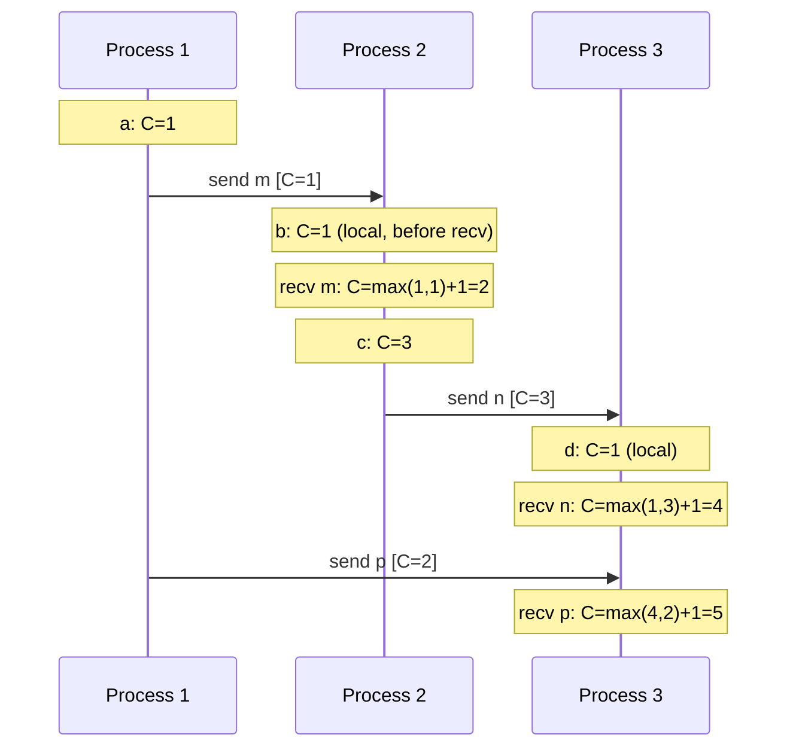
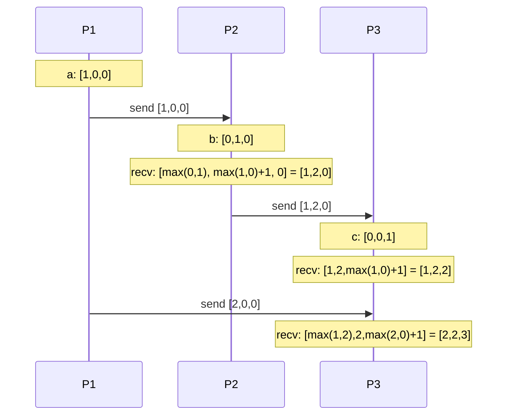

# Clock Synchronization
{: .no_toc }

<details open markdown="block">
  <summary>Table of Contents</summary>
  {: .text-delta }
1. TOC
{:toc}
</details>

Every distributed system eventually confronts the same uncomfortable truth: there is no global clock. Two servers in the same datacenter may disagree on the current time by several milliseconds. Two servers across continents can disagree by hundreds of milliseconds. Using timestamps to order events in a distributed system is therefore fundamentally unreliable — yet we keep doing it. Understanding the guarantees each approach provides (and where it breaks) is what separates principled distributed system design from cargo-cult timestamp usage.

---

## The Problem: No Global Clock

In a single-threaded program, events have a total order: event A happened before event B if A's instruction occurred before B's on the CPU. In a distributed system, there is no shared memory, no shared CPU, and no shared clock. We have only:

1. **Messages** — if A sends a message and B receives it, A happened before B.
2. **Local ordering** — events on the same process are ordered.
3. **Transitivity** — if A happened before B and B happened before C, then A happened before C.

Everything else — including "event X had timestamp 14:00:00.123" — is an approximation.

---

## Physical Clocks: NTP

### How NTP Works

Network Time Protocol (NTP) synchronizes server clocks by measuring round-trip time to reference servers.

```
Client sends: T1 (client send time)
Server receives at: T2
Server replies at: T3
Client receives at: T4

Round-trip delay = (T4 - T1) - (T3 - T2)
Clock offset ≈ ((T2 - T1) + (T3 - T4)) / 2
```

NTP then slews (gradually adjusts) the local clock toward the reference. It does **not** step the clock abruptly (which would break applications that assume monotonic time).

### NTP Accuracy

| Scenario | Accuracy |
|:---------|:---------|
| Local NTP server | ~1 ms |
| Datacenter NTP (AWS, GCP) | ~1–5 ms |
| Public NTP (pool.ntp.org) | ~10–100 ms |
| GPS-disciplined stratum 0 | ~100 ns |

**Stratum:** NTP clock quality is measured in stratum levels. Stratum 0 = atomic/GPS clock. Stratum 1 = directly synchronized to stratum 0. Most servers run at stratum 2–4.

### Clock Drift and Skew

**Drift:** Clocks don't run at exactly the same rate. A crystal oscillator may gain or lose ~10–100 ppm (parts per million), equivalent to ~1 second per day.

**Skew:** The accumulated difference between two clocks at a given point in time.

**Implications for distributed systems:**
- Two servers writing to the same Kafka partition may assign out-of-order timestamps to events that occur in the "right" order
- Last-write-wins (LWW) with physical timestamps can discard the correct write if the writing server's clock is behind
- Log analysis: correlating logs across services by timestamp has a ±5ms error bar at best

---

## TrueTime (Google Spanner)

Google Spanner achieves **external consistency** (stronger than serializability — transactions appear to execute in real-world time order) using TrueTime.

### The API

```
TT.now()   → returns [earliest, latest]
             a time interval that is guaranteed to contain the true current time
TT.after(t)  → true if t has definitely passed
TT.before(t) → true if t has definitely not passed
```

The uncertainty interval (`ε = latest - earliest`) is typically 1–7 ms. It is bounded by the accuracy of GPS receivers and atomic clocks deployed in every Google datacenter.

### Commit Wait

Spanner uses TrueTime to ensure that no two transactions get the same timestamp, even across different servers:

```
1. Leader assigns commit timestamp ts = TT.now().latest
2. Leader waits until TT.after(ts) is true — i.e., waits for uncertainty to pass
3. Then commits and returns

Result: any transaction starting after this one sees ts in TT.now().earliest,
        guaranteeing it gets a strictly later timestamp.
```

This "commit wait" adds 1–7 ms to every transaction but gives the strongest possible ordering guarantee: real-world order = transaction order.

{: .note }
No open-source database replicates TrueTime because it requires GPS/atomic clocks at every datacenter. CockroachDB approximates it using Hybrid Logical Clocks instead.

---

## Lamport Clocks

Leslie Lamport introduced logical clocks in 1978 to provide a consistent ordering of events across processes without relying on synchronized physical clocks.

### The Happened-Before Relation (→)

```
A → B iff:
  - A and B are on the same process and A occurred before B, OR
  - A is "send message m" and B is "receive message m", OR
  - There exists C such that A → C and C → B (transitivity)
```

If neither A → B nor B → A, A and B are **concurrent**: no causal relationship.

### Lamport Clock Rules

Each process maintains a counter `C`.

1. **Before each event:** `C = C + 1`
2. **On send:** Attach current `C` to message
3. **On receive:** `C = max(C, received_C) + 1`



**Property:** If A → B, then `C(A) < C(B)`. But `C(A) < C(B)` does NOT imply A → B — two concurrent events can have ordered Lamport timestamps.

**The limitation:** Lamport clocks can only detect the happened-before direction, not concurrency. If you need to detect that two writes are concurrent (neither caused the other), you need vector clocks.

---

## Vector Clocks

Vector clocks extend Lamport clocks to provide bidirectional causality detection.

### Vector Clock Rules

Each process maintains a vector `V[n]` (one slot per process):

1. **Before each event:** `V[self]++`
2. **On send:** Attach current `V`
3. **On receive:** `V[i] = max(V[i], received[i])` for all i, then `V[self]++`



### Comparing Vector Clocks

```
V_A ≤ V_B  iff  V_A[i] ≤ V_B[i] for all i

A happened-before B:  V_A < V_B  (V_A ≤ V_B and V_A ≠ V_B)
A concurrent with B:  neither V_A ≤ V_B nor V_B ≤ V_A

Example:
  A = [2, 1, 0]
  B = [1, 2, 0]   → [2,1] not ≤ [1,2] and [1,2] not ≤ [2,1] → CONCURRENT

  C = [1, 2, 0]
  D = [1, 2, 1]   → C ≤ D (component-wise) → C happened-before D
```

### Java Implementation

```java
public class VectorClock {
    private final Map<String, Long> clock = new HashMap<>();
    private final String nodeId;

    public VectorClock(String nodeId) {
        this.nodeId = nodeId;
    }

    public void tick() {
        clock.merge(nodeId, 1L, Long::sum);
    }

    public Map<String, Long> send() {
        tick();
        return Collections.unmodifiableMap(new HashMap<>(clock));
    }

    public void receive(Map<String, Long> received) {
        received.forEach((node, time) ->
            clock.merge(node, time, Math::max)
        );
        clock.merge(nodeId, 1L, Long::sum);
    }

    // A happened-before B?
    public static boolean happenedBefore(Map<String, Long> a, Map<String, Long> b) {
        Set<String> allKeys = new HashSet<>(a.keySet());
        allKeys.addAll(b.keySet());

        boolean lessThanOrEqual = allKeys.stream()
            .allMatch(k -> a.getOrDefault(k, 0L) <= b.getOrDefault(k, 0L));

        return lessThanOrEqual && !a.equals(b);
    }

    public static boolean concurrent(Map<String, Long> a, Map<String, Long> b) {
        return !happenedBefore(a, b) && !happenedBefore(b, a);
    }
}
```

### Scaling Problem

Vector clocks grow linearly with the number of processes. In a system with thousands of nodes, a vector clock attached to every message becomes impractical. **Version vectors** (used in DynamoDB) track only the replica nodes that wrote the value, not all processes — reducing the size to the number of replicas.

---

## Hybrid Logical Clocks (HLC)

HLC (Kulkarni, Demirbas, 2014) combines physical and logical clocks to get the best of both:
- **Physical clock component:** Close to real wall-clock time, useful for range queries and human-readable ordering.
- **Logical clock component:** Preserves causality even when physical clocks are ahead of the message's timestamp.

```
HLC = (physical_time, logical_counter)

Rules:
  tick():  if current_physical > saved_physical:
               hlc = (current_physical, 0)
           else:
               hlc = (saved_physical, saved_logical + 1)

  recv(m): pt = max(current_physical, message_physical_time)
           if pt > saved_physical: hlc = (pt, 0)
           elif pt == saved_physical: hlc = (pt, max(saved_logical, message_logical) + 1)
           else: hlc = (pt, saved_logical + 1)
```

**Property:** HLC ≥ physical_time. The logical counter bumps only when the physical clock doesn't advance, keeping timestamps close to real time while preserving causality.

**Used by:** CockroachDB (instead of TrueTime, since it can't use GPS clocks). MongoDB uses a similar concept for its cluster time.

---

## Practical Implications

### When Physical Timestamps Are Good Enough

- **Log correlation:** A few ms of skew is acceptable when debugging — you're looking for rough ordering, not exact.
- **TTL/expiry:** Cache expiry with a 1-second precision doesn't need nanosecond accuracy.
- **Human-facing display:** "Last updated 2 hours ago" doesn't need cross-server consistency.

### When You Need Logical Clocks

- **Event ordering in distributed logs:** Which write happened "last" in a last-write-wins scheme.
- **Conflict detection:** Did these two writes happen concurrently (and thus conflict) or is one causally after the other?
- **Replication lag detection:** Did the replica process event N before event M?

### Summary: Which Clock for Which Problem

| Problem | Solution |
|:--------|:---------|
| Approximate wall-clock time | NTP physical clock |
| Ordering events (single direction) | Lamport clock |
| Detecting concurrent events (conflict detection) | Vector clock |
| Wall-clock time + causality + range queries | Hybrid Logical Clock |
| True external consistency | TrueTime (requires GPS hardware) |

---

## Key Takeaways for Interviews

1. **NTP is not reliable for ordering.** Two events timestamped milliseconds apart on different servers may be in the wrong order due to clock skew.
2. **Lamport clocks give ordering, not concurrency detection.** `C(A) < C(B)` does not mean A happened before B — only that A *might* have happened before B.
3. **Vector clocks detect causality.** If `V_A` and `V_B` are incomparable (neither ≤ the other), the events are concurrent and may conflict.
4. **TrueTime is the gold standard but requires hardware.** Spanner's external consistency comes from GPS/atomic clocks, not software tricks.
5. **HLC is the practical answer for external consistency without GPS.** CockroachDB uses it — get close-to-physical timestamps with causal guarantees.
6. **DynamoDB and Cassandra use last-write-wins.** This means concurrent writes lose data silently. If that's unacceptable, you need vector clocks or CRDTs.

---

## References

- [Time, Clocks, and the Ordering of Events in a Distributed System](https://lamport.azurewebsites.net/pubs/time-clocks.pdf) — Leslie Lamport, 1978
- [Spanner: Google's Globally Distributed Database](https://research.google/pubs/pub39966/) — Corbett et al., 2012 (TrueTime details in Section 3)
- [Hybrid Logical Clocks](https://cse.buffalo.edu/tech-reports/2014-04.pdf) — Kulkarni & Demirbas, 2014
- [CockroachDB Hybrid Logical Clocks blog post](https://www.cockroachlabs.com/blog/living-without-atomic-clocks/)
- *Designing Data-Intensive Applications* — Chapter 8 (The Trouble with Distributed Systems)
- [Amazon Dynamo paper](https://www.allthingsdistributed.com/files/amazon-dynamo-sosp2007.pdf) — vector clocks in practice
