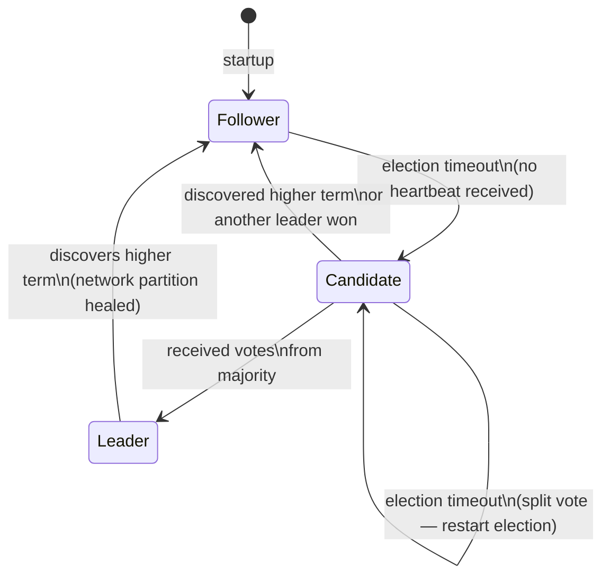
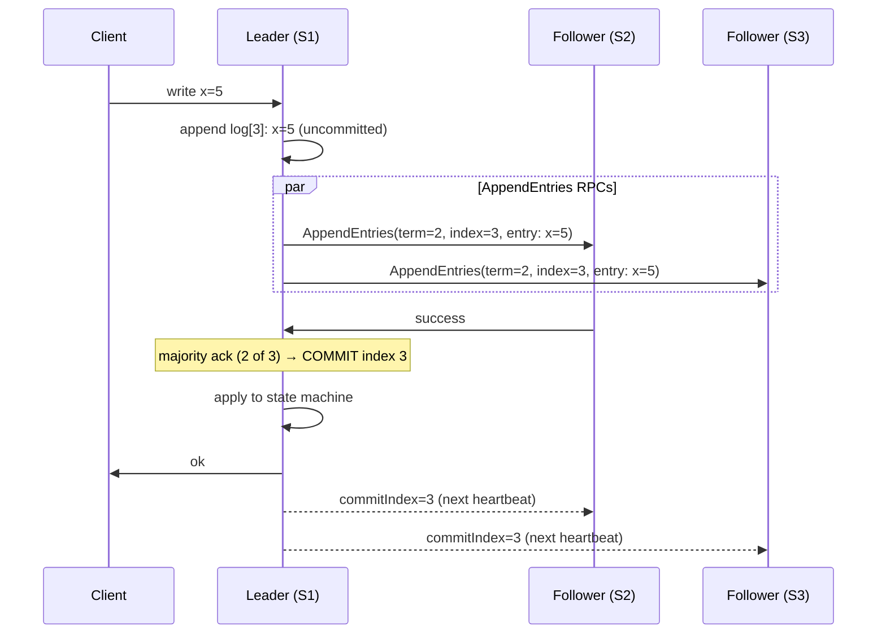

# Distributed Consensus
{: .no_toc }

<details open markdown="block">
  <summary>Table of Contents</summary>
  {: .text-delta }
1. TOC
{:toc}
</details>

Distributed consensus is the problem of getting a set of nodes to agree on a single value or sequence of operations, even when some nodes fail or messages are delayed. It underpins leader election, replicated state machines, distributed locks, and atomic broadcasts. Every coordination service — etcd, ZooKeeper, Consul — is built on a consensus algorithm.

---

## Why Consensus Is Hard

In a distributed system, you cannot distinguish between a node that is slow and a node that has crashed. When Node A stops receiving messages from Node B, it has two explanations: B is dead, or the network between A and B is partitioned. Acting on the wrong assumption causes a **split-brain**: two nodes both believe they are the leader and accept writes, leading to divergence.

**The FLP Impossibility result (1985):** In an asynchronous system where even one node may crash, there is no deterministic algorithm that always reaches consensus. In practice, systems work around this by using timeouts (introducing partial synchrony assumptions).

---

## Paxos

Paxos (Leslie Lamport, 1989) is the theoretical foundation. It's famously difficult to understand and implement — Lamport's follow-up paper was titled "Paxos Made Simple."

### Basic Paxos

Roles: **Proposers** propose values, **Acceptors** accept or reject, **Learners** learn the decided value. Any node can play multiple roles.

**Phase 1: Prepare**

```
Proposer → all Acceptors: Prepare(n)
  n = proposal number (must be unique and higher than any seen before)

Acceptor → Proposer: Promise(n, accepted_value)
  - Promise to never accept proposals < n
  - Return the highest-numbered accepted value (if any)
```

**Phase 2: Accept**

```
If Proposer received Promise from majority:
  Proposer → majority Acceptors: Accept(n, v)
    v = the accepted_value from highest-numbered promise, OR proposer's own value if none

Acceptor: if n >= highest promised → accept, reply Accepted(n, v)

If majority Accepted → value v is DECIDED
```

**Key insight:** If any acceptor has already accepted a value in a prior round, the proposer must propose that same value (not a new one). This is how Paxos ensures only one value is ever decided.

### Multi-Paxos

Basic Paxos decides one value. **Multi-Paxos** amortizes Phase 1 across many rounds by electing a distinguished **leader** who runs Phase 2 for all subsequent proposals without re-doing Phase 1. This is what production systems use.

**Limitation of Paxos:** The algorithm is specified at a high level with many implementation details left ambiguous — leader election, log compaction, membership changes. Raft was created specifically to address this.

---

## Raft

Raft (Ongaro & Ousterhout, 2014) is designed to be understandable. etcd and Consul use Raft. It decomposes consensus into three subproblems: leader election, log replication, and safety.

### Node States



**Terms:** Raft divides time into **terms** (monotonically increasing integers). Each term starts with an election. At most one leader per term. Terms act as a logical clock — stale messages from old terms are rejected.

### Leader Election

1. Each follower has a randomized **election timeout** (150–300ms). Randomization prevents split votes.
2. On timeout, a follower increments its term, transitions to Candidate, votes for itself, and sends `RequestVote` RPCs to all other nodes.
3. A node grants a vote if: (a) it hasn't voted in this term yet, and (b) the candidate's log is at least as up-to-date as the voter's log.
4. Candidate receiving majority votes → becomes Leader, starts sending heartbeats immediately.

### Log Replication



**AppendEntries** serves dual purpose: log replication and heartbeat (empty AppendEntries). A follower that falls behind will have its log repaired by the leader replaying missing entries.

### Safety Guarantees

- **Leader Completeness:** A leader has all entries committed in previous terms.
- **Log Matching:** If two entries in different nodes have the same index and term, all preceding entries are identical.
- **State Machine Safety:** If a server applies log index N, no other server will apply a different value at index N.

{: .important }
Raft guarantees safety (no wrong decisions) but not liveness under all partition scenarios. If the cluster cannot form a majority, it stops accepting writes. This is the CP side of CAP.

### Log Compaction (Snapshots)

Over time, the log grows unboundedly. Leaders periodically snapshot the state machine and truncate the log up to the snapshot point. New nodes receive the snapshot via `InstallSnapshot` RPC instead of replaying the full log.

---

## ZAB (Zookeeper Atomic Broadcast)

ZAB is ZooKeeper's consensus protocol — similar to Multi-Paxos but designed specifically for a primary-backup model.

**Key differences from Raft:**
- ZAB uses **epochs** (equivalent to terms) and **transactions** (log entries).
- On leader change, ZAB has an explicit **recovery phase** that ensures the new leader has all committed transactions before resuming service.
- ZAB is optimized for high-throughput sequential writes: the leader pipelines transactions without waiting for each to commit before sending the next.

**ZooKeeper ensemble:** Requires 2f+1 nodes to tolerate f failures. Typical: 3 nodes (f=1), 5 nodes (f=2).

---

## Leader Election in Practice

Beyond the algorithm, production systems must handle:

| Concern | Solution |
|:--------|:---------|
| **Split brain** | Fencing tokens — each leader gets a monotonically increasing token; writes rejected if token is stale |
| **Stale leader** | Lease-based leadership — leader holds lease for fixed duration; does not serve reads after lease expires |
| **Slow leader** | Follower initiates election if no heartbeat within timeout |

**Fencing tokens** are critical: a leader that was GC-paused or network-partitioned may wake up and try to perform writes. Storage systems should reject writes with stale tokens.

```
Leader gets token=42 from consensus service
→ Paused for 30 seconds (GC)
→ New leader elected with token=43
→ Old leader wakes up, tries to write with token=42
→ Storage rejects: "current fencing token is 43, yours is 42"
```

---

## Distributed Locks

Distributed locks let one process exclusively access a resource across multiple nodes.

### Redis-Based Locking (Redisson)

Redisson implements the **Redlock algorithm** for fault-tolerant distributed locks with multiple Redis nodes.

```java
@Configuration
public class RedissonConfig {
    @Bean
    public RedissonClient redissonClient() {
        Config config = new Config();
        config.useSingleServer().setAddress("redis://localhost:6379");
        return Redisson.create(config);
    }
}

@Service
public class PaymentService {
    @Autowired
    private RedissonClient redisson;

    public void processPayment(String orderId) {
        RLock lock = redisson.getLock("payment:lock:" + orderId);

        try {
            // Wait up to 5s to acquire, hold for max 30s
            boolean acquired = lock.tryLock(5, 30, TimeUnit.SECONDS);
            if (!acquired) {
                throw new LockAcquisitionException("Could not acquire lock for order " + orderId);
            }
            // critical section
            doPayment(orderId);
        } catch (InterruptedException e) {
            Thread.currentThread().interrupt();
        } finally {
            if (lock.isHeldByCurrentThread()) {
                lock.unlock();
            }
        }
    }
}
```

**Lease expiry is essential:** If the holder crashes, the lock automatically expires and unblocks other waiters.

### etcd-Based Locking

etcd provides first-class distributed lock semantics via its `concurrency` package (used in Kubernetes).

```java
// Using Jetcd (Java etcd client)
Client client = Client.builder().endpoints("http://localhost:2379").build();
Lock lockClient = client.getLockClient();

// Acquire lease first (TTL-bound)
Lease leaseClient = client.getLeaseClient();
long leaseId = leaseClient.grant(30).get().getID(); // 30 second TTL

// Acquire lock
ByteSequence lockKey = ByteSequence.from("/locks/payment", StandardCharsets.UTF_8);
lockClient.lock(lockKey, leaseId).get();

try {
    // critical section
} finally {
    lockClient.unlock(lockKey).get();
    leaseClient.revoke(leaseId).get();
}
```

### ZooKeeper-Based Locking

ZooKeeper's lock recipe uses **ephemeral sequential nodes**. When the holder dies, the ephemeral node is automatically deleted — releasing the lock without manual cleanup.

```
Process 1: create /locks/resource-0000000001 (EPHEMERAL_SEQUENTIAL)
Process 2: create /locks/resource-0000000002 (EPHEMERAL_SEQUENTIAL)
Process 3: create /locks/resource-0000000003 (EPHEMERAL_SEQUENTIAL)

Process 1: getChildren → [0001, 0002, 0003] → I have lowest → I have lock
Process 2: getChildren → [0001, 0002, 0003] → watch 0001 (predecessor)
Process 3: getChildren → [0001, 0002, 0003] → watch 0002 (predecessor)

Process 1 releases (deletes 0001)
  → Process 2's watch fires → it has lowest → it gets lock
```

**Why watch the predecessor, not all nodes?** The "thundering herd" problem: if all waiters watch the lock node, every node gets notified when the lock is released, causing N-1 unnecessary wake-ups.

### Lock Comparison

| | Redis (Redisson) | etcd | ZooKeeper |
|:-|:----------------|:-----|:----------|
| **Consistency** | Approximate (Redlock) | Strong (Raft) | Strong (ZAB) |
| **Auto-release** | TTL expiry | Lease expiry | Ephemeral node |
| **Fairness** | No (any waiter wins) | No | Yes (FIFO via sequential nodes) |
| **Use when** | High throughput, best-effort locks | K8s ecosystem, strong guarantees | Existing ZK infrastructure |

---

## Where Consensus Is Used in Production

| System | Algorithm | Purpose |
|:-------|:----------|:--------|
| **Kubernetes** | Raft (etcd) | Controller election, cluster state |
| **Apache Kafka** | KRaft (Raft, since 3.0) | Metadata partition (replaces ZooKeeper) |
| **Apache Cassandra** | Paxos (lightweight transactions) | Compare-and-set for conditional updates |
| **CockroachDB** | Raft (per-range) | Replicated state machine for each key range |
| **Google Spanner** | Paxos | Replicated log per shard |
| **Apache ZooKeeper** | ZAB | Coordination service for Kafka (pre-3.0), HBase |

---

## Key Takeaways for Interviews

1. **Raft is the practical answer.** Paxos is the theory. When asked to explain consensus, explain Raft: leader election with randomized timeouts, log replication with AppendEntries, commit on majority acknowledgment.
2. **Split-brain requires fencing tokens.** Knowing a leader was elected is not enough — you need storage to reject stale writes.
3. **Consensus = majority quorum.** A 3-node cluster tolerates 1 failure. A 5-node cluster tolerates 2. You need 2f+1 nodes for f failures.
4. **Distributed locks need TTL/lease.** A lock without expiry becomes a permanent block if the holder crashes.
5. **ZooKeeper uses ephemeral nodes for automatic cleanup.** Process death = lock release. No explicit unlock needed for crash scenarios.
6. **etcd = Kubernetes' brain.** If etcd goes down in a K8s cluster, no new pods can be scheduled, but existing pods keep running.

---

## References

- [The Raft Consensus Algorithm](https://raft.github.io/) — Ongaro & Ousterhout, original paper + visualization
- [Paxos Made Simple](https://lamport.azurewebsites.net/pubs/paxos-simple.pdf) — Leslie Lamport
- [etcd documentation](https://etcd.io/docs/)
- [Redisson distributed locks](https://redisson.org/glossary/java-distributed-lock.html)
- *Designing Data-Intensive Applications* — Chapter 9 (Consistency and Consensus)
- [ZooKeeper recipes](https://zookeeper.apache.org/doc/current/recipes.html) — official distributed lock recipe
