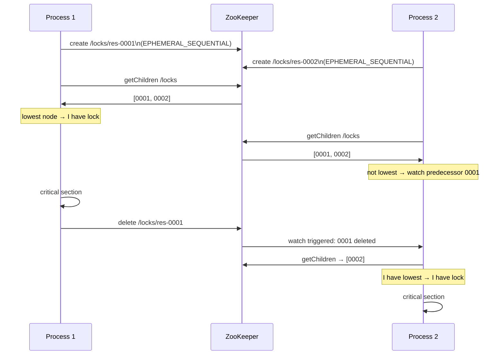
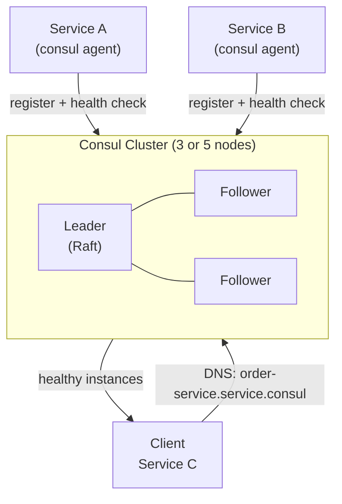
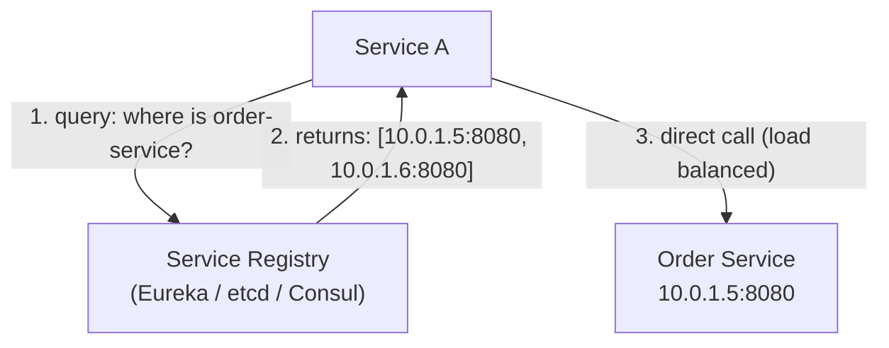
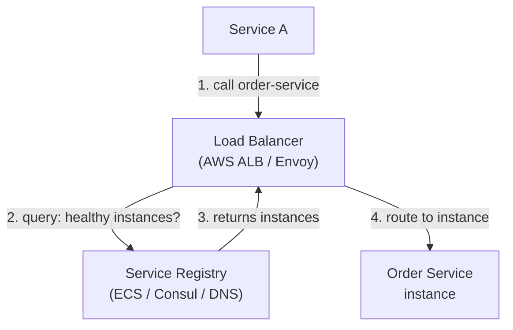

# Distributed Coordination
{: .no_toc }

<details open markdown="block">
  <summary>Table of Contents</summary>
  {: .text-delta }
1. TOC
{:toc}
</details>

Distributed services need a shared source of truth for things that can't live in an individual service's database: who is the current leader, which nodes are alive, what is the current configuration, and where can I find service X. Coordination services — ZooKeeper, etcd, Consul — provide these primitives with strong consistency guarantees.

---

## Why Dedicated Coordination Services?

You cannot use your application database for coordination because:

1. **Leader election requires compare-and-set atomicity** — most databases don't expose this efficiently.
2. **Ephemeral nodes** (auto-deleted on disconnect) are a coordination primitive with no database equivalent.
3. **Watch/notification** on key changes requires a push model — polling a DB is too slow.
4. **Strong consistency with quorum** — the coordination service itself must be highly available and consistent, which means it runs its own Raft/ZAB cluster.

---

## Apache ZooKeeper

ZooKeeper (Apache, 2008) was the dominant coordination service before etcd. It's still widely used in older Kafka clusters, HBase, and Solr.

### Data Model

ZooKeeper stores data in a hierarchical namespace of **znodes** — like a filesystem.

```
/                           ← root
├── /kafka
│   ├── /kafka/brokers
│   │   ├── /kafka/brokers/ids/0    ← broker 0 registration
│   │   └── /kafka/brokers/ids/1
│   └── /kafka/controller          ← current Kafka controller broker
├── /locks
│   └── /locks/payment-lock-001    ← distributed lock node
└── /services
    └── /services/order-service    ← service discovery
```

**Znode types:**

| Type | Description |
|:-----|:------------|
| **Persistent** | Survives client disconnect |
| **Ephemeral** | Deleted when the creating client disconnects |
| **Sequential** | Appends a monotonically increasing number to the name |
| **Ephemeral Sequential** | Combination — used for distributed locks |

### Watches

Clients register **watches** on znodes to receive a one-time notification when the node changes or is deleted. This is how ZooKeeper implements reactive patterns without polling.

```java
ZooKeeper zk = new ZooKeeper("localhost:2181", 3000, event -> {
    // session watcher
});

// Watch a node — callback fires once on change
Stat stat = zk.exists("/services/order-service", event -> {
    if (event.getType() == EventType.NodeDeleted) {
        // Service went down — trigger failover or re-register
        log.warn("order-service node deleted, service may be down");
    }
});
```

{: .warning }
Watches are one-shot. After firing, the client must re-register the watch to keep monitoring the node. This is a common source of missed events in ZooKeeper clients.

### Distributed Lock Recipe

The canonical ZooKeeper lock uses ephemeral sequential nodes so locks auto-release on crash.



### Leader Election

Similar to distributed locks: the node that successfully creates the lowest sequential ephemeral node is the leader.

```java
// Using Apache Curator (ZooKeeper client library for Java)
CuratorFramework client = CuratorFrameworkFactory.newClient(
    "localhost:2181", new ExponentialBackoffRetry(1000, 3));
client.start();

LeaderLatch leaderLatch = new LeaderLatch(client, "/leader-election/payment-processor");
leaderLatch.addListener(new LeaderLatchListener() {
    @Override
    public void isLeader() {
        log.info("This node is now the leader — starting batch processor");
        batchProcessor.start();
    }

    @Override
    public void notLeader() {
        log.info("This node lost leadership — stopping batch processor");
        batchProcessor.stop();
    }
});
leaderLatch.start();
```

### ZooKeeper Ensemble

ZooKeeper runs as an ensemble of 2f+1 nodes (typically 3 or 5). Writes go through the leader, which must get acknowledgment from a quorum (majority) before committing. The leader is elected using ZAB.

**ZooKeeper's CAP position:** CP — it will refuse writes during a partition if quorum is unavailable.

---

## etcd

etcd is a distributed key-value store using Raft for consensus. It is the backbone of Kubernetes — storing all cluster state (nodes, pods, ConfigMaps, Secrets, etc.).

### Data Model

etcd stores flat key-value pairs (not hierarchical like ZooKeeper). Keys are arbitrary byte sequences. Hierarchies are achieved by key prefix conventions (`/kubernetes/nodes/`, `/kubernetes/pods/`).

**MVCC (Multi-Version Concurrency Control):** etcd keeps multiple versions of each key. You can watch historical revisions and create watches at a specific revision — this prevents the "watch gap" problem where events between re-registrations are lost.

### Key Operations

```bash
# Put
etcdctl put /services/order-service '{"host":"10.0.1.5","port":8080}'

# Get
etcdctl get /services/order-service

# Watch (streaming)
etcdctl watch /services/ --prefix

# Lease (TTL-bound key — auto-deleted when lease expires)
etcdctl lease grant 30                          # returns LEASE_ID
etcdctl put /leader/payment LEASE_ID --lease=LEASE_ID
etcdctl lease keepalive LEASE_ID                # renew continuously
```

### Java etcd Client (Jetcd)

```java
Client client = Client.builder().endpoints("http://localhost:2379").build();
KV kvClient = client.getKVClient();
Watch watchClient = client.getWatchClient();

// Watch with prefix — receive all changes under /services/
ByteSequence prefix = ByteSequence.from("/services/", StandardCharsets.UTF_8);
WatchOption option = WatchOption.builder().withPrefix(prefix).build();

watchClient.watch(prefix, option, response -> {
    for (WatchEvent event : response.getEvents()) {
        switch (event.getEventType()) {
            case PUT    -> onServiceRegistered(event.getKeyValue());
            case DELETE -> onServiceDeregistered(event.getKeyValue().getKey());
        }
    }
});
```

### Transactions (Compare-and-Set)

etcd supports atomic transactions with conditions:

```java
// Leader election: only one process can write the leader key
Txn txn = kvClient.txn();
ByteSequence leaderKey = ByteSequence.from("/leader", StandardCharsets.UTF_8);
ByteSequence myId = ByteSequence.from("node-1", StandardCharsets.UTF_8);

TxnResponse response = txn
    .If(new Cmp(leaderKey, Cmp.Op.EQUAL, CmpTarget.version(0))) // key doesn't exist
    .Then(Op.put(leaderKey, myId, PutOption.builder().withLeaseId(leaseId).build()))
    .commit()
    .get();

if (response.isSucceeded()) {
    log.info("Became leader");
} else {
    log.info("Another node is leader");
}
```

### etcd in Kubernetes

```
etcd stores:
  /registry/pods/{namespace}/{name}       ← Pod specs
  /registry/nodes/{name}                  ← Node registrations
  /registry/configmaps/{namespace}/{name} ← ConfigMaps
  /registry/secrets/{namespace}/{name}    ← Secrets (encrypted at rest)

If etcd goes down:
  - No new pods can be scheduled
  - No deployments can be scaled
  - Existing running pods continue (kubelet runs independently)
  - kubectl commands fail
```

**etcd sizing:** etcd recommends SSD storage (high write latency from HDDs causes Raft election timeouts), 8GB RAM, and should be co-located with the API server to minimize latency.

---

## Consul

Consul (HashiCorp) combines a coordination service with a **service mesh**. It handles service discovery, health checking, KV store, and mTLS-encrypted inter-service communication.

### Core Features



### Service Registration and Discovery

```java
// Register service with Consul
ConsulClient consul = new ConsulClient("localhost");

NewService service = new NewService();
service.setId("order-service-1");
service.setName("order-service");
service.setPort(8080);
service.setAddress("10.0.1.5");

// Health check: Consul polls this endpoint every 10 seconds
NewService.Check check = new NewService.Check();
check.setHttp("http://10.0.1.5:8080/actuator/health");
check.setInterval("10s");
check.setDeregisterCriticalServiceAfter("30s");
service.setCheck(check);

consul.agentServiceRegister(service);
```

```java
// Discover healthy instances of a service
ConsulClient consul = new ConsulClient("localhost");
Response<List<HealthService>> response = consul.getHealthServices(
    "order-service", true, null); // true = only healthy

List<String> endpoints = response.getValue().stream()
    .map(hs -> hs.getService().getAddress() + ":" + hs.getService().getPort())
    .collect(toList());
// Pick one (round-robin, random, etc.) and call it
```

### Consul vs ZooKeeper vs etcd

| | ZooKeeper | etcd | Consul |
|:-|:----------|:-----|:-------|
| **Consensus** | ZAB | Raft | Raft |
| **Data model** | Hierarchical (znodes) | Flat KV | Flat KV + service catalog |
| **Service discovery** | Manual (znodes) | Manual (keys) | First-class |
| **Health checking** | Via ephemeral nodes | Via leases | Built-in HTTP/TCP/Script checks |
| **Multi-datacenter** | No | Limited | First-class |
| **Service mesh** | No | No | Yes (Connect) |
| **Best for** | Kafka, HBase (existing) | Kubernetes | Microservices, multi-DC |

---

## Service Discovery

Service discovery solves: how does Service A find the current IP:port of Service B when instances come and go?

### Client-Side Service Discovery

The client queries the registry, gets a list of instances, and does its own load balancing.



```java
// Spring Cloud + Eureka: client-side discovery
@SpringBootApplication
@EnableEurekaClient
public class PaymentServiceApp { ... }

// Use @LoadBalanced RestTemplate — automatically resolves service names
@Bean
@LoadBalanced
public RestTemplate restTemplate() { return new RestTemplate(); }

// Call by service name, not IP:port
@Service
public class OrderClient {
    @Autowired private RestTemplate restTemplate;

    public Order getOrder(String orderId) {
        // Spring Cloud resolves "order-service" via Eureka
        return restTemplate.getForObject(
            "http://order-service/api/orders/" + orderId, Order.class);
    }
}
```

**Pros:** No extra hop through a proxy. Client has full control over load balancing.  
**Cons:** Every language/framework needs a service registry client library. Discovery logic is distributed across all clients.

### Server-Side Service Discovery

The client calls a load balancer. The load balancer queries the registry and routes.



```yaml
# Kubernetes Service: server-side discovery built-in
apiVersion: v1
kind: Service
metadata:
  name: order-service
spec:
  selector:
    app: order-service
  ports:
    - port: 8080
# kube-proxy and CoreDNS handle routing: order-service.default.svc.cluster.local
```

**Pros:** Client is simple — just makes an HTTP call to a hostname. Works with any language.  
**Cons:** Load balancer is an extra hop. Load balancer itself must be highly available.

### Client-Side vs Server-Side Comparison

| | Client-Side | Server-Side |
|:-|:-----------|:-----------|
| **Example** | Spring Cloud + Eureka | Kubernetes Services, AWS ALB |
| **Load balancing** | At client | At load balancer |
| **Client complexity** | High (needs registry client) | Low (just HTTP) |
| **Language support** | Requires library per language | Universal |
| **Latency** | Slightly lower (no proxy hop) | Slightly higher (proxy hop) |
| **Failure mode** | Client caches stale list | LB handles routing dynamically |

---

## Key Takeaways for Interviews

1. **etcd is Kubernetes. ZooKeeper is Kafka (pre-3.0).** If asked what backs a distributed system, these are the first-principles answers for cluster state management.
2. **Ephemeral nodes are ZooKeeper's killer feature.** When a client crashes, its ephemeral nodes are automatically cleaned up. This makes lock release and service deregistration reliable.
3. **Watches are one-shot in ZooKeeper; streaming in etcd.** In etcd, you get a continuous stream of change events without re-registering. This is why etcd is preferred for Kubernetes — it can't afford missed events.
4. **Consul wins for multi-datacenter microservices.** ZooKeeper and etcd require extra work for multi-DC. Consul is built for it.
5. **Kubernetes made server-side discovery the default.** Most modern services running on K8s use `ClusterIP` Services — server-side, DNS-based discovery — without thinking about it.
6. **Don't implement your own coordination.** Use a proven tool. ZooKeeper, etcd, and Consul have battle-tested consensus implementations. A custom solution will have subtle bugs under network partitions.

---

## References

- [etcd documentation](https://etcd.io/docs/)
- [Apache Curator (ZooKeeper client)](https://curator.apache.org/)
- [Consul service mesh documentation](https://developer.hashicorp.com/consul/docs)
- [Spring Cloud Netflix Eureka](https://cloud.spring.io/spring-cloud-netflix/)
- [ZooKeeper: Wait-free coordination for internet-scale systems](https://www.usenix.org/legacy/event/atc10/tech/full_papers/Hunt.pdf) — original paper
- *Designing Distributed Systems* — Brendan Burns, Chapter 4 (Serving Patterns)
