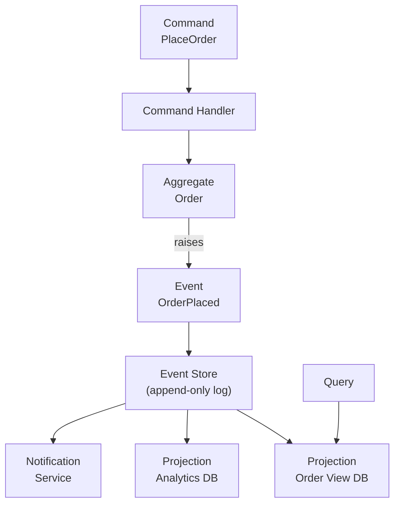
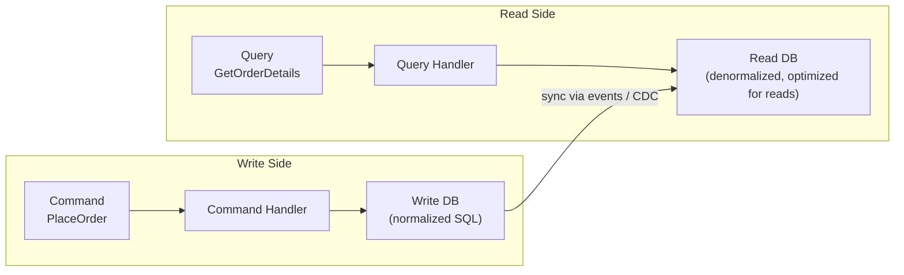
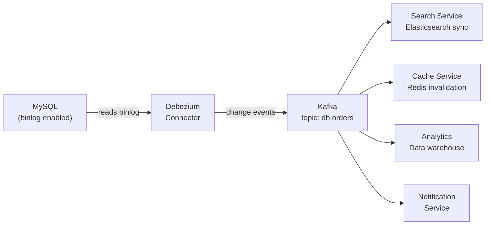
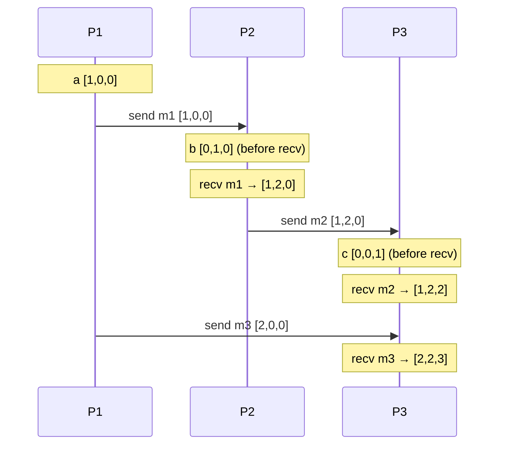

# Data Consistency Patterns
{: .no_toc }

<details open markdown="block">
  <summary>Table of Contents</summary>
  {: .text-delta }
1. TOC
{:toc}
</details>

Distributed services own separate databases. Keeping them consistent — without distributed locks, without 2PC, without a shared transaction scope — is one of the hardest problems in system design. This page covers the patterns that make it tractable: Event Sourcing, CQRS, CDC, Idempotency, Vector Clocks, and CRDTs.

---

## Event Sourcing

### The Idea

Instead of storing the **current state** of an entity, store the **sequence of events** that produced it. The current state is always derived by replaying the event log.

```
Traditional: orders table → row { id=1, status=SHIPPED, total=99.99 }

Event Sourcing:
  event 1: OrderCreated    { orderId=1, customerId=42, total=99.99 }
  event 2: PaymentReceived { orderId=1, amount=99.99 }
  event 3: ItemsShipped    { orderId=1, trackingNo="UPS-123" }

Current state = replay(event 1 + event 2 + event 3)
```

### Architecture



**Aggregates** are the unit of consistency. A command targets one aggregate; the aggregate validates the command against its current state (replayed from events) and emits events if valid.

```java
@Aggregate
public class Order {
    private String orderId;
    private OrderStatus status;
    private BigDecimal total;

    @CommandHandler
    public Order(PlaceOrderCommand command) {
        // Validate, then apply event (does NOT directly mutate state)
        apply(new OrderPlacedEvent(command.getOrderId(), command.getCustomerId(), command.getTotal()));
    }

    @EventSourcingHandler
    public void on(OrderPlacedEvent event) {
        // Only state mutation happens here
        this.orderId = event.getOrderId();
        this.status = OrderStatus.PENDING;
        this.total = event.getTotal();
    }

    @CommandHandler
    public void handle(ConfirmPaymentCommand command) {
        if (this.status != OrderStatus.PENDING) {
            throw new IllegalStateException("Order not in PENDING state");
        }
        apply(new PaymentConfirmedEvent(this.orderId, command.getAmount()));
    }

    @EventSourcingHandler
    public void on(PaymentConfirmedEvent event) {
        this.status = OrderStatus.PAID;
    }
}
```

### Snapshots

Replaying the full event log to reconstruct state is expensive if the log is long. **Snapshots** periodically capture state and store it as a checkpoint.

```
Snapshot at event 500: { status: PAID, items: [...], total: 99.99 }
→ To get state at event 750, load snapshot + replay events 501–750
```

### Pros and Cons

| Pros | Cons |
|:-----|:-----|
| Full audit log — every state change is recorded | Event schema evolution is hard (old events must still be replayable) |
| Time-travel queries — reconstruct state at any point in time | Query complexity — must build projections for every read pattern |
| Natural integration with CQRS and event-driven architectures | Eventual consistency between event log and read models |
| Debugging: replay production events in staging | Aggregate redesign is costly (existing events are immutable) |

**When to use:** Financial systems, audit-critical applications, systems where "why did this change?" matters as much as "what is the current value?"

---

## CQRS (Command Query Responsibility Segregation)

### The Idea

Separate the **write model** (commands that change state) from the **read model** (queries that return data). They can use different databases, different schemas, and scale independently.



**Example:** The write model stores orders in a normalized relational DB (3NF). The read model stores a pre-joined, denormalized view in Elasticsearch for full-text search, and a separate Redis cache for the order summary page. Each read model is optimized for its specific access pattern.

### Without CQRS

```sql
-- Every query hits the write database
-- Must join 5 tables for the order detail page
SELECT o.*, c.name, c.email, p.status, i.tracking_no
FROM orders o
JOIN customers c ON c.id = o.customer_id
JOIN payments p ON p.order_id = o.id
JOIN shipments i ON i.order_id = o.id
WHERE o.id = ?
-- Adding an index helps, but the write DB is also handling heavy INSERT/UPDATE load
```

### With CQRS

```java
// Write side: normalized, ACID
@CommandHandler
public void handle(PlaceOrderCommand cmd) {
    Order order = new Order(cmd);
    orderRepository.save(order);           // normalized write
    eventPublisher.publish(new OrderPlacedEvent(order));
}

// Read side: denormalized, pre-joined, cache-friendly
@EventHandler
public void on(OrderPlacedEvent event) {
    // Build read model: no joins needed at query time
    OrderSummaryView view = OrderSummaryView.builder()
        .orderId(event.getOrderId())
        .customerName(customerService.getName(event.getCustomerId()))
        .totalFormatted(format(event.getTotal()))
        .statusLabel("Pending")
        .build();
    orderViewRepository.save(view);    // written to read DB (denormalized)
}

// Query: O(1) lookup on read model
@QueryHandler
public OrderSummaryView handle(GetOrderSummaryQuery query) {
    return orderViewRepository.findById(query.getOrderId());
}
```

### CQRS Without Event Sourcing

CQRS and Event Sourcing are often used together but are independent patterns:
- **CQRS alone:** Split read/write models, sync via CDC or scheduled jobs. Simpler than Event Sourcing.
- **Event Sourcing alone:** Store events as source of truth, but use same service for reads. Unusual — usually paired with CQRS.
- **CQRS + Event Sourcing:** Events are published from the write side; projections build multiple read models. This is the most powerful but most complex combination.

{: .note }
Don't use CQRS unless the read and write loads genuinely have different scaling characteristics or query patterns. For a simple CRUD service, CQRS adds complexity with no benefit.

---

## Change Data Capture (CDC)

### The Problem

You have a service that writes to MySQL. Other services need to react to those changes. Direct database polling is inefficient and couples services to the schema. Dual-write (DB + Kafka) risks inconsistency if Kafka write fails.

**CDC solution:** Tap the database's replication log (binlog in MySQL, WAL in PostgreSQL) and stream every change as an event.

### How Debezium Works



**Change event structure:**

```json
{
  "op": "u",
  "before": { "id": 1, "status": "PENDING", "total": 99.99 },
  "after":  { "id": 1, "status": "PAID",    "total": 99.99 },
  "source": { "table": "orders", "ts_ms": 1714521600000 }
}
```

Operations: `c` (create), `u` (update), `d` (delete), `r` (read/snapshot).

### Debezium Spring Boot Integration

```yaml
# docker-compose: Debezium connector config
connector.class: io.debezium.connector.mysql.MySqlConnector
database.hostname: mysql
database.port: 3306
database.user: debezium
database.password: dbz
database.server.name: orderdb
table.include.list: orderdb.orders
```

```java
// Consumer of CDC events
@KafkaListener(topics = "orderdb.orders")
public void onOrderChange(String changeEvent) {
    DebeziumEvent event = objectMapper.readValue(changeEvent, DebeziumEvent.class);

    switch (event.getOp()) {
        case "c", "u" -> searchIndexService.upsert(event.getAfter());
        case "d"      -> searchIndexService.delete(event.getBefore().getId());
    }
}
```

### CDC Use Cases

| Use Case | How CDC Helps |
|:---------|:-------------|
| **Search index sync** | Stream DB changes to Elasticsearch without dual-write |
| **Cache invalidation** | Invalidate Redis entries when DB row changes |
| **Outbox relay** | Debezium reads outbox table, publishes to Kafka (no polling needed) |
| **Audit trail** | All row-level changes captured in Kafka for compliance |
| **Microservice sync** | Replicate data across service boundaries without tight coupling |
| **Data lake ingestion** | Stream operational data to S3/BigQuery in near real-time |

---

## Idempotency

An operation is **idempotent** if executing it multiple times produces the same result as executing it once. This is critical in distributed systems where at-least-once delivery means the same message may arrive multiple times.

### Designing Idempotent APIs

**Pattern: Idempotency keys**

```http
POST /v1/payments
Idempotency-Key: a8098c1a-f86e-11da-bd1a-00112444be1e
Content-Type: application/json

{ "amount": 100.00, "currency": "USD", "customerId": "c_42" }
```

The server stores the idempotency key → response mapping. On duplicate requests with the same key, return the stored response without re-executing.

```java
@RestController
public class PaymentController {

    @PostMapping("/v1/payments")
    public ResponseEntity<PaymentResponse> createPayment(
            @RequestHeader("Idempotency-Key") String idempotencyKey,
            @RequestBody PaymentRequest req) {

        // Check cache/DB for existing response
        Optional<PaymentResponse> cached = idempotencyStore.get(idempotencyKey);
        if (cached.isPresent()) {
            return ResponseEntity.ok(cached.get());
        }

        // Execute the payment
        PaymentResponse response = paymentService.charge(req);

        // Store the response with the key (TTL: 24 hours)
        idempotencyStore.put(idempotencyKey, response, Duration.ofHours(24));

        return ResponseEntity.status(HttpStatus.CREATED).body(response);
    }
}
```

### Idempotent Kafka Consumers

```java
@KafkaListener(topics = "payment-events")
public void onPaymentEvent(PaymentChargedEvent event) {
    // Check if already processed
    if (processedEventStore.exists(event.getEventId())) {
        log.debug("Skipping duplicate event {}", event.getEventId());
        return;
    }

    // Process exactly once
    inventoryService.reserve(event.getOrderId(), event.getItems());

    // Mark as processed (in same DB transaction as the business logic if possible)
    processedEventStore.mark(event.getEventId());
}
```

**Natural idempotency:** Some operations are inherently idempotent without tracking:
- `PUT /orders/1/status { "status": "SHIPPED" }` — setting the same value twice has no effect
- `DELETE /orders/1` — deleting an already-deleted resource returns 404 or 200 (no harm)
- `UPSERT INTO orders VALUES (1, ...)` — inserting/updating by primary key

**Accidental non-idempotency:** `POST /payments` without an idempotency key — calling twice charges the customer twice.

---

## Vector Clocks

### The Problem with Timestamps

Physical clocks drift. In a distributed system, two events at "the same time" from two different servers have no meaningful ordering. Lamport timestamps provide ordering but can't detect true concurrency — they collapse concurrent events into an arbitrary order.

**Vector clocks** track causality: if event A happened-before event B, the vector clock of B will be strictly greater than the vector clock of A. If neither is greater, the events are **concurrent** (no causal relationship).

### How Vector Clocks Work

Each process maintains a vector `V[n]` where `V[i]` is the process's knowledge of process i's logical time.

**Rules:**
1. **Local event:** `V[self]++`
2. **Send message:** `V[self]++`, attach current `V`
3. **Receive message:** `V[i] = max(V[i], received[i])` for all i, then `V[self]++`



**Comparing vector clocks:**
```
V_A happened-before V_B  iff  V_A[i] ≤ V_B[i] for all i AND V_A ≠ V_B
V_A concurrent with V_B  iff  neither V_A ≤ V_B nor V_B ≤ V_A
```

**Example:**
```
Event A: [1, 2, 0]
Event B: [1, 3, 0]   → A happened-before B (A ≤ B component-wise)

Event C: [2, 1, 0]
Event D: [1, 2, 0]   → C and D are concurrent ([2,1] vs [1,2] — neither dominates)
```

### Where Vector Clocks Are Used

- **Amazon DynamoDB:** Uses a variant called **version vectors** per replica to detect conflicts on concurrent writes.
- **Riak:** Each object carries a vector clock; siblings (concurrent writes) are preserved and returned to the client for application-level resolution.
- **Git:** Each commit's parent pointers implement a form of vector clocks (the DAG is the causal history).
- **Cassandra:** Uses **write timestamps** (not true vector clocks) — last-write-wins. Simpler but loses concurrency detection.

---

## CRDTs (Conflict-free Replicated Data Types)

### The Problem

In a distributed system with eventual consistency, two replicas may receive updates in different orders. CRDTs are data structures mathematically guaranteed to **merge without conflict**, regardless of order or duplicates.

**Key requirement:** The merge function must be commutative, associative, and idempotent (a lattice join).

### Common CRDTs

**G-Counter (Grow-only Counter)**

Each replica has its own counter slot. Total = sum of all slots. Increment only affects your slot.

```java
// G-Counter: each node owns one slot
public class GCounter {
    private final Map<String, Long> counts = new HashMap<>();
    private final String nodeId;

    public void increment() {
        counts.merge(nodeId, 1L, Long::sum);
    }

    public long value() {
        return counts.values().stream().mapToLong(Long::longValue).sum();
    }

    public void merge(GCounter other) {
        other.counts.forEach((node, count) ->
            counts.merge(node, count, Math::max)  // take the max per node
        );
    }
}
// Merge is idempotent, commutative, associative → always converges
```

**PN-Counter (Positive-Negative Counter)**

Two G-Counters: one for increments, one for decrements. Value = P - N.

**LWW-Register (Last-Write-Wins)**

Each write is tagged with a timestamp. On merge, keep the higher timestamp. Simple but loses writes if clocks are not well-synchronized.

**OR-Set (Observed-Remove Set)**

Supports add and remove without conflicts. Each element is tagged with a unique ID. Remove only removes the specific tagged instance. A concurrent add+remove of the same element keeps the element.

```java
// OR-Set: add with unique tag, remove by tag
public class ORSet<T> {
    private final Map<T, Set<UUID>> addSet = new HashMap<>();
    private final Map<T, Set<UUID>> removeSet = new HashMap<>();

    public void add(T element) {
        addSet.computeIfAbsent(element, k -> new HashSet<>()).add(UUID.randomUUID());
    }

    public void remove(T element) {
        Set<UUID> tags = addSet.getOrDefault(element, Collections.emptySet());
        removeSet.computeIfAbsent(element, k -> new HashSet<>()).addAll(tags);
    }

    public boolean contains(T element) {
        Set<UUID> added = addSet.getOrDefault(element, Collections.emptySet());
        Set<UUID> removed = removeSet.getOrDefault(element, Collections.emptySet());
        return !Sets.difference(added, removed).isEmpty();
    }

    public void merge(ORSet<T> other) {
        other.addSet.forEach((k, v) -> addSet.computeIfAbsent(k, x -> new HashSet<>()).addAll(v));
        other.removeSet.forEach((k, v) -> removeSet.computeIfAbsent(k, x -> new HashSet<>()).addAll(v));
    }
}
```

### CRDT Use Cases

| CRDT | Real-World Use |
|:-----|:--------------|
| **G-Counter** | Like/view counts, Prometheus counters |
| **PN-Counter** | Inventory count, user follow count |
| **LWW-Register** | Last-seen timestamp, user profile field |
| **OR-Set** | Shopping cart, collaborative tag list |
| **RGA / Causal Tree** | Collaborative text editing (Google Docs) |

**Where CRDTs are used in production:**
- **Redis Enterprise:** CRDT-based multi-master replication across datacenters
- **Riak:** Built-in CRDT data types (Map, Set, Counter, Register)
- **SoundCloud Roshi** (deprecated): Redis set CRDT for timeline ordering
- **Apple Notes / iCloud:** Last-write-wins register for note fields
- **Apache Cassandra:** Not true CRDTs, but counters use a G-Counter-like approach

---

## Key Takeaways for Interviews

1. **Event Sourcing gives you the full audit log but at the cost of schema flexibility.** Events are immutable. If you get the schema wrong, every old event must be migrated or handled with version-aware deserialization.
2. **CQRS is not always the right tool.** For simple read-heavy services, a denormalized read DB or a Redis cache is simpler. Use CQRS when the write model and read model genuinely need to evolve independently.
3. **CDC via Debezium solves the dual-write problem elegantly.** The DB is the source of truth; Debezium streams changes. This is preferred over polling or manual dual-write.
4. **Idempotency keys are your safety net for retries.** Any payment, booking, or state-mutation API must accept idempotency keys. The key → response mapping is the deduplication layer.
5. **Vector clocks detect concurrency; Lamport timestamps only order.** If you need to detect concurrent writes (and present them to the user for resolution), you need vector clocks. For simple causal ordering, Lamport is sufficient.
6. **CRDTs are the only conflict-free eventual consistency.** If you can model your data as a CRDT, you get multi-master replication for free. If you can't, you need conflict resolution logic or last-write-wins (which loses data).

---

## References

- *Designing Data-Intensive Applications* — Chapter 11 (Stream Processing), Chapter 5 (Replication)
- [Debezium documentation](https://debezium.io/documentation/)
- [Martin Fowler on Event Sourcing](https://martinfowler.com/eaaDev/EventSourcing.html)
- [Martin Fowler on CQRS](https://martinfowler.com/bliki/CQRS.html)
- [CRDTs explained (Aphyr)](https://aphyr.com/posts/345-crdt-primer-01-intro-to-crdts)
- [Amazon Dynamo paper](https://www.allthingsdistributed.com/files/amazon-dynamo-sosp2007.pdf) — vector clocks and eventual consistency
