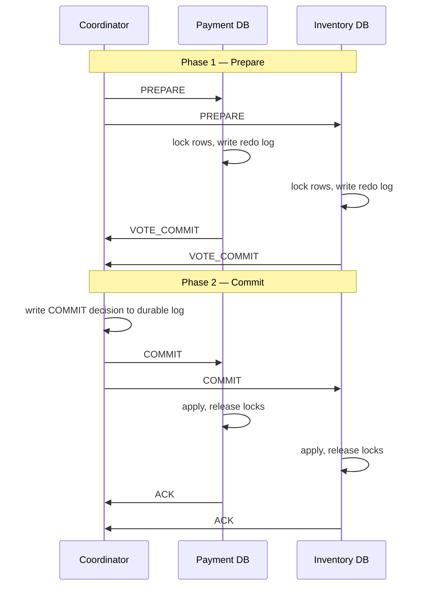
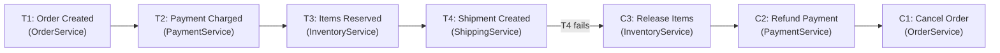
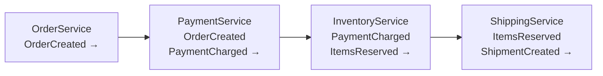
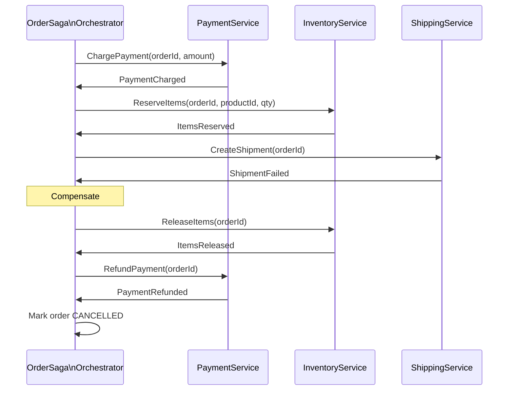
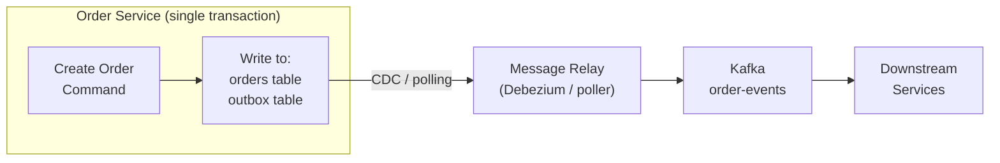

# Distributed Transactions
{: .no_toc }

<details open markdown="block">
  <summary>Table of Contents</summary>
  {: .text-delta }
1. TOC
{:toc}
</details>

A distributed transaction spans multiple services or databases and must appear atomic — either all operations commit or all roll back. On a single database, the engine handles this with ACID guarantees. Across services, there is no shared transaction coordinator, no shared write-ahead log, and no shared lock manager. You have to build the atomicity yourself.

---

## Why Distributed Transactions Are Hard

Consider an e-commerce order: deduct payment, reserve inventory, create shipment. If the payment succeeds but inventory reservation fails, you have taken money for goods you cannot ship. Rolling back the payment requires the payment service to undo a change it already committed.

**The Two Generals Problem** (1975) proves that achieving 100% reliable message delivery over an unreliable channel is impossible. Distributed transactions are a practical approximation with well-understood failure modes.

---

## Two-Phase Commit (2PC)

2PC is the classic protocol for atomic commit across multiple database participants. It is implemented in XA transactions (Java EE, Spring JTA).

### Protocol



### Failure Modes

**Coordinator fails after Phase 1, before Phase 2:**

```
Coordinator crashes after collecting VOTE_COMMIT from all participants.
Participants are now in "prepared" state — they have locked resources
and written redo logs, but don't know the final decision.
They cannot commit (no COMMIT received) or abort (no ABORT received).
They are BLOCKED until the coordinator recovers.
```

This is the **blocking problem** — the fundamental limitation of 2PC. A crashed coordinator can block all participants indefinitely, holding locks.

**Recovery:** The coordinator writes its decision to a durable log before sending to participants. On restart, it replays uncommitted decisions. Participants can query the coordinator for the outcome (heuristic completion).

**If a participant fails during Phase 2:** The coordinator retries COMMIT/ABORT indefinitely until the participant recovers. Since the participant has the redo log, it applies the decision on recovery.

### Spring Boot / JTA Example

```java
// pom.xml: spring-boot-starter-jta-atomikos

@Service
@Transactional // JTA transaction — spans multiple XA-capable datasources
public class OrderService {
    @Autowired private PaymentRepository paymentRepo;    // XA DataSource 1
    @Autowired private InventoryRepository inventoryRepo; // XA DataSource 2

    public void createOrder(Order order) {
        // Both operations participate in the same XA transaction
        paymentRepo.debit(order.getCustomerId(), order.getAmount());
        inventoryRepo.reserve(order.getProductId(), order.getQuantity());
        // If either throws, both roll back atomically
    }
}
```

{: .warning }
2PC holds database locks across network round-trips. Under high contention, lock wait times spike and throughput collapses. Avoid 2PC for high-volume microservices — use SAGA instead.

### When 2PC Is Acceptable

- Internal to a single service using multiple datasources (XA on the same host)
- Low-throughput, strong consistency requirements (financial ledger, inventory in a single warehouse)
- All participants support XA (many modern databases do; message queues generally don't)

---

## Three-Phase Commit (3PC)

3PC adds a **CanCommit** phase and a **pre-commit** phase to eliminate the blocking problem under certain conditions.

```
Phase 1: CanCommit  → participants say YES/NO without locking
Phase 2: PreCommit  → coordinator sends PreCommit; participants acknowledge and prepare to commit
Phase 3: DoCommit   → coordinator sends DoCommit; participants commit
```

**Why it's rarely used in practice:** 3PC is non-blocking only in a fail-stop model (nodes crash and don't come back). Under a network partition — where nodes are alive but can't communicate — 3PC can still reach inconsistency. It's more complex and slower than 2PC for the same consistency guarantees in real-world networks.

{: .note }
3PC is academically important but practically absent from production systems. The industry moved to SAGA for long-running business transactions instead.

---

## SAGA Pattern

A SAGA breaks a distributed transaction into a sequence of **local transactions**, each within a single service. If any step fails, **compensating transactions** undo the already-committed steps.



**Key property:** Compensating transactions must be **idempotent** (safe to retry) and **commutative** where possible. They cannot simply "undo" — if a payment was already sent to a bank, the compensation is a refund, not a rollback.

### Choreography

Each service reacts to events published by the previous step. No central coordinator.



```java
// OrderService publishes event, does NOT call PaymentService directly
@Service
public class OrderService {
    @Autowired private KafkaTemplate<String, OrderEvent> kafka;
    @Autowired private OrderRepository repo;

    @Transactional
    public Order createOrder(CreateOrderRequest req) {
        Order order = repo.save(new Order(req));
        kafka.send("order-events", new OrderCreatedEvent(order.getId(), req.getCustomerId(), req.getAmount()));
        return order;
    }
}

// PaymentService listens to order-events
@KafkaListener(topics = "order-events")
public void onOrderCreated(OrderCreatedEvent event) {
    try {
        paymentService.charge(event.getCustomerId(), event.getAmount());
        kafka.send("payment-events", new PaymentChargedEvent(event.getOrderId()));
    } catch (InsufficientFundsException e) {
        kafka.send("payment-events", new PaymentFailedEvent(event.getOrderId(), "insufficient_funds"));
    }
}
```

**Choreography trade-offs:**
- **Pro:** No single point of failure. Services are loosely coupled.
- **Con:** Hard to track the overall saga state. Debugging requires correlating events across multiple topics. Adding a new step means modifying every adjacent service.

### Orchestration

A central **Saga Orchestrator** tells each participant what to do and manages the compensating flow.



```java
// Axon Framework SAGA example
@Saga
public class OrderProcessingSaga {

    @Autowired
    private transient CommandGateway commandGateway;

    private String orderId;

    @StartSaga
    @SagaEventHandler(associationProperty = "orderId")
    public void on(OrderCreatedEvent event) {
        this.orderId = event.getOrderId();
        commandGateway.send(new ChargePaymentCommand(event.getOrderId(), event.getAmount()));
    }

    @SagaEventHandler(associationProperty = "orderId")
    public void on(PaymentChargedEvent event) {
        commandGateway.send(new ReserveItemsCommand(event.getOrderId(), event.getProductId()));
    }

    @SagaEventHandler(associationProperty = "orderId")
    public void on(ItemsReservationFailedEvent event) {
        // Compensate: refund already-charged payment
        commandGateway.send(new RefundPaymentCommand(event.getOrderId()));
    }

    @EndSaga
    @SagaEventHandler(associationProperty = "orderId")
    public void on(PaymentRefundedEvent event) {
        commandGateway.send(new CancelOrderCommand(event.getOrderId()));
    }

    @EndSaga
    @SagaEventHandler(associationProperty = "orderId")
    public void on(ShipmentCreatedEvent event) {
        // Happy path complete
    }
}
```

**Orchestration trade-offs:**
- **Pro:** Clear visibility into saga state. Easy to add steps. Central place to handle timeouts.
- **Con:** Orchestrator is a new service to deploy and maintain. Risk of "smart orchestrator, dumb services" anti-pattern.

### SAGA vs 2PC

| | 2PC | SAGA |
|:-|:----|:-----|
| Consistency | Strong (ACID) | Eventual (BASE) |
| Isolation | Full (locks held) | None between steps |
| Failure recovery | Coordinator retries | Compensating transactions |
| Lock duration | Across all participants | Per local transaction only |
| Throughput | Low (lock contention) | High |
| Complexity | Protocol complexity | Compensation logic complexity |
| Use case | Same-host, XA-compatible DBs | Cross-service, microservices |

---

## Outbox Pattern

The **dual-write problem**: after a local DB commit, if publishing to Kafka fails, the event is lost — the DB has new state but downstream services don't know about it. The Outbox Pattern solves this.



**How it works:**

1. In the same local transaction, write to the business table AND to an `outbox` table.
2. A separate **message relay** process reads the outbox table and publishes to Kafka.
3. Mark entries as published (or delete them) after successful Kafka delivery.
4. At-least-once delivery: if the relay crashes before marking published, it retries. Consumers must be idempotent.

```java
@Service
public class OrderService {
    @Autowired private OrderRepository orderRepo;
    @Autowired private OutboxRepository outboxRepo;

    @Transactional
    public Order createOrder(CreateOrderRequest req) {
        Order order = orderRepo.save(new Order(req));

        // Written in same transaction as the order — atomically
        OutboxEvent event = OutboxEvent.builder()
            .aggregateId(order.getId())
            .aggregateType("Order")
            .eventType("OrderCreated")
            .payload(toJson(new OrderCreatedEvent(order)))
            .build();
        outboxRepo.save(event);

        return order;
    }
}

// Separate scheduler — relay publishes pending outbox events
@Scheduled(fixedDelay = 100)
public void relayOutboxEvents() {
    List<OutboxEvent> pending = outboxRepo.findUnpublished();
    for (OutboxEvent event : pending) {
        kafkaTemplate.send("order-events", event.getAggregateId(), event.getPayload());
        outboxRepo.markPublished(event.getId());
    }
}
```

{: .important }
For production, use **Debezium** to stream the outbox table changes via CDC rather than polling. This reduces latency and eliminates the polling load on the database. See [3.3 Data Consistency Patterns](data-consistency/) for CDC details.

---

## TCC (Try-Confirm-Cancel)

TCC is a business-level 3-phase protocol. Unlike 2PC (which operates at the database level), TCC requires explicit Try, Confirm, and Cancel business operations on each service.

```
Phase 1 — Try:     Reserve resources (soft lock). Do not commit.
Phase 2 — Confirm: Confirm and finalize the reservation.
Phase 2 — Cancel:  Release the reservation if any Try failed.
```

```java
// Payment service TCC interface
public interface PaymentTCCService {
    // Try: reserve amount — doesn't actually deduct, creates a "hold"
    String tryCharge(String customerId, BigDecimal amount);  // returns reservationId

    // Confirm: finalize the hold as a real deduction
    void confirm(String reservationId);

    // Cancel: release the hold
    void cancel(String reservationId);
}

@Service
public class PaymentTCCServiceImpl implements PaymentTCCService {
    public String tryCharge(String customerId, BigDecimal amount) {
        Account account = accountRepo.findById(customerId);
        if (account.getAvailableBalance().compareTo(amount) < 0) {
            throw new InsufficientFundsException();
        }
        // "Freeze" the amount — reduce available, not actual balance
        account.setFrozenAmount(account.getFrozenAmount().add(amount));
        return reservationRepo.save(new Reservation(customerId, amount)).getId();
    }

    public void confirm(String reservationId) {
        Reservation r = reservationRepo.findById(reservationId);
        Account account = accountRepo.findById(r.getCustomerId());
        account.setBalance(account.getBalance().subtract(r.getAmount()));
        account.setFrozenAmount(account.getFrozenAmount().subtract(r.getAmount()));
        r.setStatus(CONFIRMED);
    }

    public void cancel(String reservationId) {
        Reservation r = reservationRepo.findById(reservationId);
        Account account = accountRepo.findById(r.getCustomerId());
        account.setFrozenAmount(account.getFrozenAmount().subtract(r.getAmount()));
        r.setStatus(CANCELLED);
    }
}
```

**TCC vs 2PC:** TCC doesn't require XA-capable databases. The business logic defines what "reserve" and "release" mean. The cost is that every service must implement three explicit operations.

---

## Pattern Comparison

| Pattern | Consistency | Isolation | Complexity | Best For |
|:--------|:-----------|:----------|:-----------|:---------|
| **2PC** | Strong | Full | Protocol overhead | Same-host, XA-compatible, low volume |
| **SAGA (Choreography)** | Eventual | None | Event topology | High-scale microservices, loose coupling |
| **SAGA (Orchestration)** | Eventual | None | Orchestrator + compensations | Complex flows, visibility needed |
| **Outbox** | At-least-once | N/A | Relay process | Dual-write elimination |
| **TCC** | Business-defined | Soft lock | 3 methods per service | Financial, inventory (explicit reservations) |

---

## Key Takeaways for Interviews

1. **2PC is blocking.** If the coordinator crashes after Phase 1, participants hold locks forever. This is the core reason 2PC doesn't scale.
2. **SAGAs trade isolation for availability.** Between SAGA steps, partial state is visible. Design compensations for this — the system may be read in a partially-applied state.
3. **Always include the Outbox Pattern.** Whenever you publish an event after a DB write, use the Outbox Pattern to prevent dual-write bugs. It's one of the most common patterns missed in interviews.
4. **Compensating transactions are not rollbacks.** They are new forward-moving operations. A sent email cannot be un-sent — the compensation is a follow-up apology email.
5. **Choreography for coupling, Orchestration for visibility.** Choreography is more resilient but harder to debug. Orchestration is easier to observe and extend.
6. **TCC for reservation systems.** Any time you need "soft-lock then finalize" semantics (hotel booking, ticket reservation, payment hold), TCC models the problem well.

---

## References

- *Designing Data-Intensive Applications* — Chapter 9 (Transactions)
- [SAGA Pattern (Chris Richardson, microservices.io)](https://microservices.io/patterns/data/saga.html)
- [Outbox Pattern (microservices.io)](https://microservices.io/patterns/data/transactional-outbox.html)
- [Axon Framework SAGA documentation](https://docs.axoniq.io/reference-guide/axon-framework/sagas)
- [Eventuate Tram](https://eventuate.io/abouteventuatetram.html) — Java library for SAGAs and Outbox
- *System Design Interview Vol 2* — Alex Xu, Chapter on Payment Systems
