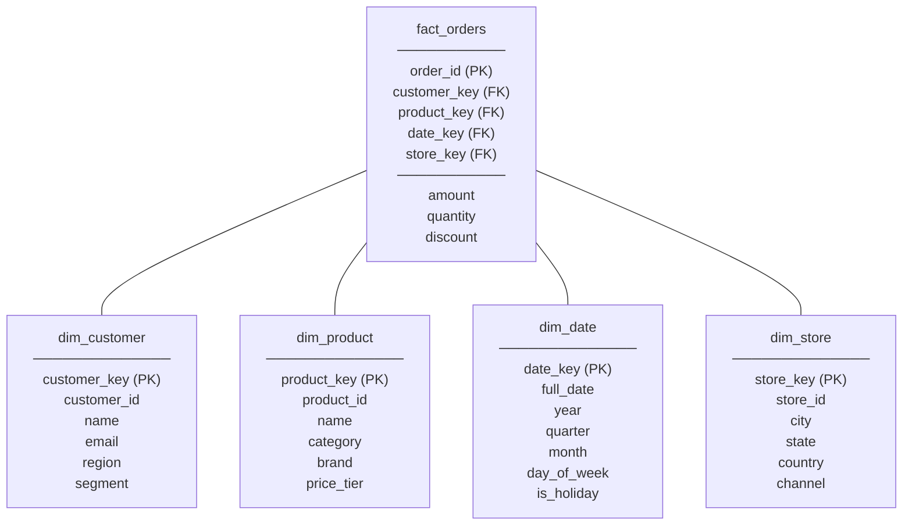

# Data Warehousing & OLAP
{: .no_toc }

<details open markdown="block">
  <summary>Table of Contents</summary>
  {: .text-delta }
1. TOC
{:toc}
</details>

Operational databases (OLTP) and analytical databases (OLAP) have opposing optimization targets. An OLTP database is tuned for thousands of small, concurrent transactions. An OLAP warehouse is tuned for a handful of large queries that scan billions of rows to produce aggregated insights. Trying to run both workloads on the same system leads to resource contention and poor performance for both.

---

## OLTP vs OLAP

| Dimension | OLTP | OLAP |
|:----------|:-----|:-----|
| **Purpose** | Record and retrieve individual transactions | Analyze patterns across historical data |
| **Query shape** | Point reads + small writes (`SELECT WHERE id=?`, `INSERT`, `UPDATE`) | Large scans + aggregations (`GROUP BY`, `SUM`, `AVG` across millions of rows) |
| **Data freshness** | Real-time (milliseconds) | Near-real-time to hours-old (ETL lag) |
| **Schema** | Normalized (3NF) — minimize redundancy | Denormalized (star/snowflake) — minimize joins |
| **Storage layout** | Row-oriented | Column-oriented |
| **Indexes** | Many (B+ Tree, covering) | Few or none (full scans with column pruning) |
| **Row count per query** | 1–1000 rows | Millions–billions of rows |
| **Concurrent users** | Thousands | Tens to hundreds |
| **Example systems** | PostgreSQL, MySQL, Oracle | BigQuery, Redshift, Snowflake, Clickhouse |

**The fundamental tension:** A normalized OLTP schema (3NF, many tables, foreign keys) requires many joins for analytical queries. A denormalized OLAP schema duplicates data but collapses joins into single table scans. You pay in storage and ETL complexity for the read performance gain.

---

## Data Warehouse Schemas

### Star Schema

A **fact table** at the center, surrounded by **dimension tables**. The fact table holds measurable events (orders, page views, transactions). Dimension tables hold descriptive attributes (who, what, where, when).



**Dimension keys vs natural keys:** Dimension tables use surrogate integer keys (`customer_key`), not the natural business key (`customer_id`). This decouples the warehouse from upstream schema changes and enables slowly changing dimensions (SCD).

### Slowly Changing Dimensions (SCD)

Dimension attributes change over time (a customer moves to a different region; a product changes its category). SCD patterns define how to handle historical vs current values.

| Type | Strategy | Use When |
|:-----|:---------|:---------|
| **SCD Type 1** | Overwrite old value | History doesn't matter |
| **SCD Type 2** | Add new row with effective dates, flag old as inactive | Need full history (was customer in "East" when they bought?) |
| **SCD Type 3** | Add a "previous value" column | Only last change matters |

```sql
-- SCD Type 2: dim_customer with effective dates
SELECT c.name, c.region, SUM(f.amount) AS revenue
FROM fact_orders f
JOIN dim_customer c ON f.customer_key = c.customer_key
WHERE f.date_key BETWEEN 20240101 AND 20241231
  AND c.effective_start <= f.order_date
  AND c.effective_end > f.order_date  -- join to the version active at order time
GROUP BY c.name, c.region;
```

### Snowflake Schema

Dimension tables are normalized into sub-dimensions. Reduces storage but adds joins.

```
Star schema:
  fact_orders.product_key → dim_product (category, brand all in one table)

Snowflake schema:
  fact_orders.product_key → dim_product.category_key → dim_category
                                         .brand_key   → dim_brand
```

**Star vs Snowflake trade-off:**
- **Star:** More storage (repeated category names in dim_product). Faster queries (no extra joins).
- **Snowflake:** Less storage. Slower queries (extra joins). Easier to maintain dimension hierarchies.

Most modern cloud warehouses (BigQuery, Redshift) optimize star schema joins heavily. **Star schema is preferred for query performance.**

### Analytical Query Example

```sql
-- Revenue by product category and quarter, top 10 categories
SELECT
    d.category,
    dt.year,
    dt.quarter,
    SUM(f.amount)     AS total_revenue,
    COUNT(f.order_id) AS order_count,
    AVG(f.amount)     AS avg_order_value
FROM fact_orders f
JOIN dim_product  d  ON f.product_key  = d.product_key
JOIN dim_date     dt ON f.date_key     = dt.date_key
JOIN dim_customer c  ON f.customer_key = c.customer_key
WHERE dt.year = 2024
  AND c.region = 'US'
GROUP BY d.category, dt.year, dt.quarter
ORDER BY total_revenue DESC
LIMIT 10;
```

In a column store, this query:
1. Reads only `amount`, `order_id` from `fact_orders` (projection pushdown)
2. Applies `date_key` filter using row group statistics (predicate pushdown)
3. Joins dimension tables (small tables, fit in memory — broadcast join)
4. Aggregates in parallel across multiple workers

---

## Cloud OLAP Systems

### BigQuery

BigQuery is Google Cloud's serverless OLAP engine. Built on **Dremel** (Google's internal columnar query engine) and **Colossus** (Google's distributed filesystem).

**Architecture:**
- **Serverless:** No clusters to provision. Capacity scales instantly.
- **Separated storage and compute:** Data lives in Colossus (columnar, compressed). Compute workers are ephemeral.
- **Slot-based compute:** 1 slot ≈ 1 virtual CPU. On-demand pricing charges per byte scanned. Reserved slots (flat-rate) for predictable cost.

```sql
-- BigQuery: partitioned + clustered table for cost control
CREATE TABLE ecommerce.orders
PARTITION BY DATE(order_date)           -- partition by date (prune old partitions)
CLUSTER BY customer_region, status      -- cluster within partition (sort, prune blocks)
AS SELECT * FROM staging.orders_raw;

-- Query with partition filter (only scans relevant partitions)
SELECT customer_id, SUM(amount)
FROM ecommerce.orders
WHERE order_date BETWEEN '2024-01-01' AND '2024-03-31'  -- partition pruning
  AND customer_region = 'US'                              -- clustering pruning
GROUP BY customer_id;
```

**Cost optimization rules:**
- Always `SELECT` only needed columns (columnar — you pay per byte scanned).
- Partition by date, cluster by high-cardinality filter columns.
- Use materialized views for frequently repeated aggregations.
- Avoid `SELECT *` on large tables.

**BigQuery ML:** Train ML models in SQL (`CREATE MODEL ... AS SELECT ...`). Useful for churn prediction, recommendations, anomaly detection without exporting data.

### Redshift

Amazon Redshift is a PostgreSQL-based MPP (Massively Parallel Processing) data warehouse.

**Architecture (Redshift RA3):**
- **Leader node:** Parses queries, creates execution plan, coordinates workers.
- **Compute nodes:** Execute slices of the query in parallel, each with local SSD cache.
- **Redshift Managed Storage (RMS):** Data stored in S3 (decoupled from compute). Compute nodes cache hot data on local SSD.

```sql
-- Redshift: distribution key + sort key
CREATE TABLE fact_orders (
    order_id    BIGINT,
    customer_id BIGINT      DISTKEY,    -- distribute rows by customer_id
    order_date  DATE        SORTKEY,    -- sort within each node by date
    amount      DECIMAL(12,2),
    status      VARCHAR(20)
)
DISTSTYLE KEY;                          -- hash distribution on DISTKEY

-- DISTKEY collocates customer data on same node → avoids shuffle for customer JOINs
-- SORTKEY enables zone map pruning: skip data blocks outside date range
```

**Distribution styles:**

| Style | When to Use |
|:------|:------------|
| `KEY` | Large fact tables — distribute on join column to avoid shuffle |
| `ALL` | Small dimension tables — full copy on every node (broadcast join) |
| `EVEN` | No dominant join key — uniform distribution |
| `AUTO` | Let Redshift decide (recommended for new tables) |

**Redshift Spectrum:** Query Parquet/ORC files on S3 directly (without loading into Redshift). Useful for querying cold data from the data lake alongside hot data in Redshift.

### Snowflake

Snowflake is a cloud-native warehouse with a unique **multi-cluster shared data** architecture.

```
Snowflake Architecture:
  ┌─────────────────────────────────────────────────────┐
  │  Central Data Storage (S3 / Azure Blob / GCS)       │
  │  Columnar, compressed, immutable micro-partitions   │
  └──────────────┬──────────────────────────────────────┘
                 │ shared data, decoupled compute
      ┌──────────┴──────────┐
      ▼                     ▼
  Warehouse A            Warehouse B
  (analytics team)       (data science team)
  4 nodes                8 nodes
  (scale independently, no contention)
```

**Key differentiators:**

| Feature | How it works |
|:--------|:-------------|
| **Multi-cluster warehouses** | Auto-scale compute clusters for concurrent workload spikes |
| **Zero-copy clone** | `CREATE TABLE orders_backup CLONE orders` — instant, no data copied, only metadata |
| **Time travel** | Query any point in history up to 90 days back |
| **Data sharing** | Share live data with other Snowflake accounts without copying |
| **Separation of storage + compute** | Pay for storage and compute independently; scale compute to zero when not querying |

```sql
-- Snowflake time travel
SELECT * FROM orders AT (TIMESTAMP => '2024-01-15 00:00:00'::TIMESTAMP);
SELECT * FROM orders BEFORE (STATEMENT => '019e6780-...');  -- before a specific query

-- Zero-copy clone for dev/test environments
CREATE DATABASE dev_environment CLONE production_db;  -- instant, shares storage
-- Changes in dev_environment don't affect production (copy-on-write)

-- Data sharing (provider account)
CREATE SHARE order_data_share;
GRANT USAGE ON DATABASE ecommerce TO SHARE order_data_share;
GRANT SELECT ON TABLE ecommerce.public.orders TO SHARE order_data_share;
ALTER SHARE order_data_share ADD ACCOUNTS = 'partner_account';
```

### OLAP System Comparison

| | BigQuery | Redshift | Snowflake |
|:-|:---------|:---------|:----------|
| **Architecture** | Serverless, Dremel engine | MPP, PostgreSQL-based | Multi-cluster, shared storage |
| **Storage** | Colossus (proprietary) | S3 (RA3) | S3/Azure/GCS |
| **Pricing** | Per byte scanned (on-demand) or slots (flat-rate) | Per node-hour or Serverless per compute unit | Per credit (compute) + per TB (storage) |
| **Scaling** | Instant (serverless) | Manual or auto-scaling | Auto-scale (multi-cluster) |
| **Ecosystem** | GCP, BigQuery ML, Looker | AWS, Redshift Spectrum, Glue | Multi-cloud, data sharing |
| **Best for** | GCP-native, serverless analytics, ML in SQL | AWS-native, cost-predictable workloads | Multi-cloud, data sharing, dev/prod isolation |

---

## Apache Iceberg (Revisited in OLAP Context)

While Iceberg was introduced in the [storage engines section](storage-engines/) as a file format, its OLAP implications deserve emphasis.

### The Lakehouse Pattern

Traditional architecture separated the data lake (cheap storage, no ACID) from the data warehouse (expensive, ACID, SQL):

```
Traditional:
  Source systems → ETL → Data Warehouse (Redshift/BigQuery) ← BI tools
                    └──► Data Lake (S3/HDFS, raw files)     ← Data Science

Lakehouse (Iceberg-based):
  Source systems → CDC/streaming → Iceberg tables on S3
                                        ↑
              BI (Redshift Spectrum, Athena, Tableau)
              Data Science (Spark, Jupyter)
              ML (SageMaker, Vertex AI)
              Streaming (Flink)
              ← all query the same Iceberg tables, no duplication
```

**Benefits:** Single copy of data, no ETL duplication, ACID transactions, schema evolution, time travel — all at data lake cost (~$23/TB/month on S3 vs ~$250/TB/month on Redshift managed storage).

### Iceberg + Flink for Streaming Ingestion

```java
// Flink job: write Kafka events to Iceberg table on S3
StreamExecutionEnvironment env = StreamExecutionEnvironment.getExecutionEnvironment();
StreamTableEnvironment tEnv = StreamTableEnvironment.create(env);

// Source: Kafka
tEnv.executeSql("""
    CREATE TABLE kafka_orders (
        order_id STRING,
        customer_id STRING,
        amount DECIMAL(12,2),
        event_time TIMESTAMP(3),
        WATERMARK FOR event_time AS event_time - INTERVAL '5' SECOND
    ) WITH (
        'connector' = 'kafka',
        'topic' = 'orders',
        'properties.bootstrap.servers' = 'kafka:9092',
        'format' = 'json'
    )
""");

// Sink: Iceberg on S3
tEnv.executeSql("""
    CREATE TABLE iceberg_orders (
        order_id STRING,
        customer_id STRING,
        amount DECIMAL(12,2),
        event_time TIMESTAMP(3)
    ) PARTITIONED BY (HOUR(event_time))
    WITH (
        'connector' = 'iceberg',
        'catalog-type' = 'hadoop',
        'warehouse' = 's3://my-lakehouse/warehouse'
    )
""");

tEnv.executeSql("INSERT INTO iceberg_orders SELECT * FROM kafka_orders");
```

---

## ETL vs ELT

Modern cloud warehouses have reversed the traditional ETL (Extract-Transform-Load) pattern to ELT (Extract-Load-Transform).

| | ETL | ELT |
|:-|:----|:----|
| **Transform step** | Before loading (on ETL server) | After loading (inside the warehouse) |
| **Tools** | Informatica, Talend, AWS Glue | dbt, Spark SQL, warehouse native SQL |
| **When** | Legacy warehouses, complex proprietary transforms | Cloud warehouses with abundant compute |
| **Cost** | ETL server compute | Warehouse query compute |

**dbt (data build tool):** Defines transforms as SQL `SELECT` statements. dbt handles materialization (table vs view vs incremental), dependencies, testing, and documentation. Standard in modern data teams.

```sql
-- dbt model: models/marts/revenue_by_category.sql

{{ config(materialized='table', partition_by={'field': 'order_date', 'data_type': 'date'}) }}


SELECT
    d.category,
    DATE_TRUNC(f.order_date, MONTH) AS order_month,
    SUM(f.amount)     AS total_revenue,
    COUNT(f.order_id) AS order_count
FROM {{ ref('fact_orders') }} f
JOIN {{ ref('dim_product') }} d ON f.product_key = d.product_key
WHERE f.order_date >= DATE_SUB(CURRENT_DATE(), INTERVAL 24 MONTH)
GROUP BY 1, 2
```

---

## Key Takeaways for Interviews

1. **OLTP and OLAP have opposing optimization targets.** Row storage + normalization for OLTP. Column storage + denormalization for OLAP. Never mix them on the same system at scale.
2. **The star schema fact table is the unit of analysis.** Every measurable event (order, click, view) is a fact row. Descriptive context (who, what, where, when) lives in dimensions.
3. **SCD Type 2 preserves historical accuracy.** For analytical correctness ("what region was the customer in when they placed this order?"), you need versioned dimension rows with effective dates.
4. **BigQuery charges per byte scanned.** Partition pruning and column projection are mandatory cost controls, not optional optimizations.
5. **Snowflake zero-copy clone enables safe dev/test environments.** Production data is instantly available for testing without storage duplication — copy-on-write handles mutations.
6. **Iceberg makes S3 a first-class ACID store.** Time travel, schema evolution, and partition evolution on object storage without a database engine. The lakehouse pattern eliminates the dual data lake + warehouse architecture.
7. **ELT > ETL for cloud warehouses.** Load raw data into the warehouse and transform using SQL (dbt). Warehouses have more compute than your ETL server, and SQL transforms are easier to test and version-control.

---

## References

- *The Data Warehouse Toolkit* — Ralph Kimball & Margy Ross (star schema bible)
- [BigQuery documentation](https://cloud.google.com/bigquery/docs)
- [Amazon Redshift documentation](https://docs.aws.amazon.com/redshift/)
- [Snowflake documentation](https://docs.snowflake.com/)
- [Apache Iceberg documentation](https://iceberg.apache.org/docs/latest/)
- [dbt documentation](https://docs.getdbt.com/)
- *Designing Data-Intensive Applications* — Chapter 3 (column-oriented storage), Chapter 10 (batch processing)
- [Dremel: Interactive Analysis of Web-Scale Datasets](https://research.google/pubs/pub36632/) — Google (BigQuery's foundation)
