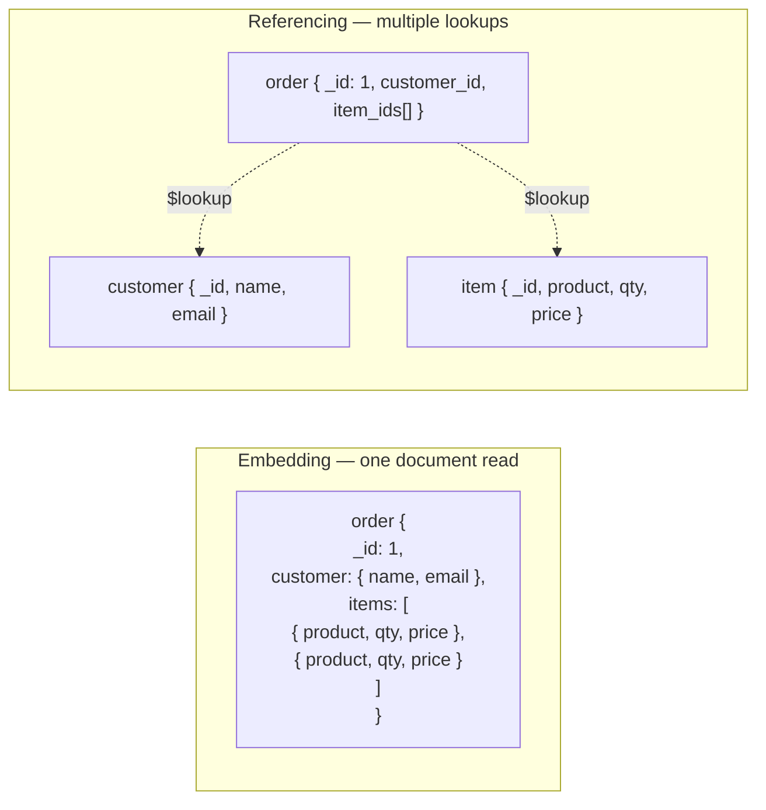

# NoSQL Databases
{: .no_toc }

<details open markdown="block">
  <summary>Table of Contents</summary>
  {: .text-delta }
1. TOC
{:toc}
</details>

"NoSQL" is not a single thing — it's a family of storage systems each optimized for a different access pattern. The decision to use a particular NoSQL database is always an access-pattern decision, not a "it's faster" decision. Choosing the wrong NoSQL database for your access pattern is worse than choosing a relational database.

---

## When to Choose NoSQL

| Reason | Example |
|:-------|:--------|
| **Schema flexibility** | Product catalog with wildly different attribute sets per category |
| **Horizontal write scale** | Cassandra writing 1M events/sec across partitions |
| **Access-pattern simplicity** | Redis key-value lookups with microsecond latency |
| **Hierarchical / graph data** | Social graph, fraud detection, recommendation engine |
| **Time-series workloads** | IoT metrics, stock ticks, infrastructure monitoring |
| **Document-centric reads** | Reading a user's full profile (denormalized) in one query |

**When to keep using PostgreSQL/MySQL instead:** multi-entity joins, complex reporting queries, strong ACID transactions across entities, schema with enforced referential integrity.

---

## Document Stores — MongoDB

MongoDB stores data as **BSON** (binary JSON) documents in collections. A document can contain nested objects and arrays — no schema enforcement by default.

### Embedding vs Referencing

The core schema design decision in MongoDB.



**Embed when:**
- Data is accessed together always (order + its line items)
- Subdocument has no independent lifecycle
- Array is bounded and small (< ~100 elements)
- Write consistency between parent and child matters

**Reference when:**
- Many-to-many relationship (products shared across many orders)
- Referenced entity is large and only sometimes needed
- Referenced entity is updated frequently and independently

### Aggregation Pipeline (Java)

```java
MongoCollection<Document> orders = db.getCollection("orders");

List<Document> results = orders.aggregate(List.of(
    // Stage 1: filter
    Aggregates.match(Filters.eq("status", "PENDING")),
    // Stage 2: group and sum
    Aggregates.group("$customerId",
        Accumulators.sum("totalSpent", "$amount"),
        Accumulators.sum("orderCount", 1)
    ),
    // Stage 3: sort by total descending
    Aggregates.sort(Sorts.descending("totalSpent")),
    // Stage 4: limit
    Aggregates.limit(10)
)).into(new ArrayList<>());
```

### Key Design Rules

- **Design your schema around your queries**, not the data's natural structure.
- Avoid unbounded arrays (a post with millions of comments embedded = document grows to gigabytes).
- MongoDB performs **collection-level locking for multi-document operations** unless you use multi-document ACID transactions (available since v4.0, expensive).
- **Atlas Search** integrates Lucene-based full-text search directly into MongoDB — avoids a separate Elasticsearch cluster for basic search use cases.

---

## Wide-Column Stores — Cassandra

Cassandra is a distributed wide-column store optimized for **high-throughput writes** and **linear horizontal scaling**. Every design decision follows from two principles: no single point of failure, and writes never block.

### Data Model Fundamentals

```
Keyspace → Table → Partition → Rows (sorted by clustering columns)

CREATE TABLE orders_by_customer (
    customer_id  UUID,
    order_date   TIMESTAMP,
    order_id     UUID,
    total_amount DECIMAL,
    status       TEXT,
    PRIMARY KEY ((customer_id), order_date, order_id)
    -- ^^^^^^^^^^^                ^^^^^^^^^^^^^^^^^
    -- partition key              clustering columns
);
```

- **Partition key** (`customer_id`): determines which node holds this data. All rows with the same partition key are co-located on the same node(s). Queried with `=` only.
- **Clustering columns** (`order_date, order_id`): sort order within the partition. Queried with `=`, `>`, `<`, `BETWEEN` — but only in declared order.

### Partition Key Design Rules

```
-- ✅ Good: queries go to one partition
SELECT * FROM orders_by_customer WHERE customer_id = ? AND order_date > ?;

-- ❌ Bad: requires ALLOW FILTERING — full cluster scan
SELECT * FROM orders_by_customer WHERE total_amount > 100;

-- ❌ Hot partition: time-based key means all writes go to "today" shard
PRIMARY KEY ((date), timestamp, order_id)   -- January 15 = one hot partition

-- ✅ Better: bucket to distribute writes
PRIMARY KEY ((customer_id, bucket), timestamp, order_id)
-- bucket = timestamp % 10  (spread across 10 partitions)
```

**The golden rule:** design your table *for each specific query*, not for the data. If you have 5 different query patterns, you may need 5 tables (denormalized).

### Tombstones

When you `DELETE` a row in Cassandra, it doesn't disappear immediately — a **tombstone** marker is written. During reads, Cassandra must skip tombstones. During compaction, tombstones older than `gc_grace_seconds` (default 10 days) are purged.

```
Problem scenario:
  - Table has 1M rows, 900K are deleted
  - Each read must skip 900K tombstones to find 100K live rows
  - Symptoms: read timeouts, "TombstoneOverwhelmingException"

Mitigations:
  - Use TTL instead of explicit DELETE: INSERT ... USING TTL 86400
  - Run compaction more aggressively (LeveledCompaction for read-heavy)
  - Avoid patterns that delete large numbers of rows in one table
```

### Compaction Strategies

| Strategy | When to Use | Trade-off |
|:---------|:------------|:----------|
| **SizeTieredCompaction (STCS)** | Write-heavy (default) | Good write amplification; read amplification grows with SSTable count |
| **LeveledCompaction (LCS)** | Read-heavy | Low read amplification; higher write amplification and I/O |
| **TimeWindowCompaction (TWCS)** | Time-series with TTL | Groups SSTables by time window; efficient TTL expiration |

```java
// Spring Data Cassandra — repository pattern
@Table("orders_by_customer")
public class OrderByCustomer {
    @PrimaryKeyColumn(name = "customer_id", type = PrimaryKeyType.PARTITIONED)
    private UUID customerId;

    @PrimaryKeyColumn(name = "order_date", type = PrimaryKeyType.CLUSTERED,
                      ordering = Ordering.DESCENDING)
    private Instant orderDate;

    @PrimaryKeyColumn(name = "order_id", type = PrimaryKeyType.CLUSTERED)
    private UUID orderId;

    private BigDecimal totalAmount;
    private String status;
}

public interface OrderByCustomerRepository
    extends CassandraRepository<OrderByCustomer, OrderByCustomerKey> {

    List<OrderByCustomer> findByCustomerIdAndOrderDateGreaterThan(
        UUID customerId, Instant since);
}
```

---

## Key-Value Stores — Redis & DynamoDB

### Redis

Redis stores all data in memory with optional persistence. Its strength is microsecond latency and rich data structures.

| Data Structure | Use Case | Example |
|:--------------|:---------|:--------|
| **String** | Cache values, counters, session tokens | `SET session:abc123 "{...}" EX 3600` |
| **Hash** | Object fields (avoids full-object serialization) | `HSET user:1 name "Alice" email "a@b.com"` |
| **Set** | Unique tags, online users, deduplication | `SADD online_users user:42` |
| **Sorted Set (ZSet)** | Leaderboards, priority queues, rate limiting | `ZADD leaderboard 9850 "player:1"` |
| **List** | Task queues, activity feeds | `LPUSH feed:user:1 event_id` |
| **Stream** | Durable event log with consumer groups | Kafka-lite for inter-service events |

**Persistence options:**
- **RDB (snapshot):** Point-in-time snapshot to disk every N seconds or M writes. Fast restart, but data since last snapshot is lost on crash.
- **AOF (Append-Only File):** Log every write command. `fsync always` = 0 data loss, 2× slower writes. `fsync everysec` = ≤1 second data loss.
- **RDB + AOF:** Use both for durability with fast restart (AOF used for recovery, RDB for backup).

**Cluster mode:** Redis Cluster uses 16,384 hash slots distributed across nodes. Each key maps to `CRC16(key) % 16384`. Use `{user:1}` brace notation to colocate related keys on the same slot.

### DynamoDB

DynamoDB is a fully managed key-value + document store from AWS. Provisioned or on-demand capacity, single-digit millisecond latency at any scale.

**Primary key:** Every item has either a **partition key** (hash key) alone, or a **partition key + sort key** (range key). This pair must be unique.

#### Single-Table Design

DynamoDB's access patterns are defined at table creation — there are no joins. Single-table design stores multiple entity types in one table, using a generic `PK`/`SK` convention.

```
Table: ecommerce (PK, SK, attributes...)

PK                  SK                   Attributes
------------------  -------------------  -----------
CUSTOMER#cust-1     PROFILE              name, email, region
CUSTOMER#cust-1     ORDER#2024-01-15#ord-1  amount, status
CUSTOMER#cust-1     ORDER#2024-01-20#ord-2  amount, status
ORDER#ord-1         ITEM#item-a          product, qty, price
ORDER#ord-1         ITEM#item-b          product, qty, price
PRODUCT#prod-x      META                 name, price, stock
```

```java
// Spring Data DynamoDB / AWS SDK v2 Java example
@DynamoDbBean
public class CustomerOrder {
    private String pk;          // "CUSTOMER#cust-1"
    private String sk;          // "ORDER#2024-01-15#ord-1"
    private BigDecimal amount;
    private String status;

    @DynamoDbPartitionKey
    public String getPk() { return pk; }

    @DynamoDbSortKey
    public String getSk() { return sk; }
}

// Query: all orders for a customer since a date
QueryRequest request = QueryRequest.builder()
    .tableName("ecommerce")
    .keyConditionExpression("PK = :pk AND SK BETWEEN :from AND :to")
    .expressionAttributeValues(Map.of(
        ":pk",   AttributeValue.fromS("CUSTOMER#" + customerId),
        ":from", AttributeValue.fromS("ORDER#2024-01-01"),
        ":to",   AttributeValue.fromS("ORDER#2099-12-31")
    ))
    .build();
```

#### GSI and LSI

| | GSI (Global Secondary Index) | LSI (Local Secondary Index) |
|:-|:-----------------------------|:----------------------------|
| Partition key | Different from table PK | Same as table PK |
| Sort key | Different | Different from table SK |
| Storage | Separate partition | Co-located with base partition |
| Item limit per partition | None | 10 GB per partition key |
| When to create | After table creation | Only at table creation |
| Use case | Query by a non-PK attribute | Alternate sort order for same PK |

```
GSI example: find all orders by status (PK is customerId, GSI PK is status)
  GSI PK: status = "PENDING"  → returns all pending orders across all customers
```

---

## Graph Databases — Neo4j

Graph databases model data as nodes (entities) and relationships (edges), each with properties. Optimized for traversing relationships — queries that would require many JOINs in SQL.

### When to Use a Graph Database

- **Social graphs:** "Who are the friends of friends of User X within 3 hops?"
- **Fraud detection:** "Has this card been used at a merchant that shares an IP with a known fraud account?"
- **Recommendation engines:** "What did users who bought A and B also buy?"
- **Access control graphs:** "Can User X reach Resource Y through any permission chain?"

**Rule of thumb:** if your query involves traversing relationships of unknown or variable depth, use a graph DB. If the depth is always 1 or 2, SQL with JOINs is fine.

### Cypher Query Language

```cypher
// Find friends of friends (2-hop traversal)
MATCH (me:User {id: "user-1"})-[:FRIEND]->(friend)-[:FRIEND]->(fof)
WHERE fof <> me AND NOT (me)-[:FRIEND]->(fof)
RETURN fof.name, fof.id
LIMIT 20;

// Shortest path between two users
MATCH path = shortestPath(
    (a:User {id: "user-1"})-[:FRIEND*]-(b:User {id: "user-99"})
)
RETURN path;

// Fraud pattern: shared device across multiple accounts
MATCH (a:Account)-[:USED_DEVICE]->(d:Device)<-[:USED_DEVICE]-(b:Account)
WHERE a <> b AND a.flagged = true
RETURN b.accountId, count(d) AS sharedDevices
ORDER BY sharedDevices DESC;
```

```java
// Spring Data Neo4j
@Node
public class User {
    @Id @GeneratedValue
    private Long id;
    private String name;

    @Relationship(type = "FRIEND", direction = Relationship.Direction.UNDIRECTED)
    private List<User> friends;
}

@Repository
public interface UserRepository extends Neo4jRepository<User, Long> {
    @Query("MATCH (u:User {id: $id})-[:FRIEND*2]-(fof) " +
           "WHERE NOT (u)-[:FRIEND]-(fof) " +
           "RETURN fof LIMIT 20")
    List<User> findFriendsOfFriends(@Param("id") Long id);
}
```

**Amazon Neptune** is AWS's managed graph database, supporting both Gremlin (property graph) and SPARQL (RDF). Use it instead of self-managed Neo4j for cloud-native workloads.

---

## Time-Series Databases — InfluxDB & TimescaleDB

Time-series data is append-only, high-volume, and queried by time range with aggregation. General-purpose databases handle this poorly at scale — data retention, downsampling, and compression require special treatment.

### InfluxDB

InfluxDB uses a custom storage engine (TSM — Time-Structured Merge Tree) optimized for time-series.

**Data model: measurement, tags, fields**

```
// Line protocol
cpu_usage,host=web-01,region=us-east value=72.5 1699900000000000000
^^^^^^^^^  ^^^^^^^^^^^^^^^^^^^^^^^^^ ^^^^^^^^^^  ^^^^^^^^^^^^^^^^^^^
measurement         tags               field(s)       timestamp (ns)

// Tags: indexed, low cardinality (host names, regions, service names)
// Fields: not indexed, high cardinality (metric values, counters)
```

```sql
-- InfluxQL query: average CPU per host over last hour in 5-minute windows
SELECT MEAN("value") FROM "cpu_usage"
WHERE time > now() - 1h
GROUP BY time(5m), "host"
FILL(null);
```

**Retention policies:** Automatically delete data older than a configured duration. Combine with **continuous queries** (pre-aggregated summaries) for long-term storage:

```sql
-- Keep raw data for 7 days
CREATE RETENTION POLICY "raw" ON "metrics" DURATION 7d REPLICATION 1 DEFAULT;

-- Keep hourly aggregates for 1 year
CREATE RETENTION POLICY "hourly" ON "metrics" DURATION 365d REPLICATION 1;

-- Continuous query: downsample from raw to hourly
CREATE CONTINUOUS QUERY "cq_hourly_cpu" ON "metrics"
BEGIN
  SELECT MEAN("value") INTO "hourly"."cpu_usage" FROM "raw"."cpu_usage"
  GROUP BY time(1h), "host"
END;
```

### TimescaleDB

TimescaleDB is a PostgreSQL extension that adds time-series optimizations via **hypertables** — tables automatically partitioned into time-based chunks.

```sql
-- Create hypertable (partitioned by time)
SELECT create_hypertable('metrics', 'time', chunk_time_interval => INTERVAL '1 day');

-- Continuous aggregate (pre-computed materialized view)
CREATE MATERIALIZED VIEW hourly_cpu
WITH (timescaledb.continuous) AS
SELECT time_bucket('1 hour', time) AS bucket,
       host,
       AVG(cpu_value) AS avg_cpu
FROM metrics
GROUP BY bucket, host;

-- Compression (8–20× compression ratio for time-series)
SELECT add_compression_policy('metrics', INTERVAL '7 days');
```

**TimescaleDB advantage:** full SQL, JOINs with relational data, existing PostgreSQL tooling (pgAdmin, Hibernate, JDBC). Choose it when you need time-series analytics alongside relational data.

### Prometheus

Prometheus is a **pull-based** monitoring system that scrapes metrics from services at configured intervals. It stores data locally in a custom TSDB and exposes a query language (PromQL).

```yaml
# prometheus.yml — scrape targets
scrape_configs:
  - job_name: 'order-service'
    scrape_interval: 15s
    static_configs:
      - targets: ['order-service:8080']
```

```java
// Micrometer (Spring Boot Actuator) exposes metrics for Prometheus
@RestController
public class OrderController {
    private final Counter orderCounter;

    public OrderController(MeterRegistry registry) {
        this.orderCounter = registry.counter("orders.created", "region", "us-east");
    }

    @PostMapping("/orders")
    public Order create(@RequestBody CreateOrderRequest req) {
        orderCounter.increment();
        // ...
    }
}
```

```promql
# PromQL: request rate over 5 minutes
rate(http_server_requests_seconds_count{job="order-service"}[5m])

# 99th percentile latency
histogram_quantile(0.99,
  rate(http_server_requests_seconds_bucket{job="order-service"}[5m])
)
```

---

## NoSQL Comparison

| | MongoDB | Cassandra | Redis | DynamoDB | Neo4j | InfluxDB |
|:-|:--------|:----------|:------|:---------|:------|:---------|
| **Model** | Document | Wide-column | Key-value | Key-value + document | Graph | Time-series |
| **Query** | Rich queries, aggregation | CQL (partition-first) | Commands | PK + GSI only | Cypher traversals | InfluxQL / Flux |
| **Joins** | `$lookup` (slow) | None | None | None | Native (graph traversal) | None |
| **Consistency** | Tunable (default strong) | Tunable (eventual default) | Strong (single shard) | Eventually consistent by default | ACID (single instance) | Eventual |
| **Horizontal scale** | Via sharding | Built-in (masterless) | Via cluster | Fully managed | Limited | Via sharding |
| **Best for** | Flexible schemas, rich queries | High write throughput | Cache, sessions, leaderboards | Serverless, AWS-native | Relationships, graph traversal | Metrics, IoT, monitoring |

---

## Key Takeaways for Interviews

1. **MongoDB schema design is query-driven.** Embed when data is always read together; reference when entities have independent lifecycles or many-to-many relationships.
2. **Cassandra's partition key is everything.** A bad partition key (time-based without bucketing, low cardinality) creates hot partitions that nullify horizontal scaling.
3. **Cassandra tombstones accumulate on delete-heavy workloads.** Use TTL instead of DELETE for time-bounded data.
4. **DynamoDB single-table design puts query patterns in the schema.** Define access patterns before modeling the table — there's no "fix it with a JOIN" escape hatch.
5. **Redis is a data structure server, not just a cache.** Sorted sets for leaderboards, streams for event queues, and bloom filter module for set membership tests are all first-class features.
6. **Graph databases shine when relationship depth is variable.** A 3-hop social graph query that would need 3 JOINs in SQL (and explode at 6 hops) is a single Cypher `MATCH` with `*`.
7. **Time-series databases auto-expire and downsample.** Their killer features are retention policies and continuous aggregates — not just "fast inserts."

---

## References

- [MongoDB Schema Design Anti-Patterns](https://www.mongodb.com/developer/products/mongodb/schema-design-anti-pattern-summary/) — MongoDB documentation
- [Cassandra Data Modeling](https://cassandra.apache.org/doc/latest/cassandra/data_modeling/intro.html) — Apache Cassandra docs
- [DynamoDB Best Practices](https://docs.aws.amazon.com/amazondynamodb/latest/developerguide/best-practices.html) — AWS documentation
- [The DynamoDB Book](https://www.dynamodbbook.com/) — Alex DeBrie (single-table design)
- *Cassandra: The Definitive Guide* — Carpenter & Hewitt (O'Reilly)
- [InfluxDB documentation](https://docs.influxdata.com/influxdb/v2/)
- [TimescaleDB documentation](https://docs.timescale.com/)
- *Designing Data-Intensive Applications* — Chapter 2 (Data Models and Query Languages)
