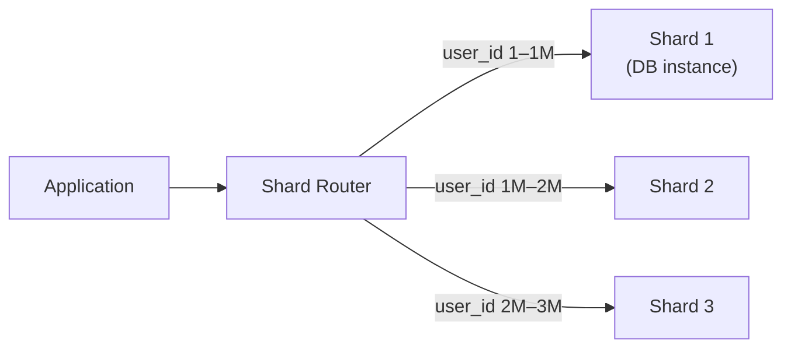
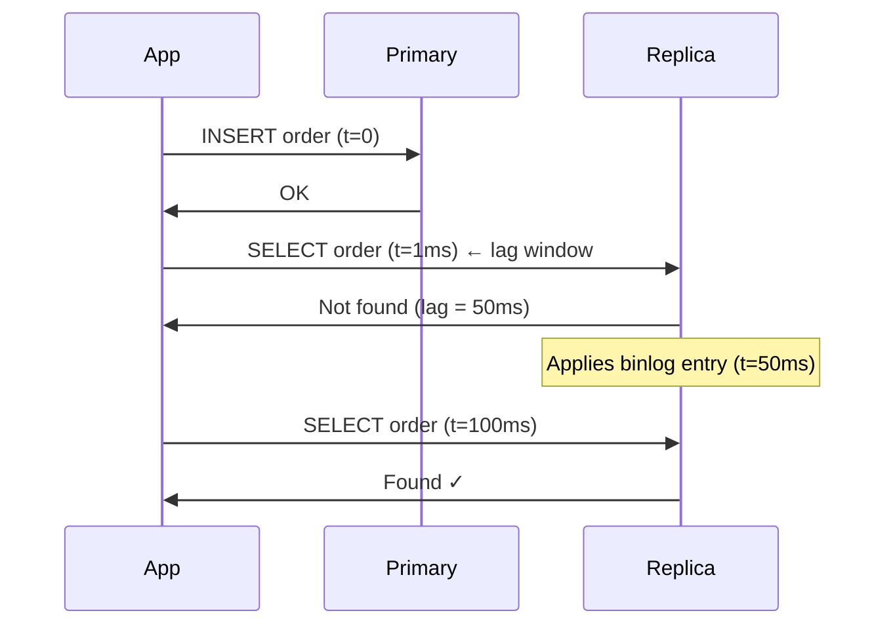

# Relational Databases
{: .no_toc }

<details open markdown="block">
  <summary>Table of Contents</summary>
  {: .text-delta }
1. TOC
{:toc}
</details>

Relational databases are not simply "storage with SQL" — they are complex engines with carefully designed transaction systems, index structures, and replication pipelines. Understanding these internals explains why a query that runs in 2 ms on a 10K-row table takes 8 seconds on a 50M-row table, and what to do about it.

---

## Transaction Isolation Levels

The SQL standard defines four isolation levels, each trading off visibility of concurrent changes against anomaly risk. Most databases default to **READ COMMITTED** (PostgreSQL) or **REPEATABLE READ** (MySQL InnoDB).

### Read Phenomena

| Anomaly | Description |
|:--------|:------------|
| **Dirty Read** | Read an uncommitted change from another transaction — if that transaction rolls back, you read data that never existed |
| **Non-repeatable Read** | Read the same row twice within a transaction and get different values because another transaction committed between reads |
| **Phantom Read** | Run the same range query twice and get different rows because another transaction inserted/deleted in that range |
| **Lost Update** | Two transactions read-modify-write the same row; one overwrites the other's change |

### Isolation Level Matrix

| Level | Dirty Read | Non-repeatable Read | Phantom Read | Default in |
|:------|:-----------|:--------------------|:-------------|:-----------|
| **READ UNCOMMITTED** | Possible | Possible | Possible | Rarely used |
| **READ COMMITTED** | Prevented | Possible | Possible | PostgreSQL, Oracle |
| **REPEATABLE READ** | Prevented | Prevented | Possible* | MySQL InnoDB |
| **SERIALIZABLE** | Prevented | Prevented | Prevented | Explicit opt-in |

*InnoDB's REPEATABLE READ also prevents phantom reads for range queries using gap locks — stronger than the SQL standard requires.

### Spring Boot Transaction Configuration

```java
// Default: inherits from DataSource (usually READ COMMITTED)
@Transactional
public void processOrder(String orderId) { ... }

// Explicit isolation — use REPEATABLE READ for financial reads
@Transactional(isolation = Isolation.REPEATABLE_READ)
public BigDecimal getAccountBalance(String accountId) {
    return accountRepo.findById(accountId).getBalance();
}

// SERIALIZABLE for critical inventory checks
@Transactional(isolation = Isolation.SERIALIZABLE)
public void reserveSeat(String flightId, String seatId) {
    Seat seat = seatRepo.findById(seatId);
    if (seat.isReserved()) throw new SeatTakenException();
    seat.reserve();
    seatRepo.save(seat);
}
```

{: .warning }
SERIALIZABLE uses predicate locks and is 2–5× slower than READ COMMITTED on contended workloads. Use it only when phantom reads would cause real correctness issues (e.g., "only 1 seat remaining" checks). For most cases, optimistic locking achieves the same safety at lower cost.

### Optimistic Locking (Alternative to SERIALIZABLE)

```java
@Entity
public class Seat {
    @Version
    private Long version;  // JPA increments on every update
    // ...
}

// JPA throws OptimisticLockException if version changed since read
@Transactional
public void reserveSeat(String seatId) {
    Seat seat = seatRepo.findById(seatId).orElseThrow();
    if (seat.isReserved()) throw new SeatTakenException();
    seat.reserve();
    seatRepo.save(seat);  // fails if another transaction already updated
}
```

---

## MVCC (Multi-Version Concurrency Control)

MVCC allows readers and writers to never block each other. Instead of locking rows for reads, the database maintains multiple versions of each row.

### InnoDB MVCC

InnoDB stores old row versions in the **undo log** (a separate tablespace). Each row in the clustered index has two hidden fields:
- `DB_TRX_ID` — the transaction ID that last modified this row
- `DB_ROLL_PTR` — pointer to the undo log record for the previous version

```
Active row in clustered index:
  [data | DB_TRX_ID=500 | DB_ROLL_PTR] ──▶ Undo log entry (version for TRX_ID=480)
                                                             └──▶ Undo log entry (version for TRX_ID=450)
                                                                              └──▶ ...
```

When a transaction reads a row, it uses a **read view** (snapshot of which transactions were active when it started). If the row's `DB_TRX_ID` is newer than the read view, InnoDB walks the undo log chain to find the version visible to this transaction.

**Undo log growth:** Long-running transactions accumulate undo log entries that cannot be purged. A single `SELECT` that runs for hours (e.g., a report) while heavy writes occur can cause the undo log to grow to gigabytes. The purge thread cleans old versions only when no transaction needs them.

### PostgreSQL MVCC

PostgreSQL stores old versions as **dead tuples directly in the heap** (data pages). Each row has:
- `xmin` — transaction ID that inserted this row
- `xmax` — transaction ID that deleted/updated this row (0 if live)

```
Heap page:
  Tuple 1: [data | xmin=100, xmax=0]   ← live row
  Tuple 2: [data | xmin=80,  xmax=100] ← dead tuple (updated by TRX 100)
  Tuple 3: [data | xmin=70,  xmax=80]  ← dead tuple (older version)
```

Dead tuples accumulate until **AUTOVACUUM** reclaims them. Without regular vacuuming, tables bloat and queries slow down as pages fill with dead tuples.

### MVCC Comparison

| | InnoDB | PostgreSQL |
|:-|:-------|:-----------|
| Old versions stored in | Separate undo log | Heap (same table pages) |
| Read of old version | Reconstruct from undo chain | Read dead tuple directly |
| Cleanup | Purge thread (automatic) | AUTOVACUUM (must be tuned) |
| Bloat risk | Undo log (long transactions) | Table/index bloat (high write workloads) |
| HOT updates | N/A | Heap Only Tuple — no index update if non-indexed columns change |

---

## Index Types

### B+ Tree Index

The default index type in all major relational databases. A balanced tree where:
- **Internal nodes** hold separator keys and child pointers
- **Leaf nodes** hold the actual key values and row pointers (or data, for clustered indexes)
- **Leaf nodes are linked** — enabling efficient range scans without returning to internal nodes

```
B+ Tree for index on (age):
                    [30]
                  /      \
           [15|22]        [40|55]
          /   |   \       /  |  \
       [10] [18] [25]  [35] [45] [60]
        ↕    ↕    ↕     ↕    ↕    ↕
       (linked list for range scans)
```

**Clustered vs secondary:**
- **Clustered index** (InnoDB primary key): leaf nodes hold the actual row data. Table IS the B+ Tree. Only one per table.
- **Secondary index**: leaf nodes hold the primary key value. A lookup must follow the PK to get the full row ("double lookup" / "bookmark lookup").

**InnoDB implication:** Always choose a short, monotonically increasing PK (e.g., `BIGINT AUTO_INCREMENT`). A UUID primary key causes random insertions that fragment the B+ Tree, filling pages to ~50% and doubling storage.

### Hash Index

Only supports exact equality (`=`). No range scans, no `ORDER BY`, no `LIKE`.

- MySQL: available only in the MEMORY engine (not InnoDB). InnoDB has an **Adaptive Hash Index** — automatically built in the buffer pool for frequently accessed B+ Tree pages.
- PostgreSQL: explicitly available (`CREATE INDEX idx USING hash`). Useful for large equality-only columns.

### Full-Text Index

**MySQL FULLTEXT:**
```sql
CREATE FULLTEXT INDEX idx_ft ON articles(title, body);
SELECT * FROM articles WHERE MATCH(title, body) AGAINST('distributed systems' IN BOOLEAN MODE);
```

Internally an inverted index: word → list of (row_id, position) pairs. Does not support partial word matching or stemming by default.

**PostgreSQL tsvector:**
```sql
ALTER TABLE articles ADD COLUMN search_vector tsvector
    GENERATED ALWAYS AS (to_tsvector('english', title || ' ' || body)) STORED;
CREATE INDEX idx_fts ON articles USING GIN(search_vector);

SELECT * FROM articles WHERE search_vector @@ to_tsquery('english', 'distributed & system');
```

PostgreSQL's full-text supports stemming (e.g., "run" matches "running"), language-specific dictionaries, and ranking (`ts_rank`).

### Covering Index

A covering index includes all columns a query needs — the query engine never reads the base table.

```sql
-- Query
SELECT order_date, total_amount FROM orders WHERE customer_id = 42;

-- Covering index: includes all three columns
CREATE INDEX idx_cover ON orders(customer_id, order_date, total_amount);

-- EXPLAIN shows "Using index" (no table access)
-- Without covering index: "Using index condition" → table lookup per row
```

```
Without covering index:           With covering index:
  Index (customer_id)               Index (customer_id, order_date, total_amount)
      │                                 │
      ▼                                 ▼ ← query satisfied here, done
  Table lookup (I/O)
```

**Rule:** For high-frequency queries, include all `SELECT` columns and `WHERE` / `ORDER BY` columns in the index. The storage cost (index duplication) is worth eliminating random I/O at scale.

### Partial Index

Index only a subset of rows matching a `WHERE` clause. Smaller, faster, more selective.

```sql
-- Index only unpaid invoices — far fewer rows than all invoices
CREATE INDEX idx_unpaid ON invoices(customer_id, created_at)
    WHERE status = 'UNPAID';

-- Queries that include the same WHERE condition use this index
SELECT * FROM invoices WHERE customer_id = 5 AND status = 'UNPAID';
```

**PostgreSQL only** (MySQL does not support partial indexes). Useful for sparse conditions: soft-deleted rows, active sessions, unprocessed queue items.

---

## Query Optimization

### Reading EXPLAIN ANALYZE

```sql
EXPLAIN ANALYZE SELECT o.id, c.name
FROM orders o JOIN customers c ON o.customer_id = c.id
WHERE o.status = 'PENDING' AND c.region = 'US';
```

MySQL EXPLAIN key columns:

| Column | Good | Investigate |
|:-------|:-----|:------------|
| `type` | `const`, `eq_ref`, `ref`, `range` | `ALL`, `index` (full scan) |
| `rows` | Low estimate | Large number × many rows = slow |
| `Extra` | `Using index` | `Using filesort`, `Using temporary` |
| `key` | Shows index name | `NULL` = no index used |

```
type values (best → worst):
  const      → PK or unique key with single value (one row guaranteed)
  eq_ref     → PK join (one row per outer row)
  ref        → non-unique index lookup
  range      → index range scan (BETWEEN, >, <, IN)
  index      → full index scan (still sequential, not as bad as ALL)
  ALL        → full table scan — usually bad above 10K rows
```

### Index Selectivity

**Selectivity** = `COUNT(DISTINCT col) / COUNT(*)` — ranges 0 to 1.

- `1.0` = unique (perfect, like a PK)
- `0.5` = half distinct values
- `~0` = very low (e.g., boolean, status with 3 values)

**Low-selectivity indexes are often ignored by the optimizer.** If `status` has 3 values and 40% of rows are `PENDING`, a full table scan may be faster than index + random I/O for 40% of rows.

```sql
-- Check selectivity
SELECT COUNT(DISTINCT status) / COUNT(*) AS selectivity FROM orders;
-- 0.00003 → useless index alone; combine with high-selectivity column

-- Composite index — put high-selectivity columns first
CREATE INDEX idx_orders ON orders(customer_id, status, created_at);
-- customer_id is high selectivity (millions of customers)
-- status alone is low — but filters within a customer's rows
```

### Composite Index Column Order

1. **Equality conditions first** (`WHERE a = ? AND b = ?`)
2. **Range condition last** (`AND c > ?`)
3. Columns after a range condition in the index are not used for filtering

```sql
-- Index: (a, b, c)
WHERE a = 1 AND b = 2 AND c > 5   -- uses a, b, c
WHERE a = 1 AND c > 5             -- uses a only (b skipped, c after gap)
WHERE b = 2                       -- uses nothing (leftmost prefix rule)
```

---

## Sharding Strategies

Sharding splits a table across multiple database instances. No single database holds the full dataset.

### Range-Based Sharding

Partition by a range of the shard key (e.g., `user_id 1–1M → shard 1`, `1M–2M → shard 2`).



**Pro:** Range queries stay on one shard. Easy to add new shards at the high end.  
**Con:** **Hotspot risk** — monotonically increasing keys (auto-increment IDs, timestamps) concentrate all new writes on the last shard. New users always go to the latest shard.

### Hash-Based Sharding

`shard = hash(shard_key) % num_shards`

```
user_id=1001  → hash(1001) % 4 = 1 → Shard 1
user_id=1002  → hash(1002) % 4 = 3 → Shard 3
user_id=1003  → hash(1003) % 4 = 0 → Shard 0
```

**Pro:** Even distribution. No hotspots.  
**Con:** Range queries require **scatter-gather** across all shards. Adding a shard changes `% num_shards` — requires rehashing all data (mitigated by consistent hashing).

### Directory-Based Sharding

A lookup table maps shard key → shard.

```
Shard directory:
  user_id 1–1M    → Shard A (us-east-1)
  user_id 1M–5M   → Shard B (us-west-2)
  user_id 5M+     → Shard C (eu-west-1)
  VIP users       → Shard VIP (dedicated)
```

**Pro:** Maximum flexibility — move any range to any shard. Supports heterogeneous shards (VIP tier).  
**Con:** Directory itself is a single point of failure. Every query must hit the directory first (cache it).

### Cross-Shard Query Problem

```sql
-- Single-shard (fast): customer_id is the shard key
SELECT * FROM orders WHERE customer_id = 42;

-- Cross-shard (slow): must query ALL shards and merge results
SELECT customer_id, SUM(amount) FROM orders
GROUP BY customer_id
ORDER BY SUM(amount) DESC LIMIT 10;
```

**Mitigation strategies:**
- **Denormalize** — pre-aggregate per-shard, then merge in the application layer
- **Dual-write** — write to both the sharded table and an analytics replica that holds the full dataset
- **Vitess** — intercepts queries and optimizes scatter-gather, with support for cross-shard joins via application-side scatter

### Vitess

[Vitess](https://vitess.io) is a MySQL sharding solution developed at YouTube to scale MySQL horizontally.

```
VTGate (query router) → VTTablet (per-shard MySQL proxy) → MySQL instances

VSchema (sharding config):
  {
    "sharded": true,
    "vindexes": {
      "hash": { "type": "hash" }
    },
    "tables": {
      "orders": {
        "columnVindexes": [{ "column": "customer_id", "name": "hash" }]
      }
    }
  }
```

Vitess handles resharding (splitting a shard into two) online, with no downtime. It also provides connection pooling, query rewriting, and backups. Used by YouTube, Slack, GitHub.

---

## Replication Lag

In primary-replica (master-slave) replication, replicas apply the primary's write log asynchronously. This creates **replication lag** — a window where replicas have stale data.



### Read-Your-Writes Consistency

After a user writes, they must always read their own write — even on a lagging replica.

**Strategy 1: Read from primary after writes**
```java
// Route all writes and immediately-following reads to primary
@Transactional(readOnly = false)  // goes to primary
public Order createOrder(CreateOrderRequest req) { ... }

// Use primary for the confirmation read
public Order getOrderForConfirmation(String orderId) {
    return primaryRepo.findById(orderId);  // dedicated primary datasource
}
```

**Strategy 2: Track write timestamp, skip stale replicas**
```java
// After write, store the replica's minimum acceptable lag timestamp
session.setAttribute("lastWriteAt", Instant.now());

// On read, check if replica is fresh enough
public Order getOrder(String orderId, HttpSession session) {
    Instant lastWrite = (Instant) session.getAttribute("lastWriteAt");
    if (lastWrite != null && replicaLagMonitor.getLag() > Duration.between(lastWrite, Instant.now())) {
        return primaryRepo.findById(orderId);
    }
    return replicaRepo.findById(orderId);
}
```

### Monotonic Reads

If a user reads from replica A (with lag=10ms) and then from replica B (with lag=100ms), they might see newer data then older data — time going backwards.

**Fix:** Route each user session to the same replica consistently (sticky routing by `user_id % num_replicas`).

---

## Connection Pooling (HikariCP)

HikariCP is the default connection pool in Spring Boot. Database connections are expensive (~3–30 ms to establish, ~5 MB memory each), so they are pooled and reused.

### The Pool Sizing Formula

```
Pool size = (Tcore × 2) + Tspindles

Where:
  Tcore      = number of CPU cores on the DB server
  Tspindles  = number of disk spindles (0 for SSD/NVMe)

Example: 8-core DB server with SSD → pool size = 8×2 + 0 = 16
```

Counterintuitively, **more connections doesn't mean more throughput.** Beyond the optimal pool size, each additional connection adds context-switch overhead on the DB server.

### Spring Boot Configuration

```yaml
# application.yml
spring:
  datasource:
    hikari:
      maximum-pool-size: 20       # max connections to DB
      minimum-idle: 5             # keep 5 warm connections at idle
      connection-timeout: 30000   # max ms to wait for a connection (30s)
      idle-timeout: 600000        # close idle connections after 10min
      max-lifetime: 1800000       # replace connections every 30min (avoid stale)
      keepalive-time: 300000      # send keepalive ping every 5min (avoid firewall drops)
      pool-name: OrderServicePool
```

```java
// Monitoring pool health via Spring Boot Actuator
// GET /actuator/metrics/hikaricp.connections.active
// GET /actuator/metrics/hikaricp.connections.pending  ← if > 0, pool is exhausted
```

{: .important }
If `hikaricp.connections.pending` is consistently > 0, the pool is exhausted. Causes: pool too small, slow queries holding connections, or connection leaks (unclosed connections). Set `leak-detection-threshold: 5000` (5 seconds) to log stack traces of connections held longer than that.

### Connection Leak Detection

```yaml
spring:
  datasource:
    hikari:
      leak-detection-threshold: 5000  # log if connection held > 5s
```

---

## Key Takeaways for Interviews

1. **Know your isolation level defaults.** MySQL InnoDB defaults to REPEATABLE READ; PostgreSQL defaults to READ COMMITTED. Many "phantom read" bugs come from assuming the wrong default.
2. **MVCC means readers never block writers, writers never block readers.** The cost is undo log growth (InnoDB) or table bloat (PostgreSQL) for long-running transactions.
3. **B+ Tree leaf nodes are linked** — this is why range scans are efficient. Hash indexes cannot range scan.
4. **Covering indexes eliminate table lookups.** For high-frequency queries, the extra storage is almost always worth it.
5. **Composite index column order matters.** Equality columns first, range column last. Columns after a range condition are not used.
6. **Hash sharding solves hotspots; range sharding solves range queries.** Pick based on your dominant query pattern.
7. **Replication lag is real and measurable.** Design for it explicitly — don't assume replicas are current.
8. **HikariCP pool size ≠ "as large as possible".** The optimal formula is `(cores × 2) + spindles`. More connections = more context switching on the DB server.

---

## References

- *High Performance MySQL* — Baron Schwartz, Peter Zaitsev (index internals, query optimization)
- [InnoDB MVCC internals](https://dev.mysql.com/doc/refman/8.0/en/innodb-multi-versioning.html) — MySQL documentation
- [PostgreSQL MVCC](https://www.postgresql.org/docs/current/mvcc.html) — PostgreSQL documentation
- [Vitess documentation](https://vitess.io/docs/) — MySQL sharding at YouTube/Slack
- [HikariCP configuration](https://github.com/brettwooldridge/HikariCP#gear-configuration-knobs-baby) — pool sizing rationale
- *Designing Data-Intensive Applications* — Chapter 3 (Storage and Retrieval), Chapter 5 (Replication)
