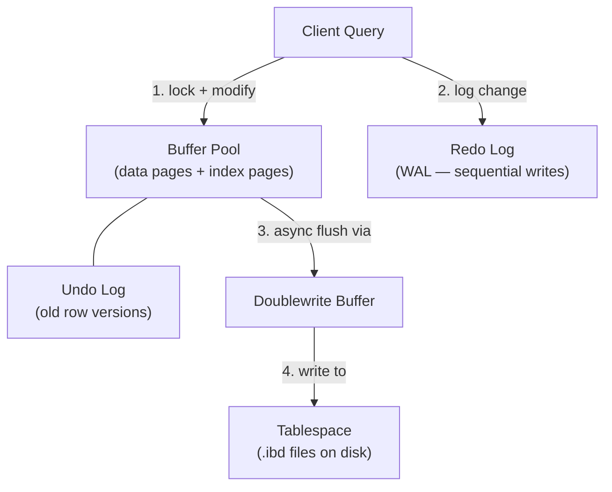
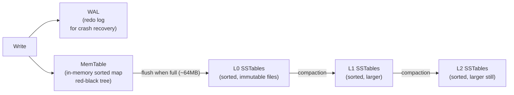

# Storage Engines
{: .no_toc }

<details open markdown="block">
  <summary>Table of Contents</summary>
  {: .text-delta }
1. TOC
{:toc}
</details>

A storage engine is the component that determines *how* data is physically laid out on disk. The choice of storage engine — B+ Tree vs LSM tree vs columnar vs object storage — determines the throughput, latency, and read/write trade-offs of every database built on top of it. The same data, the same query, can take microseconds or seconds depending on the engine.

---

## InnoDB — B+ Tree Engine

InnoDB is the default MySQL storage engine since MySQL 5.5. Every table is a B+ Tree. Understanding InnoDB's internals explains why certain table designs are fast and others are slow.

### Clustered Index (The Table IS the B+ Tree)

Every InnoDB table has exactly one clustered index — the primary key. The B+ Tree leaf nodes hold the **actual row data**, not a pointer to a row. This means the row is found in one tree traversal.

```
Clustered Index (PRIMARY KEY = id):

                       [100 | 300]
                      /     |      \
              [10|50]    [150|200]   [350|450]
             /  |  \     /  |  \     /  |  \
          [row] ... [row][row] ...[row][row]...[row]
           ↑ leaf nodes contain the FULL ROW DATA
```

**Secondary indexes** store the primary key value at leaf nodes — not the row data. Reading a row via a secondary index requires two tree traversals: first the secondary index tree, then the primary key tree. This is the "index lookup" + "table lookup" (bookmark lookup) double-read.

```
Secondary index on (email):
  Leaf node: email → primary_key (user_id)
  Then: fetch full row from clustered index using user_id
```

**Implication:** Secondary index lookup costs 2× the I/O of a primary key lookup. Covering indexes (including all needed columns in the secondary index) eliminate the second tree traversal.

### Buffer Pool

The buffer pool is InnoDB's in-memory page cache — typically 60–80% of total RAM. All reads and writes go through it. Dirty pages are flushed to disk by background threads.

```
Buffer Pool (LRU with young/old sublists):
  ┌─────────────────┬───────────────────────┐
  │   Young sublist  │    Old sublist (37%)  │
  │   (frequently    │   (new pages enter    │
  │   accessed)      │    here first)        │
  └─────────────────┴───────────────────────┘
  ← hot                                cold →

New page enters old sublist.
If accessed again within innodb_old_blocks_time (default 1s) → promoted to young.
This prevents a full table scan from evicting hot pages.
```

### Redo Log (WAL — Write-Ahead Log)

Changes are written to the **redo log** before being applied to data pages in the buffer pool. On crash, InnoDB replays the redo log to recover committed but not-yet-flushed changes.

```
Write path:
  1. Acquire row lock
  2. Write change to redo log (sequential, fast)
  3. Modify page in buffer pool (in-memory, fast)
  4. Return success to client
  5. Background: flush dirty pages to tablespace (async)
```

### Undo Log (MVCC + Rollback)

The undo log stores the *previous* version of modified rows. Serves two purposes:
1. **MVCC:** readers access old versions without blocking writers (see [4.1 Relational Databases](relational-db/))
2. **Rollback:** `ROLLBACK` replays the undo log to reverse changes

### Doublewrite Buffer

A protection against **torn page writes** — if MySQL crashes mid-write, a partial page on disk would be corrupted. The doublewrite buffer writes pages to a sequential buffer file first, then to their actual location. On recovery, InnoDB can detect and correct torn pages.

### InnoDB Architecture Summary



---

## LSM-Tree Engines — RocksDB

Log-Structured Merge-Tree (LSM) engines are optimized for **write-heavy workloads**. They convert random writes into sequential disk writes by buffering in memory and flushing sorted files.

### Write Path



**Key insight:** writes go to the WAL (sequential) and in-memory MemTable. No random disk I/O on write path. When the MemTable fills (~64 MB), it's flushed as an immutable **SSTable** (Sorted String Table) to disk.

**SSTable:** An immutable, sorted file of key-value pairs with:
- A **Bloom filter** per file: quickly test "is key K possibly in this file?" (no → skip file)
- A **block index**: sparse index mapping keys to file offsets for binary search

### Read Path

```
Read key K:
  1. Check MemTable (most recent writes) → hit? return
  2. For each SSTable level (L0 → L1 → L2 ...):
       a. Check Bloom filter → probably not here? skip
       b. Binary search block index → find candidate block
       c. Read and scan block → found? return
  3. Key not found → return null
```

**Why reads are slower than B+ Trees:** A B+ Tree lookup is O(log n) tree traversal, hitting 1 file. An LSM read might need to check multiple SSTables across multiple levels. This is mitigated by Bloom filters and block cache.

### Compaction

Compaction merges SSTables from one level into the next, discarding deleted and overwritten entries.

```
Without compaction:
  L0: [a=1, c=3, d=deleted], [b=2, c=new_value], [a=new_a]
  Read "c" → must check all 3 L0 files

After compaction (merge-sort L0 into L1):
  L1: [a=new_a, b=2, c=new_value]
  Read "c" → check Bloom filter, one file
```

**Write amplification:** Each byte written once to MemTable may be rewritten multiple times through compaction levels. RocksDB's default is ~10–30× write amplification for 5-level compaction.

### Where RocksDB Is Used

| System | Role |
|:-------|:-----|
| **Apache Kafka** | Log storage in KIP-1150 (replacing custom segment files) |
| **TiKV** | Distributed key-value store underlying TiDB |
| **MyRocks** | Facebook's MySQL storage engine (replacing InnoDB for social data) |
| **CockroachDB** | Underlying key-value layer |
| **Cassandra** (via BTree) | Cassandra uses its own LSM variant |

### B+ Tree vs LSM-Tree Trade-offs

| | B+ Tree (InnoDB) | LSM Tree (RocksDB) |
|:-|:-----------------|:-------------------|
| **Write throughput** | Moderate (random I/O for index updates) | High (sequential MemTable flush) |
| **Read throughput** | High (one tree traversal) | Moderate (Bloom filter + multi-level check) |
| **Write amplification** | 2–5× | 10–30× |
| **Space amplification** | Low (in-place update) | Moderate (dead data until compaction) |
| **Range scan** | Efficient (linked leaf nodes) | Efficient (sorted SSTables) |
| **Best for** | Read-heavy OLTP | Write-heavy OLTP (logging, metrics, social) |

---

## Column-Oriented Storage

Row-oriented databases (MySQL, PostgreSQL) store all columns of a row together on disk. Column-oriented databases store each column separately. This single architectural difference is responsible for 10–100× performance difference on analytical queries.

### Why Columnar Storage Wins for Analytics

```
Row storage (MySQL):
  Page 1: [row1: id=1, name="Alice", age=29, salary=85000, dept="Eng"]
           [row2: id=2, name="Bob",   age=34, salary=92000, dept="Mkt"]
           ...
  Query: SELECT AVG(salary) → must read ALL columns of ALL rows,
         then project only salary → 80% of I/O wasted

Column storage (Parquet):
  salary column file: [85000, 92000, 78000, 101000, ...]
  Query: SELECT AVG(salary) → reads ONLY the salary file
         → reads exactly what the query needs
```

**Two key optimizations:**

1. **Projection pushdown:** Only read the columns in the `SELECT` clause. Skip all other column files.
2. **Predicate pushdown:** Use column-level statistics (min/max per row group) to skip entire blocks that cannot satisfy a `WHERE` clause — without reading individual values.

```
Row group 1: salary min=70000, max=90000
WHERE salary > 100000 → skip entire row group (no row can satisfy this)

Row group 2: salary min=95000, max=120000
→ must read this row group
```

### Compression

Columnar storage compresses dramatically better than row storage because:
- Each column contains homogeneous data (all integers, all strings, all dates)
- Repeated or similar values can be run-length encoded or dictionary encoded

```
Dictionary encoding (low cardinality columns like "department"):
  Original:  ["Eng", "Eng", "Mkt", "Eng", "HR", "Mkt", "Eng"]
  Dictionary: {0: "Eng", 1: "Mkt", 2: "HR"}
  Encoded:   [0, 0, 1, 0, 2, 1, 0]  ← 3 bytes vs 28 bytes = 89% reduction

Run-length encoding (repeated values):
  Original:  [1, 1, 1, 1, 2, 2, 2, 3, 3]
  Encoded:   [(1, 4), (2, 3), (3, 2)]  ← (value, count)
```

### Apache Parquet

Parquet is the dominant open columnar file format for analytics. Used natively by Spark, Hive, Trino, BigQuery, Redshift Spectrum, and Athena.

```
Parquet file layout:
  ┌─────────────────────────────────────────┐
  │  File header (magic number)             │
  ├─────────────────────────────────────────┤
  │  Row Group 1 (e.g., 128 MB of rows)     │
  │  ├── Column Chunk: id        [encoded]  │
  │  ├── Column Chunk: name      [encoded]  │
  │  ├── Column Chunk: salary    [encoded]  │
  │  └── Column Chunk: dept      [encoded]  │
  ├─────────────────────────────────────────┤
  │  Row Group 2 ...                        │
  ├─────────────────────────────────────────┤
  │  File Footer                            │
  │  ├── Schema                             │
  │  ├── Row group offsets                  │
  │  └── Column statistics (min/max/null)   │
  └─────────────────────────────────────────┘
```

The footer is read first. Column statistics in the footer enable skip decisions without reading data pages.

### Apache Iceberg

Iceberg is an open **table format** built on top of Parquet/ORC files on object storage (S3, GCS, ADLS). It adds ACID semantics, time travel, and schema evolution to data lakes.

```
Iceberg table structure:
  S3 bucket/
  ├── metadata/
  │   ├── v1.metadata.json    ← table schema, partition spec, snapshot list
  │   ├── v2.metadata.json
  │   ├── snap-001.avro       ← manifest list: pointers to manifests
  │   └── manifest-001.avro  ← manifest: pointers to data files + statistics
  └── data/
      ├── part-00001.parquet  ← actual data files
      └── part-00002.parquet
```

**Key capabilities:**

| Feature | How |
|:--------|:----|
| **ACID transactions** | Optimistic concurrency via snapshot isolation on metadata files |
| **Time travel** | `SELECT * FROM orders FOR SYSTEM_TIME AS OF '2024-01-15'` |
| **Schema evolution** | Add/rename/drop columns without rewriting data files |
| **Partition evolution** | Change partition strategy without rewriting existing files |
| **Hidden partitioning** | Queries don't need to specify `WHERE year=2024 AND month=1` — Iceberg prunes automatically |

```sql
-- Iceberg time travel (Spark SQL)
SELECT * FROM orders TIMESTAMP AS OF '2024-01-15 00:00:00';
SELECT * FROM orders VERSION AS OF 1234567890;

-- Schema evolution
ALTER TABLE orders ADD COLUMN discount DECIMAL(5,2);  -- online, no rewrite

-- Partition evolution (existing data unaffected)
ALTER TABLE orders REPLACE PARTITION FIELD years(order_date)
    WITH days(order_date);
```

Iceberg is now the standard for open lakehouses, supported by Spark, Trino, Flink, Dremio, Snowflake (external tables), and AWS Glue.

---

## Object Storage — S3

Amazon S3 (and equivalent: GCS, Azure Blob Storage) stores **objects** (arbitrary binary blobs) identified by a bucket name + key string. It is not a filesystem — there are no directories, no file locking, no append operations.

### Consistency Model

Since December 2020, S3 provides **strong read-after-write consistency** for all operations:
- After a successful `PUT`, all subsequent `GET` and `LIST` operations immediately reflect the new object.
- After a successful `DELETE`, all subsequent `GET` operations return a 404.

Before 2020, S3 had eventual consistency for `PUT` of new objects and `DELETE`, which caused subtle bugs (a `LIST` immediately after `PUT` might not show the new object).

### Multipart Upload

For objects > 5 MB, use multipart upload for reliability and parallelism.

```java
// AWS SDK v2 — multipart upload
S3Client s3 = S3Client.builder().region(Region.US_EAST_1).build();

// 1. Initiate
CreateMultipartUploadResponse initResponse = s3.createMultipartUpload(
    CreateMultipartUploadRequest.builder()
        .bucket("my-bucket")
        .key("large-file.parquet")
        .build()
);
String uploadId = initResponse.uploadId();

// 2. Upload parts (in parallel — each ≥ 5 MB except the last)
List<CompletedPart> completedParts = new ArrayList<>();
for (int partNum = 1; partNum <= numParts; partNum++) {
    byte[] partData = readPart(partNum);
    UploadPartResponse partResponse = s3.uploadPart(
        UploadPartRequest.builder()
            .bucket("my-bucket").key("large-file.parquet")
            .uploadId(uploadId).partNumber(partNum)
            .contentLength((long) partData.length)
            .build(),
        RequestBody.fromBytes(partData)
    );
    completedParts.add(CompletedPart.builder()
        .partNumber(partNum).eTag(partResponse.eTag()).build());
}

// 3. Complete — atomic — object only appears after this call
s3.completeMultipartUpload(
    CompleteMultipartUploadRequest.builder()
        .bucket("my-bucket").key("large-file.parquet")
        .uploadId(uploadId)
        .multipartUpload(CompletedMultipartUpload.builder()
            .parts(completedParts).build())
        .build()
);
```

### S3 Storage Classes

| Class | Use Case | Retrieval | Cost |
|:------|:---------|:----------|:-----|
| **S3 Standard** | Frequently accessed data | Immediate | High storage |
| **S3 Standard-IA** | Infrequent access (monthly) | Immediate | Lower storage, retrieval fee |
| **S3 One Zone-IA** | Reproducible infrequent data | Immediate | Lower (single AZ) |
| **S3 Glacier Instant** | Archive accessed quarterly | Immediate | Very low |
| **S3 Glacier Flexible** | Long-term archive (years) | Minutes–hours | Lowest |
| **S3 Intelligent-Tiering** | Unknown access patterns | Immediate | Moves automatically |

**S3 Lifecycle policies** automate tier transitions:

```xml
<LifecycleConfiguration>
  <Rule>
    <Transition>
      <Days>30</Days>
      <StorageClass>STANDARD_IA</StorageClass>
    </Transition>
    <Transition>
      <Days>90</Days>
      <StorageClass>GLACIER</StorageClass>
    </Transition>
    <Expiration>
      <Days>365</Days>  <!-- delete after 1 year -->
    </Expiration>
  </Rule>
</LifecycleConfiguration>
```

### S3 as a Data Lake Foundation

S3's combination of low cost, infinite scale, strong consistency (since 2020), and native support from analytics engines (Spark, Athena, Trino) makes it the standard foundation for data lakes. Iceberg + Parquet + S3 is now the canonical "open lakehouse" stack.

```
Data Lake stack:
  Raw data        → S3 (any format: JSON, CSV, logs)
  Cleaned data    → S3 Parquet (columnar, compressed)
  Table catalog   → AWS Glue / Apache Hive Metastore
  Table format    → Apache Iceberg (ACID + time travel)
  Query engine    → Trino / Spark / Athena / Flink
  BI layer        → Redshift Spectrum / Looker / Superset
```

---

## Key Takeaways for Interviews

1. **InnoDB's clustered index means the table IS the B+ Tree.** Secondary index lookups require two tree traversals — this is why covering indexes are so impactful.
2. **LSM trees convert random writes to sequential writes.** Writes go to MemTable (in-memory), flushed as sorted SSTables. Fast writes, slower reads. RocksDB is LSM-tree in production.
3. **Compaction is LSM's hidden cost.** It reclaims space and reduces read amplification, but writes data multiple times — 10–30× write amplification is typical.
4. **Columnar storage skips I/O that row storage cannot.** Predicate pushdown (skip row groups) and projection pushdown (skip columns) make analytics queries 10–100× faster.
5. **Parquet row groups contain min/max statistics.** The query engine reads the footer, skips row groups that can't satisfy `WHERE` conditions, without reading any data pages.
6. **Iceberg adds ACID + time travel to Parquet on S3.** Schema and partition evolution without rewrites is its key advantage over Hive tables.
7. **S3 has had strong consistency since December 2020.** Pre-2020 S3 eventually-consistent behavior is historical context — modern S3 is strongly consistent for read-after-write.

---

## References

- [InnoDB Storage Engine](https://dev.mysql.com/doc/refman/8.0/en/innodb-storage-engine.html) — MySQL documentation
- [RocksDB Overview](https://rocksdb.org/blog/2013/11/07/rocks-db-1.html) — Facebook engineering blog
- [Parquet file format specification](https://parquet.apache.org/docs/file-format/)
- [Apache Iceberg documentation](https://iceberg.apache.org/docs/latest/)
- [Amazon S3 Strong Consistency](https://aws.amazon.com/blogs/aws/amazon-s3-update-strong-read-after-write-consistency/) — AWS announcement
- *Designing Data-Intensive Applications* — Chapter 3 (Storage and Retrieval) — LSM vs B-Tree analysis
- [The Log-Structured Merge-Tree (LSM-Tree)](https://www.cs.umb.edu/~poneil/lsmtree.pdf) — O'Neil et al., 1996 (original paper)
