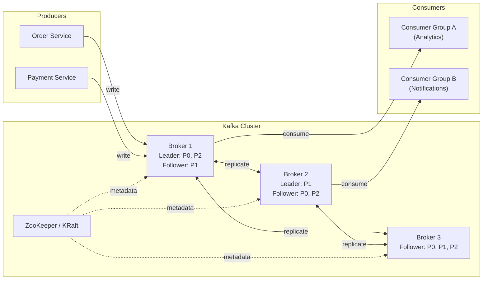

# Apache Kafka
{: .no_toc }

<details open markdown="block">
  <summary>Table of Contents</summary>
  {: .text-delta }
1. TOC
{:toc}
</details>

Kafka is a distributed, durable, ordered log. Unlike traditional message queues where messages are deleted after consumption, Kafka retains messages on disk for a configurable retention period. Any consumer can re-read the log from any offset. This seemingly simple choice — commit log rather than queue — has profound implications for throughput, replay, and consumer independence.

---

## Architecture Overview



**Core concepts:**

| Concept | Description |
|:--------|:------------|
| **Topic** | A named, ordered log. Split into partitions for parallelism. |
| **Partition** | Ordered, immutable sequence of records. Unit of parallelism and replication. |
| **Offset** | A sequential integer identifying a record's position within a partition. |
| **Broker** | A Kafka server that stores and serves partitions. |
| **Producer** | Writes records to a topic. Controls partition assignment. |
| **Consumer** | Reads records from a partition, tracking its own offset. |
| **Consumer Group** | A set of consumers that collectively consume a topic — each partition assigned to exactly one group member. |
| **ISR** | In-Sync Replicas — followers caught up to within `replica.lag.time.max.ms` of the leader. |

---

## Partitioning

### Partition Assignment

A topic with N partitions can be consumed by at most N consumers in a single consumer group. Partitions are the unit of parallelism.

```
Topic: orders (6 partitions)
Consumer Group: order-processors (4 consumers)

Consumer 0 → P0, P4
Consumer 1 → P1, P5
Consumer 2 → P2
Consumer 3 → P3

Add a 5th consumer → rebalance: each gets 1-2 partitions
Add a 7th consumer → one consumer gets no partition (idle)
```

### Partition Key

The producer chooses which partition to write to:

```java
// spring-kafka producer configuration
@Configuration
public class KafkaProducerConfig {

    @Bean
    public ProducerFactory<String, OrderEvent> producerFactory() {
        Map<String, Object> config = new HashMap<>();
        config.put(ProducerConfig.BOOTSTRAP_SERVERS_CONFIG, "kafka:9092");
        config.put(ProducerConfig.KEY_SERIALIZER_CLASS_CONFIG, StringSerializer.class);
        config.put(ProducerConfig.VALUE_SERIALIZER_CLASS_CONFIG, JsonSerializer.class);
        // Idempotent producer (enables exactly-once for single partition)
        config.put(ProducerConfig.ENABLE_IDEMPOTENCE_CONFIG, true);
        config.put(ProducerConfig.ACKS_CONFIG, "all");
        config.put(ProducerConfig.RETRIES_CONFIG, Integer.MAX_VALUE);
        return new DefaultKafkaProducerFactory<>(config);
    }

    @Bean
    public KafkaTemplate<String, OrderEvent> kafkaTemplate() {
        return new KafkaTemplate<>(producerFactory());
    }
}

@Service
public class OrderEventProducer {
    private final KafkaTemplate<String, OrderEvent> kafkaTemplate;

    // Key = customerId → all events for same customer go to same partition
    // Guarantees ordering per customer, not across all customers
    public void publishOrderCreated(OrderEvent event) {
        kafkaTemplate.send("orders", event.getCustomerId(), event)
            .whenComplete((result, ex) -> {
                if (ex != null) {
                    log.error("Failed to send order event", ex);
                } else {
                    log.info("Sent to partition {} offset {}",
                        result.getRecordMetadata().partition(),
                        result.getRecordMetadata().offset());
                }
            });
    }
}
```

**Partition key selection matters:**
- `null` key → round-robin across partitions (no ordering guarantee)
- `customerId` → all events for a customer are ordered (good for state machines)
- `orderId` → events for the same order are ordered
- Hot keys (one customer generating 80% of traffic) → hot partition bottleneck

### Replication and ISR

```
Topic: payments, replication-factor=3, min.insync.replicas=2

Partition 0:
  Broker 1 (Leader): offset 0..1000
  Broker 2 (Follower, ISR): offset 0..998  ← 2 messages behind
  Broker 3 (Follower, ISR): offset 0..1000

ISR = {Broker 1, Broker 2, Broker 3}

If Broker 3 falls behind by > replica.lag.time.max.ms (default 30s):
  ISR = {Broker 1, Broker 2}

With acks=all: producer waits for all ISR members to acknowledge
With min.insync.replicas=2: write succeeds as long as 2 brokers are in ISR
```

---

## Producer Acknowledgments

| `acks` | Guarantee | Risk | Throughput |
|:-------|:----------|:-----|:-----------|
| `0` | None — fire and forget | Data loss on any failure | Highest |
| `1` | Leader wrote to disk | Leader failure before follower replication → loss | Medium |
| `all` (-1) | All ISR replicas acknowledged | Leader can't commit until ISR followers acknowledge | Lowest |

**`acks=all` + `min.insync.replicas=2`** is the standard durability configuration for financial/critical data.

```java
// High-durability producer
config.put(ProducerConfig.ACKS_CONFIG, "all");
config.put(ProducerConfig.RETRIES_CONFIG, Integer.MAX_VALUE);
config.put(ProducerConfig.MAX_IN_FLIGHT_REQUESTS_PER_CONNECTION, 5); // safe with idempotence
config.put(ProducerConfig.ENABLE_IDEMPOTENCE_CONFIG, true);
```

---

## Consumer Groups and Offset Management

```java
@Component
public class OrderEventConsumer {

    // Manual offset commit — control exactly when "processed" is acknowledged
    @KafkaListener(
        topics = "orders",
        groupId = "order-processors",
        containerFactory = "manualAckKafkaListenerContainerFactory"
    )
    public void consume(
            ConsumerRecord<String, OrderEvent> record,
            Acknowledgment ack) {

        try {
            orderService.process(record.value());
            ack.acknowledge(); // commit offset AFTER successful processing
        } catch (RetryableException e) {
            // Don't ack — will be redelivered on restart
            throw e;
        } catch (PoisonPillException e) {
            ack.acknowledge(); // ack to skip, send to DLQ manually
            dlqProducer.send("orders-dlq", record);
        }
    }
}

@Configuration
public class KafkaConsumerConfig {

    @Bean
    public ConsumerFactory<String, OrderEvent> consumerFactory() {
        Map<String, Object> config = new HashMap<>();
        config.put(ConsumerConfig.BOOTSTRAP_SERVERS_CONFIG, "kafka:9092");
        config.put(ConsumerConfig.GROUP_ID_CONFIG, "order-processors");
        config.put(ConsumerConfig.AUTO_OFFSET_RESET_CONFIG, "earliest"); // or "latest"
        config.put(ConsumerConfig.ENABLE_AUTO_COMMIT_CONFIG, false);     // manual commit
        config.put(ConsumerConfig.MAX_POLL_RECORDS_CONFIG, 100);
        config.put(ConsumerConfig.MAX_POLL_INTERVAL_MS_CONFIG, 300_000); // 5 min processing budget
        return new DefaultKafkaConsumerFactory<>(config, new StringDeserializer(),
                new JsonDeserializer<>(OrderEvent.class));
    }

    @Bean
    public ConcurrentKafkaListenerContainerFactory<String, OrderEvent>
            manualAckKafkaListenerContainerFactory() {
        var factory = new ConcurrentKafkaListenerContainerFactory<String, OrderEvent>();
        factory.setConsumerFactory(consumerFactory());
        factory.getContainerProperties().setAckMode(AckMode.MANUAL_IMMEDIATE);
        factory.setConcurrency(3); // 3 threads, one per partition assigned to this instance
        return factory;
    }
}
```

**Auto-commit vs manual commit:**
- `enable.auto.commit=true` + crash between poll and process → **data loss** (offset advanced but message not processed)
- Manual commit after process → **at-least-once** delivery (idempotent handlers required)
- Manual commit before process → **at-most-once** (data loss on crash, acceptable for logging)

---

## Exactly-Once Semantics (EOS)

Kafka provides exactly-once delivery through two complementary mechanisms:

### Idempotent Producer

Prevents duplicate writes caused by producer retries. Each producer is assigned a `ProducerID (PID)`, and each record has a monotonically increasing sequence number per partition. The broker detects and drops retransmitted duplicates.

```
Without idempotence:
  Producer sends record (PID=42, seq=1)
  Network timeout → producer retries
  Broker receives the record twice → two records in log

With idempotence (enable.idempotence=true):
  Producer sends record (PID=42, seq=1)
  Retry: producer sends (PID=42, seq=1) again
  Broker: "already saw seq=1 from PID=42" → deduplicated
  Log has exactly one record
```

### Transactional API

Enables atomic writes across multiple partitions and topics — either all writes commit or none do:

```java
@Configuration
public class TransactionalKafkaConfig {
    @Bean
    public ProducerFactory<String, Object> transactionalProducerFactory() {
        Map<String, Object> config = new HashMap<>();
        config.put(ProducerConfig.BOOTSTRAP_SERVERS_CONFIG, "kafka:9092");
        config.put(ProducerConfig.ENABLE_IDEMPOTENCE_CONFIG, true);
        config.put(ProducerConfig.TRANSACTIONAL_ID_CONFIG, "order-processor-tx-1");
        // transactional.id must be unique per producer instance (use pod name or ID)
        return new DefaultKafkaProducerFactory<>(config);
    }
}

// Kafka Streams: consume-transform-produce exactly once
@Service
public class OrderEnrichmentProcessor {

    @Transactional  // Spring's @Transactional is NOT Kafka EOS — use KafkaTemplate.executeInTransaction
    public void processWithEOS(ConsumerRecord<String, OrderEvent> input) {
        kafkaTemplate.executeInTransaction(ops -> {
            // Atomically: consume from 'orders', produce to 'enriched-orders' and 'audit-log'
            EnrichedOrder enriched = enrich(input.value());
            ops.send("enriched-orders", input.key(), enriched);
            ops.send("audit-log", input.key(), new AuditEvent(input.value()));
            // Both writes commit together, or neither does
            return true;
        });
    }
}
```

**EOS on the consumer side:** Set `isolation.level=read_committed` so consumers only see records from committed transactions (not in-progress or aborted ones).

---

## Kafka Streams

Kafka Streams is a Java library (not a cluster) for building stream processing applications. Processing runs embedded in your application, scaling by adding instances.

### KStream vs KTable

```
KStream: unbounded sequence of records (events, each record is an independent fact)
  key=user1, value=PageView(page=/home)
  key=user1, value=PageView(page=/products)
  key=user2, value=PageView(page=/home)

KTable: changelog stream (each record is an update — latest value per key wins)
  key=user1, value=UserProfile(region=US, tier=gold)   ← upsert
  key=user1, value=UserProfile(region=EU, tier=gold)   ← supersedes previous
```

### Kafka Streams DSL Example

```java
@Configuration
public class OrderStatsTopology {

    @Bean
    public KStream<String, OrderEvent> orderStatsStream(StreamsBuilder builder) {
        // Source stream from 'orders' topic
        KStream<String, OrderEvent> orders = builder.stream("orders",
            Consumed.with(Serdes.String(), new JsonSerde<>(OrderEvent.class)));

        // Filter only completed orders
        KStream<String, OrderEvent> completed = orders
            .filter((key, order) -> order.getStatus() == OrderStatus.COMPLETED);

        // Rekey by product category (for per-category aggregation)
        KStream<String, OrderEvent> byCategory = completed
            .selectKey((key, order) -> order.getProductCategory());

        // Tumbling window: revenue per category per hour
        KTable<Windowed<String>, Double> revenueByCategory = byCategory
            .groupByKey(Grouped.with(Serdes.String(), new JsonSerde<>(OrderEvent.class)))
            .windowedBy(TimeWindows.ofSizeWithNoGrace(Duration.ofHours(1)))
            .aggregate(
                () -> 0.0,
                (key, order, aggregate) -> aggregate + order.getAmount(),
                Materialized.<String, Double, WindowStore<Bytes, byte[]>>as("revenue-store")
                    .withValueSerde(Serdes.Double())
            );

        // Write results to 'category-revenue' topic
        revenueByCategory.toStream()
            .map((windowedKey, revenue) -> KeyValue.pair(
                windowedKey.key() + "@" + windowedKey.window().startTime(),
                revenue))
            .to("category-revenue", Produced.with(Serdes.String(), Serdes.Double()));

        return orders;
    }
}

// Spring Boot Kafka Streams setup
spring:
  kafka:
    streams:
      application-id: order-stats-processor
      bootstrap-servers: kafka:9092
      properties:
        default.key.serde: org.apache.kafka.common.serialization.Serdes$StringSerde
        processing.guarantee: exactly_once_v2  # EOS for Kafka Streams
        num.stream.threads: 4
```

### State Stores and Changelog Topics

```
Stateful Kafka Streams operations (aggregate, join, groupBy) maintain local RocksDB state stores.
Each state store is backed by a Kafka changelog topic (compacted).

On restart:
  Instance reads changelog topic → rebuilds local state
  Standby replicas (num.standby.replicas) maintain hot copies on other instances
  → failover without full replay

State store query (Interactive Queries):
  GET /stats/category/electronics → query local RocksDB directly
  If partition assigned to another instance → RPC to the correct instance
```

---

## Schema Registry and Avro

Schema Registry (Confluent) stores versioned Avro/Protobuf/JSON Schema definitions. Producers write schema ID in the message header; consumers look up the schema to deserialize.

```java
// 1. Define Avro schema: src/main/avro/OrderEvent.avsc
{
  "type": "record",
  "name": "OrderEvent",
  "namespace": "com.example.events",
  "fields": [
    {"name": "orderId",    "type": "string"},
    {"name": "customerId", "type": "string"},
    {"name": "amount",     "type": "double"},
    {"name": "status",     "type": {"type": "enum", "name": "Status",
                                    "symbols": ["CREATED", "COMPLETED", "CANCELLED"]}},
    {"name": "couponCode", "type": ["null", "string"], "default": null}  // optional field
  ]
}

// 2. Producer with Avro
config.put(ProducerConfig.VALUE_SERIALIZER_CLASS_CONFIG, KafkaAvroSerializer.class);
config.put("schema.registry.url", "http://schema-registry:8081");

// 3. Schema evolution rules
// BACKWARD compatible: new schema can read old data
//   → Add optional fields with defaults (new consumers, old data)
// FORWARD compatible: old schema can read new data
//   → Remove optional fields (old consumers, new data)
// FULL compatible: both directions
//   → Only add optional fields, never remove
```

**Why Schema Registry?** Without it, producers and consumers must be deployed atomically — schema changes break running consumers. With it, schemas evolve independently within compatibility rules.

---

## ksqlDB

ksqlDB is a SQL engine on top of Kafka Streams — run continuous queries on Kafka topics:

```sql
-- Create a stream over the orders topic
CREATE STREAM orders_stream (
    order_id   VARCHAR KEY,
    customer_id VARCHAR,
    amount      DOUBLE,
    status      VARCHAR,
    created_at  BIGINT
) WITH (
    kafka_topic = 'orders',
    value_format = 'AVRO',
    timestamp = 'created_at'
);

-- Persistent query: 1-hour tumbling window revenue by status
CREATE TABLE revenue_by_status AS
    SELECT status,
           SUM(amount) AS total_revenue,
           COUNT(*) AS order_count,
           WINDOWSTART AS window_start
    FROM orders_stream
    WINDOW TUMBLING (SIZE 1 HOUR)
    GROUP BY status
    EMIT CHANGES;

-- Push query: subscribe to real-time results (for dashboards)
SELECT * FROM revenue_by_status EMIT CHANGES;

-- Pull query: current state (point-in-time, like a REST call)
SELECT * FROM revenue_by_status WHERE status = 'COMPLETED';
```

---

## Kafka vs Traditional Message Queues

| | Kafka | RabbitMQ / SQS |
|:-|:------|:---------------|
| **Storage model** | Durable log (messages stay until TTL) | Queue (messages deleted after consumption) |
| **Consumer independence** | Each consumer group has its own offset — replay freely | Once consumed, message is gone for all consumers |
| **Ordering** | Per-partition ordering guaranteed | FIFO queues (SQS FIFO, RabbitMQ single queue) |
| **Throughput** | Millions of events/sec (sequential disk I/O) | Hundreds of thousands |
| **Consumer model** | Poll-based (consumers pull) | Push or pull depending on broker |
| **Use case** | Event streaming, log aggregation, data pipelines | Task queues, RPC, routing, fan-out |
| **Replay** | Yes — any offset, any consumer group | No — messages are deleted |

**Choose Kafka when:** you need multiple independent consumer groups, event replay, stream processing, or high throughput.  
**Choose RabbitMQ when:** you need flexible routing (topic/fanout exchanges), priority queues, or short-lived task messages.

---

## Key Takeaways for Interviews

1. **Kafka is a commit log, not a queue.** Messages persist after consumption. Multiple consumer groups each get a full copy of the log, consuming independently. This enables replay, audit, and decoupled consumers — impossible with queue-based brokers.
2. **Partition key governs ordering.** Use `customerId` as key when event ordering per customer matters. Round-robin (`null` key) maximizes distribution but loses ordering. Hot partition from popular keys is a real production problem.
3. **`acks=all` + `min.insync.replicas=2` = durability.** A broker failure during replication can lose data with `acks=1`. Never use `acks=0` for important data.
4. **Exactly-once = idempotent producer + transactional API.** Idempotent producer handles duplicate sends. Transactions handle atomic multi-partition writes. `isolation.level=read_committed` on consumers to not see in-flight transactions.
5. **Consumer group = horizontal scaling.** Max parallelism = number of partitions. A consumer added beyond partition count is idle. Rebalance is triggered by joins, leaves, and crashes.
6. **Manual offset commit = at-least-once.** Auto-commit can cause data loss. Manual commit after successful processing ensures at-least-once. Idempotent message handlers are required.
7. **Kafka Streams scales by adding instances.** No separate cluster. State is local RocksDB backed by Kafka changelog topics. Interactive Queries expose state as a service.
8. **Schema Registry enforces compatibility contracts.** Backward compatibility (add optional fields) is the safest default. Schema evolution without Registry causes runtime deserialization failures.

---

## References

- [Kafka Documentation](https://kafka.apache.org/documentation/)
- [Kafka: The Definitive Guide](https://www.confluent.io/resources/kafka-the-definitive-guide/) — Confluent (free PDF)
- [Kafka Streams Documentation](https://kafka.apache.org/documentation/streams/)
- [Schema Registry Documentation](https://docs.confluent.io/platform/current/schema-registry/index.html)
- [Kafka Transactions](https://kafka.apache.org/documentation/#transactions) — official design doc
- *Designing Data-Intensive Applications* — Chapter 11 (stream processing)
- [FLIP-62: Kafka Exactly-Once Semantics](https://cwiki.apache.org/confluence/display/KAFKA/KIP-98+-+Exactly+Once+Delivery+and+Transactional+Messaging)
