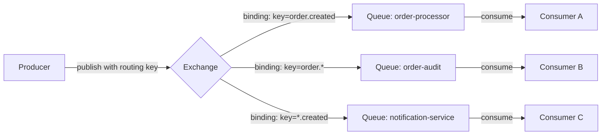
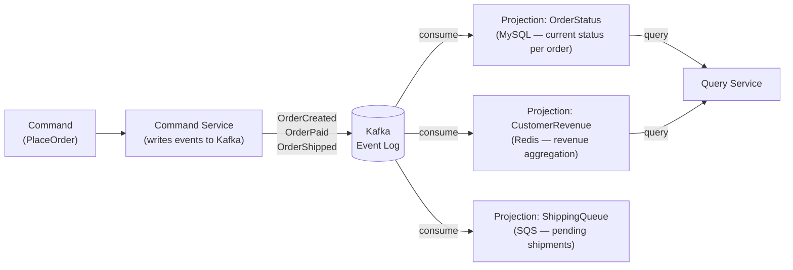

# Messaging Patterns & Brokers
{: .no_toc }

<details open markdown="block">
  <summary>Table of Contents</summary>
  {: .text-delta }
1. TOC
{:toc}
</details>

A message broker is a server that routes messages from producers to consumers. The routing model — how the broker decides which consumer receives a message — differs fundamentally between systems. Understanding RabbitMQ's exchange types, SQS's visibility window, and Pulsar's multi-tenancy prepares you to choose the right tool and avoid common pitfalls.

---

## RabbitMQ

RabbitMQ implements the AMQP 0-9-1 protocol. The core model: producers publish to an **exchange**, the exchange routes to one or more **queues** based on **bindings**, and consumers read from queues.



### Exchange Types

| Exchange | Routing Logic | Use Case |
|:---------|:--------------|:---------|
| **Direct** | Exact match on routing key | Point-to-point: `order.created` → single queue |
| **Topic** | Wildcard match: `*` (one word) and `#` (zero or more) | Hierarchical routing: `order.#` matches all order events |
| **Fanout** | All bound queues, routing key ignored | Broadcast: same message to audit + notification + analytics |
| **Headers** | Match on AMQP header attributes, not routing key | Complex multi-attribute routing |

```java
// Spring AMQP: declare topology
@Configuration
public class RabbitMQConfig {

    @Bean
    public TopicExchange orderExchange() {
        return new TopicExchange("order-events");
    }

    @Bean
    public Queue orderProcessorQueue() {
        return QueueBuilder.durable("order-processor")
            .withArgument("x-dead-letter-exchange", "order-dlx") // DLQ routing
            .withArgument("x-message-ttl", 300_000)              // 5 min TTL
            .build();
    }

    @Bean
    public Binding orderProcessorBinding() {
        return BindingBuilder
            .bind(orderProcessorQueue())
            .to(orderExchange())
            .with("order.created");  // exact routing key match
    }

    @Bean
    public Queue auditQueue() {
        return QueueBuilder.durable("order-audit").build();
    }

    @Bean
    public Binding auditBinding() {
        return BindingBuilder
            .bind(auditQueue())
            .to(orderExchange())
            .with("order.#");  // matches order.created, order.updated, order.cancelled
    }
}

// Consumer
@Component
public class OrderProcessor {

    @RabbitListener(queues = "order-processor")
    public void handleOrder(OrderCreatedEvent event, Channel channel,
                            @Header(AmqpHeaders.DELIVERY_TAG) long tag) throws IOException {
        try {
            processOrder(event);
            channel.basicAck(tag, false);       // acknowledge: remove from queue
        } catch (RetryableException e) {
            channel.basicNack(tag, false, true); // nack + requeue
        } catch (PoisonPillException e) {
            channel.basicNack(tag, false, false); // nack without requeue → goes to DLX
        }
    }
}
```

### Dead Letter Exchange (DLX / DLQ)

Messages are dead-lettered (moved to DLX) when they are:
- **Rejected** (`basicNack` / `basicReject` with `requeue=false`)
- **Expired** (message TTL exceeded)
- **Queue overflow** (queue length limit reached)

```java
// Dead letter topology
@Configuration
public class DLQConfig {

    @Bean
    public DirectExchange deadLetterExchange() {
        return new DirectExchange("order-dlx");
    }

    @Bean
    public Queue deadLetterQueue() {
        return QueueBuilder.durable("order-dlq").build();
    }

    @Bean
    public Binding deadLetterBinding() {
        return BindingBuilder.bind(deadLetterQueue())
            .to(deadLetterExchange())
            .with("order-processor");  // routing key = original queue name by convention
    }
}

// DLQ consumer: inspect, alert, and selectively replay
@RabbitListener(queues = "order-dlq")
public void handleDeadLetter(
        Message message,
        @Header("x-death") List<Map<String, Object>> deathHeaders) {

    String originalQueue = (String) deathHeaders.get(0).get("queue");
    String reason         = (String) deathHeaders.get(0).get("reason");  // rejected/expired/maxlen
    long   deathCount     = (long)   deathHeaders.get(0).get("count");

    alertingService.notify("Dead letter: reason=" + reason + " count=" + deathCount);

    if (deathCount < 3) {
        // Replay to original queue after delay
        rabbitTemplate.convertAndSend(originalQueue, message.getBody());
    } else {
        // Persist for manual inspection, don't retry
        deadLetterRepository.save(message);
    }
}
```

### Message Acknowledgment Modes

| Mode | When ACK is sent | Risk |
|:-----|:----------------|:-----|
| `auto` | As soon as broker delivers to consumer | Loss if consumer crashes before processing |
| `manual` | Explicitly by consumer code | Duplicates if crash between process and ack |
| `none` | Never (fire-and-forget) | Always loses messages |

---

## Amazon SQS and SNS

### SQS: Simple Queue Service

SQS is a managed, distributed queue. Key property: **visibility timeout** — when a consumer receives a message, it becomes invisible to other consumers for the visibility window. If not deleted within the window, it reappears (retry mechanism).

```java
// Spring Cloud AWS SQS consumer
@SqsListener(value = "order-processing-queue", deletionPolicy = SqsMessageDeletionPolicy.ON_SUCCESS)
public void processOrder(OrderEvent event) {
    // ON_SUCCESS: message deleted automatically if method returns without exception
    // ON_FAILURE: message NOT deleted on exception → reappears after visibility timeout
    orderService.process(event);
}

// Manual visibility extension for long-running processing
@SqsListener(value = "heavy-processing-queue", deletionPolicy = SqsMessageDeletionPolicy.NEVER)
public void processHeavyTask(String body, @Header("ReceiptHandle") String receiptHandle) {
    // Extend visibility timeout before it expires
    sqsClient.changeMessageVisibility(req -> req
        .queueUrl(queueUrl)
        .receiptHandle(receiptHandle)
        .visibilityTimeout(300)  // extend by 5 more minutes
    );

    doLongProcessing(body);

    sqsClient.deleteMessage(req -> req
        .queueUrl(queueUrl)
        .receiptHandle(receiptHandle)
    );
}
```

**SQS Standard vs FIFO:**

| | SQS Standard | SQS FIFO |
|:-|:------------|:---------|
| **Ordering** | Best-effort (may be out of order) | Exactly ordered within message group |
| **Delivery** | At-least-once (duplicates possible) | Exactly-once processing |
| **Throughput** | Nearly unlimited | 300 msg/sec per queue (3000 with batching) |
| **Use case** | Decoupling, high-volume tasks | Financial transactions, order sequencing |
| **Cost** | Lower | Higher |

### SNS + SQS Fan-Out Pattern

SNS (Simple Notification Service) is a pub-sub system. One SNS topic can fan-out to multiple SQS queues, Lambda functions, HTTP endpoints, and mobile push.

```
SNS Topic: order-created
  ├── SQS Queue: order-fulfillment-queue    (fulfillment service)
  ├── SQS Queue: order-notification-queue   (email/push service)
  ├── SQS Queue: order-analytics-queue      (data pipeline)
  └── Lambda: order-fraud-detector          (sync check)

Publisher sends once to SNS → SNS fans out to all subscribers
Each service processes independently, at its own rate
Failures in one subscriber don't affect others
```

```java
// SNS publish (any message broker abstraction)
snsClient.publish(req -> req
    .topicArn("arn:aws:sns:us-east-1:123456:order-created")
    .message(objectMapper.writeValueAsString(orderEvent))
    .messageAttributes(Map.of(
        "eventType", MessageAttributeValue.builder()
            .dataType("String")
            .stringValue("ORDER_CREATED")
            .build()
    ))
);
```

**SQS dead-letter queue configuration:**
```
SQS queue: order-fulfillment-queue
  maxReceiveCount: 3          → after 3 failed attempts
  deadLetterTargetArn: arn:.../order-fulfillment-dlq  → move to DLQ
```

---

## Apache Pulsar

Pulsar is a cloud-native alternative to Kafka with a cleaner separation between storage and compute. Built at Yahoo! to handle multiple tenants and geographically distributed workloads.

**Architecture:**

```
Pulsar Architecture:
  ┌─────────────────────────────────────────────────────────┐
  │  Apache BookKeeper (Storage layer)                       │
  │  Ledgers: durable, ordered log segments                 │
  │  Distributed across Bookies (storage nodes)             │
  └──────────────────────┬──────────────────────────────────┘
                         │ storage is stateless from broker POV
      ┌──────────────────┴────────────────────┐
      ▼                                        ▼
  Broker 1 (stateless)               Broker 2 (stateless)
  Serves topic partition A           Serves topic partition B
  (ownership can move freely         (no data to migrate on failover)
   — no data migration needed)
```

**Pulsar vs Kafka:**

| | Pulsar | Kafka |
|:-|:-------|:------|
| **Storage** | BookKeeper (separate storage layer) | Local disk on brokers |
| **Broker state** | Stateless (can move topics instantly) | Stateful (data on broker's disk) |
| **Multi-tenancy** | First-class: `persistent://tenant/namespace/topic` | Not native |
| **Subscription models** | Exclusive, Shared, Failover, Key_Shared | Consumer groups (one model) |
| **Geo-replication** | Built-in active-active replication across regions | MirrorMaker 2 (external tool) |
| **Message TTL** | Per-namespace TTL, per-message TTL | Topic-level retention only |
| **Queuing** | Shared subscription = traditional queue | No native queue model |

```java
// Pulsar Java client
PulsarClient client = PulsarClient.builder()
    .serviceUrl("pulsar://localhost:6650")
    .build();

// Producer
Producer<OrderEvent> producer = client.newProducer(Schema.AVRO(OrderEvent.class))
    .topic("persistent://ecommerce/orders/created")
    .compressionType(CompressionType.LZ4)
    .create();

producer.newMessage()
    .key(event.getCustomerId())    // partition key
    .value(event)
    .property("eventType", "ORDER_CREATED")
    .send();

// Consumer with Key_Shared subscription (each key goes to same consumer)
Consumer<OrderEvent> consumer = client.newConsumer(Schema.AVRO(OrderEvent.class))
    .topic("persistent://ecommerce/orders/created")
    .subscriptionName("order-processor")
    .subscriptionType(SubscriptionType.Key_Shared)  // ordering per key, parallel across keys
    .subscribe();
```

---

## Event-Driven Patterns

### Publish-Subscribe vs Point-to-Point

```
Point-to-Point (Queue):
  Producer ──► Queue ──► Consumer A
                         (message consumed once, by one consumer)
  
  Use case: task distribution, work queue, RPC

Publish-Subscribe (Topic):
  Producer ──► Topic ──► Consumer Group A (analytics)
                    └──► Consumer Group B (notifications)
                         (all groups receive all messages)
  
  Use case: event broadcast, fan-out, audit logs
```

### Competing Consumers Pattern

Multiple consumer instances read from the same queue to parallelize processing. Each message is processed by exactly one consumer. This is the queue model — SQS, RabbitMQ queues, Kafka consumer groups.

```
Queue: payment-processing-tasks (100 messages pending)

Consumer Instance 1 → reads message 1, 4, 7, 10...
Consumer Instance 2 → reads message 2, 5, 8, 11...
Consumer Instance 3 → reads message 3, 6, 9, 12...

Scale out: add Instance 4 → automatic rebalancing
Scale in:  remove Instance 3 → its messages requeued (SQS visibility) or reassigned (Kafka rebalance)
```

**Requirement:** handlers must be **idempotent** — the same message may be delivered twice (at-least-once delivery).

```java
@Service
public class PaymentProcessor {

    @Transactional
    public void processPayment(PaymentEvent event) {
        // Idempotency check: was this payment already processed?
        if (paymentRepository.existsByIdempotencyKey(event.getIdempotencyKey())) {
            log.info("Duplicate payment event, skipping: {}", event.getIdempotencyKey());
            return;
        }

        // Process payment
        Payment payment = paymentGateway.charge(event);

        // Save result + idempotency key atomically
        paymentRepository.save(payment);
        // existsByIdempotencyKey now returns true for this key
    }
}
```

### Event Sourcing + CQRS Combined

Event Sourcing stores the log of events (not current state). CQRS separates the command (write) model from the query (read) model. Together, they use Kafka as the event store and projections as read models.



```java
// Command side: emit events to Kafka
@Service
public class OrderCommandService {

    public void placeOrder(PlaceOrderCommand cmd) {
        // Validate
        inventory.reserve(cmd.getProductId(), cmd.getQuantity());

        // Emit event (Kafka is the source of truth)
        OrderCreatedEvent event = new OrderCreatedEvent(
            cmd.getOrderId(), cmd.getCustomerId(), cmd.getAmount(), Instant.now());
        kafkaTemplate.send("order-events", cmd.getOrderId(), event);
    }
}

// Query side: projection consumer
@KafkaListener(topics = "order-events", groupId = "order-status-projection")
public void project(OrderEvent event) {
    switch (event.getType()) {
        case ORDER_CREATED  -> orderStatusRepo.upsert(event.getOrderId(), "CREATED");
        case ORDER_PAID     -> orderStatusRepo.upsert(event.getOrderId(), "PAID");
        case ORDER_SHIPPED  -> orderStatusRepo.upsert(event.getOrderId(), "SHIPPED");
    }
}
```

### Dead Letter Queue Strategies

| Scenario | Strategy |
|:---------|:---------|
| **Transient failure** (network, DB timeout) | Retry with exponential backoff, then DLQ after N attempts |
| **Poison pill** (malformed message, bug) | Move to DLQ immediately; alert on-call; fix code; replay from DLQ |
| **Business rule violation** | DLQ + manual review; may need compensating action |
| **Downstream unavailable** | Retry loop with circuit breaker; don't DLQ, don't lose messages |

```java
// Spring Retry + DLQ on Kafka
@Bean
public DefaultErrorHandler errorHandler(KafkaTemplate<String, Object> template) {
    // DLQ publisher: send failed records to <topic>.DLT (Dead Letter Topic)
    DeadLetterPublishingRecoverer recoverer = new DeadLetterPublishingRecoverer(template,
        (record, ex) -> new TopicPartition(record.topic() + ".DLT", record.partition()));

    // Retry 3 times with 1s, 2s, 4s backoff before going to DLT
    ExponentialBackOffWithMaxRetries backOff = new ExponentialBackOffWithMaxRetries(3);
    backOff.setInitialInterval(1_000);
    backOff.setMultiplier(2.0);

    DefaultErrorHandler handler = new DefaultErrorHandler(recoverer, backOff);
    // Don't retry deserialization errors (they'll never succeed)
    handler.addNotRetryableExceptions(DeserializationException.class);
    return handler;
}
```

---

## Backpressure with Reactive Streams

Backpressure occurs when a consumer can't keep up with the producer's rate. Without it, the consumer's in-memory queue grows unboundedly until OOM.

**Reactive Streams** (Project Reactor, RxJava) standardize backpressure: consumers request N items; producers send at most N. Processing pipelines compose operators that propagate backpressure upstream.

```java
// Spring WebFlux + Reactor: backpressure-aware processing pipeline
@Service
public class OrderProcessingPipeline {

    public Flux<ProcessedOrder> process(Flux<OrderEvent> inbound) {
        return inbound
            // Buffer upstream: accept up to 64 items, drop if full
            .onBackpressureBuffer(64, dropped -> log.warn("Dropped: {}", dropped.getOrderId()))

            // Parallel processing: 4 workers, each with a prefetch of 8
            .parallel(4).runOn(Schedulers.boundedElastic())
            .flatMap(event -> enrichOrder(event))
            .sequential()

            // Batch into groups of 50 for database bulk write
            .bufferTimeout(50, Duration.ofSeconds(1))
            .flatMap(batch -> orderRepository.saveAll(batch));
    }

    // Consumer requests items explicitly (pull model = backpressure)
    public void startConsumption(Flux<OrderEvent> source) {
        source.subscribe(new BaseSubscriber<OrderEvent>() {
            @Override
            protected void hookOnSubscribe(Subscription subscription) {
                request(10);  // initial request: 10 items
            }

            @Override
            protected void hookOnNext(OrderEvent event) {
                process(event);
                request(1);   // request 1 more after each processed
            }
        });
    }
}
```

**Backpressure strategies:**
- **Buffer**: hold items in memory until consumer catches up (bounded buffer to avoid OOM)
- **Drop**: discard overflow (acceptable for metrics, not for orders)
- **Error**: signal error to producer when overwhelmed
- **Latest**: keep only the most recent item (useful for sensor readings)

---

## Broker Comparison Summary

| | Kafka | RabbitMQ | SQS Standard | SQS FIFO | Pulsar |
|:-|:------|:---------|:------------|:---------|:-------|
| **Model** | Log | Queue + Exchange | Queue | FIFO Queue | Log + Queue |
| **Ordering** | Per-partition | Per-queue | Best-effort | Per message group | Per key (Key_Shared) |
| **Replay** | Yes | No | No | No | Yes |
| **Throughput** | Very high | High | Very high | Limited | Very high |
| **Managed** | MSK (AWS) | AmazonMQ | Native AWS | Native AWS | StreamNative |
| **Multi-tenancy** | No | Vhosts | Per queue | Per queue | First-class |
| **Best for** | Event streaming, pipelines | Routing, RPC, task queues | AWS-native decoupling | Ordered tasks | Multi-tenant, geo-replication |

---

## Key Takeaways for Interviews

1. **RabbitMQ routes by exchange type; Kafka routes by partition key.** Choose RabbitMQ when you need complex routing (wildcard subscriptions, fanout broadcasts, priority). Choose Kafka when you need replay, high throughput, or stream processing.
2. **DLQ is mandatory for production queues.** Any message that can't be processed must land somewhere observable — not silently dropped. Design the DLQ consumer strategy (retry policy, alerting, manual replay) before deployment.
3. **SQS visibility timeout = implicit retry mechanism.** Increase timeout for long-running jobs. Failed messages reappear automatically — implement idempotency to handle duplicates.
4. **SNS + SQS fan-out decouples publishers from subscribers.** The payment service publishes one event to SNS. Each downstream service (fulfillment, notification, analytics) owns its SQS queue independently. A new consumer never requires changes to the publisher.
5. **Idempotency is non-negotiable with at-least-once delivery.** All message brokers deliver at least once. Idempotency key + deduplication table (or upsert semantics) prevents double-processing.
6. **Backpressure prevents cascade OOM.** Unbounded queues between async stages become memory bombs under sustained load. Use reactive streams or explicit bounded queues to propagate backpressure upstream.
7. **Event Sourcing turns Kafka into a database.** The event log is the source of truth. Read models are projections rebuilt from events. Replaying events rebuilds any historical state — immensely powerful for debugging and audit.

---

## References

- [RabbitMQ Documentation](https://www.rabbitmq.com/documentation.html)
- [Amazon SQS Documentation](https://docs.aws.amazon.com/sqs/)
- [Amazon SNS Documentation](https://docs.aws.amazon.com/sns/)
- [Apache Pulsar Documentation](https://pulsar.apache.org/docs/)
- [Spring AMQP Reference](https://docs.spring.io/spring-amqp/docs/current/reference/html/)
- [Project Reactor Reference](https://projectreactor.io/docs/core/release/reference/)
- *Enterprise Integration Patterns* — Hohpe & Woolf (patterns catalog)
- *Designing Data-Intensive Applications* — Chapter 11 (stream processing)
