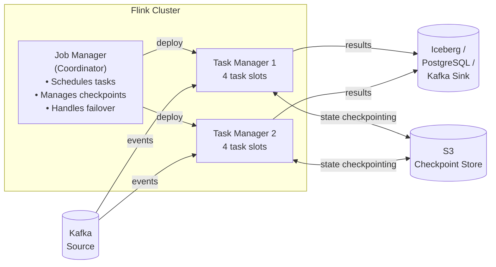

# Stream Processing
{: .no_toc }

<details open markdown="block">
  <summary>Table of Contents</summary>
  {: .text-delta }
1. TOC
{:toc}
</details>

Stream processing means computing results continuously as data arrives rather than periodically re-processing a batch. The fundamental challenge: the stream is unbounded (it never ends), events can arrive late, and you often need to compute over time windows. Three systems dominate: Apache Flink (stateful, low-latency), Kafka Streams (embedded Java library), and Spark Structured Streaming (micro-batch). Each represents a different design point on the spectrum between latency, throughput, and operational simplicity.

---

## Event Time vs Processing Time

Before windowing and watermarks make sense, two time concepts must be distinguished:

```
Event time:      when the event actually happened (in the source system)
Processing time: when the event arrives at the stream processor

Real-world gap:
  10:00:00 — Mobile app generates a click event
  10:00:03 — Event uploaded to server (network delay)
  10:00:07 — Event arrives at Kafka (queue lag)
  10:00:09 — Event arrives at stream processor

Processing-time window [10:00:00, 10:01:00) might include events that happened at 09:59:58.
Event-time window [10:00:00, 10:01:00) includes all events that happened in that minute,
regardless of when they arrived.
```

**Use event time for analytical correctness.** Processing-time windows are simpler but produce different results depending on how fast the system is under load.

---

## Windowing

Windows group events into finite buckets for aggregation. Three fundamental types:

### Tumbling Windows

Non-overlapping, fixed-size windows. Each event belongs to exactly one window.

```
Events:  e1(t=0s)  e2(t=45s)  e3(t=61s)  e4(t=90s)  e5(t=125s)

5-minute tumbling windows:
  [0s,  300s): e1, e2, e3, e4, e5  (not quite — let me use 1-min for clarity)

1-minute tumbling windows:
  [0s,  60s):  e1(0s), e2(45s)
  [60s, 120s): e3(61s), e4(90s)
  [120s,180s): e5(125s)

Use case: revenue per hour, requests per minute, daily active users
```

### Sliding Windows

Fixed size, slide by a step smaller than the window size. Each event belongs to multiple windows.

```
10-minute window, sliding every 5 minutes:

  [0:00, 0:10): includes events from 0:00 to 0:10
  [0:05, 0:15): includes events from 0:05 to 0:15  (5-minute overlap with previous)
  [0:10, 0:20): includes events from 0:10 to 0:20

Use case: moving averages, rolling rate of errors (P99 over last 5 min, updated every minute)
```

### Session Windows

Gap-based windows: a session ends when no event arrives for a gap duration. Sessions are per-key.

```
User session windows (gap = 30 minutes of inactivity):

User A:  click(10:00) click(10:05) click(10:08) ── 35min gap ── click(10:50) click(10:52)
         ├─────── Session 1 ──────┤                             ├── Session 2 ──┤

User B:  click(10:00) ───── 45min gap ───── click(10:47)
         ├─ S1 ─┤                            ├── S2 ──┤

Use case: e-commerce session revenue, user engagement time, video watch sessions
```

---

## Watermarks

A **watermark** is a signal that says: "I believe all events with timestamps earlier than T have already arrived." It allows the system to close windows and emit results.

```
Stream events (arrival order ≠ event-time order):
  [t=10:00:01] order A
  [t=10:00:05] order B
  [t=10:00:03] order C  ← late by 2s relative to B
  [t=09:59:58] order D  ← 3 seconds late!
  [t=10:00:08] order E
  ...

Watermark strategy: current_max_event_time - allowed_lateness (e.g., 5s)

When max event time = 10:00:08, watermark = 10:00:03
→ Window [10:00:00, 10:00:05) not yet closed (watermark hasn't passed 10:00:05)

When max event time = 10:00:12, watermark = 10:00:07
→ Window [10:00:00, 10:00:05) can close — emit results
   order D (t=09:59:58) arrived before the window closed — included ✓
   If order D arrived after window closed → late element → handled by side output or dropped
```

**Watermark trade-off:** larger allowed lateness = more complete results + higher latency. Smaller allowed lateness = faster results + more late elements dropped.

---

## Apache Flink

Flink is a distributed stream processing framework with stateful operators, event-time processing, and millisecond latency. Used at LinkedIn, Uber, Netflix, and Alibaba for production workloads.

### Flink Architecture



### Flink DataStream API (Java)

```java
// Flink job: detect high-value customers in real time
public class HighValueCustomerJob {

    public static void main(String[] args) throws Exception {
        StreamExecutionEnvironment env = StreamExecutionEnvironment.getExecutionEnvironment();

        // Enable checkpointing every 60 seconds (exactly-once)
        env.enableCheckpointing(60_000, CheckpointingMode.EXACTLY_ONCE);
        env.getCheckpointConfig().setCheckpointStorage("s3://my-bucket/checkpoints");

        // Source: Kafka
        KafkaSource<OrderEvent> source = KafkaSource.<OrderEvent>builder()
            .setBootstrapServers("kafka:9092")
            .setTopics("orders")
            .setGroupId("flink-high-value-detector")
            .setStartingOffsets(OffsetsInitializer.latest())
            .setValueOnlyDeserializer(new JsonDeserializationSchema<>(OrderEvent.class))
            .build();

        DataStream<OrderEvent> orders = env.fromSource(source,
            WatermarkStrategy
                .<OrderEvent>forBoundedOutOfOrderness(Duration.ofSeconds(5))
                .withTimestampAssigner((event, ts) -> event.getOrderTimestamp()),
            "kafka-orders-source");

        // Tumbling window: 1-hour revenue per customer
        OutputTag<OrderEvent> lateTag = new OutputTag<>("late-orders") {};

        SingleOutputStreamOperator<CustomerRevenue> revenue = orders
            .keyBy(OrderEvent::getCustomerId)
            .window(TumblingEventTimeWindows.of(Time.hours(1)))
            .allowedLateness(Time.minutes(5))  // accept events up to 5 min late
            .sideOutputLateData(lateTag)        // late beyond that → side output
            .aggregate(new RevenueAggregateFunction(), new RevenueWindowFunction());

        // Main output: high-value customers (revenue > $1000 in the hour)
        revenue
            .filter(r -> r.getRevenue() > 1000.0)
            .sinkTo(KafkaSink.<CustomerRevenue>builder()
                .setBootstrapServers("kafka:9092")
                .setRecordSerializer(KafkaRecordSerializationSchema.builder()
                    .setTopic("high-value-customers")
                    .setValueSerializationSchema(new JsonSerializationSchema<>())
                    .build())
                .setDeliveryGuarantee(DeliveryGuarantee.EXACTLY_ONCE)
                .build());

        // Side output: late orders for separate processing
        orders.getSideOutput(lateTag)
            .sinkTo(/* late-orders Kafka topic or DLQ */);

        env.execute("High Value Customer Detection");
    }
}

// Aggregate function: incremental computation (more memory efficient than collecting all records)
public class RevenueAggregateFunction
        implements AggregateFunction<OrderEvent, Double, Double> {
    @Override public Double createAccumulator() { return 0.0; }
    @Override public Double add(OrderEvent event, Double acc) { return acc + event.getAmount(); }
    @Override public Double getResult(Double acc) { return acc; }
    @Override public Double merge(Double a, Double b) { return a + b; }
}
```

### Flink State Management

```java
// Stateful operator: detect fraud (same card used in 3+ countries within 10 minutes)
public class FraudDetectionFunction
        extends KeyedProcessFunction<String, Transaction, FraudAlert> {

    // ValueState: persisted per key (card number), survives failures via checkpointing
    private ValueState<List<String>> recentCountries;
    private ValueState<Long> windowStart;

    @Override
    public void open(Configuration params) {
        recentCountries = getRuntimeContext().getState(
            new ValueStateDescriptor<>("recent-countries", Types.LIST(Types.STRING)));
        windowStart = getRuntimeContext().getState(
            new ValueStateDescriptor<>("window-start", Types.LONG));
    }

    @Override
    public void processElement(Transaction tx, Context ctx, Collector<FraudAlert> out)
            throws Exception {

        List<String> countries = recentCountries.value();
        Long start = windowStart.value();

        if (countries == null) {
            countries = new ArrayList<>();
            start = tx.getTimestamp();
        }

        // Reset if outside 10-minute window
        if (tx.getTimestamp() - start > 10 * 60 * 1000) {
            countries = new ArrayList<>();
            start = tx.getTimestamp();
        }

        if (!countries.contains(tx.getCountry())) {
            countries.add(tx.getCountry());
        }

        if (countries.size() >= 3) {
            out.collect(new FraudAlert(tx.getCardNumber(), countries, tx.getTimestamp()));
        }

        recentCountries.update(countries);
        windowStart.update(start);

        // Set a timer to clean up state (Flink ProcessingTimeTimer)
        ctx.timerService().registerProcessingTimeTimer(tx.getTimestamp() + 10 * 60 * 1000 + 1);
    }

    @Override
    public void onTimer(long timestamp, OnTimerContext ctx, Collector<FraudAlert> out)
            throws Exception {
        recentCountries.clear();
        windowStart.clear();
    }
}
```

**Flink state backends:**

| Backend | Where state lives | Use case |
|:--------|:-----------------|:---------|
| `HashMapStateBackend` | JVM heap | Small state, low latency |
| `EmbeddedRocksDBStateBackend` | Local RocksDB on disk | Large state (TBs), spills to disk |
| Remote checkpoint | S3/HDFS (on checkpoint) | Recovery after failure |

---

## Kafka Streams

Kafka Streams runs inside your application — no separate cluster. Scales by adding application instances. State is stored in RocksDB, backed by Kafka changelog topics.

### Topology and Operators

```java
@Configuration
public class FraudDetectionTopology {

    @Bean
    public KStream<String, Transaction> fraudDetectionStream(StreamsBuilder builder) {
        // Source KStream
        KStream<String, Transaction> transactions = builder
            .stream("transactions",
                Consumed.with(Serdes.String(), new JsonSerde<>(Transaction.class))
                    .withTimestampExtractor((record, prev) ->
                        ((Transaction) record.value()).getTimestamp()));

        // KTable: known merchant risk scores (loaded from another topic)
        KTable<String, MerchantRisk> merchantRisk = builder
            .table("merchant-risk-scores",
                Consumed.with(Serdes.String(), new JsonSerde<>(MerchantRisk.class)),
                Materialized.as("merchant-risk-store"));

        // Stream-Table Join: enrich transaction with merchant risk
        KStream<String, EnrichedTransaction> enriched = transactions
            .leftJoin(merchantRisk,
                (tx, risk) -> new EnrichedTransaction(tx, risk),
                Joined.with(Serdes.String(), new JsonSerde<>(Transaction.class),
                            new JsonSerde<>(MerchantRisk.class)));

        // Session window: flag accounts with > $10K in a single session
        enriched
            .groupByKey()
            .windowedBy(SessionWindows.ofInactivityGapWithNoGrace(Duration.ofMinutes(30)))
            .aggregate(
                () -> 0.0,
                (key, tx, acc) -> acc + tx.getAmount(),
                (key, aggL, aggR) -> aggL + aggR,  // session merger
                Materialized.<String, Double, SessionStore<Bytes, byte[]>>as("session-totals")
                    .withValueSerde(Serdes.Double()))
            .toStream()
            .filter((windowedKey, total) -> total > 10_000.0)
            .map((windowedKey, total) -> KeyValue.pair(
                windowedKey.key(),
                new FraudAlert(windowedKey.key(), total, windowedKey.window().startTime())))
            .to("fraud-alerts", Produced.with(Serdes.String(), new JsonSerde<>(FraudAlert.class)));

        return transactions;
    }
}
```

### Interactive Queries

Kafka Streams exposes local state stores as queryable services:

```java
@RestController
public class StatsController {

    private final KafkaStreams streams;

    // Query local state store directly (O(1) RocksDB lookup)
    @GetMapping("/session-total/{cardNumber}")
    public double getSessionTotal(@PathVariable String cardNumber) {
        ReadOnlySessionStore<String, Double> store = streams.store(
            StoreQueryParameters.fromNameAndType("session-totals",
                QueryableStoreTypes.sessionStore()));

        // Get all session windows for this card
        try (KeyValueIterator<Windowed<String>, Double> iter = store.fetch(cardNumber)) {
            double maxTotal = 0.0;
            while (iter.hasNext()) {
                maxTotal = Math.max(maxTotal, iter.next().value);
            }
            return maxTotal;
        }
    }

    // For partitions owned by other instances, route via HTTP
    @GetMapping("/route/{cardNumber}")
    public double routeQuery(@PathVariable String cardNumber) {
        KeyQueryMetadata metadata = streams.queryMetadataForKey(
            "session-totals", cardNumber, Serdes.String().serializer());

        if (metadata.activeHost().port() == localPort) {
            return getSessionTotal(cardNumber);
        }
        // RPC to the instance that owns this partition
        return webClient.get()
            .uri("http://{}:{}/session-total/{}", metadata.activeHost().host(),
                 metadata.activeHost().port(), cardNumber)
            .retrieve()
            .bodyToMono(Double.class)
            .block();
    }
}
```

---

## Spark Structured Streaming

Spark Structured Streaming treats a stream as an unbounded DataFrame, executing micro-batches (default trigger interval: as fast as possible, typically 100ms–1s). Familiar SQL API for teams already using Spark.

```java
// Spark Structured Streaming: revenue aggregation from Kafka
SparkSession spark = SparkSession.builder()
    .appName("RevenueAggregator")
    .getOrCreate();

// Read stream from Kafka
Dataset<Row> rawOrders = spark.readStream()
    .format("kafka")
    .option("kafka.bootstrap.servers", "kafka:9092")
    .option("subscribe", "orders")
    .option("startingOffsets", "latest")
    .load();

// Parse JSON, extract fields
Dataset<Row> orders = rawOrders
    .select(from_json(col("value").cast("string"),
            new StructType()
                .add("orderId", "string")
                .add("customerId", "string")
                .add("amount", "double")
                .add("orderTime", "timestamp")).as("data"))
    .select("data.*")
    .withWatermark("orderTime", "5 minutes");  // allow 5 min of lateness

// Tumbling window aggregation: revenue per customer per hour
Dataset<Row> revenue = orders
    .groupBy(
        window(col("orderTime"), "1 hour"),
        col("customerId"))
    .agg(
        sum("amount").as("totalRevenue"),
        count("orderId").as("orderCount"));

// Write to Parquet on S3 (append mode: each micro-batch writes new files)
StreamingQuery query = revenue.writeStream()
    .format("parquet")
    .option("path", "s3://my-bucket/revenue/")
    .option("checkpointLocation", "s3://my-bucket/checkpoints/revenue/")
    .outputMode("append")   // only new rows since last trigger
    .trigger(Trigger.ProcessingTime("1 minute"))
    .start();

query.awaitTermination();
```

**Spark output modes:**

| Mode | When to use |
|:-----|:------------|
| `append` | Only new rows added since last trigger (requires watermark for aggregations) |
| `update` | Only rows that changed since last trigger (for aggregations without watermark) |
| `complete` | Full result table every trigger (small result sets only — rewrites everything) |

---

## Comparison: Flink vs Kafka Streams vs Spark Streaming

| | Apache Flink | Kafka Streams | Spark Structured Streaming |
|:-|:------------|:-------------|:--------------------------|
| **Processing model** | True streaming (event-by-event) | True streaming | Micro-batch (default) |
| **Latency** | Milliseconds | Milliseconds | Seconds (micro-batch) |
| **Deployment** | Separate cluster (YARN/K8s/standalone) | Embedded in your app | Spark cluster |
| **State** | Large, RocksDB, distributed checkpoint | Local RocksDB + Kafka changelog | Checkpoint to HDFS/S3 |
| **Windowing** | Tumbling, Sliding, Session, Global | Tumbling, Sliding, Session | Tumbling, Sliding (event-time) |
| **Exactly-once** | Yes (with Kafka source/sink) | Yes (`processing.guarantee=exactly_once_v2`) | Yes (idempotent writes + checkpoints) |
| **Language** | Java, Scala, Python, SQL | Java, Scala | Java, Scala, Python, SQL |
| **Kafka dependency** | Optional (supports many sources) | Required (Kafka is storage) | Optional (via connector) |
| **Operational complexity** | High (cluster to manage) | Low (library, no cluster) | High (Spark cluster) |
| **Best for** | Complex event processing, large state, low latency | Kafka-centric apps, embedded processing | Existing Spark teams, batch + streaming unification |

**Decision guide:**
- Use **Kafka Streams** when your data is in Kafka, you're writing Java microservices, and you don't want to operate a cluster.
- Use **Flink** when you need millisecond latency, complex event patterns (CEP), very large state, or non-Kafka sources.
- Use **Spark Streaming** when your team already runs Spark, you need to unify batch and streaming, or you need rich ML/SQL integrations.

---

## Windowing with Late Data: End-to-End Example

```
Scenario: count orders per customer per 5-minute tumbling window
Allowed lateness: 2 minutes
Events arrive out of order (mobile network delays)

Timeline:
  t=10:00 — Window [10:00, 10:05) opens
  t=10:02 — Order A (event_time=10:01) arrives → added to [10:00, 10:05)
  t=10:04 — Order B (event_time=10:03) arrives → added to [10:00, 10:05)
  t=10:06 — Watermark advances past 10:05 (max_event_time=10:06 - 1min_lateness)
           → Window [10:00, 10:05) would fire IF lateness=0

  Actually with allowed_lateness=2min: window stays open until watermark=10:07
  t=10:07 — Order C (event_time=10:02) arrives → still within lateness → added
  t=10:07 — Watermark=10:05 → Window [10:00, 10:05) fires (result: A+B+C)
  t=10:09 — Order D (event_time=10:01) arrives → TOO LATE (window already fired)
           → Goes to side output (Flink) or discarded (depending on config)
```

```java
// Flink: window with late data handling
orders.keyBy(OrderEvent::getCustomerId)
    .window(TumblingEventTimeWindows.of(Time.minutes(5)))
    .allowedLateness(Time.minutes(2))
    .sideOutputLateData(new OutputTag<OrderEvent>("very-late") {})
    .process(new OrderCountWindowFunction())
    // main output: window result (may fire multiple times as late events arrive)
    // side output: events that arrived after allowed lateness expired
```

---

## Key Takeaways for Interviews

1. **Event time > processing time for analytical correctness.** Event time reflects when things happened. Processing time varies with system load. Use event time with watermarks for windows that give correct counts even under backpressure.
2. **Watermarks trade latency for completeness.** A 5-minute watermark waits 5 minutes before closing a window, reducing dropped late events but increasing result latency. Size the watermark to the typical network/pipeline delay in your system.
3. **Three window types solve different problems.** Tumbling = non-overlapping buckets (hourly revenue). Sliding = rolling calculations (5-min error rate updated every 1 min). Session = user-activity-scoped windows (session revenue).
4. **Kafka Streams requires no cluster.** It scales by adding application instances; each takes ownership of a subset of partitions. Local RocksDB state is recovered from Kafka changelog topics on restart. Choose it when Kafka is already your backbone.
5. **Flink is the industrial-strength choice.** Millisecond latency, large state management, exactly-once across heterogeneous sources, complex event processing — Flink handles workloads that exceed Kafka Streams' scope.
6. **Spark Streaming is micro-batch, not true streaming.** Each trigger reads a batch from Kafka, processes it, and writes output. Latency is seconds, not milliseconds. Excellent for teams unifying Spark batch and streaming jobs.
7. **Flink checkpoints = fault tolerance.** Flink snapshots distributed state to S3 at checkpoint intervals. On failure, the job restarts from the last checkpoint and replays Kafka from the saved offsets. This achieves exactly-once end-to-end.

---

## References

- [Apache Flink Documentation](https://nightlies.apache.org/flink/flink-docs-stable/)
- [Kafka Streams Documentation](https://kafka.apache.org/documentation/streams/)
- [Spark Structured Streaming Guide](https://spark.apache.org/docs/latest/structured-streaming-programming-guide.html)
- *Streaming Systems* — Tyler Akidau, Slava Chernyak, Reuven Lax (O'Reilly)
- [The Dataflow Model paper](https://research.google/pubs/pub43864/) — Google (foundation of Apache Beam and Flink's windowing model)
- [Flink: Stateful Computations over Data Streams](https://flink.apache.org/flink-architecture.html)
- *Designing Data-Intensive Applications* — Chapter 11 (stream processing, watermarks, windowing)
- [Kafka Streams Interactive Queries](https://kafka.apache.org/documentation/streams/developer-guide/interactive-queries.html)
