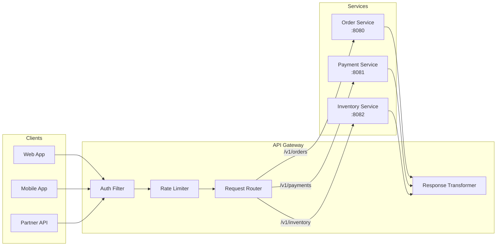

# API Design
{: .no_toc }

<details open markdown="block">
  <summary>Table of Contents</summary>
  {: .text-delta }
1. TOC
{:toc}
</details>

An API is a contract that outlives the implementation. REST, gRPC, and GraphQL each occupy a different point in the design space: REST is human-readable and stateless; gRPC is binary and schema-first; GraphQL is query-flexible and client-driven. Knowing when to use each — and how to avoid their respective failure modes — is a core Senior/Staff Engineer skill.

---

## RESTful API Best Practices

### Resource Naming

Resources are nouns, not verbs. HTTP methods express the action.

```
Bad (verb in URL):
  POST /createOrder
  GET  /getOrderById?id=123
  POST /cancelOrder/123

Good (noun resource, method is the verb):
  POST   /orders              → create order
  GET    /orders/123          → get order
  PUT    /orders/123          → full replace
  PATCH  /orders/123          → partial update
  DELETE /orders/123          → cancel/delete

Nested resources for clear ownership:
  GET  /orders/123/lines      → order lines for order 123
  POST /orders/123/lines      → add line to order 123
  GET  /customers/456/orders  → orders for customer 456

Actions that don't fit CRUD:
  POST /orders/123/confirm    → confirm (acceptable verb sub-resource for state transitions)
  POST /orders/123/cancel
```

### Versioning Strategies

| Strategy | Example | Trade-off |
|:---------|:--------|:----------|
| **URI versioning** | `/v1/orders`, `/v2/orders` | Simple, explicit. Breaks REST (resource URI shouldn't encode version) |
| **Header versioning** | `Accept: application/vnd.api+json;version=2` | Clean URLs. Harder to test in browser |
| **Query parameter** | `/orders?version=2` | Easy to test. Pollutes query params |
| **Content negotiation** | `Accept: application/vnd.company.order-v2+json` | Fully correct REST. Complex to implement |

**Practical recommendation:** URI versioning (`/v1/`, `/v2/`) for public APIs — simplicity wins. Header versioning for internal APIs consumed by teams that control the clients.

```java
// Spring Boot: version via URI
@RestController
@RequestMapping("/v1/orders")
public class OrderControllerV1 { ... }

@RestController
@RequestMapping("/v2/orders")
public class OrderControllerV2 { ... }

// Or via custom header: X-API-Version
@GetMapping(value = "/orders/{id}", headers = "X-API-Version=2")
public OrderResponseV2 getOrderV2(@PathVariable String id) { ... }
```

### Pagination

**Offset pagination:** simple but breaks on inserts (rows shift under cursor).

```
GET /orders?offset=0&limit=20    → items 0–19
GET /orders?offset=20&limit=20   → items 20–39

Problem: if a new order is inserted at offset 5 between pages,
page 2 skips an item (the item that shifted from offset 19 to 20).
Also: COUNT(*) for total page count is expensive on large tables.
```

**Cursor pagination:** stable under concurrent inserts. No offset calculation.

```
GET /orders?limit=20                          → first page
Response:
{
  "data": [...],
  "cursor": {
    "next": "eyJpZCI6MTIzNH0="   // base64({"id":1234, "created_at":"2024-01-15"})
  }
}

GET /orders?after=eyJpZCI6MTIzNH0=&limit=20  → next page
→ SQL: WHERE (created_at, id) < (decoded_date, decoded_id)
        ORDER BY created_at DESC, id DESC
        LIMIT 20
```

```java
@GetMapping("/orders")
public PagedResponse<OrderDTO> listOrders(
        @RequestParam(required = false) String after,  // cursor
        @RequestParam(defaultValue = "20") int limit) {

    Cursor cursor = after != null ? Cursor.decode(after) : Cursor.start();
    List<Order> orders = orderRepository.findAfterCursor(cursor, limit + 1);

    boolean hasMore = orders.size() > limit;
    if (hasMore) orders = orders.subList(0, limit);

    String nextCursor = hasMore ? Cursor.encode(orders.get(orders.size() - 1)) : null;
    return new PagedResponse<>(orders.stream().map(orderMapper::toDTO).toList(), nextCursor);
}
```

### Idempotency Keys

Idempotency keys prevent duplicate operations when a client retries after a network timeout. The server stores the response keyed on the idempotency key and returns the cached response on retry.

```java
@PostMapping("/payments")
public ResponseEntity<PaymentResponse> createPayment(
        @RequestHeader("Idempotency-Key") String idempotencyKey,
        @RequestBody PaymentRequest request) {

    // Check if this key was already processed
    Optional<CachedResponse> cached = idempotencyStore.get(idempotencyKey);
    if (cached.isPresent()) {
        return ResponseEntity.ok(cached.get().getResponse());
    }

    // Acquire a lock to prevent concurrent processing of same key
    if (!idempotencyLock.tryLock(idempotencyKey)) {
        return ResponseEntity.status(409).build(); // Conflict: already in flight
    }

    try {
        PaymentResponse response = paymentService.charge(request);
        // Store result with TTL (e.g., 24 hours)
        idempotencyStore.put(idempotencyKey, response, Duration.ofHours(24));
        return ResponseEntity.status(201).body(response);
    } finally {
        idempotencyLock.unlock(idempotencyKey);
    }
}
```

---

## gRPC and Protocol Buffers

gRPC is a high-performance RPC framework using Protocol Buffers (binary serialization) over HTTP/2. Used heavily for inter-service communication where latency and throughput matter.

### Protocol Buffers

```protobuf
// order.proto
syntax = "proto3";
package com.example.orders;
option java_package = "com.example.orders.grpc";

message Order {
  string  order_id    = 1;   // field number — NEVER change or remove
  string  customer_id = 2;
  double  amount      = 3;
  OrderStatus status  = 4;
  repeated OrderLine lines = 5;

  // Adding optional fields is backward compatible
  string coupon_code  = 6;   // added in v2 — old clients ignore unknown fields
}

enum OrderStatus {
  ORDER_STATUS_UNSPECIFIED = 0;  // proto3 requires 0 as default
  ORDER_STATUS_DRAFT       = 1;
  ORDER_STATUS_CONFIRMED   = 2;
  ORDER_STATUS_SHIPPED     = 3;
}

message OrderLine {
  string product_id = 1;
  int32  quantity   = 2;
  double unit_price = 3;
}

// Service definition
service OrderService {
  // Unary RPC
  rpc GetOrder(GetOrderRequest) returns (Order);
  rpc CreateOrder(CreateOrderRequest) returns (Order);

  // Server streaming: client sends one request, server streams many responses
  rpc WatchOrderStatus(WatchOrderRequest) returns (stream OrderStatusUpdate);

  // Client streaming: client streams many requests, server responds once
  rpc BulkCreateOrders(stream CreateOrderRequest) returns (BulkCreateResponse);

  // Bidirectional streaming: both sides stream
  rpc SyncOrders(stream OrderSyncRequest) returns (stream OrderSyncResponse);
}
```

**Why Protocol Buffers beat JSON:**
- Binary encoding: 3–10× smaller than JSON for the same data
- Schema-enforced: no runtime type errors (unlike JSON where any field can be any type)
- Generated code: no manual serialization bugs
- Forward/backward compatible: unknown fields preserved, new optional fields ignored

**Field number rules:**
- Field numbers are permanent. Never change or reuse a field number.
- Removing a field: mark it `reserved 6; reserved "coupon_code";` to prevent future reuse.
- Adding fields: safe as long as they're optional (proto3 all fields are optional).

### gRPC Java Implementation

```java
// Server implementation (grpc-java + Spring Boot)
@GrpcService
public class OrderGrpcService extends OrderServiceGrpc.OrderServiceImplBase {

    // Unary RPC
    @Override
    public void getOrder(GetOrderRequest request, StreamObserver<Order> responseObserver) {
        try {
            com.example.domain.Order order = orderService.findById(request.getOrderId());
            responseObserver.onNext(orderMapper.toProto(order));
            responseObserver.onCompleted();
        } catch (OrderNotFoundException e) {
            responseObserver.onError(
                Status.NOT_FOUND
                    .withDescription("Order not found: " + request.getOrderId())
                    .asRuntimeException());
        }
    }

    // Server streaming: stream order status updates as they happen
    @Override
    public void watchOrderStatus(WatchOrderRequest request,
                                 StreamObserver<OrderStatusUpdate> responseObserver) {
        String orderId = request.getOrderId();

        // Register listener — called whenever order status changes
        orderEventBus.subscribe(orderId, event -> {
            if (responseObserver.isReady()) {
                responseObserver.onNext(OrderStatusUpdate.newBuilder()
                    .setOrderId(orderId)
                    .setStatus(event.getStatus())
                    .setTimestamp(event.getTimestamp())
                    .build());
            }
        });

        // Client disconnect: unsubscribe (Context cancellation)
        Context.current().withCancellation().addListener(
            ctx -> orderEventBus.unsubscribe(orderId), Runnable::run);
    }

    // Client streaming: receive bulk orders, respond once
    @Override
    public StreamObserver<CreateOrderRequest> bulkCreateOrders(
            StreamObserver<BulkCreateResponse> responseObserver) {

        List<Order> created = new ArrayList<>();

        return new StreamObserver<>() {
            @Override
            public void onNext(CreateOrderRequest req) {
                created.add(orderService.create(req));
            }
            @Override
            public void onError(Throwable t) { log.error("Bulk create stream error", t); }
            @Override
            public void onCompleted() {
                responseObserver.onNext(BulkCreateResponse.newBuilder()
                    .setSuccessCount(created.size())
                    .build());
                responseObserver.onCompleted();
            }
        };
    }
}

// Client (with interceptor for auth token injection)
@Configuration
public class GrpcClientConfig {
    @Bean
    public OrderServiceGrpc.OrderServiceBlockingStub orderServiceStub() {
        ManagedChannel channel = ManagedChannelBuilder
            .forAddress("order-service", 9090)
            .usePlaintext()  // in production: useTransportSecurity() or Istio mTLS
            .intercept(new AuthTokenInterceptor())
            .build();
        return OrderServiceGrpc.newBlockingStub(channel);
    }
}
```

### gRPC vs REST Comparison

| | gRPC | REST |
|:-|:-----|:-----|
| **Protocol** | HTTP/2 | HTTP/1.1 or HTTP/2 |
| **Serialization** | Protocol Buffers (binary) | JSON (text) |
| **Schema** | Required (`.proto` file) | Optional (OpenAPI) |
| **Streaming** | 4 modes (unary, server, client, bidi) | Only SSE / WebSocket for streaming |
| **Browser support** | Limited (gRPC-Web proxy needed) | Native |
| **Payload size** | 3–10× smaller | Larger |
| **Code generation** | Automatic (all languages) | Optional |
| **Debugging** | Harder (binary) | Easy (curl, browser) |
| **Best for** | Inter-service, high throughput, mobile | Public APIs, browser clients |

---

## GraphQL

GraphQL is a query language for APIs. Clients specify exactly the data they need; the server returns exactly that. Solves over-fetching (getting more data than needed) and under-fetching (needing multiple requests for related data).

### Schema Design

```graphql
# Schema-first design
type Query {
  order(id: ID!): Order
  orders(customerId: ID, status: OrderStatus, first: Int, after: String): OrderConnection!
}

type Mutation {
  createOrder(input: CreateOrderInput!): OrderPayload!
  confirmOrder(orderId: ID!): OrderPayload!
}

type Subscription {
  orderStatusChanged(orderId: ID!): OrderStatusUpdate!
}

type Order {
  id:         ID!
  customer:   Customer!      # nested type — resolver fetches from CustomerService
  lines:      [OrderLine!]!
  status:     OrderStatus!
  totalAmount: Money!
  createdAt:  DateTime!
}

type OrderLine {
  product:    Product!       # nested type — resolver fetches from ProductService
  quantity:   Int!
  unitPrice:  Money!
}

type OrderConnection {       # cursor-based pagination (Relay spec)
  edges:    [OrderEdge!]!
  pageInfo: PageInfo!
}

type OrderEdge {
  node:   Order!
  cursor: String!
}

enum OrderStatus { DRAFT CONFIRMED SHIPPED CANCELLED }
```

### The N+1 Problem and DataLoader

```
Query:
  orders(customerId: "c1") {
    id
    customer { name }    ← requires fetching customer for each order
    lines { product { name } }  ← requires fetching product for each line
  }

Without DataLoader:
  1 query: SELECT * FROM orders WHERE customer_id = 'c1' → 10 orders
  10 queries: SELECT * FROM customers WHERE id = ? (once per order)
  50 queries: SELECT * FROM products WHERE id = ? (once per line)
  Total: 61 queries for one GraphQL request

With DataLoader (batching + caching):
  1 query: SELECT * FROM orders
  1 query: SELECT * FROM customers WHERE id IN (c1, c2, ... c10)  ← batched
  1 query: SELECT * FROM products WHERE id IN (p1, p2, ... p50)   ← batched
  Total: 3 queries
```

```java
// Spring Boot GraphQL + DataLoader (spring-graphql)
@Component
public class OrderResolver {

    // DataLoader key: customerId → Customer
    @SchemaMapping(typeName = "Order", field = "customer")
    public CompletableFuture<Customer> customer(Order order,
                                                DataLoader<String, Customer> customerLoader) {
        // DataLoader batches all customer fetches within one request into a single call
        return customerLoader.load(order.getCustomerId());
    }

    @SchemaMapping(typeName = "OrderLine", field = "product")
    public CompletableFuture<Product> product(OrderLine line,
                                              DataLoader<String, Product> productLoader) {
        return productLoader.load(line.getProductId());
    }
}

// Register DataLoader: batch function called once per request with all collected keys
@Configuration
public class DataLoaderConfig {

    @Bean
    public BatchLoaderRegistry batchLoaderRegistry(CustomerRepository customerRepo,
                                                   ProductRepository productRepo) {
        BatchLoaderRegistry registry = new DefaultBatchLoaderRegistry();

        registry.forTypePair(String.class, Customer.class)
            .withName("customerLoader")
            .registerBatchLoader((customerIds, env) ->
                customerRepo.findAllByIdIn(customerIds)
                    .collectMap(Customer::getId));  // returns Mono<Map<K,V>>

        registry.forTypePair(String.class, Product.class)
            .withName("productLoader")
            .registerBatchLoader((productIds, env) ->
                productRepo.findAllByIdIn(productIds)
                    .collectMap(Product::getId));

        return registry;
    }
}

// Query handler
@Controller
public class OrderQueryController {

    @QueryMapping
    public Connection<Order> orders(
            @Argument String customerId,
            @Argument String after,
            @Argument int first) {
        return orderService.findOrders(customerId, after, first);
    }
}

// Subscription (WebSocket-based)
@SubscriptionMapping
public Flux<OrderStatusUpdate> orderStatusChanged(@Argument String orderId) {
    return orderEventFlux
        .filter(event -> event.getOrderId().equals(orderId))
        .map(event -> new OrderStatusUpdate(orderId, event.getStatus()));
}
```

### When to Use GraphQL vs REST

| Use GraphQL when | Use REST when |
|:----------------|:-------------|
| Multiple clients (web, mobile, TV) need different shapes of the same data | Single client with known, stable data requirements |
| Over-fetching is a real problem (mobile on low bandwidth) | Simple CRUD, public API |
| Rapid iteration without versioning (schema evolves, add fields freely) | File uploads, binary responses, caching via HTTP (REST caches well; GraphQL POST doesn't) |
| Backend-for-Frontend layer | Webhooks, event callbacks |

---

## API Gateway Patterns

### API Gateway

The API Gateway is the single entry point for all clients. It handles cross-cutting concerns: authentication, rate limiting, request routing, SSL termination, and response transformation.



```yaml
# Kong API Gateway: declarative config
services:
  - name: order-service
    url: http://order-service:8080
    routes:
      - name: order-routes
        paths: ["/v1/orders"]
        methods: ["GET", "POST", "PUT", "DELETE", "PATCH"]
    plugins:
      - name: jwt
        config:
          secret_is_base64: false
          claims_to_verify: [exp, nbf]
      - name: rate-limiting
        config:
          minute: 1000
          policy: local
      - name: request-transformer
        config:
          add:
            headers: ["X-Consumer-ID:$(consumer.id)"]
```

### Backend for Frontend (BFF)

A BFF is a dedicated API Gateway for a specific client type. Each client (web, mobile, partner) gets its own BFF tailored to its data needs.

```
Generic API Gateway:                    BFF Pattern:
  All clients → one gateway              Web client → Web BFF → microservices
  Gateway returns maximum data           Mobile client → Mobile BFF → microservices
  Clients filter what they need          Partner → Partner BFF → microservices

Problem with generic gateway:          BFF advantages:
  Mobile needs 3 fields                  Mobile BFF returns exactly 3 fields
  Web needs 30 fields                    Web BFF aggregates from 4 services
  Gateway returns 30 to both            Each BFF evolves independently
```

```java
// Mobile BFF: aggregates and trims response from multiple services
@RestController
@RequestMapping("/mobile/v1")
public class MobileOrderBFF {

    @GetMapping("/orders/{id}/summary")
    public MobileOrderSummary getOrderSummary(@PathVariable String id) {
        // Parallel fetch from multiple services
        CompletableFuture<Order> orderFuture =
            CompletableFuture.supplyAsync(() -> orderClient.getOrder(id));
        CompletableFuture<ShipmentStatus> shipmentFuture =
            CompletableFuture.supplyAsync(() -> shippingClient.getStatus(id));

        Order order = orderFuture.join();
        ShipmentStatus shipment = shipmentFuture.join();

        // Return only what the mobile app needs (minimal payload)
        return MobileOrderSummary.builder()
            .orderId(order.getId())
            .status(order.getStatus())
            .totalAmount(order.getTotalAmount())
            .estimatedDelivery(shipment.getEstimatedDelivery())
            .trackingNumber(shipment.getTrackingNumber())
            .build();
        // Web BFF would return the full 30-field response
    }
}
```

---

## Key Takeaways for Interviews

1. **Cursor pagination is mandatory at scale.** Offset-based pagination degrades to O(n) database cost as the offset grows (the DB must skip `offset` rows). Cursor-based pagination always reads from a known position — constant cost regardless of page number.
2. **Idempotency keys prevent double charges.** Any POST that has financial side effects must accept an `Idempotency-Key` header. Store the result keyed on it and return the cached response on retry. This is non-negotiable for payment APIs.
3. **Protocol Buffer field numbers are immutable.** Reusing or changing a field number causes silent data corruption in deployed clients reading old messages with new field semantics. Reserve removed fields to block accidental reuse.
4. **DataLoader is the GraphQL N+1 fix.** Without it, resolvers fire one database query per parent object. DataLoader collects all keys within a request's tick, fires one batched query, and distributes results — N queries become 1.
5. **gRPC wins on throughput; REST wins on reach.** gRPC's binary encoding and HTTP/2 multiplexing make it ideal for inter-service communication. REST's browser-native support and human-readable JSON make it ideal for public APIs and external consumers.
6. **BFF per client type prevents API bloat.** A single general API that serves web, mobile, and partner clients ends up serving the union of all their requirements — bloated, version-locked, and slow for mobile. Separate BFFs evolve independently.
7. **GraphQL subscriptions require WebSockets.** REST-style HTTP polling is a common anti-pattern for real-time data. GraphQL subscriptions establish a persistent WebSocket connection; the server pushes updates without polling.

---

## References

- [Google API Design Guide](https://aip.dev) — opinionated REST API standards
- [gRPC Documentation](https://grpc.io/docs/)
- [Protocol Buffers Language Guide](https://protobuf.dev/programming-guides/proto3/)
- [Spring for GraphQL Reference](https://docs.spring.io/spring-graphql/docs/current/reference/html/)
- [GraphQL DataLoader](https://github.com/graphql/dataloader)
- [Relay Cursor Connections Spec](https://relay.dev/graphql/connections.htm) — cursor pagination standard
- *Building Microservices* — Sam Newman — API design chapter
- [Kong Gateway Documentation](https://docs.konghq.com/)
