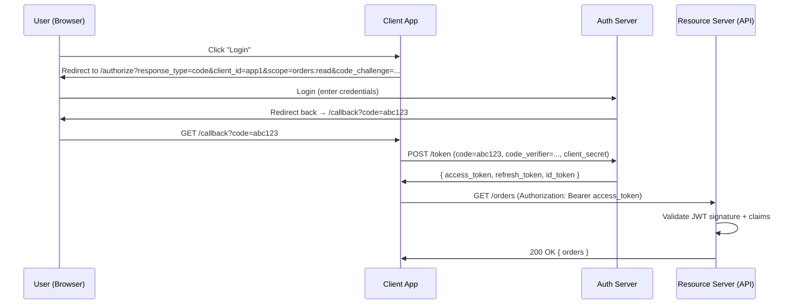
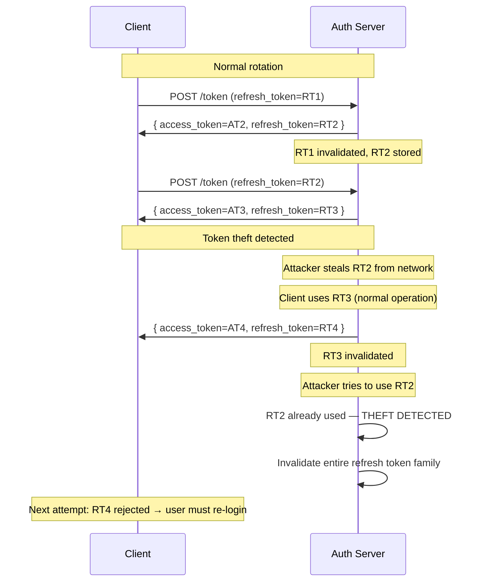

# API Security
{: .no_toc }

<details open markdown="block">
  <summary>Table of Contents</summary>
  {: .text-delta }
1. TOC
{:toc}
</details>

API security is fundamentally about trust: which identities can perform which actions on which resources. OAuth 2.0 delegates authorization, OIDC adds identity, JWT carries claims, and mTLS proves machine identity. Each layer solves a different problem — using only one or conflating them causes security gaps.

---

## OAuth 2.0

OAuth 2.0 is an **authorization** framework. It allows a client application to obtain limited access to a resource on behalf of a resource owner (user) without exposing the user's credentials.

### Core Roles

```
Resource Owner:  The user (the person who owns the data)
Client:          The application requesting access (your web app, mobile app)
Authorization Server:  Issues tokens (Keycloak, Auth0, Okta, Cognito)
Resource Server: The API that holds the protected data (your microservices)
```

### Authorization Code Flow (User-Facing Apps)

The most secure flow for web and mobile apps. The client never sees the user's password.



**PKCE (Proof Key for Code Exchange):** Mobile and SPA apps cannot keep a `client_secret` (it would be in the binary/JS bundle). PKCE adds a `code_verifier` (random string) and `code_challenge` (SHA256 hash of verifier). The authorization server verifies the verifier matches the challenge at token exchange — proving the same client that initiated the flow is completing it.

```java
// Spring Boot Resource Server: validate Bearer token
@Configuration
@EnableWebSecurity
public class ResourceServerConfig {

    @Bean
    public SecurityFilterChain filterChain(HttpSecurity http) throws Exception {
        http
            .oauth2ResourceServer(oauth2 -> oauth2
                .jwt(jwt -> jwt
                    .jwtAuthenticationConverter(jwtAuthConverter())))
            .authorizeHttpRequests(auth -> auth
                .requestMatchers("/actuator/health").permitAll()
                .requestMatchers(HttpMethod.GET,  "/orders/**").hasAuthority("SCOPE_orders:read")
                .requestMatchers(HttpMethod.POST, "/orders/**").hasAuthority("SCOPE_orders:write")
                .anyRequest().authenticated());
        return http.build();
    }

    @Bean
    public JwtAuthenticationConverter jwtAuthConverter() {
        JwtGrantedAuthoritiesConverter scopeConverter = new JwtGrantedAuthoritiesConverter();
        scopeConverter.setAuthoritiesClaimName("scope");
        scopeConverter.setAuthorityPrefix("SCOPE_");

        JwtAuthenticationConverter converter = new JwtAuthenticationConverter();
        converter.setJwtGrantedAuthoritiesConverter(scopeConverter);
        return converter;
    }
}

# application.yml: point to JWKS endpoint for automatic key rotation
spring:
  security:
    oauth2:
      resourceserver:
        jwt:
          issuer-uri: https://auth.example.com/realms/myapp
          # Spring auto-fetches JWKS from issuer-uri/.well-known/openid-configuration
```

### Client Credentials Flow (Machine-to-Machine)

Service-to-service calls with no user involved. The client authenticates with its own `client_id` + `client_secret`.

```java
// Spring Boot: client credentials for service-to-service calls
@Configuration
public class WebClientConfig {

    @Bean
    public WebClient inventoryServiceClient(OAuth2AuthorizedClientManager authorizedClientManager) {
        // Automatically obtains and caches access tokens, refreshes when expired
        ServletOAuth2AuthorizedClientExchangeFilterFunction oauth2 =
            new ServletOAuth2AuthorizedClientExchangeFilterFunction(authorizedClientManager);
        oauth2.setDefaultClientRegistrationId("inventory-service");

        return WebClient.builder()
            .baseUrl("http://inventory-service")
            .apply(oauth2.oauth2Configuration())
            .build();
    }
}

# application.yml
spring:
  security:
    oauth2:
      client:
        registration:
          inventory-service:
            client-id: order-service
            client-secret: ${INVENTORY_SERVICE_SECRET}
            authorization-grant-type: client_credentials
            scope: inventory:read, inventory:write
        provider:
          inventory-service:
            token-uri: https://auth.example.com/realms/myapp/protocol/openid-connect/token
```

### OAuth 2.0 Flow Comparison

| Flow | Use Case | User Involved? | Client Secret Required |
|:-----|:---------|:--------------|:----------------------|
| **Authorization Code + PKCE** | Web apps, mobile apps | Yes | No (PKCE replaces it) |
| **Client Credentials** | Service-to-service | No | Yes (kept server-side) |
| **Device Authorization** | Smart TVs, CLIs | Yes (on another device) | No |
| **Implicit** | (Deprecated) SPAs | Yes | No |
| **Resource Owner Password** | (Legacy) Direct credential grant | Yes | Yes |

---

## OpenID Connect (OIDC)

OAuth 2.0 is for authorization (can this client access this resource?). OIDC adds **authentication** (who is the user?) on top of OAuth 2.0.

OIDC introduces the **ID Token** — a JWT containing user identity claims (`sub`, `email`, `name`). The Access Token is for calling APIs; the ID Token is for the client to know who the user is.

```
OAuth 2.0 alone:
  access_token = "I can access /orders on behalf of someone"
  (the client doesn't know WHO that someone is without another API call)

OIDC (OAuth 2.0 + id_token):
  access_token = "I can access /orders on behalf of user 456"
  id_token     = JWT { sub: "456", email: "alice@example.com", name: "Alice" }
  (the client knows exactly who the user is from the id_token)
```

**Standard OIDC scopes:**
- `openid` — required; triggers OIDC mode, returns `id_token`
- `profile` — name, given_name, family_name, picture
- `email` — email, email_verified
- `address` — address claim
- `phone` — phone_number

---

## JSON Web Tokens (JWT)

A JWT is a self-contained, signed token carrying claims. The receiver validates the signature cryptographically — no database lookup required.

### Structure

```
Header.Payload.Signature
  ↓           ↓               ↓
Base64URL   Base64URL   HMAC-SHA256 or RS256 signature
encoded     encoded

Header (algorithm + token type):
  { "alg": "RS256", "typ": "JWT", "kid": "key-id-2024" }

Payload (claims):
  {
    "iss": "https://auth.example.com",    // issuer — who created the token
    "sub": "user-456",                    // subject — who the token is about
    "aud": "order-service",               // audience — who should accept it
    "exp": 1706745600,                    // expiry — Unix timestamp
    "iat": 1706742000,                    // issued at
    "jti": "unique-token-id",             // JWT ID (for revocation)
    "scope": "orders:read orders:write",  // granted permissions
    "email": "alice@example.com"
  }

Signature:
  RS256_sign(base64url(header) + "." + base64url(payload), privateKey)
```

### Mandatory Validation

```java
@Component
public class JwtValidator {

    private final JWKSCache jwksCache;  // cache public keys from JWKS endpoint

    public Claims validateToken(String token) {
        try {
            // 1. Decode header, get kid (key ID)
            // 2. Fetch public key from JWKS endpoint (cached)
            // 3. Verify signature
            // 4. Validate standard claims
            return Jwts.parser()
                .keyLocator(header -> jwksCache.getKey(header.getKeyId()))
                .requireIssuer("https://auth.example.com")          // iss check
                .requireAudience("order-service")                   // aud check
                .clockSkewSeconds(30)                               // 30s tolerance
                .build()
                .parseSignedClaims(token)
                .getPayload();
        } catch (ExpiredJwtException e) {
            throw new TokenExpiredException("Token expired");
        } catch (JwtException e) {
            throw new InvalidTokenException("Invalid token: " + e.getMessage());
        }
    }
}
```

**Claims to validate (all required):**
- `iss` — is the issuer the expected authorization server? (prevents tokens from other systems)
- `aud` — is this token intended for this service? (prevents confused deputy attacks)
- `exp` — is the token still valid? (time-based expiry)
- `nbf` — is the token active yet? (not before)
- **Signature** — is the cryptographic signature valid with the issuer's public key?

### Short-Lived Access Tokens vs Long-Lived

JWTs are stateless — there is no revocation list checked on every request. A compromised token remains valid until it expires.

```
Access token lifetime: 5–15 minutes (short-lived)
  → Compromise window is small
  → User re-authenticates via refresh token (not password)

Refresh token lifetime: days to weeks (long-lived, stored securely)
  → Used only to obtain new access tokens
  → Can be revoked by the authorization server (stored in DB)
  → Never sent to resource servers (only to authorization server)
```

### Refresh Token Rotation

Rotation detects refresh token theft: when a token is stolen and the attacker uses it, the legitimate user's next refresh attempt fails, revealing the theft.



```java
// Keycloak: enable refresh token rotation
# keycloak/realm-config.json
{
  "revokeRefreshToken": true,           // rotate on each use
  "refreshTokenMaxReuse": 0,            // no reuse allowed
  "accessTokenLifespan": 300,           // 5 minutes
  "ssoSessionMaxLifespan": 86400        // 24 hours (refresh token lifetime)
}
```

---

## API Keys

API keys authenticate a client application (not a user). Used for server-to-server, developer integrations, and public APIs.

### Storage and Validation

**Never store API keys in plaintext.** Store the hash (SHA-256 or bcrypt). Present the key only once at creation.

```java
@Service
public class ApiKeyService {

    // Generate: create a random key, hash it, store hash
    public ApiKeyCreationResult createApiKey(String clientName, Set<String> scopes) {
        String rawKey = "sk_" + randomBase64(32);  // prefix makes accidental leaks obvious
        String keyHash = sha256Hex(rawKey);

        ApiKey stored = ApiKey.builder()
            .id(UUID.randomUUID())
            .clientName(clientName)
            .keyHash(keyHash)          // store hash only
            .scopes(scopes)
            .createdAt(Instant.now())
            .lastUsedAt(null)
            .expiresAt(Instant.now().plus(365, ChronoUnit.DAYS))
            .build();

        apiKeyRepository.save(stored);

        return new ApiKeyCreationResult(rawKey, stored.getId());
        // rawKey presented to client once, never stored in plaintext
    }

    // Validate: hash the incoming key, look up by hash
    public Optional<ApiKey> validate(String rawKey) {
        String keyHash = sha256Hex(rawKey);
        Optional<ApiKey> key = apiKeyRepository.findByKeyHash(keyHash);

        key.ifPresent(k -> {
            if (k.isExpired()) throw new ExpiredApiKeyException();
            apiKeyRepository.updateLastUsed(k.getId(), Instant.now());
        });

        return key;
    }

    private String sha256Hex(String input) {
        return Hashing.sha256().hashString(input, StandardCharsets.UTF_8).toString();
    }
}

// API Key authentication filter
@Component
public class ApiKeyAuthFilter extends OncePerRequestFilter {

    @Override
    protected void doFilterInternal(HttpServletRequest request,
                                    HttpServletResponse response,
                                    FilterChain chain) throws IOException, ServletException {

        String rawKey = request.getHeader("X-API-Key");
        if (rawKey == null) {
            chain.doFilter(request, response);
            return;
        }

        apiKeyService.validate(rawKey).ifPresentOrElse(
            key -> {
                // Set authenticated principal with scopes
                SecurityContextHolder.getContext().setAuthentication(
                    new ApiKeyAuthentication(key.getClientName(), key.getScopes()));
                chain.doFilter(request, response);
            },
            () -> response.sendError(HttpServletResponse.SC_UNAUTHORIZED, "Invalid API key")
        );
    }
}
```

**API key scoping:** assign explicit permissions rather than full access.
```
sk_live_abc123  →  scopes: [orders:read]                 (read-only integration)
sk_live_def456  →  scopes: [orders:read, orders:write]   (full order management)
sk_live_ghi789  →  scopes: [analytics:read]              (BI tool integration)
```

---

## Mutual TLS (mTLS)

Standard TLS proves the server's identity to the client. mTLS additionally proves the **client's identity** to the server — both sides present X.509 certificates.

```
Standard TLS (one-way):
  Client → Server: "Prove you're the real server"
  Server → Client: presents certificate (signed by trusted CA)
  Client verifies certificate chain
  Client sends encrypted data

mTLS (two-way):
  Client → Server: "Prove you're the real server" + "Here's my certificate"
  Server → Client: presents server certificate
  Server → Client: "Prove you're a trusted client"
  Client → Server: presents client certificate
  Both verify each other's certificates
  Encrypted channel with authenticated client identity
```

**What mTLS proves:** the client has the private key corresponding to a certificate issued by a trusted CA. The server doesn't need to check a password, session token, or API key — the identity is cryptographic.

### mTLS in Microservices (Istio)

Istio automates mTLS between all services. Istiod acts as a CA, issuing short-lived certificates (24h) via SPIFFE (Secure Production Identity Framework for Everyone) SVIDs.

```yaml
# Enforce strict mTLS across the entire mesh
apiVersion: security.istio.io/v1beta1
kind: PeerAuthentication
metadata:
  name: default
  namespace: production
spec:
  mtls:
    mode: STRICT  # reject all non-mTLS traffic between services

---
# Authorization policy: only order-service can call payment-service
apiVersion: security.istio.io/v1beta1
kind: AuthorizationPolicy
metadata:
  name: payment-service-policy
  namespace: production
spec:
  selector:
    matchLabels:
      app: payment-service
  rules:
    - from:
        - source:
            principals:
              - "cluster.local/ns/production/sa/order-service"
              # SPIFFE identity: spiffe://cluster.local/ns/production/sa/order-service
    - to:
        - operation:
            methods: ["POST"]
            paths: ["/v1/payments"]
```

### Manual mTLS with Spring Boot

For services that need mTLS without a service mesh:

```java
// Configure embedded Tomcat for mTLS
@Configuration
public class MtlsConfig {

    @Bean
    public TomcatServletWebServerFactory servletContainer() {
        TomcatServletWebServerFactory factory = new TomcatServletWebServerFactory();
        factory.addConnectorCustomizers(connector -> {
            connector.setSecure(true);
            connector.setScheme("https");
            connector.setPort(8443);
            ((AbstractHttp11Protocol<?>) connector.getProtocolHandler())
                .setSSLEnabled(true);
        });
        factory.addContextCustomizers(context -> {
            SSLHostConfig sslHostConfig = new SSLHostConfig();
            sslHostConfig.setProtocols("TLSv1.3");
            sslHostConfig.setCertificateKeystoreFile("classpath:server.p12");
            sslHostConfig.setCertificateKeystorePassword("${SERVER_KEYSTORE_PASSWORD}");
            sslHostConfig.setTruststoreFile("classpath:ca-truststore.p12"); // trusted client CAs
            sslHostConfig.setTruststorePassword("${TRUSTSTORE_PASSWORD}");
            sslHostConfig.setCertificateVerification("required");  // enforce client cert
        });
        return factory;
    }
}

# application.yml (Spring Boot native SSL — simpler)
server:
  ssl:
    enabled: true
    key-store: classpath:server.p12
    key-store-password: ${SERVER_KEYSTORE_PASSWORD}
    client-auth: need       # require client certificate
    trust-store: classpath:ca-truststore.p12
    trust-store-password: ${TRUSTSTORE_PASSWORD}
    protocol: TLS
    enabled-protocols: TLSv1.3
```

```java
// Extract client identity from certificate in request
@RestController
public class SecureOrderController {

    @GetMapping("/orders")
    public List<Order> getOrders(HttpServletRequest request) {
        X509Certificate[] certs = (X509Certificate[])
            request.getAttribute("javax.servlet.request.X509Certificate");

        String clientCN = certs[0].getSubjectX500Principal().getName();
        // clientCN = "CN=inventory-service,O=MyCompany,C=US"
        log.info("Request from: {}", clientCN);

        return orderService.findAll();
    }
}
```

---

## Security Comparison

| Mechanism | Proves | Revocable | Human or Machine | Common Use |
|:----------|:-------|:----------|:----------------|:-----------|
| **JWT (Access Token)** | User/service has authorization claims | No (until expiry) | Both | Resource server auth |
| **Refresh Token** | Right to get new access tokens | Yes (in auth server DB) | Human | Token renewal |
| **API Key** | Client application identity | Yes (delete from DB) | Machine | Developer integrations |
| **mTLS** | Certificate holder's identity | Via CRL/OCSP | Machine | Service-to-service |
| **Session Cookie** | Server-issued session ID | Yes (delete session) | Human | Browser-based apps |

---

## Key Takeaways for Interviews

1. **OAuth 2.0 ≠ authentication.** OAuth 2.0 grants access. OIDC adds identity. Use OIDC (`openid` scope + `id_token`) when you need to know who the user is; use OAuth 2.0 access tokens when authorizing API calls.
2. **Validate `iss`, `aud`, `exp`, and signature.** A JWT with a valid signature from the wrong issuer can still be a forgery. Validate `aud` to prevent confused deputy attacks where a token for Service A is used against Service B.
3. **Short-lived access tokens limit breach windows.** A 5-minute access token limits an attacker to 5 minutes even if stolen. A 24-hour token is essentially a password. Use refresh tokens (revocable) for long sessions.
4. **Refresh token rotation detects theft.** When a refresh token is reused (by an attacker), the authorization server detects the anomaly and revokes the entire token family, forcing re-authentication.
5. **Never store API keys in plaintext.** Store SHA-256 or bcrypt hash. Present the raw key only once at creation. This way a database breach doesn't expose working keys.
6. **mTLS is cryptographic identity, not just encryption.** Standard TLS encrypts traffic and proves the server. mTLS additionally proves which client is calling — certificate holder identity without passwords or tokens. Istio automates this at the service mesh layer with zero application code changes.
7. **Client Credentials flow = machine-to-machine OAuth.** No user involved. The calling service authenticates with its `client_id` + `client_secret` to get a short-lived access token scoped to what it needs. Rotate secrets regularly.

---

## References

- [OAuth 2.0 RFC 6749](https://www.rfc-editor.org/rfc/rfc6749)
- [PKCE RFC 7636](https://www.rfc-editor.org/rfc/rfc7636)
- [OpenID Connect Core 1.0](https://openid.net/specs/openid-connect-core-1_0.html)
- [JWT RFC 7519](https://www.rfc-editor.org/rfc/rfc7519)
- [SPIFFE Documentation](https://spiffe.io/docs/latest/)
- [Keycloak Documentation](https://www.keycloak.org/documentation)
- [Spring Security OAuth2 Reference](https://docs.spring.io/spring-security/reference/servlet/oauth2/index.html)
- [Istio Security Documentation](https://istio.io/latest/docs/concepts/security/)
- *OAuth 2.0 in Action* — Justin Richer & Antonio Sanso
