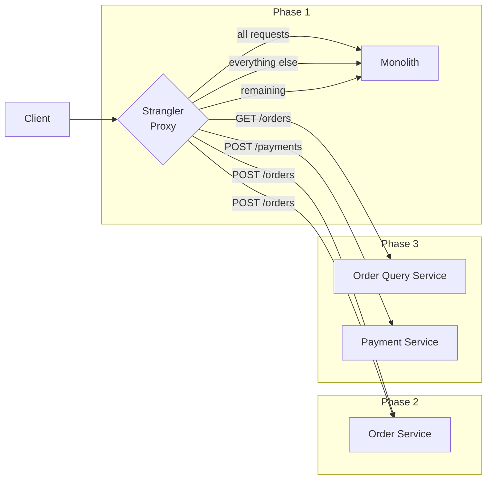
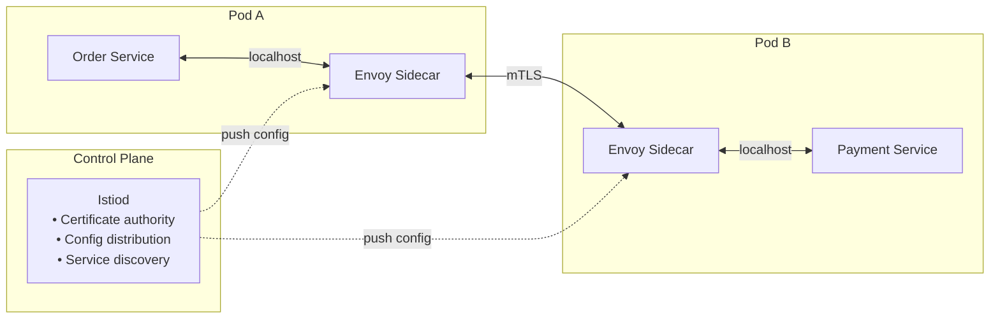

# Microservices & Domain-Driven Design
{: .no_toc }

<details open markdown="block">
  <summary>Table of Contents</summary>
  {: .text-delta }
1. TOC
{:toc}
</details>

Domain-Driven Design (DDD) provides the vocabulary and tools for decomposing complex domains into services with coherent boundaries. The most common microservices failure — services that are technically separate but logically coupled — is what DDD's strategic patterns are designed to prevent.

---

## Domain-Driven Design

### Building Blocks

**Entity:** An object defined by its identity, not its attributes. Two orders with the same items are still different orders.

**Value Object:** An object defined entirely by its attributes. No identity. Immutable. Two addresses with the same street/city/zip are interchangeable.

**Aggregate:** A cluster of Entities and Value Objects with a single root that enforces invariants. The Aggregate Root is the only entry point — external objects hold references only to the root, never to internal entities.

**Domain Event:** A record that something meaningful happened in the domain. Immutable. Named in past tense.

```java
// Value Object: immutable, equality by value
public record Money(BigDecimal amount, Currency currency) {
    public Money {
        if (amount.compareTo(BigDecimal.ZERO) < 0)
            throw new IllegalArgumentException("Amount cannot be negative");
    }
    public Money add(Money other) {
        if (!currency.equals(other.currency))
            throw new IllegalArgumentException("Currency mismatch");
        return new Money(amount.add(other.amount), currency);
    }
}

// Entity: identity-based equality
public class OrderLine {
    private final OrderLineId id;  // identity
    private ProductId productId;
    private int quantity;
    private Money unitPrice;
    // Equality based on id, not fields
}

// Aggregate Root: enforces invariants, controls internal entity lifecycle
public class Order {
    private final OrderId id;                  // Aggregate Root identity
    private CustomerId customerId;
    private OrderStatus status;
    private List<OrderLine> lines = new ArrayList<>();  // internal entities
    private Money totalAmount;

    // Only the root exposes mutation methods
    public void addLine(ProductId productId, int quantity, Money unitPrice) {
        if (status != OrderStatus.DRAFT)
            throw new IllegalStateException("Cannot modify a non-draft order");
        if (lines.size() >= 50)
            throw new IllegalStateException("Order cannot exceed 50 lines");

        lines.add(new OrderLine(OrderLineId.generate(), productId, quantity, unitPrice));
        recalculateTotal();
        // Invariants enforced here — no external code can violate them
    }

    public OrderConfirmedEvent confirm() {
        if (lines.isEmpty())
            throw new IllegalStateException("Cannot confirm empty order");
        this.status = OrderStatus.CONFIRMED;
        return new OrderConfirmedEvent(id, customerId, totalAmount, Instant.now());
    }
}

// Domain Event: past-tense, immutable
public record OrderConfirmedEvent(
    OrderId orderId,
    CustomerId customerId,
    Money totalAmount,
    Instant occurredAt
) {}
```

### Bounded Context

A Bounded Context is an explicit boundary within which a domain model applies consistently. The same word can mean different things in different contexts — and that's fine.

```
E-commerce Domain:

┌─────────────────────────────┐    ┌─────────────────────────────┐
│  Order Management Context   │    │  Customer Support Context   │
│                             │    │                             │
│  Customer = payer,          │    │  Customer = ticket owner,   │
│    has payment methods      │    │    has satisfaction score   │
│                             │    │                             │
│  Order = purchase intent    │    │  Order = support case ref   │
│    with line items          │    │    with issue history       │
└─────────────────────────────┘    └─────────────────────────────┘

Same word "Customer", completely different models.
Don't merge the models — maintain separate models per context.
```

### Context Mapping

When Bounded Contexts must interact, Context Mapping defines the relationship:

| Pattern | Description | Use When |
|:--------|:------------|:---------|
| **Shared Kernel** | Two contexts share a subset of the model | Teams work closely, model overlap is small and stable |
| **Customer-Supplier** | Upstream (supplier) defines the API; downstream (customer) adapts | Teams with clear dependency direction |
| **Anti-Corruption Layer (ACL)** | Downstream translates upstream model to its own | Downstream must not be polluted by legacy upstream model |
| **Open Host Service** | Upstream publishes a stable, well-documented protocol | Many downstreams; upstream wants to avoid bilateral coupling |
| **Conformist** | Downstream adopts upstream model wholesale | Integration cost of translation outweighs model purity |

```java
// Anti-Corruption Layer: translate legacy ERP Order model to domain model
@Component
public class ErpOrderTranslator {

    // Legacy ERP has a different "Order" concept — don't let it bleed into your domain
    public Order toDomainOrder(ErpOrderRecord erpRecord) {
        return Order.reconstitute(
            new OrderId(erpRecord.getOrderNum()),
            new CustomerId(erpRecord.getCustCode()),
            erpRecord.getLines().stream()
                .map(this::toDomainOrderLine)
                .collect(toList()),
            mapStatus(erpRecord.getStatusCode())
        );
    }

    private OrderStatus mapStatus(String erpCode) {
        return switch (erpCode) {
            case "OP"  -> OrderStatus.DRAFT;
            case "CF"  -> OrderStatus.CONFIRMED;
            case "SH"  -> OrderStatus.SHIPPED;
            case "CL"  -> OrderStatus.CANCELLED;
            default    -> throw new UnknownErpStatusException(erpCode);
        };
    }
}
```

### Event Storming

Event Storming is a workshop technique (Alberto Brandolini) for discovering domain events by having domain experts and engineers put orange sticky notes on a wall — events, commands, aggregates, and bounded contexts.

```
Workshop timeline (left to right):
  [Order Placed] → [Payment Initiated] → [Payment Confirmed] → [Inventory Reserved]
        ↑                                       ↑                       ↑
    Command:                               Domain Event:           Domain Event:
    PlaceOrder                           PaymentConfirmed        InventoryReserved

Identify:
  Hotspots (red notes): where domain experts disagree → likely boundary to investigate
  Aggregates (yellow notes): what handles the command → service candidate
  Bounded Contexts (frames): group related events → service boundaries
```

---

## Service Decomposition Patterns

### Decompose by Business Capability

Organize services around what the business does, not around technical layers. Business capabilities are stable — they change much more slowly than technology.

```
Bad decomposition (technical layers):
  FrontendService → APIService → BusinessLogicService → DatabaseService
  (All coupled — deploy as one anyway)

Good decomposition (business capabilities):
  OrderService      — manages order lifecycle
  InventoryService  — tracks stock levels
  PaymentService    — charges and refunds
  ShippingService   — fulfillment and tracking
  NotificationService — emails and push notifications
```

### Decompose by Subdomain

DDD classifies subdomains by strategic importance:

| Type | Description | Strategy |
|:-----|:------------|:---------|
| **Core** | Your competitive advantage | Build in-house, highest investment |
| **Supporting** | Necessary but not differentiating | Build or buy, simpler investment |
| **Generic** | Commodity functionality | Buy off-the-shelf (Stripe for payments, Twilio for SMS) |

```
E-commerce subdomains:
  Core:       Recommendation engine, personalization, search ranking
  Supporting: Order management, inventory, shipping
  Generic:    Authentication (Keycloak), Payments (Stripe), Email (SendGrid)
```

### Strangler Fig Pattern

Incrementally migrate a monolith by adding a routing layer in front. New functionality is built in microservices; old monolith endpoints are strangled one by one.



**Migration steps:**
1. Add a reverse proxy (Nginx, AWS ALB, or API Gateway) in front of the monolith.
2. Extract one endpoint to a new service (start with the one with the fewest dependencies).
3. Route traffic to the new service via the proxy, leaving the monolith untouched.
4. Repeat per endpoint until the monolith is empty.
5. Decommission the monolith.

**Key principle:** the monolith and new service must share the same database during transition (or replicate data). Never split the data before the code is stable.

---

## Inter-Service Communication

### Synchronous vs Asynchronous

```
Synchronous (HTTP/gRPC):
  Order → [HTTP] → Inventory → [HTTP] → Reservation
  
  Coupling: Order service waits for Inventory
  If Inventory is down: Order fails immediately
  Latency: additive (sum of all downstream calls)

Asynchronous (Kafka/SQS):
  Order → [Kafka: OrderCreated] → (returns immediately to client)
                                → Inventory consumes, reserves
                                → Notification consumes, sends email

  Coupling: Order doesn't know about Inventory at publish time
  If Inventory is down: message waits in Kafka, processed when recovered
  Latency: non-blocking (eventual consistency)
```

**Choose synchronous when:**
- The caller needs the result to proceed (get order details, validate coupon code)
- Strong consistency is required (check inventory before confirming sale)
- Latency budget is tight (user is waiting for an API response)

**Choose asynchronous when:**
- The action can complete eventually (send email, update analytics, trigger shipping)
- Downstream services have different availability/SLA requirements
- Fan-out to multiple consumers

### Choreography vs Orchestration

```
Choreography (event-driven, no central coordinator):
  OrderService  emits → OrderCreated
  InventoryService  listens → reserves stock, emits → StockReserved
  PaymentService    listens → charges card, emits → PaymentConfirmed
  ShippingService   listens → creates shipment

  Pro: services are decoupled
  Con: hard to see the overall flow; compensating transactions are complex

Orchestration (central saga coordinator):
  OrderSaga calls InventoryService (reserve stock)
            calls PaymentService (charge card)
            calls ShippingService (create shipment)
  On failure: OrderSaga calls compensating transactions in reverse

  Pro: flow is explicit and visible
  Con: orchestrator is coupled to all participants
```

---

## Service Mesh

A **Service Mesh** is an infrastructure layer that handles service-to-service communication concerns (TLS, retries, circuit breaking, observability) without changes to application code. Implemented via a **sidecar proxy** (Envoy) injected into every pod.



**What Istio provides without application code changes:**

| Feature | How it works |
|:--------|:-------------|
| **mTLS** | Envoy terminates/initiates TLS using certs from Istiod CA. App talks plain HTTP on localhost. |
| **Traffic management** | `VirtualService` and `DestinationRule` CRDs route traffic by weight, header, etc. |
| **Canary deployments** | Route 5% to v2, 95% to v1 via weight-based routing rule |
| **Circuit breaking** | `DestinationRule` with `outlierDetection` ejects unhealthy hosts |
| **Observability** | Envoy emits metrics (Prometheus), traces (Jaeger/Zipkin), access logs — automatically |
| **Retries & timeouts** | `VirtualService` retry policy and timeout without client code changes |

```yaml
# Istio VirtualService: canary deployment (5% → new version)
apiVersion: networking.istio.io/v1alpha3
kind: VirtualService
metadata:
  name: payment-service
spec:
  hosts:
    - payment-service
  http:
    - route:
        - destination:
            host: payment-service
            subset: v1
          weight: 95
        - destination:
            host: payment-service
            subset: v2
          weight: 5

---
# DestinationRule: circuit breaker + mTLS
apiVersion: networking.istio.io/v1alpha3
kind: DestinationRule
metadata:
  name: payment-service
spec:
  host: payment-service
  trafficPolicy:
    tls:
      mode: ISTIO_MUTUAL     # Istio-managed mTLS
    connectionPool:
      http:
        http1MaxPendingRequests: 100
        http2MaxRequests: 1000
    outlierDetection:
      consecutive5xxErrors: 5     # eject host after 5 consecutive 5xx
      interval: 10s               # check every 10s
      baseEjectionTime: 30s       # eject for 30s minimum
  subsets:
    - name: v1
      labels:
        version: v1
    - name: v2
      labels:
        version: v2
```

**Istio vs Linkerd:**
- **Istio**: More features (traffic management, fault injection, authorization policies). Heavier (more CPU/memory per sidecar). Full control over traffic.
- **Linkerd**: Lighter, simpler, Rust-based proxy (lower overhead). Fewer features. Better for teams that want mTLS + observability without full traffic management.

---

## Key Takeaways for Interviews

1. **Aggregate boundaries = transaction boundaries.** Everything inside an Aggregate is consistent within a single transaction. Cross-Aggregate operations use eventual consistency (domain events). Never hold a database transaction across Aggregates.
2. **Bounded Contexts prevent model corruption.** The same word in two services can mean different things — that's correct. The Anti-Corruption Layer translates between models and prevents a legacy upstream from infecting your domain model.
3. **Strangler Fig is the only safe way to migrate a monolith.** Big-bang rewrites fail. Extract one capability at a time, route traffic through a proxy, verify, then repeat. The monolith shrinks incrementally.
4. **Service Mesh handles cross-cutting concerns without code changes.** mTLS, retries, circuit breaking, and observability are infrastructure — they don't belong in application code. Istio's Envoy sidecar intercepts all traffic transparently.
5. **Choreography scales, orchestration is observable.** Choreographed sagas decouple services but scatter the business flow across event handlers. Orchestrated sagas (Axon, Eventuate) keep the flow explicit. Choose based on complexity of compensating transactions.
6. **Decompose by business capability, not technical layer.** A "DatabaseService" is not a microservice. A "PaymentService" that owns the payment domain — data, logic, and API — is.

---

## References

- *Domain-Driven Design* — Eric Evans (the original)
- *Implementing Domain-Driven Design* — Vaughn Vernon (practical Java examples)
- *Building Microservices* — Sam Newman (2nd Ed) — service decomposition and patterns
- [Martin Fowler: Strangler Fig Application](https://martinfowler.com/bliki/StranglerFigApplication.html)
- [Martin Fowler: BoundedContext](https://martinfowler.com/bliki/BoundedContext.html)
- [Istio Documentation](https://istio.io/latest/docs/)
- [Axon Framework](https://docs.axoniq.io/reference-guide/) — SAGA orchestration in Java
