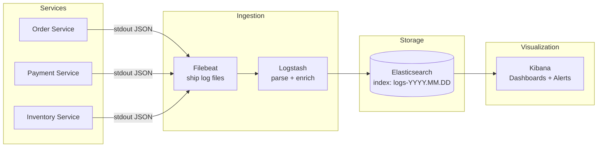
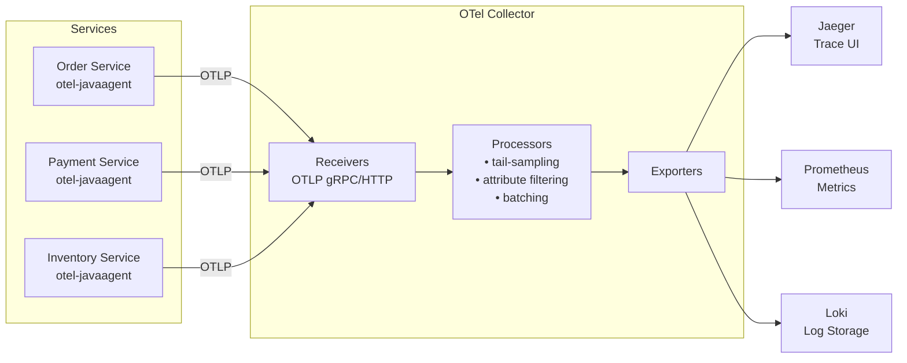

# Observability & SLOs
{: .no_toc }

<details open markdown="block">
  <summary>Table of Contents</summary>
  {: .text-delta }
1. TOC
{:toc}
</details>

Observability is the ability to understand the internal state of a system from its external outputs alone. The three pillars — logs, metrics, and traces — answer different questions about the same running system: **logs** answer *what happened*, **metrics** answer *how much / how often*, **traces** answer *where did the time go*. None is sufficient alone; all three are needed for effective production diagnosis.

---

## Structured Logging

### Why Structured Logging

Unstructured logs (`"Order 123 confirmed for user 456 in 45ms"`) require fragile regex to parse. Structured logs emit JSON, allowing log aggregators to index and query every field.

**Key principles:**
- Every log line includes a correlation/trace ID so a single request can be followed across all services.
- Log level discipline: `DEBUG` (local dev only), `INFO` (state transitions, business events), `WARN` (degraded but functional), `ERROR` (requires action, wakes someone up).
- Never log PII (email, card numbers) at INFO or above — add a masking appender or use a structured field marker.

### Correlation IDs with MDC

MDC (Mapped Diagnostic Context) attaches key-value pairs to every log line emitted from the current thread.

```java
@Component
@Order(Ordered.HIGHEST_PRECEDENCE)
public class CorrelationIdFilter extends OncePerRequestFilter {

    private static final String TRACE_HEADER = "X-Trace-Id";

    @Override
    protected void doFilterInternal(HttpServletRequest request,
                                    HttpServletResponse response,
                                    FilterChain chain) throws ServletException, IOException {
        String traceId = request.getHeader(TRACE_HEADER);
        if (traceId == null || traceId.isBlank()) {
            traceId = UUID.randomUUID().toString();
        }
        MDC.put("traceId", traceId);
        response.setHeader(TRACE_HEADER, traceId);     // echo back to caller
        try {
            chain.doFilter(request, response);
        } finally {
            MDC.clear();                               // thread pool: always clear
        }
    }
}
```

```xml
<!-- logback-spring.xml: JSON output via logstash-logback-encoder -->
<appender name="JSON_CONSOLE" class="ch.qos.logback.core.ConsoleAppender">
    <encoder class="net.logstash.logback.encoder.LogstashEncoder">
        <includeMdcKeyName>traceId</includeMdcKeyName>
        <includeMdcKeyName>userId</includeMdcKeyName>
    </encoder>
</appender>

<root level="INFO">
    <appender-ref ref="JSON_CONSOLE"/>
</root>
```

Output (one log line, machine-parseable):
```json
{
  "timestamp": "2026-04-01T12:00:00.123Z",
  "level": "INFO",
  "logger": "com.example.OrderService",
  "message": "Order confirmed",
  "traceId": "4bf92f35-77b3-4da6-a3ce-929d0e0e4736",
  "userId": "usr-789",
  "orderId": "ord-456",
  "durationMs": 45
}
```

### ELK Stack Architecture



**Index strategy:** Use daily indices (`logs-2026.04.01`) with ILM (Index Lifecycle Management) — hot tier for 7 days, warm tier for 30 days, delete after 90 days. Keep production log volume manageable.

---

## Metrics with Prometheus + Grafana

### RED and USE Methods

Two complementary frameworks for deciding *which* metrics matter:

**RED** — for services and APIs (user-facing):

| Metric | Description | Example |
|:-------|:------------|:--------|
| **Rate** | Requests per second (throughput) | `sum(rate(http_requests_total[1m]))` |
| **Errors** | Error rate (% of requests failing) | `rate(http_requests_total{status=~"5.."}[1m])` |
| **Duration** | Latency distribution (p50/p95/p99) | `histogram_quantile(0.99, ...)` |

**USE** — for infrastructure resources (CPU, memory, network):

| Metric | Description | Example |
|:-------|:------------|:--------|
| **Utilization** | % time resource is busy | CPU usage 75% |
| **Saturation** | Queue depth or wait time | JVM GC pause duration |
| **Errors** | Error events on the resource | Network packet drops, disk I/O errors |

Start with RED on every service. Add USE when a RED metric degrades and you need to find the bottleneck.

### Micrometer + Spring Boot Actuator

Micrometer is a vendor-neutral metrics facade — you write `Counter`, `Timer`, `Gauge` code once and export to Prometheus, Datadog, CloudWatch, or any registry.

```xml
<!-- pom.xml -->
<dependency>
    <groupId>io.micrometer</groupId>
    <artifactId>micrometer-registry-prometheus</artifactId>
</dependency>
<dependency>
    <groupId>org.springframework.boot</groupId>
    <artifactId>spring-boot-starter-actuator</artifactId>
</dependency>
```

```yaml
# application.yml
management:
  endpoints:
    web:
      exposure:
        include: health,metrics,prometheus
  metrics:
    tags:
      application: ${spring.application.name}
      environment: production
```

```java
@RestController
@RequestMapping("/orders")
public class OrderController {

    private final Counter ordersCreated;
    private final Counter ordersRejected;
    private final Timer   orderProcessingTime;
    private final DistributionSummary orderValueSummary;

    public OrderController(MeterRegistry registry) {
        this.ordersCreated = Counter.builder("orders.created")
            .description("Total orders successfully created")
            .register(registry);

        this.ordersRejected = Counter.builder("orders.rejected")
            .description("Orders rejected due to business rule violations")
            .tag("reason", "validation")
            .register(registry);

        this.orderProcessingTime = Timer.builder("orders.processing.duration")
            .description("End-to-end order processing time")
            .publishPercentiles(0.5, 0.95, 0.99)
            .publishPercentileHistogram()          // enables server-side percentiles in Prometheus
            .register(registry);

        this.orderValueSummary = DistributionSummary.builder("orders.value.usd")
            .description("Order value distribution in USD")
            .baseUnit("USD")
            .publishPercentiles(0.5, 0.95)
            .register(registry);
    }

    @PostMapping
    public ResponseEntity<Order> createOrder(@RequestBody CreateOrderRequest request) {
        return orderProcessingTime.record(() -> {
            try {
                Order order = orderService.create(request);
                ordersCreated.increment();
                orderValueSummary.record(order.getTotalAmountUsd());
                return ResponseEntity.status(HttpStatus.CREATED).body(order);
            } catch (ValidationException e) {
                ordersRejected.increment();
                throw e;
            }
        });
    }
}
```

Spring Boot auto-registers many metrics out of the box: JVM memory, GC pauses, HTTP request durations, datasource pool sizes, Kafka consumer lag. You only need to add domain-specific metrics manually.

### Prometheus Scrape Configuration

```yaml
# prometheus.yml
scrape_configs:
  - job_name: 'order-service'
    metrics_path: '/actuator/prometheus'
    scrape_interval: 15s
    static_configs:
      - targets: ['order-service:8080']
        labels:
          environment: production
          team: platform

  - job_name: 'kubernetes-pods'
    kubernetes_sd_configs:
      - role: pod
    relabel_configs:
      - source_labels: [__meta_kubernetes_pod_annotation_prometheus_io_scrape]
        action: keep
        regex: "true"
      - source_labels: [__meta_kubernetes_pod_annotation_prometheus_io_path]
        action: replace
        target_label: __metrics_path__
        regex: (.+)
```

### Defining SLIs in PromQL

An SLI is a quantitative measure that directly reflects user experience. Good SLIs:
- Are measurable (not "is the service up?" but "what fraction of requests return 2xx within 200ms?")
- Correlate with user pain
- Are aggregated over a time window (not instantaneous)

```promql
# Availability SLI: fraction of requests that succeed (non-5xx)
sum(rate(http_server_requests_seconds_count{status!~"5.."}[5m]))
  /
sum(rate(http_server_requests_seconds_count[5m]))

# Latency SLI: fraction of requests completing within 200ms
sum(rate(http_server_requests_seconds_bucket{le="0.2"}[5m]))
  /
sum(rate(http_server_requests_seconds_count[5m]))

# Freshness SLI (for async pipeline): fraction of events processed within 30s of arrival
sum(rate(events_processed_total{lag_seconds="<30"}[5m]))
  /
sum(rate(events_received_total[5m]))
```

---

## Distributed Tracing with OpenTelemetry

### Why Distributed Tracing

In a microservices call chain (`Client → API Gateway → Order Service → Inventory Service → DB`), a single request generates log lines in 4 separate systems. Even with correlation IDs in logs, reconstructing the exact timing of each hop requires a trace. A trace is a tree of **spans** — each span records one unit of work (service call, DB query, cache lookup) with its start time, duration, and attributes.

```
Trace: order-create (total: 287ms)
├── api-gateway.route           4ms
├── order-service.createOrder   250ms
│   ├── inventory.checkStock    180ms
│   │   └── postgres.query      170ms   ← hotspot
│   └── kafka.publishEvent       8ms
└── order-service.serialize     33ms
```

### OpenTelemetry Java Agent (Zero-Code Instrumentation)

The OTel Java agent automatically instruments Spring Boot, JDBC, Kafka, Redis, HTTP clients, and 80+ other libraries — no code changes required.

```bash
# Start the JVM with the agent attached
java \
  -javaagent:/opt/opentelemetry-javaagent.jar \
  -Dotel.service.name=order-service \
  -Dotel.resource.attributes=environment=production,team=commerce \
  -Dotel.exporter.otlp.endpoint=http://otel-collector:4317 \
  -Dotel.traces.exporter=otlp \
  -Dotel.metrics.exporter=otlp \
  -Dotel.logs.exporter=otlp \
  -jar order-service.jar
```

### Manual Instrumentation for Custom Spans

Auto-instrumentation covers frameworks; add manual spans for your own business logic:

```java
@Service
public class OrderService {

    private static final Tracer tracer =
        GlobalOpenTelemetry.getTracer("com.example.order", "1.0.0");

    private final InventoryClient inventoryClient;
    private final OrderRepository  orderRepository;

    public Order createOrder(CreateOrderRequest request) {
        Span span = tracer.spanBuilder("order.create")
            .setAttribute("customer.id", request.getCustomerId())
            .setAttribute("order.item.count", request.getItems().size())
            .startSpan();

        try (Scope scope = span.makeCurrent()) {
            validateInventory(request);        // child spans created inside
            Order order = buildOrder(request);
            orderRepository.save(order);
            span.setAttribute("order.id", order.getId());
            span.setAttribute("order.total_usd", order.getTotalAmountUsd());
            return order;
        } catch (Exception e) {
            span.recordException(e);
            span.setStatus(StatusCode.ERROR, e.getMessage());
            throw e;
        } finally {
            span.end();
        }
    }
}
```

### W3C TraceContext Header

When a service makes an outbound HTTP call, OTel injects the trace context as a standard `traceparent` header. The receiving service extracts it and creates child spans within the same trace.

```
traceparent: 00-4bf92f3577b34da6a3ce929d0e0e4736-00f067aa0ba902b7-01
             ^^  ────────────────────────────────  ────────────────  ^^
             │   trace-id (128-bit, hex)           parent-span-id    flags
             version                                                  (01 = sampled)
```

The same `trace-id` appears in every span across every service for the entire request. This is the bridge between tracing and logging: put `trace-id` in MDC, and a single Kibana query can pull all logs for one request across 8 services.

### OTel Collector Pipeline

The OTel Collector acts as a vendor-neutral telemetry pipeline between your services and the backend storage systems:



### Sampling Strategies

Sending 100% of traces to Jaeger is expensive at high traffic. Sampling controls the fraction stored.

| Strategy | How It Works | Trade-offs |
|:---------|:-------------|:-----------|
| **Head-based fixed rate** | Sampling decision at trace root (e.g., 5%). Propagated downstream via `traceparent` flags. | Predictable volume. Misses rare errors if they fall in the 95% dropped. |
| **Head-based rate limiting** | Sample max N traces/second globally. Higher coverage for low-traffic endpoints. | Still misses slow/error traces that weren't sampled. |
| **Tail-based** | Buffer all spans. Make sampling decision after trace completes, based on outcome. Always sample errors, always sample >1s traces. | Captures what matters. Requires the OTel Collector tail-sampling processor and more memory. |

```yaml
# OTel Collector: tail-based sampling config
processors:
  tail_sampling:
    decision_wait: 10s
    num_traces: 100000
    policies:
      - name: errors-policy
        type: status_code
        status_code: { status_codes: [ERROR] }
      - name: slow-traces-policy
        type: latency
        latency: { threshold_ms: 1000 }
      - name: probabilistic-policy
        type: probabilistic
        probabilistic: { sampling_percentage: 2 }   # 2% of everything else
```

---

## SLI, SLO, SLA, and Error Budgets

### Definitions

| Term | Definition | Who sets it |
|:-----|:-----------|:-----------|
| **SLI** (Service Level Indicator) | A quantitative metric that directly measures user experience | Engineering |
| **SLO** (Service Level Objective) | The target value for an SLI over a time window | Engineering + Product |
| **Error Budget** | 100% − SLO. The allowed amount of unreliability. | Engineering |
| **SLA** (Service Level Agreement) | Contractual SLO commitment to a customer, with financial penalties | Legal + Business |

{: .important }
**SLA is always weaker than SLO.** Internal SLO: 99.95% availability. Customer SLA: 99.9%. The gap is your operational buffer — you don't breach the SLA until after you've exhausted your internal error budget.

### Error Budget Math

```
SLO = 99.9% availability over a rolling 30-day window

Error budget = 100% − 99.9% = 0.1%
             = 0.1% × 30 days × 24 hours × 60 minutes
             = 43.2 minutes of allowed downtime per month

If your service has been down for 40 minutes this month:
  Remaining budget = 43.2 − 40 = 3.2 minutes
  → Freeze all non-critical deployments
  → Focus all engineering capacity on reliability
```

### SLO Definition Example (Order Service)

| SLI | SLO | Measurement Window |
|:----|:----|:------------------|
| Availability: fraction of requests returning non-5xx | ≥ 99.95% | Rolling 28 days |
| Latency: fraction of requests completing in < 200ms | ≥ 99% | Rolling 28 days |
| Freshness: fraction of order events processed within 30s | ≥ 99.9% | Rolling 28 days |

### Error Budget Burn Rate Alert

A burn rate alert fires before the budget is exhausted — giving time to act. A 5× burn rate means you'll exhaust the monthly budget in 6 days instead of 30.

```promql
# Alert: error budget burning 5× faster than steady-state (for 99.9% SLO)
# Steady-state allowed error rate = 0.1% = 0.001
# 5× burn rate threshold = 0.005

(
  sum(rate(http_server_requests_seconds_count{status=~"5.."}[1h]))
  /
  sum(rate(http_server_requests_seconds_count[1h]))
) > (5 * 0.001)
```

Multi-window burn rate (Google's recommended approach):
- **Short window (1h, 5× burn):** Fast burn — detect incidents quickly.
- **Long window (6h, 2× burn):** Slow burn — catch gradual degradation that won't trip short-window alerts.
- Alert only when BOTH fire to reduce false positives.

```yaml
# Grafana alert rule (multi-window burn rate)
groups:
  - name: slo-order-service
    rules:
      - alert: HighErrorBudgetBurnRate
        expr: |
          (
            sum(rate(http_server_requests_seconds_count{job="order-service",status=~"5.."}[1h]))
            / sum(rate(http_server_requests_seconds_count{job="order-service"}[1h]))
          ) > 0.005
          AND
          (
            sum(rate(http_server_requests_seconds_count{job="order-service",status=~"5.."}[6h]))
            / sum(rate(http_server_requests_seconds_count{job="order-service"}[6h]))
          ) > 0.002
        for: 2m
        labels:
          severity: page
        annotations:
          summary: "Order service error budget burning fast — check recent deployments"
```

---

## Key Takeaways for Interviews

1. **Logs + metrics + traces are complementary, not redundant.** Logs tell you *what happened* at a point. Metrics tell you *how much* over time. Traces tell you *where the latency is* across services. You need all three.
2. **MDC correlation IDs are non-negotiable in microservices.** Without a trace ID in every log line, production debugging is guesswork across 8 dashboards.
3. **SLO → Error budget → engineering decisions.** The error budget is the most powerful concept in SRE. It converts an abstract reliability goal into a concrete decision rule: "do we deploy this, or do we spend the time on reliability?"
4. **Tail-based sampling is the only way to guarantee 100% capture of errors and slow traces.** Head-based sampling at 5% means 95% of your most interesting traces are discarded before the outcome is known.
5. **OTel auto-instrumentation via Java agent gives you traces, metrics, and logs with zero application code changes.** It's the lowest-effort, highest-value observability investment for a Java shop.
6. **SLA must be weaker than internal SLO.** The gap is deliberate — it gives you a buffer to fix problems before a contractual breach.

---

## References

- *Site Reliability Engineering* — Google (free at [sre.google](https://sre.google/books/))
- *The Site Reliability Workbook* — Chapter 2 (SLOs) and Chapter 4 (Alerting)
- [OpenTelemetry Java Documentation](https://opentelemetry.io/docs/instrumentation/java/)
- [Micrometer Documentation](https://micrometer.io/docs)
- [Prometheus Query Language (PromQL)](https://prometheus.io/docs/prometheus/latest/querying/basics/)
- [logstash-logback-encoder](https://github.com/logfellow/logstash-logback-encoder)
- Alex Hidalgo — *Implementing Service Level Objectives* (O'Reilly)
