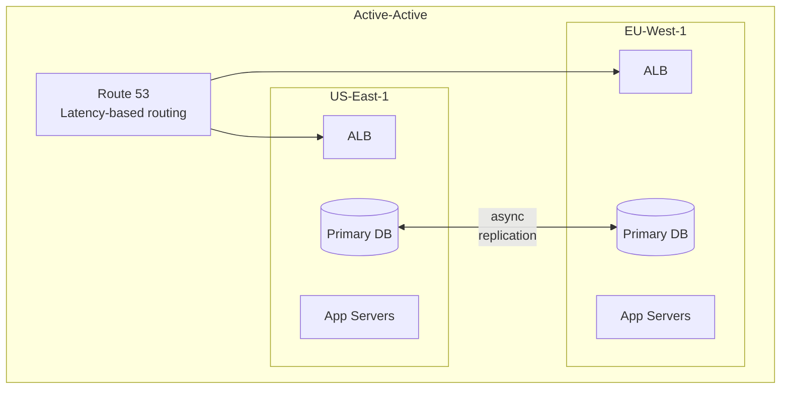
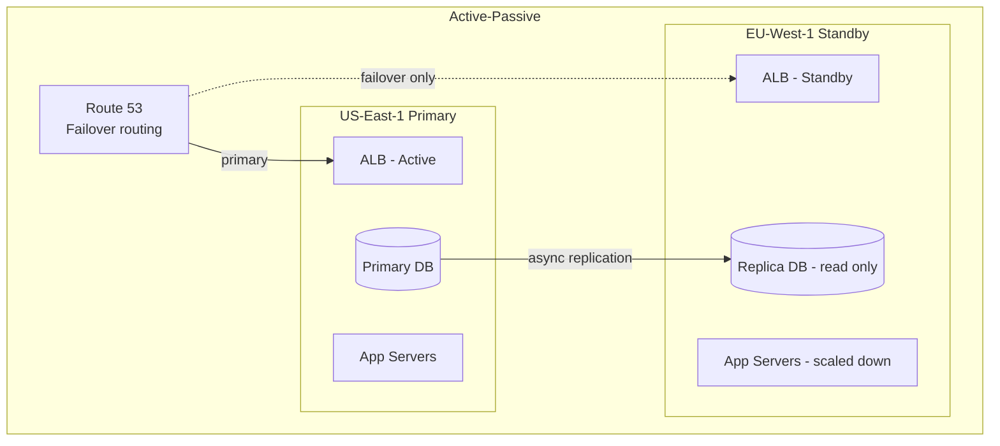

# Reliability Engineering
{: .no_toc }

<details open markdown="block">
  <summary>Table of Contents</summary>
  {: .text-delta }
1. TOC
{:toc}
</details>

Reliability engineering is the practice of making systems that fail gracefully, recover quickly, and improve over time. It combines proactive practices (chaos experiments, FMEA, game days) with recovery architecture (RTO/RPO targets, backup strategies, multi-region design) to reduce the cost and frequency of incidents.

---

## Chaos Engineering

### Principles

Chaos engineering is not "break things randomly." It is a disciplined experimental method:

1. **Define steady state** — a measurable output that represents normal system behavior (e.g., orders processed per second, p99 latency, error rate).
2. **Hypothesize** — state that the steady state will hold in both the control group and the experimental group.
3. **Introduce variables** — inject a realistic failure (kill a pod, add latency, saturate a dependency, partition the network).
4. **Observe** — does the system maintain steady state? Do circuit breakers open? Do alerts fire? Does it self-heal?
5. **Disprove the hypothesis** — if steady state breaks, you've found a real reliability gap before production did.

Start in staging. Move to production off-peak. Automate experiments that pass repeatedly.

### Chaos Monkey (Netflix)

Netflix's Chaos Monkey randomly terminates production EC2 instances during business hours. The hypothesis: "Our services are designed for instance failure and will continue serving traffic normally."

The result: teams were forced to design stateless services, use auto-scaling groups, and avoid sticky sessions — not because someone mandated it, but because the alternative was being paged at 2pm.

The Simian Army extended this: Chaos Gorilla (terminate an entire AZ), Chaos Kong (terminate a region), Latency Monkey (inject artificial latency).

### Chaos Toolkit (Open Source)

Chaos Toolkit provides a vendor-neutral, declarative experiment DSL that works with Kubernetes, AWS, GCP, and any HTTP endpoint.

```yaml
# chaos-experiment-circuit-breaker.yml
title: "Order service circuit breaker opens when Inventory is unavailable"

steady-state-hypothesis:
  title: "Order service is healthy and responding"
  probes:
    - type: http
      name: order-health-returns-200
      url: http://order-service/actuator/health
      expected_status: 200
    - type: http
      name: orders-api-responding
      url: http://order-service/orders/test-ord-001
      expected_status: 200

method:
  - type: action
    name: kill-inventory-service-pods
    provider:
      type: process
      path: kubectl
      arguments: "delete pods -l app=inventory-service --grace-period=0 --force"
  - type: probe
    name: wait-10-seconds
    provider:
      type: python
      module: time
      func: sleep
      arguments: { seconds: 10 }
  - type: probe
    name: verify-circuit-breaker-opened
    provider:
      type: http
      url: http://order-service/actuator/metrics/resilience4j.circuitbreaker.state
      expected_status: 200

rollbacks:
  - type: action
    name: restore-inventory-service
    provider:
      type: process
      path: kubectl
      arguments: "scale deployment inventory-service --replicas=3"
```

```java
// The Resilience4j circuit breaker the experiment is testing
@Service
public class InventoryClient {

    @CircuitBreaker(name = "inventory", fallbackMethod = "checkStockFallback")
    @Retry(name = "inventory")
    public StockStatus checkStock(String productId, int quantity) {
        return inventoryApi.checkStock(productId, quantity);
    }

    private StockStatus checkStockFallback(String productId, int quantity, Exception e) {
        // Return UNKNOWN so order creation continues with a reservation flag
        // rather than blocking the entire order flow
        log.warn("Inventory unavailable for product {}, using fallback", productId);
        return StockStatus.UNKNOWN;
    }
}
```

```yaml
# application.yml: circuit breaker config
resilience4j:
  circuitbreaker:
    instances:
      inventory:
        sliding-window-size: 10
        failure-rate-threshold: 50          # open after 50% failures
        wait-duration-in-open-state: 30s    # half-open after 30s
        permitted-number-of-calls-in-half-open-state: 3
  retry:
    instances:
      inventory:
        max-attempts: 3
        wait-duration: 500ms
        exponential-backoff-multiplier: 2
```

### Failure Mode and Effects Analysis (FMEA)

FMEA is a systematic method for enumerating every way a system can fail, scoring each by likelihood and impact, and prioritizing mitigations.

**Risk Priority Number (RPN) = Likelihood (1–10) × Impact (1–10) × Detectability (1–10)**

Higher RPN = higher priority to mitigate.

| Component | Failure Mode | Likelihood | Impact | Detectability | RPN | Mitigation |
|:----------|:------------|:-----------|:-------|:--------------|:----|:-----------|
| Order DB primary | Node crash | 3 | 10 | 8 | 240 | Auto-failover replica, RTO < 30s |
| Kafka broker | Broker outage (1 of 3) | 3 | 7 | 9 | 189 | Replication factor 3, min.ISR=2 |
| Payment API | Latency spike (>2s) | 6 | 9 | 7 | 378 | Circuit breaker, async fallback |
| CDN | Cache stampede after purge | 4 | 6 | 6 | 144 | Cache lock (request coalescing) |
| Order Service pod | OOMKilled | 5 | 5 | 9 | 225 | Memory limits + alerts on heap usage |
| Auth service | Token validation latency | 4 | 8 | 7 | 224 | Local JWKS cache with background refresh |

### Game Days

A game day is a structured team exercise that simulates a specific production failure scenario to test both the system's behavior and the team's response.

**Agenda template:**
1. **Scenario briefing (15 min)** — "Today's hypothesis: Primary RDS fails during peak traffic. Our auto-failover should complete in < 60s with no data loss."
2. **Define success criteria** — SLO maintained? Alerts fired within 5 min? On-call joined within 10 min? Runbook followed correctly?
3. **Execute** — inject the failure (usually off-peak for production, any time for staging)
4. **Observe and document** — real timeline vs expected, where the system held, where it broke
5. **Retrospective** — capture action items: runbook gaps, automation opportunities, missing alerts

---

## Disaster Recovery

### RTO and RPO

The two most important DR metrics — and the most confused:

**RPO (Recovery Point Objective):** Maximum acceptable data loss measured in time. "How old can our most recent backup be when we recover?" If RPO = 5 minutes, you can lose at most 5 minutes of transactions.

**RTO (Recovery Time Objective):** Maximum time to restore the service after a failure. "How long can the service be unavailable?" If RTO = 15 minutes, the service must be back within 15 minutes of the failure.

```
                         Failure occurs
                               │
Past ──────────────────────────┤──────────────────────── Present
                               │
          [last good state]    │             [service restored]
               │◄── RPO ──────►│◄──── RTO ──────────────►│
           (data loss           (downtime window)
            window)
```

RPO is constrained by your backup/replication frequency. RTO is constrained by your failover automation, infrastructure, and runbook maturity.

### DR Tier Mapping

| Tier | Example Services | Target RTO | Target RPO | Strategy |
|:-----|:----------------|:-----------|:-----------|:---------|
| **Mission-critical** | Payments, Auth | < 1 min | 0 (zero loss) | Active-active multi-region, synchronous replication |
| **Business-critical** | Order placement | < 15 min | < 5 min | Active-passive, automated failover, async replication |
| **Important** | Reporting, search | < 4 hours | < 1 hour | Warm standby, hourly snapshots |
| **Non-critical** | Analytics, audit logs | < 24 hours | < 24 hours | Cold standby, daily backups |

### Backup Strategies

| Type | How | Restore Time | RPO | Best For |
|:-----|:----|:-------------|:----|:---------|
| **Full backup** | Complete snapshot of all data | Hours (copy all data) | Hours (backup cadence) | Simple, infrequent restore |
| **Incremental** | Only data changed since last backup (any kind) | Long (replay entire chain) | Minutes to hours | Low storage cost, slow restore |
| **Differential** | Data changed since last *full* backup | Moderate (full + one diff) | Minutes to hours | Compromise between full and incremental |
| **Continuous (WAL shipping)** | PostgreSQL WAL or MySQL binlog streamed to replica in real-time | Minutes (promote replica) | Seconds | HA databases, near-zero RPO |
| **PITR (Point-In-Time Recovery)** | Full backup + replay WAL to any timestamp | Hours (replay logs) | Near-zero | Accidental deletes, logical corruption |

```sql
-- PostgreSQL: configure WAL archiving for PITR
-- postgresql.conf
archive_mode = on
archive_command = 'aws s3 cp %p s3://my-wal-bucket/%f'
wal_level = replica

-- Restore to specific time (e.g., before accidental DELETE)
-- recovery.conf
restore_command = 'aws s3 cp s3://my-wal-bucket/%f %p'
recovery_target_time = '2026-04-01 14:30:00'
recovery_target_action = promote
```

```java
// Automated backup validation — test restore monthly
@Scheduled(cron = "0 0 2 1 * *")    // 2am on 1st of every month
public void validateBackupRestore() {
    String backupS3Key = backupService.latestFullBackupKey();
    String restoreInstance = rdsClient.restoreFromSnapshot(backupS3Key, "restore-validation");
    boolean dataIntegrity = validationService.runChecksumValidation(restoreInstance);
    rdsClient.deleteInstance(restoreInstance);

    if (!dataIntegrity) {
        alertingService.page("CRITICAL: Monthly backup restore validation FAILED");
    } else {
        metrics.recordBackupValidationSuccess();
    }
}
```

---

## Multi-Region Architecture

### Active-Active vs Active-Passive





**Trade-off comparison:**

| Concern | Active-Active | Active-Passive |
|:--------|:-------------|:--------------|
| Both regions serve live traffic | ✅ | ❌ (standby is idle) |
| RTO on regional failure | Seconds (DNS TTL ≈ 30s) | 5–15 min (failover + promote replica) |
| RPO | Seconds (async lag) | Seconds to minutes (replication lag) |
| Write conflicts possible | ✅ (needs conflict resolution) | ❌ (single writer region) |
| Consistency model | Eventual (global writes) | Easier (single primary) |
| Cost | 2× infra (both regions full capacity) | ~1.5× (standby runs at reduced scale) |
| Complexity | High (conflict resolution, CRDT, or routing to single region for writes) | Medium (automated failover tooling) |
| Use case | Global user base, latency-sensitive, zero-downtime requirement | DR for regional failures, simpler ops |

### Failover Automation

```java
// AWS Route 53 health check + failover routing
// Application code: expose a health endpoint that checks all critical dependencies
@RestController
public class HealthController {

    private final DataSource dataSource;
    private final KafkaTemplate<?, ?> kafkaTemplate;

    @GetMapping("/actuator/health/region")
    public ResponseEntity<Map<String, String>> regionHealth() {
        Map<String, String> status = new LinkedHashMap<>();
        boolean healthy = true;

        try {
            dataSource.getConnection().close();
            status.put("database", "UP");
        } catch (Exception e) {
            status.put("database", "DOWN: " + e.getMessage());
            healthy = false;
        }

        // Route53 health checker calls this endpoint every 10s
        // If it returns non-2xx, Route53 triggers DNS failover automatically
        return healthy
            ? ResponseEntity.ok(status)
            : ResponseEntity.status(HttpStatus.SERVICE_UNAVAILABLE).body(status);
    }
}
```

```yaml
# Terraform: Route53 failover routing policy
resource "aws_route53_health_check" "order_service_primary" {
  fqdn              = "order-service.us-east-1.internal"
  port              = 8080
  type              = "HTTP"
  resource_path     = "/actuator/health/region"
  failure_threshold = 3
  request_interval  = 10
}

resource "aws_route53_record" "order_service_primary" {
  zone_id         = var.hosted_zone_id
  name            = "orders.api.example.com"
  type            = "A"
  set_identifier  = "primary"
  health_check_id = aws_route53_health_check.order_service_primary.id

  failover_routing_policy {
    type = "PRIMARY"
  }
  alias {
    name    = aws_lb.order_service_us_east.dns_name
    zone_id = aws_lb.order_service_us_east.zone_id
  }
}

resource "aws_route53_record" "order_service_secondary" {
  zone_id        = var.hosted_zone_id
  name           = "orders.api.example.com"
  type           = "A"
  set_identifier = "secondary"

  failover_routing_policy {
    type = "SECONDARY"
  }
  alias {
    name    = aws_lb.order_service_eu_west.dns_name
    zone_id = aws_lb.order_service_eu_west.zone_id
  }
}
```

### Data Replication Trade-offs

Synchronous replication: every write is confirmed only after the standby acknowledges. Zero RPO, but adds latency proportional to network distance between regions (us-east ↔ eu-west ≈ 70–100ms RTT).

Asynchronous replication: primary acknowledges the write immediately, replicates in background. Low write latency, but RPO = replication lag (seconds to minutes). Suitable for most active-passive setups.

For active-active with global writes, options:
- **Single-region writes (routing):** Route all writes to one region, distribute reads. Simplest but creates asymmetric latency for geographically distant writers.
- **CRDTs:** Data types that auto-resolve conflicts (counters, sets). Limited to specific use cases.
- **Google Spanner / Amazon Aurora Global Database:** Managed synchronous replication with tuned latency. Best option when you need zero-RPO active-active without building conflict resolution yourself.

---

## Key Takeaways for Interviews

1. **Chaos engineering tests hypotheses, not random destruction.** The difference is a steady-state definition, a measurable outcome, and a rollback plan. Chaos without measurement is just sabotage.
2. **Circuit breakers are the primary chaos-engineering validation target.** If a dependency fails and your service cascades rather than degrades gracefully, the chaos experiment has found a critical gap.
3. **RTO and RPO are independent constraints.** A system can have low RPO (frequent replication) but high RTO (slow failover automation). Design them separately and measure both during game days.
4. **WAL shipping is the foundation of production database DR.** Full backups alone can only achieve RPO = backup interval. Continuous WAL archiving + PITR gets RPO to near-zero.
5. **Active-active costs 2× and requires conflict resolution.** Most companies don't need it. Active-passive with < 15-minute automated RTO covers the vast majority of reliability requirements at half the cost.
6. **Backup validation matters as much as backup creation.** A backup that has never been tested is a hypothesis. Schedule monthly restore exercises and alert on failures.

---

## References

- *Site Reliability Engineering* — Google (Chapter 22: Addressing Cascading Failures; Chapter 33: Lessons from Being On-Call)
- [Chaos Toolkit Documentation](https://chaostoolkit.org/)
- [Netflix: Chaos Engineering Principles](https://principlesofchaos.org/)
- [AWS: Building Multi-Region Architectures](https://aws.amazon.com/solutions/implementations/multi-region-application-architecture/)
- [PostgreSQL: Continuous Archiving and PITR](https://www.postgresql.org/docs/current/continuous-archiving.html)
- *Release It!* — Michael Nygard (2nd Ed) — stability patterns, bulkheads, circuit breakers
