# Application Security
{: .no_toc }

<details open markdown="block">
  <summary>Table of Contents</summary>
  {: .text-delta }
1. TOC
{:toc}
</details>

Application security addresses the vulnerabilities that exist in every layer of a running system: the code, the dependencies, the runtime configuration, and the secrets and keys that protect everything else. The OWASP Top 10 frames the most critical categories. Secrets management and encryption protect credentials and data at rest and in transit. SAST and DAST find vulnerabilities before attackers do.

---

## OWASP Top 10 (2021)

The Open Worldwide Application Security Project Top 10 is the industry-standard catalog of the most critical web application security risks. Every senior engineer is expected to know all ten, their root cause, and their primary mitigation.

| Rank | Vulnerability | Root Cause | Primary Mitigation |
|:-----|:-------------|:-----------|:-------------------|
| **A01** | Broken Access Control | Authorization not enforced server-side; IDOR | Server-side authz checks on every request; deny by default |
| **A02** | Cryptographic Failures | Sensitive data in plaintext; weak ciphers; exposed keys | Encrypt PII at rest (AES-256); TLS 1.2+ in transit; KMS for key management |
| **A03** | Injection (SQL, LDAP, NoSQL, OS) | Untrusted data included in commands | Parameterized queries; input validation; ORM; least-privilege DB account |
| **A04** | Insecure Design | Security not considered during architecture | Threat modeling; security requirements from day one |
| **A05** | Security Misconfiguration | Default credentials; verbose errors; open cloud storage | Hardened defaults; secret scanning; IaC security checks |
| **A06** | Vulnerable & Outdated Components | Known CVEs in dependencies | OWASP Dependency-Check; Snyk; automated patch pipelines |
| **A07** | Identification & Auth Failures | Weak passwords; missing MFA; credential stuffing | MFA; account lockout; rate-limit login; secure session tokens |
| **A08** | Software & Data Integrity Failures | Unsigned packages; insecure deserialization; CI/CD compromise | Signed artifacts; SBOMs; verified pipeline integrity |
| **A09** | Security Logging & Monitoring Failures | No audit trail; undetected breaches | Log all AuthN/AuthZ decisions; alert on anomalies; centralized SIEM |
| **A10** | Server-Side Request Forgery (SSRF) | User-controlled URL fetched by server | URL allowlist; block RFC 1918 ranges; no redirect following |

### SSRF Example and Mitigation (A10)

SSRF is particularly dangerous in cloud environments where the instance metadata endpoint (`169.254.169.254`) exposes IAM credentials.

```java
// VULNERABLE: user-controlled URL fetched without validation
@GetMapping("/preview")
public String preview(@RequestParam String url) throws Exception {
    return restTemplate.getForObject(url, String.class);
    // Attacker sends: url=http://169.254.169.254/latest/meta-data/iam/security-credentials/
    // Returns AWS IAM credentials → full account compromise
}

// SAFE: allowlist validation before fetching
@GetMapping("/preview")
public String preview(@RequestParam String url) throws Exception {
    URI uri = URI.create(url);
    validateAllowedHost(uri.getHost());
    return restTemplate.getForObject(uri, String.class);
}

private void validateAllowedHost(String host) {
    Set<String> allowed = Set.of("cdn.example.com", "images.example.com");
    if (!allowed.contains(host)) {
        throw new ResponseStatusException(HttpStatus.BAD_REQUEST, "Host not allowed: " + host);
    }
    // Also check that the resolved IP is not RFC 1918 (10.x, 172.16.x, 192.168.x, 169.254.x)
    InetAddress addr = InetAddress.getByName(host);
    if (addr.isSiteLocalAddress() || addr.isLinkLocalAddress() || addr.isLoopbackAddress()) {
        throw new ResponseStatusException(HttpStatus.BAD_REQUEST, "Internal hosts not allowed");
    }
}
```

---

## SQL Injection

SQL injection remains the most exploited injection class. An attacker injects SQL syntax into a parameter that is concatenated into a query, gaining the ability to read arbitrary data, bypass authentication, or execute commands.

### Vulnerable vs Safe Code

```java
// VULNERABLE: string concatenation builds the query
public User findByUsername(String username) {
    String sql = "SELECT * FROM users WHERE username = '" + username + "'";
    // Input: username = "alice' OR '1'='1"
    // Resulting SQL: SELECT * FROM users WHERE username = 'alice' OR '1'='1'
    // Returns all rows → authentication bypass
    return jdbcTemplate.queryForObject(sql, userRowMapper);
}

// SAFE: parameterized query — the driver sends query + parameters separately
public User findByUsername(String username) {
    String sql = "SELECT * FROM users WHERE username = ?";
    return jdbcTemplate.queryForObject(sql, userRowMapper, username);
    // Database receives: query="SELECT * FROM users WHERE username = ?" params=["alice' OR '1'='1"]
    // Parameter is treated as a literal string, never parsed as SQL
}

// SAFE: JPA named parameter (also parameterized under the hood)
@Query("SELECT u FROM User u WHERE u.username = :username")
Optional<User> findByUsername(@Param("username") String username);

// SAFE: Spring Data method name derivation (always parameterized)
Optional<User> findByUsername(String username);
```

### Dynamic Queries with JPA Criteria API

When filters are dynamic (e.g., a search form with optional fields), use the Criteria API rather than string concatenation:

```java
public List<Order> searchOrders(OrderSearchRequest req) {
    CriteriaBuilder cb = entityManager.getCriteriaBuilder();
    CriteriaQuery<Order> query = cb.createQuery(Order.class);
    Root<Order> order = query.from(Order.class);

    List<Predicate> predicates = new ArrayList<>();

    if (req.getStatus() != null) {
        predicates.add(cb.equal(order.get("status"), req.getStatus()));
    }
    if (req.getCustomerId() != null) {
        predicates.add(cb.equal(order.get("customerId"), req.getCustomerId()));
    }
    if (req.getAfter() != null) {
        predicates.add(cb.greaterThanOrEqualTo(order.get("createdAt"), req.getAfter()));
    }

    query.where(predicates.toArray(new Predicate[0]));
    return entityManager.createQuery(query).getResultList();
}
```

### Additional Defenses

- **Least-privilege database account:** The application's DB user should only have `SELECT, INSERT, UPDATE, DELETE` on its own schema — never `DROP`, `CREATE`, or access to other schemas.
- **Stored procedures:** Move complex queries to stored procedures with defined parameter types. The query structure is fixed server-side.
- **WAF:** A Web Application Firewall (AWS WAF, Cloudflare) can detect and block common injection patterns as a defense-in-depth layer, not a primary control.

---

## XSS and CSRF

### Cross-Site Scripting (XSS)

XSS allows attackers to inject client-side scripts into pages viewed by other users. The three types:

| Type | Mechanism | Example |
|:-----|:----------|:--------|
| **Reflected** | Injected script in request echoed in response | `?search=<script>alert(1)</script>` |
| **Stored** | Script persisted in the database, rendered for all viewers | Comment containing `` |
| **DOM-based** | Client JS reads attacker-controlled data and writes to DOM | `document.write(location.hash)` |

**Spring Security default security headers** (automatically applied):

```java
// Spring Security adds these headers to every response by default:
// X-Content-Type-Options: nosniff          — prevent MIME sniffing
// X-Frame-Options: DENY                    — prevent clickjacking in iframes
// X-XSS-Protection: 0                      — modern browsers ignore this; CSP is the control
// Strict-Transport-Security: ...           — HSTS (when HTTPS is configured)
```

**Content Security Policy (CSP)** is the primary defense against XSS — it restricts where scripts can be loaded from:

```java
@Configuration
public class SecurityHeadersConfig {

    @Bean
    public SecurityFilterChain filterChain(HttpSecurity http) throws Exception {
        return http
            .headers(headers -> headers
                .contentSecurityPolicy(csp -> csp.policyDirectives(
                    "default-src 'self'; " +
                    "script-src 'self' https://cdn.example.com; " +
                    "style-src 'self' 'unsafe-inline'; " +   // avoid 'unsafe-inline' when possible
                    "img-src 'self' data: https:; " +
                    "connect-src 'self' https://api.example.com; " +
                    "frame-ancestors 'none'"                 // replaces X-Frame-Options
                ))
            )
            .build();
    }
}
```

**Output encoding:** Never render user input as raw HTML. In Thymeleaf, `th:text` auto-encodes; `th:utext` is unsafe and should rarely be used.

### Cross-Site Request Forgery (CSRF)

CSRF tricks an authenticated user's browser into sending a forged request to your application. Since the browser automatically includes session cookies, the server cannot distinguish the forged request from a legitimate one.

```mermaid
sequenceDiagram
    participant U as Victim (Browser)
    participant A as Attacker Site
    participant S as Your Server

    U->>S: Login → receives session cookie
    U->>A: Visit attacker's page (email link, ad)
    A->>U: Response: <form action="https://bank.com/transfer" method="POST">
    Note over U: Auto-submits (JavaScript or img tag)
    U->>S: POST /transfer (cookie auto-sent by browser)
    S->>S: Valid session — processes transfer
```



**Spring Security CSRF protection:** A CSRF token is a secret, unique-per-session value that the server embeds in forms. The forged request from the attacker's site cannot include it because the attacker cannot read the victim's session.

```java
// Spring Security enables CSRF by default for stateful (session-based) applications.
// For stateless REST APIs with JWT (no cookies for auth), CSRF is unnecessary — disable it:
http.csrf(csrf -> csrf.disable());

// For session-based apps (Spring MVC + Thymeleaf), CSRF is auto-managed.
// Thymeleaf forms automatically include _csrf hidden field.
// AJAX: read the token from the cookie or meta tag:
```

```javascript
// Axios CSRF config for Spring Security with cookie-based CSRF token
axios.defaults.xsrfCookieName = 'XSRF-TOKEN';
axios.defaults.xsrfHeaderName = 'X-XSRF-TOKEN';
```

```java
// For SPAs that need CSRF: configure cookie-based CSRF token readable by JavaScript
http.csrf(csrf -> csrf
    .csrfTokenRepository(CookieCsrfTokenRepository.withHttpOnlyFalse())
    // JavaScript can read the cookie; HttpOnly=false required
);
```

**When to disable CSRF:** Stateless REST APIs that authenticate via `Authorization: Bearer <JWT>` header (not cookies) are immune to CSRF. The browser cannot be tricked into sending an `Authorization` header — it only auto-sends cookies. Disable CSRF only when you have confirmed stateless JWT auth.

---

## Secrets Management

Secrets are credentials that grant access: database passwords, API keys, signing keys, TLS certificates. Hardcoding secrets in source code, `.properties` files, or environment variables creates serious exposure.

### The Problem with Environment Variables

Environment variables are an improvement over source code, but they are:
- Readable by any process on the host (`/proc/<pid>/environ`)
- Leaked in crash dumps, debug logs, and container inspection (`docker inspect`)
- Not rotated — a leaked env var remains valid until manually changed

### HashiCorp Vault

Vault is a secrets management platform that provides: dynamic secrets (credentials generated on-demand and automatically revoked), secret leasing with TTL, audit logging of every secret access, and fine-grained access policies.

```java
// Spring Cloud Vault: auto-injects Vault secrets as @Value properties at startup
// pom.xml: spring-cloud-starter-vault-config
```

```yaml
# bootstrap.yml (Spring Cloud Vault config)
spring:
  cloud:
    vault:
      host: vault.internal
      port: 8200
      scheme: https
      authentication: KUBERNETES          # use Kubernetes service account token to authenticate
      kubernetes:
        role: order-service               # Vault role mapped to k8s service account
      kv:
        enabled: true
        backend: secret                   # KV secrets engine path
        default-context: order-service    # Reads secret/order-service/* into application context
```

```java
// Vault KV secret: vault write secret/order-service db.password=s3cr3t
// Injected automatically:
@Value("${db.password}")
private String dbPassword;
```

**Dynamic database credentials (Vault Database Secrets Engine):**

```bash
# Vault generates a unique DB username/password per application instance
# with a configured TTL (e.g., 1 hour). Credentials are automatically revoked at expiry.
vault write database/roles/order-service \
    db_name=orders-db \
    creation_statements="CREATE USER '{{name}}'@'%' IDENTIFIED BY '{{password}}'; GRANT SELECT, INSERT, UPDATE, DELETE ON orders.* TO '{{name}}'@'%';" \
    default_ttl=1h \
    max_ttl=24h
```

```java
// Spring Cloud Vault with dynamic DB credentials: Spring rotates the credentials
// automatically before the lease expires, with zero application restart required.
@Configuration
public class VaultDataSourceConfig {

    @Bean
    public DataSource dataSource(SecretLeaseContainer leaseContainer,
                                  VaultDatabaseProperties props) {
        // VaultRotatingDataSource wraps HikariCP and re-validates connections
        // when Vault issues new credentials before the current lease expires
        return new VaultRotatingDataSource(leaseContainer, props);
    }
}
```

### AWS Secrets Manager

```java
// AWS Secrets Manager: use spring-cloud-aws-secrets-manager-config
// or fetch programmatically:

@Bean
public DataSource dataSource(SecretsManagerClient secretsClient) {
    GetSecretValueRequest request = GetSecretValueRequest.builder()
        .secretId("prod/order-service/db")
        .build();

    String secretJson = secretsClient.getSecretValue(request).secretString();
    Map<String, String> secret = objectMapper.readValue(secretJson, Map.class);

    HikariConfig config = new HikariConfig();
    config.setJdbcUrl(secret.get("jdbcUrl"));
    config.setUsername(secret.get("username"));
    config.setPassword(secret.get("password"));
    return new HikariDataSource(config);
}
```

### Secret Scanning in CI/CD

Prevent secrets from reaching source control:

```yaml
# .github/workflows/security.yml
- name: Scan for secrets
  uses: trufflesecurity/trufflehog@main
  with:
    path: ./
    base: ${{ github.event.repository.default_branch }}
    head: HEAD
    extra_args: --only-verified   # only report secrets that are verified valid
```

---

## Encryption at Rest and in Transit

### TLS 1.3 (In Transit)

TLS 1.3 (2018) eliminates several legacy protocol weaknesses from TLS 1.2:

| Feature | TLS 1.2 | TLS 1.3 |
|:--------|:--------|:--------|
| Handshake round trips | 2-RTT | 1-RTT (or 0-RTT for resumed sessions) |
| Cipher suites | Negotiable (many insecure options) | Fixed to 5 secure suites; no negotiation |
| Forward secrecy | Optional (depends on cipher) | Mandatory (ephemeral Diffie-Hellman always) |
| RSA key exchange | Supported (vulnerable to DROWN, ROBOT) | Removed |
| Session resumption | Session IDs (server-side state) | Session tickets (stateless) |

**Forward Secrecy:** Each session uses a fresh ephemeral key pair. Compromising the server's long-term private key later does not decrypt previously captured traffic — the session keys were ephemeral and discarded.

```yaml
# Spring Boot: enforce TLS 1.3, disable older protocols
server:
  ssl:
    enabled: true
    protocol: TLS
    enabled-protocols: TLSv1.3          # only TLS 1.3; add TLSv1.2 only if backward compat required
    ciphers:
      - TLS_AES_256_GCM_SHA384
      - TLS_AES_128_GCM_SHA256
      - TLS_CHACHA20_POLY1305_SHA256
```

### Encryption at Rest (Envelope Encryption)

Encrypting every database row with the same key is dangerous — one key compromise exposes all data. **Envelope encryption** uses two keys:

- **Data Encryption Key (DEK):** A unique AES-256 key per record (or per data class). Stored encrypted alongside the data.
- **Key Encryption Key (KEK):** A master key held only in a KMS (AWS KMS, HashiCorp Vault). Used only to encrypt/decrypt DEKs — never touches the actual data.

```
Encrypt:
  1. Generate random 256-bit DEK
  2. Encrypt plaintext with DEK (AES-256-GCM)
  3. Call KMS: Encrypt(DEK) → EncryptedDEK
  4. Store: { ciphertext, EncryptedDEK }

Decrypt:
  1. Read: { ciphertext, EncryptedDEK }
  2. Call KMS: Decrypt(EncryptedDEK) → DEK
  3. Decrypt ciphertext with DEK → plaintext
```

```java
@Service
public class FieldEncryptionService {

    private final KmsClient kmsClient;
    private final String kmsKeyId;    // ARN of the KMS master key

    public EncryptedField encrypt(String plaintext) throws Exception {
        // Generate a fresh DEK for this value
        KeyGenerator kg = KeyGenerator.getInstance("AES");
        kg.init(256);
        SecretKey dek = kg.generateKey();

        // Encrypt the plaintext with the DEK
        Cipher cipher = Cipher.getInstance("AES/GCM/NoPadding");
        byte[] iv = new byte[12];
        new SecureRandom().nextBytes(iv);
        cipher.init(Cipher.ENCRYPT_MODE, dek, new GCMParameterSpec(128, iv));
        byte[] ciphertext = cipher.doFinal(plaintext.getBytes(StandardCharsets.UTF_8));

        // Encrypt the DEK with KMS
        EncryptResponse kmsResponse = kmsClient.encrypt(r -> r
            .keyId(kmsKeyId)
            .plaintext(SdkBytes.fromByteArray(dek.getEncoded()))
        );

        return new EncryptedField(
            Base64.encode(ciphertext),
            Base64.encode(iv),
            Base64.encode(kmsResponse.ciphertextBlob().asByteArray())
        );
    }

    public String decrypt(EncryptedField field) throws Exception {
        // Decrypt the DEK using KMS
        DecryptResponse kmsResponse = kmsClient.decrypt(r -> r
            .ciphertextBlob(SdkBytes.fromByteArray(Base64.decode(field.encryptedDek())))
        );
        SecretKey dek = new SecretKeySpec(kmsResponse.plaintext().asByteArray(), "AES");

        // Decrypt the ciphertext with the DEK
        Cipher cipher = Cipher.getInstance("AES/GCM/NoPadding");
        cipher.init(Cipher.DECRYPT_MODE, dek,
            new GCMParameterSpec(128, Base64.decode(field.iv())));
        return new String(cipher.doFinal(Base64.decode(field.ciphertext())), StandardCharsets.UTF_8);
    }
}
```

**Transparent Data Encryption (TDE):** Many managed databases (AWS RDS, Cloud SQL) support TDE — the database engine encrypts the storage layer automatically. This protects physical media theft but not a compromised DB account. Application-level encryption (above) additionally protects against a compromised DB server or DBA.

---

## SAST and DAST

Security testing has two complementary approaches: static analysis (examine code without running it) and dynamic analysis (exercise the running application).

### SAST — Static Application Security Testing

Analyzes source code or bytecode to find vulnerabilities before runtime.

**SpotBugs + Find Security Bugs:**

```xml
<!-- pom.xml -->
<plugin>
    <groupId>com.github.spotbugs</groupId>
    <artifactId>spotbugs-maven-plugin</artifactId>
    <version>4.8.3.0</version>
    <configuration>
        <plugins>
            <plugin>
                <groupId>com.h3xstream.findsecbugs</groupId>
                <artifactId>findsecbugs-plugin</artifactId>
                <version>1.13.0</version>
            </plugin>
        </plugins>
        <effort>Max</effort>
        <threshold>Low</threshold>
        <failOnError>true</failOnError>
    </configuration>
    <executions>
        <execution>
            <goals><goal>check</goal></goals>
            <phase>verify</phase>
        </execution>
    </executions>
</plugin>
```

Find Security Bugs detects: SQL injection, path traversal, command injection, insecure deserialization, XXE, hard-coded credentials, use of weak cryptography.

**OWASP Dependency-Check:** Scans dependencies against the National Vulnerability Database (NVD):

```xml
<plugin>
    <groupId>org.owasp</groupId>
    <artifactId>dependency-check-maven</artifactId>
    <version>9.0.0</version>
    <configuration>
        <failBuildOnCVSS>7</failBuildOnCVSS>   <!-- fail build on CVSS score >= 7 (High) -->
        <suppressionFile>owasp-suppressions.xml</suppressionFile>
    </configuration>
</plugin>
```

```yaml
# CI/CD: Snyk as an alternative with GitHub PR integration
- name: Snyk security scan
  uses: snyk/actions/maven@master
  env:
    SNYK_TOKEN: ${{ secrets.SNYK_TOKEN }}
  with:
    args: --severity-threshold=high --fail-on=upgradable
```

### DAST — Dynamic Application Security Testing

Exercises the running application from the outside, mimicking an attacker. Finds runtime vulnerabilities that SAST misses (configuration, chained exploits, authentication bypass).

**OWASP ZAP (Zed Attack Proxy):**

```yaml
# CI/CD: run ZAP baseline scan against the deployed staging environment
- name: ZAP Baseline Scan
  uses: zaproxy/action-baseline@v0.12.0
  with:
    target: 'https://staging.example.com'
    rules_file_name: '.zap/rules.tsv'
    cmd_options: '-a -j'    # active scan; output JSON
    fail_action: warn        # warn on findings; change to 'true' to fail build
```

ZAP performs: crawling all endpoints, fuzzing parameters with injection payloads, testing for XSS/SQL injection/CSRF/header misconfigurations, and authentication bypass.

### SAST vs DAST Comparison

| Dimension | SAST | DAST |
|:----------|:-----|:-----|
| When | At build time, pre-deployment | Against running application (staging/prod) |
| What it finds | Code-level vulnerabilities, unsafe patterns | Configuration issues, chained exploits, runtime behavior |
| False positives | Higher (no runtime context) | Lower (exploited in practice) |
| Coverage | All code paths including rarely-hit branches | Only paths reachable from the entry points exercised |
| Speed | Fast (minutes in CI) | Slow (hours for full scan) |
| Java tools | SpotBugs + FindSecBugs, Semgrep, Checkmarx | OWASP ZAP, Burp Suite Enterprise, Acunetix |

---

## Key Takeaways for Interviews

1. **A01 Broken Access Control is the #1 risk.** The fix is simple but consistently skipped: enforce authorization server-side on every request, deny by default. Never rely on the UI hiding a button to prevent access.
2. **Parameterized queries completely eliminate SQL injection.** If you ever see string concatenation building a SQL query, it is wrong — no exceptions. ORM's `@Query` with `:param` is also safe; `@Query("... WHERE id = '" + id + "'")` is not.
3. **CSRF protection is only needed for cookie-based authentication.** Stateless JWT in the `Authorization` header is immune. Disabling CSRF on a session-based API exposes every user action to CSRF attacks.
4. **Never store secrets in source code, properties files, or plain environment variables.** The minimum acceptable baseline is environment variables; the correct solution is Vault or AWS Secrets Manager with rotation.
5. **Envelope encryption separates the data encryption key from the master key.** The KMS master key never leaves the KMS — it only encrypts/decrypts the DEK. Rotating the master key does not require re-encrypting all data.
6. **TLS 1.3 mandates perfect forward secrecy.** Every session uses a fresh ephemeral key. Recording TLS 1.3 traffic today and compromising the server certificate tomorrow gains nothing.
7. **SAST and DAST are complementary, not substitutes.** Run SAST in CI (fast, catches code patterns) and DAST in staging (slower, confirms exploitability against the real application). Neither replaces a manual penetration test for high-risk systems.

---

## References

- [OWASP Top 10 (2021)](https://owasp.org/Top10/)
- [OWASP Cheat Sheet Series](https://cheatsheetseries.owasp.org/)
- [Spring Security Reference: CSRF](https://docs.spring.io/spring-security/reference/servlet/exploits/csrf.html)
- [HashiCorp Vault: Database Secrets Engine](https://developer.hashicorp.com/vault/docs/secrets/databases)
- [AWS KMS: Envelope Encryption](https://docs.aws.amazon.com/kms/latest/developerguide/concepts.html#enveloping)
- [Find Security Bugs](https://find-sec-bugs.github.io/)
- [OWASP Dependency-Check](https://owasp.org/www-project-dependency-check/)
- [OWASP ZAP](https://www.zaproxy.org/)
