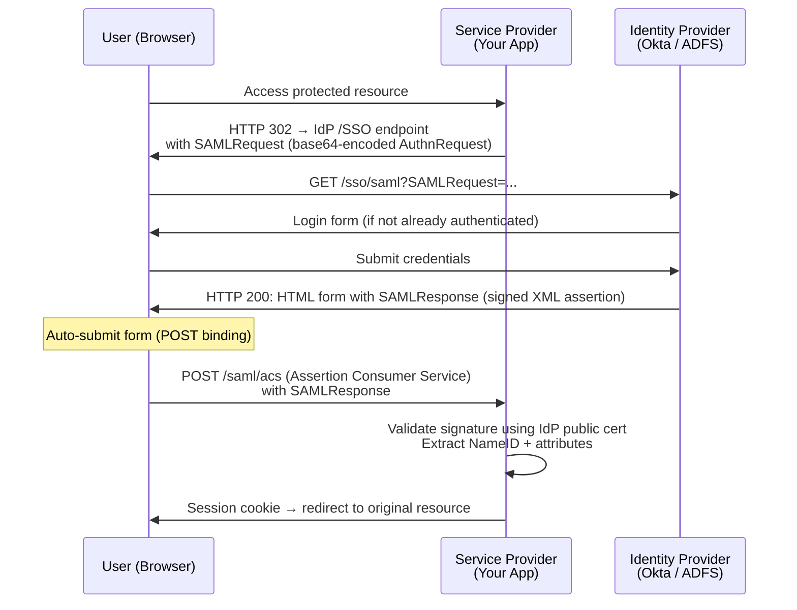

# Authentication & Authorization
{: .no_toc }

<details open markdown="block">
  <summary>Table of Contents</summary>
  {: .text-delta }
1. TOC
{:toc}
</details>

Authentication (AuthN) proves identity — "who are you?" Authorization (AuthZ) enforces access — "what are you allowed to do?" Conflating these two concerns is one of the most common security design mistakes. This page covers the Zero Trust model that frames both, then the concrete mechanisms: RBAC/ABAC for authorization decisions, Keycloak for identity brokering, LDAP for enterprise directory integration, and SAML 2.0 for enterprise SSO federation.

---

## Zero Trust Architecture

### The Problem with Perimeter Security

Traditional "castle-and-moat" security assumes that anything inside the corporate network is trusted. Once an attacker breaches the perimeter (via phishing, a compromised VPN credential, or a rogue insider), they can move laterally to any internal resource with little resistance.

Zero Trust inverts this assumption: **never trust, always verify** — regardless of whether the request originates inside or outside the corporate network.

```
Castle-and-moat:                    Zero Trust:
                                    
  ┌─────────────────────────────┐   Every request must present:
  │  Trusted internal network   │     - Valid identity (mTLS cert or JWT)
  │  ┌──────┐  ┌──────┐        │     - Valid device posture (MDM enrollment)
  │  │Svc A │→ │Svc B │        │     - Scoped authorization claim
  │  └──────┘  └──────┘        │     - Shortest-lived credential possible
  └─────────────────────────────┘
  
  Breach perimeter once → own everything.
```

### Zero Trust Pillars

| Pillar | What it controls | Mechanism |
|:-------|:----------------|:----------|
| **Identity** | Users and service accounts | MFA, SSO, mTLS certs, short-lived JWTs |
| **Device** | Endpoint trust posture | MDM enrollment, certificate attestation |
| **Network** | Lateral movement | Micro-segmentation, service mesh (Istio mTLS) |
| **Application** | Per-request authorization | OAuth 2.0 scopes, RBAC/ABAC |
| **Data** | Data classification | Encryption at rest, DLP, column-level access control |

### BeyondCorp (Google's Zero Trust Implementation)

Google replaced VPN-based access in 2014 with BeyondCorp. Access decisions are made by a policy engine that evaluates:

1. **Who** is making the request (corporate SSO identity)
2. **What device** they're using (certificate enrolled in fleet management)
3. **What they want** (specific application, specific action)

If all three satisfy the policy, the request is allowed — with no dependency on whether they're in a Google office or a coffee shop.

**Application to microservices:** Every service-to-service call uses mTLS. The certificate identifies the calling service. An authorization policy (OPA, Istio, or Spring Security) decides if service A is allowed to call endpoint B. Network topology is irrelevant.

### mTLS for Service-to-Service Authentication

```java
// Spring Boot: configure client certificate authentication
// In a service mesh (Istio/Linkerd), mTLS is injected automatically via sidecar proxy.
// For direct mTLS without a service mesh:

@Configuration
public class MtlsClientConfig {

    @Bean
    public RestTemplate mtlsRestTemplate(
            @Value("${tls.key-store}") Resource keyStore,
            @Value("${tls.key-store-password}") String keyStorePassword,
            @Value("${tls.trust-store}") Resource trustStore,
            @Value("${tls.trust-store-password}") String trustStorePassword) throws Exception {

        SSLContext sslContext = SSLContextBuilder.create()
            .loadKeyMaterial(keyStore.getFile(), keyStorePassword.toCharArray(), keyStorePassword.toCharArray())
            .loadTrustMaterial(trustStore.getFile(), trustStorePassword.toCharArray())
            .build();

        HttpClient client = HttpClients.custom()
            .setSSLContext(sslContext)
            .build();

        return new RestTemplate(new HttpComponentsClientHttpRequestFactory(client));
    }
}
```

```yaml
# application.yml: server-side: require client certificate
server:
  ssl:
    enabled: true
    key-store: classpath:server-keystore.p12
    key-store-password: ${TLS_KEYSTORE_PASSWORD}
    key-store-type: PKCS12
    client-auth: need          # require client cert
    trust-store: classpath:client-truststore.p12
    trust-store-password: ${TLS_TRUSTSTORE_PASSWORD}
```

---

## RBAC vs ABAC

### Role-Based Access Control (RBAC)

RBAC assigns permissions to roles, and roles to users. It is simple, auditable, and well-understood — the right choice for most systems.

```
User → Role → Permission
alice → ADMIN → [READ_USERS, WRITE_USERS, DELETE_USERS]
bob   → VIEWER → [READ_USERS]
```

```java
// Spring Security: method-level RBAC with @PreAuthorize
@RestController
@RequestMapping("/users")
public class UserController {

    @GetMapping
    @PreAuthorize("hasAnyRole('ADMIN', 'VIEWER')")
    public List<UserDto> listUsers() { ... }

    @DeleteMapping("/{id}")
    @PreAuthorize("hasRole('ADMIN')")
    public void deleteUser(@PathVariable Long id) { ... }
}
```

```java
// Enable method security globally
@Configuration
@EnableMethodSecurity   // replaces @EnableGlobalMethodSecurity in Spring Security 6+
public class SecurityConfig {

    @Bean
    public SecurityFilterChain filterChain(HttpSecurity http) throws Exception {
        return http
            .authorizeHttpRequests(auth -> auth
                .requestMatchers("/actuator/health").permitAll()
                .anyRequest().authenticated()
            )
            .oauth2ResourceServer(oauth2 -> oauth2.jwt(Customizer.withDefaults()))
            .build();
    }
}
```

**RBAC limitation:** Role explosion. When you have 50 departments × 10 resource types × 5 action types = 2,500 roles to manage. RBAC also cannot express context-sensitive rules like "a manager can only view reports for their own department."

### Attribute-Based Access Control (ABAC)

ABAC evaluates a policy against attributes of the **subject** (user), **resource** (data), and **environment** (time, location).

```
Policy: ALLOW if user.department == resource.department AND user.role == MANAGER
```

This single policy replaces 50 department-specific roles.

```java
// ABAC via Spring Security SpEL expression calling a custom policy bean
@PreAuthorize("@reportPolicy.canView(authentication, #reportId)")
public Report getReport(@PathVariable Long reportId) { ... }

@Component("reportPolicy")
public class ReportPolicy {

    private final ReportRepository reportRepository;
    private final UserRepository userRepository;

    public boolean canView(Authentication auth, Long reportId) {
        String username = auth.getName();
        User user = userRepository.findByUsername(username);
        Report report = reportRepository.findById(reportId).orElseThrow();

        // Business rule: managers can see their department's reports; admins see all
        if (auth.getAuthorities().stream().anyMatch(a -> a.getAuthority().equals("ROLE_ADMIN"))) {
            return true;
        }
        return user.getDepartmentId().equals(report.getDepartmentId())
            && auth.getAuthorities().stream().anyMatch(a -> a.getAuthority().equals("ROLE_MANAGER"));
    }
}
```

### Open Policy Agent (OPA) for Externalized ABAC

For complex policies spanning multiple services, externalizing authorization to OPA decouples policy logic from application code. Services call OPA's REST API for authorization decisions.

```rego
# policy.rego: Rego language (OPA's policy language)
package orders.authz

default allow = false

# Allow: user is the order owner
allow {
    input.user.id == input.resource.ownerId
}

# Allow: user has admin role
allow {
    input.user.roles[_] == "ADMIN"
}

# Allow: support agents can read (not write) any order
allow {
    input.user.roles[_] == "SUPPORT"
    input.action == "READ"
}
```

```java
// Call OPA from Spring Security for authorization decisions
@Component
public class OpaAuthorizationManager implements AuthorizationManager<RequestAuthorizationContext> {

    private final RestTemplate restTemplate;

    @Override
    public AuthorizationDecision check(Supplier<Authentication> auth,
                                        RequestAuthorizationContext context) {
        Map<String, Object> input = Map.of(
            "user", Map.of("id", getUserId(auth.get()), "roles", getRoles(auth.get())),
            "action", context.getRequest().getMethod(),
            "resource", context.getRequest().getRequestURI()
        );

        Map<String, Object> response = restTemplate.postForObject(
            "http://opa-service:8181/v1/data/orders/authz/allow",
            Map.of("input", input),
            Map.class
        );

        boolean allowed = Boolean.TRUE.equals(((Map<?, ?>) response.get("result")).get("result"));
        return new AuthorizationDecision(allowed);
    }
}
```

| Aspect | RBAC | ABAC |
|:-------|:-----|:-----|
| Complexity | Low | High |
| Flexibility | Medium (role explosion for fine-grained) | High (arbitrary policy attributes) |
| Auditability | Simple (user→role mapping) | Harder (policy evaluation trace) |
| Performance | Fast (cache roles from JWT) | Slower (policy evaluation per request) |
| Use case | Most business applications | Regulatory, multi-tenant, context-sensitive access |

---

## Keycloak

Keycloak is an open-source Identity and Access Management (IAM) server that provides: SSO, OAuth 2.0 / OIDC, SAML 2.0, user federation (LDAP/AD), social login, and an admin console.

### Core Concepts

```
Realm:    Isolated namespace — contains its own users, clients, roles, groups
Client:   A registered application (Spring Boot service, React SPA, CLI tool)
User:     A person or service account with credentials
Role:     Assigned to users or groups — flows into JWT claims
Group:    Hierarchical user groupings for bulk role assignment
```

### Spring Boot Resource Server with Keycloak

```yaml
# application.yml
spring:
  security:
    oauth2:
      resourceserver:
        jwt:
          # Keycloak publishes JWKS at this endpoint; Spring auto-fetches and caches keys
          jwk-set-uri: http://keycloak:8080/realms/my-realm/protocol/openid-connect/certs

keycloak:
  realm: my-realm
  auth-server-url: http://keycloak:8080
  resource: order-service
```

```java
@Configuration
@EnableMethodSecurity
public class SecurityConfig {

    @Bean
    public SecurityFilterChain filterChain(HttpSecurity http) throws Exception {
        return http
            .csrf(csrf -> csrf.disable())   // stateless REST API; CSRF not needed
            .sessionManagement(s -> s.sessionCreationPolicy(SessionCreationPolicy.STATELESS))
            .authorizeHttpRequests(auth -> auth
                .requestMatchers("/actuator/health", "/actuator/info").permitAll()
                .anyRequest().authenticated()
            )
            .oauth2ResourceServer(oauth2 -> oauth2
                .jwt(jwt -> jwt.jwtAuthenticationConverter(keycloakJwtConverter()))
            )
            .build();
    }

    @Bean
    public JwtAuthenticationConverter keycloakJwtConverter() {
        // Keycloak encodes roles at realm_access.roles[] in the JWT — not in the standard
        // Spring Security "scope" claim. This converter maps them to GrantedAuthority objects.
        JwtGrantedAuthoritiesConverter converter = new JwtGrantedAuthoritiesConverter();
        converter.setAuthoritiesClaimName("realm_access.roles");
        converter.setAuthorityPrefix("ROLE_");

        JwtAuthenticationConverter jwtConverter = new JwtAuthenticationConverter();
        jwtConverter.setJwtGrantedAuthoritiesConverter(converter);
        return jwtConverter;
    }
}
```

```java
// Decoded Keycloak JWT payload (abbreviated)
// {
//   "exp": 1746000000,
//   "iat": 1745996400,
//   "sub": "a1b2c3d4-...",        // user UUID
//   "preferred_username": "alice",
//   "email": "alice@example.com",
//   "realm_access": {
//     "roles": ["ORDER_ADMIN", "user", "offline_access"]
//   },
//   "resource_access": {
//     "order-service": {
//       "roles": ["order:write"]   // client-specific roles
//     }
//   }
// }
```

### Service Account (Machine-to-Machine) Authentication

For service-to-service calls, use the OAuth 2.0 **Client Credentials** flow: no user involved, the service authenticates as itself.

```java
@Configuration
public class M2mTokenConfig {

    @Bean
    public OAuth2AuthorizedClientManager authorizedClientManager(
            ClientRegistrationRepository clientRegistrationRepository,
            OAuth2AuthorizedClientRepository authorizedClientRepository) {

        OAuth2AuthorizedClientProvider provider =
            OAuth2AuthorizedClientProviderBuilder.builder()
                .clientCredentials()
                .build();

        DefaultOAuth2AuthorizedClientManager manager =
            new DefaultOAuth2AuthorizedClientManager(clientRegistrationRepository, authorizedClientRepository);
        manager.setAuthorizedClientProvider(provider);
        return manager;
    }

    @Bean
    public WebClient orderServiceClient(OAuth2AuthorizedClientManager authorizedClientManager) {
        // Automatically fetches and caches the access token; refreshes before expiry
        ServletOAuth2AuthorizedClientExchangeFilterFunction oauth2 =
            new ServletOAuth2AuthorizedClientExchangeFilterFunction(authorizedClientManager);
        oauth2.setDefaultClientRegistrationId("inventory-service");

        return WebClient.builder()
            .apply(oauth2.oauth2Configuration())
            .baseUrl("http://inventory-service")
            .build();
    }
}
```

```yaml
# application.yml: register the client credentials client
spring:
  security:
    oauth2:
      client:
        registration:
          inventory-service:
            client-id: order-service
            client-secret: ${KEYCLOAK_CLIENT_SECRET}
            authorization-grant-type: client_credentials
            scope: inventory:read
        provider:
          inventory-service:
            token-uri: http://keycloak:8080/realms/my-realm/protocol/openid-connect/token
```

---

## LDAP / Active Directory

LDAP (Lightweight Directory Access Protocol) is the standard protocol for querying enterprise identity stores. Active Directory (Microsoft) is the dominant LDAP-compatible directory. Most enterprises use one as the authoritative source of user identity.

### Authentication Modes

**Bind authentication:** The application attempts to bind (authenticate) to the LDAP server as the user, using the provided credentials. If the bind succeeds, authentication succeeds. No password comparison in application code.

**Search + compare:** The application first searches for the user's DN (Distinguished Name), then compares the provided password against the stored hash. Requires a service account with search privileges.

### Spring Security LDAP

```xml
<!-- pom.xml -->
<dependency>
    <groupId>org.springframework.security</groupId>
    <artifactId>spring-security-ldap</artifactId>
</dependency>
<dependency>
    <groupId>com.unboundid</groupId>
    <artifactId>unboundid-ldapsdk</artifactId>   <!-- embedded LDAP for testing -->
</dependency>
```

```java
@Configuration
@EnableWebSecurity
public class LdapSecurityConfig {

    @Bean
    public SecurityFilterChain filterChain(HttpSecurity http) throws Exception {
        return http
            .authorizeHttpRequests(auth -> auth.anyRequest().authenticated())
            .formLogin(Customizer.withDefaults())
            .build();
    }

    @Bean
    public AuthenticationManager authenticationManager(HttpSecurity http) throws Exception {
        LdapAuthenticationProviderConfigurer<AuthenticationManagerBuilder> ldap =
            http.getSharedObject(AuthenticationManagerBuilder.class)
                .ldapAuthentication();

        return ldap
            // Search for user DN: uid=<username>,ou=people,dc=example,dc=com
            .userDnPatterns("uid={0},ou=people")
            .groupSearchBase("ou=groups")
            .contextSource()
                .url("ldap://ldap.example.com:389/dc=example,dc=com")
                .managerDn("cn=service-account,dc=example,dc=com")
                .managerPassword("${LDAP_SERVICE_PASSWORD}")
                .and()
            // Use PBKDF2 password encoder to compare stored hash
            .passwordCompare()
                .passwordEncoder(new BCryptPasswordEncoder())
                .passwordAttribute("userPassword")
                .and()
            .and()
            .build();
    }
}
```

### LDAP Group → Spring Role Mapping

```java
// Map LDAP groups to Spring Security roles
ldap
    .groupSearchBase("ou=groups")
    .groupSearchFilter("member={0}")         // group has 'member' attribute = user DN
    .groupRoleAttribute("cn")               // group name becomes the role
    .rolePrefix("ROLE_");

// LDAP group cn=ORDER_ADMIN → Spring role ROLE_ORDER_ADMIN
```

---

## SAML 2.0

SAML (Security Assertion Markup Language) 2.0 is the standard for enterprise SSO federation, dominant in environments using Active Directory Federation Services (ADFS), Okta, or Ping Identity. It predates OAuth 2.0/OIDC and is more complex, but remains ubiquitous in B2B SaaS and enterprise applications.

### Parties and Flow



### SAML Assertion (XML)

```xml
<!-- SAMLResponse contains a signed assertion with identity claims -->
<saml:Assertion>
  <saml:Subject>
    <saml:NameID Format="urn:oasis:names:tc:SAML:1.1:nameid-format:emailAddress">
      alice@example.com
    </saml:NameID>
  </saml:Subject>
  <saml:Conditions NotBefore="2026-05-02T10:00:00Z"
                   NotOnOrAfter="2026-05-02T10:05:00Z">
    <!-- 5-minute assertion window — replay protection -->
    <saml:AudienceRestriction>
      <saml:Audience>https://myapp.example.com</saml:Audience>
    </saml:AudienceRestriction>
  </saml:Conditions>
  <saml:AttributeStatement>
    <saml:Attribute Name="groups">
      <saml:AttributeValue>ORDER_ADMIN</saml:AttributeValue>
      <saml:AttributeValue>FINANCE_VIEWER</saml:AttributeValue>
    </saml:Attribute>
  </saml:AttributeStatement>
  <!-- Entire assertion signed with IdP private key; SP validates with IdP public cert -->
  <ds:Signature>...</ds:Signature>
</saml:Assertion>
```

### Spring Security SAML2

```xml
<!-- pom.xml -->
<dependency>
    <groupId>org.springframework.security</groupId>
    <artifactId>spring-security-saml2-service-provider</artifactId>
</dependency>
```

```yaml
# application.yml
spring:
  security:
    saml2:
      relyingparty:
        registration:
          okta:
            # SP entity ID — must match what's registered in the IdP
            entity-id: "https://myapp.example.com/saml/metadata"
            acs:
              location: "https://myapp.example.com/login/saml2/sso/okta"
            assertingparty:
              metadata-uri: "https://mycompany.okta.com/app/abc123/sso/saml/metadata"
              # Spring fetches and caches IdP metadata (entity ID, SSO URL, certificate)
```

```java
@Configuration
@EnableWebSecurity
public class SamlSecurityConfig {

    @Bean
    public SecurityFilterChain filterChain(HttpSecurity http) throws Exception {
        return http
            .authorizeHttpRequests(auth -> auth
                .requestMatchers("/public/**").permitAll()
                .anyRequest().authenticated()
            )
            .saml2Login(saml2 -> saml2
                .loginPage("/login")
                .defaultSuccessUrl("/dashboard")
            )
            .saml2Logout(Customizer.withDefaults())  // Single Logout (SLO)
            .build();
    }
}
```

### SAML vs OIDC — When to Use Each

| Factor | SAML 2.0 | OIDC / OAuth 2.0 |
|:-------|:---------|:-----------------|
| Standard age | 2005 (XML-based) | 2014 (JSON/JWT-based) |
| Dominant in | Enterprise B2B, ADFS, legacy SSO | Modern web/mobile, cloud-native |
| Token format | Signed XML assertion | JWT |
| Mobile/SPA support | Poor (requires browser redirect + form POST) | Excellent (PKCE, authorization code) |
| SSO logout | Single Logout (SLO) via redirects | Session management spec (less mature) |
| Use SAML when | IdP is ADFS, Okta SAML-only, or enterprise mandates it | Building new systems — always prefer OIDC |

---

## Key Takeaways for Interviews

1. **Zero Trust is an architectural philosophy, not a product.** The implementation is: every request carries a verifiable identity claim (JWT, mTLS cert), every service validates it, and no resource trusts the network location alone.
2. **AuthN and AuthZ are separate concerns.** Keycloak (or any IdP) handles AuthN — proving who you are. Spring Security's `@PreAuthorize` / OPA handles AuthZ — deciding what you can do.
3. **RBAC is almost always the right starting point.** Switch to ABAC only when you hit the role explosion wall or need context-sensitive policies (department isolation, time-of-day restrictions).
4. **Keycloak's JWT encodes roles at `realm_access.roles`**, not the OAuth 2.0 `scope` claim. Spring Security's default converter doesn't know this — always configure a custom `JwtGrantedAuthoritiesConverter`.
5. **Service-to-service calls must authenticate too.** Client Credentials flow is the correct OAuth 2.0 grant for machine-to-machine — the service authenticates as itself, no user involved.
6. **LDAP bind authentication is more secure than password-compare.** The application never sees or compares the password — it delegates the credential verification entirely to the directory server.
7. **SAML is mandatory in enterprise B2B.** Learn the SP-initiated flow and understand assertion replay protection (5-minute `NotOnOrAfter` window, audience restriction) — these are the failure modes.

---

## References

- [Spring Security Reference: Method Security](https://docs.spring.io/spring-security/reference/servlet/authorization/method-security.html)
- [Spring Security Reference: SAML 2.0](https://docs.spring.io/spring-security/reference/servlet/saml2/index.html)
- [Spring Security Reference: OAuth2 Resource Server](https://docs.spring.io/spring-security/reference/servlet/oauth2/resource-server/index.html)
- [Keycloak Documentation](https://www.keycloak.org/documentation)
- [NIST SP 800-207: Zero Trust Architecture](https://doi.org/10.6028/NIST.SP.800-207)
- [Open Policy Agent Documentation](https://www.openpolicyagent.org/docs/latest/)
- *The Web Application Hacker's Handbook* — Dafydd Stuttard, Marcus Pinto
