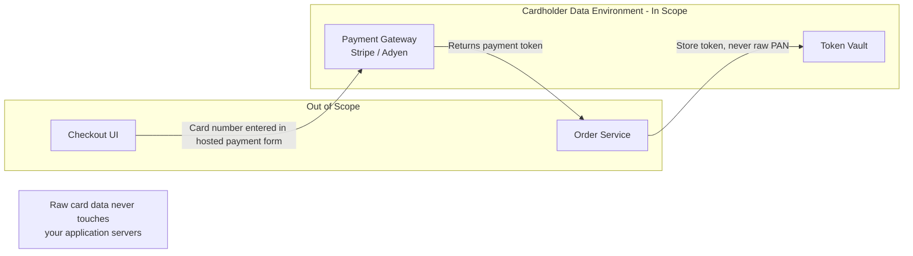

# Compliance & Data Privacy
{: .no_toc }

<details open markdown="block">
  <summary>Table of Contents</summary>
  {: .text-delta }
1. TOC
{:toc}
</details>

Compliance frameworks impose legal obligations on how systems collect, store, process, and delete data. GDPR governs EU personal data globally. HIPAA governs US healthcare data. PCI-DSS governs cardholder data for anyone processing payments. Violating these is not a theoretical risk — GDPR fines can reach 4% of global annual revenue. Understanding these requirements shapes architecture decisions: where data lives, how long it is retained, how it is masked, and how it can be deleted.

---

## GDPR

The General Data Protection Regulation (EU 2016/679) applies to **any organization that processes personal data of EU residents**, regardless of where the organization is based. A US company serving EU users is subject to GDPR.

### Key Definitions

| Term | Definition |
|:-----|:-----------|
| **Personal Data** | Any information relating to an identified or identifiable natural person — name, email, IP address, location, cookie IDs |
| **Data Subject** | The individual whose data is being processed |
| **Controller** | The organization that determines why and how data is processed |
| **Processor** | A third party that processes data on behalf of the controller (e.g., your cloud provider, email SaaS) |
| **Processing** | Any operation on personal data: collection, storage, use, transmission, deletion |

### Lawful Bases for Processing

Every processing activity needs a legal basis. The six lawful bases are:

1. **Consent** — explicit, informed, freely given, and revocable
2. **Contract** — processing necessary to fulfil a contract with the data subject
3. **Legal obligation** — required by law (e.g., tax records)
4. **Vital interests** — protecting someone's life
5. **Public task** — public authority exercising official authority
6. **Legitimate interests** — controller's interests, balanced against the data subject's rights

Most commercial applications rely on **consent** (marketing, analytics) or **contract** (account management, order fulfillment).

### Data Subject Rights

| Right | What the System Must Support | Deadline |
|:------|:----------------------------|:---------|
| **Right of access** | Export all personal data for a user on request | 30 days |
| **Right to rectification** | Correct inaccurate data | 30 days |
| **Right to erasure** ("right to be forgotten") | Delete personal data on request | 30 days |
| **Right to portability** | Export data in machine-readable format (JSON/CSV) | 30 days |
| **Right to restriction** | Stop processing (but keep data) while a dispute is resolved | Immediate |
| **Right to object** | Opt out of processing based on legitimate interests or marketing | Immediate |

### Right to Erasure — Architecture Challenge

Erasure is straightforward in a simple CRUD database: `DELETE FROM users WHERE id = ?`. It becomes complex in distributed systems.

**Challenge 1 — Event Sourcing:**  
An event log is immutable. You cannot delete the `UserCreated` event containing `{name: "Alice", email: "alice@example.com"}`.

**Solution: Cryptographic Erasure**

```java
// Store personal data encrypted with a per-user key (the "crypto-shred key").
// On erasure: delete the key from KMS. The encrypted events become undecipherable garbage.

@Service
public class CryptoShreddingService {

    private final KmsClient kmsClient;
    private final UserKeyRepository userKeyRepository;  // maps userId → KMS key ARN

    public String encryptUserField(Long userId, String plaintext) {
        String keyArn = getUserKey(userId);
        EncryptResponse resp = kmsClient.encrypt(r -> r
            .keyId(keyArn)
            .plaintext(SdkBytes.fromString(plaintext, StandardCharsets.UTF_8))
        );
        return Base64.encode(resp.ciphertextBlob().asByteArray());
    }

    public void eraseUser(Long userId) {
        String keyArn = userKeyRepository.findByUserId(userId).orElseThrow().getKeyArn();
        // Schedule key deletion in KMS (7–30 day pending window)
        kmsClient.scheduleKeyDeletion(r -> r
            .keyId(keyArn)
            .pendingWindowInDays(7)
        );
        // Remove key mapping — the user's encrypted fields in event log are now unreadable
        userKeyRepository.deleteByUserId(userId);
    }
}
```

**Challenge 2 — Backups:**  
Backups contain historical personal data. GDPR does not require re-processing all backups on every erasure request, provided:
- Backups are not actively queried or used for the user's profile
- The data is genuinely isolated from operational processing
- Backups are deleted on schedule (retain backups for X days max)

**Challenge 3 — Downstream systems (analytics, data warehouse):**  
Personal data propagated to analytics pipelines must also be erased. Options:
- **Data segregation:** Never send raw personal data to analytics — send only pseudonymized or aggregated data from the start
- **Delete propagation:** Publish a `UserErased` event; all consumers must handle it (delete, mask, or ignore the affected records)

### PII in Logs

Logs frequently contain personal data inadvertently: email addresses in error messages, IP addresses, payment amounts, request/response bodies.

```java
// Logback: mask PII patterns in log output using a custom converter

public class PiiMaskingConverter extends ClassicConverter {

    private static final Pattern EMAIL_PATTERN = Pattern.compile(
        "[a-zA-Z0-9._%+\\-]+@[a-zA-Z0-9.\\-]+\\.[a-zA-Z]{2,}"
    );
    private static final Pattern CARD_PATTERN = Pattern.compile(
        "\\b(?:\\d[ -]?){13,16}\\b"
    );
    private static final Pattern IP_PATTERN = Pattern.compile(
        "\\b(?:\\d{1,3}\\.){3}\\d{1,3}\\b"
    );

    @Override
    public String convert(ILoggingEvent event) {
        String message = event.getFormattedMessage();
        message = EMAIL_PATTERN.matcher(message).replaceAll("***@***.***");
        message = CARD_PATTERN.matcher(message).replaceAll("[CARD-MASKED]");
        message = IP_PATTERN.matcher(message).replaceAll("[IP-MASKED]");
        return message;
    }
}
```

```xml
<!-- logback-spring.xml: register the custom converter -->
<conversionRule conversionWord="maskedMsg" converterClass="com.example.PiiMaskingConverter"/>

<encoder>
    <pattern>%d{ISO8601} [%thread] %-5level %logger{36} - %maskedMsg%n</pattern>
</encoder>
```

**What must never appear in logs:**
- Passwords and secrets (even hashed)
- Full credit card numbers (PAN)
- Social Security Numbers (SSN) / National ID numbers
- Full authentication tokens (JWT, API keys) — log only the first 8 characters
- Precise geolocation
- Medical diagnoses

### Data Residency

GDPR restricts transferring personal data outside the EU/EEA unless the destination country has "adequate protection" or appropriate safeguards (Standard Contractual Clauses, Binding Corporate Rules).

**Architecture implication:** EU user data must stay in EU AWS regions. Route EU traffic to `eu-west-1` / `eu-central-1`. Partition multi-region deployments by data residency zones.

```yaml
# Example: Kafka producer routing EU events to EU-region broker
@Bean
public ProducerFactory<String, Object> euProducerFactory() {
    return new DefaultKafkaProducerFactory<>(Map.of(
        ProducerConfig.BOOTSTRAP_SERVERS_CONFIG, "kafka.eu-west-1.internal:9092",
        ProducerConfig.KEY_SERIALIZER_CLASS_CONFIG, StringSerializer.class,
        ProducerConfig.VALUE_SERIALIZER_CLASS_CONFIG, JsonSerializer.class
    ));
}
```

---

## HIPAA

The Health Insurance Portability and Accountability Act (1996) governs Protected Health Information (PHI) in the United States. It applies to Covered Entities (healthcare providers, health plans, clearinghouses) and their Business Associates (cloud providers, SaaS tools that process PHI).

### Protected Health Information (PHI)

PHI is any health information that could identify an individual. The 18 HIPAA identifiers include:
- Name, address, dates (birth, admission, discharge)
- Phone, fax, email, SSN, medical record number, account number
- IP address, device identifier, photograph, biometrics
- Any other unique identifier

**De-identification removes the legal protection obligation.** Two methods:
1. **Expert determination** — a statistician certifies the risk of re-identification is very small
2. **Safe Harbor** — remove all 18 identifiers and geographic data smaller than state level

### HIPAA Technical Safeguards

| Safeguard | Requirement | Implementation |
|:----------|:-----------|:---------------|
| **Access control** | Only authorized users access PHI | RBAC with audit log; MFA for administrative access |
| **Audit controls** | Record who accessed, modified, or deleted PHI | Immutable audit log (append-only table or CloudTrail) |
| **Integrity** | PHI not altered or destroyed improperly | Digital signatures; checksums; version history |
| **Transmission security** | PHI encrypted in transit | TLS 1.2+ on all API connections; no PHI in URL query strings |
| **Encryption at rest** | PHI encrypted on storage | AES-256; KMS for key management |

```java
// Immutable HIPAA audit log — every PHI access recorded
@Aspect
@Component
public class PhiAuditAspect {

    private final AuditLogRepository auditLog;

    @Around("@annotation(PhiAccess)")
    public Object auditPhiAccess(ProceedingJoinPoint pjp) throws Throwable {
        String user = SecurityContextHolder.getContext().getAuthentication().getName();
        String method = pjp.getSignature().toShortString();
        Instant accessTime = Instant.now();

        Object result = pjp.proceed();

        // Append-only insert; no UPDATE/DELETE on audit_log table
        auditLog.save(PhiAuditEntry.builder()
            .userId(user)
            .action(method)
            .accessedAt(accessTime)
            .build());

        return result;
    }
}

// Annotation to mark PHI-accessing methods
@Target(ElementType.METHOD)
@Retention(RetentionPolicy.RUNTIME)
public @interface PhiAccess {}

// Usage:
@PhiAccess
public PatientRecord getPatientRecord(Long patientId) { ... }
```

### Business Associate Agreements (BAA)

Any vendor that processes PHI on behalf of a covered entity must sign a BAA — a contract specifying how they will protect the data. AWS, GCP, Azure, and most major SaaS providers offer BAAs for their HIPAA-eligible services (not all services in the portfolio are covered — verify the eligible services list).

---

## PCI-DSS

The Payment Card Industry Data Security Standard governs organizations that process, store, or transmit cardholder data (credit/debit card numbers and associated data). Non-compliance results in fines, increased transaction fees, or loss of the ability to process card payments.

### 12 PCI-DSS Requirements (v4.0)

| Domain | Requirements | Key Controls |
|:-------|:-------------|:-------------|
| **Build and maintain secure network** | 1, 2 | Firewalls; no vendor default passwords |
| **Protect cardholder data** | 3, 4 | Encrypt stored PAN; TLS for transmission |
| **Maintain vulnerability management** | 5, 6 | Anti-malware; patch management; secure SDLC |
| **Strong access control** | 7, 8, 9 | Need-to-know access; MFA; physical access control |
| **Monitor and test networks** | 10, 11 | Audit logs; vulnerability scans; penetration testing |
| **Maintain information security policy** | 12 | Security policy; incident response plan |

### Cardholder Data Environment (CDE)

The CDE is the systems that store, process, or transmit cardholder data. The primary objective of PCI-DSS architecture is to **minimize the CDE scope** — fewer systems in scope means less compliance overhead and reduced attack surface.



**Best practice: Use a hosted payment form** (Stripe Elements, Adyen Drop-in). The card number is entered directly in an iframe hosted by the payment provider. Your servers never receive the raw PAN — only a token. This takes your application entirely out of CDE scope.

### Tokenization vs Encryption

Both are used to protect PAN (Primary Account Number — the 16-digit card number), but they serve different purposes:

| Aspect | Tokenization | Encryption |
|:-------|:-------------|:-----------|
| Transformation | PAN → opaque token (no mathematical relationship) | PAN → ciphertext (mathematically reversible with key) |
| Reversal | Only by the token vault (external lookup) | By anyone with the key |
| PAN retrievable? | Only by token vault; your app never needs original PAN again | Yes — with the decryption key |
| PCI scope | Token vault is in scope; systems storing tokens are not | Key holder is in scope |
| Use case | Store for future charges (subscriptions, saved cards) | Transmit PAN between systems that legitimately need it |

```java
// Tokenization: exchange PAN for a token at the payment provider
// Your application stores the token, not the PAN
@Service
public class PaymentService {

    private final StripeClient stripeClient;

    public String tokenizeCard(CardDetails card) {
        // The Stripe SDK makes a server-side API call to exchange card details for a token
        // Your server sends card data directly to Stripe; Stripe returns a PaymentMethod ID
        PaymentMethod paymentMethod = stripeClient.paymentMethods().create(
            PaymentMethodCreateParams.builder()
                .setType(PaymentMethodCreateParams.Type.CARD)
                .setCard(PaymentMethodCreateParams.Card.builder()
                    .setNumber(card.getNumber())      // PAN only exists here, in transit to Stripe
                    .setExpMonth(card.getExpMonth())
                    .setExpYear(card.getExpYear())
                    .setCvc(card.getCvc())
                    .build())
                .build()
        );
        return paymentMethod.getId();   // pm_1Abc... — store this token, never the raw PAN
    }

    public void chargeStoredCard(String customerId, String paymentMethodId, long amountCents) {
        // Future charge using only the token — PAN never touches your system again
        stripeClient.paymentIntents().create(
            PaymentIntentCreateParams.builder()
                .setAmount(amountCents)
                .setCurrency("usd")
                .setCustomer(customerId)
                .setPaymentMethod(paymentMethodId)
                .setConfirm(true)
                .build()
        );
    }
}
```

### PAN Masking

When a card number must be displayed (receipts, UI, logs), show only the last 4 digits:

```java
public static String maskPan(String pan) {
    if (pan == null || pan.length() < 4) return "****";
    // Replace all but last 4 with asterisks: ************1234
    return "*".repeat(pan.length() - 4) + pan.substring(pan.length() - 4);
}
// "4111111111111111" → "************1111"
```

```java
// Hibernate custom type: transparently mask PAN when serializing to JSON
@JsonSerialize(using = PanMaskSerializer.class)
@Column(name = "card_last_four")
private String cardLastFour;   // Only store the last 4 — never store full PAN in your DB
```

---

## Data Masking

Data masking replaces sensitive data with realistic but fictitious values, enabling use of production-like data in non-production environments without exposing real personal information.

### Static vs Dynamic Masking

| Type | When applied | How | Use case |
|:-----|:-------------|:----|:---------|
| **Static masking** | One-time, at copy time | Extract production data → mask → load into target DB | Dev, QA, UAT environments |
| **Dynamic masking** | At query time, without changing stored data | DB proxy or view intercepts queries and masks results for non-privileged users | Analytics users who don't need raw PII |

### Static Data Masking for Dev Environments

```java
// Masking techniques by data type:

// Email: preserve domain structure for realism
public static String maskEmail(String email) {
    int atIndex = email.indexOf('@');
    if (atIndex <= 0) return "masked@example.com";
    String localPart = email.substring(0, atIndex);
    String domain = email.substring(atIndex);
    // Replace with deterministic hash so the same email always produces the same masked value
    // (referential integrity preserved across related tables)
    String hashed = DigestUtils.sha256Hex(localPart).substring(0, 8);
    return hashed + domain;
}

// Phone number: preserve format, randomize digits
public static String maskPhone(String phone) {
    return phone.replaceAll("\\d(?=\\d{4})", "*");
    // "+1-555-867-5309" → "+1-***-***-5309"
}

// Name: replace with faker data (same index → same name, deterministic)
public static String maskName(String name, long seed) {
    Faker faker = new Faker(new Random(seed));
    return faker.name().fullName();
}

// SSN: replace with obviously fake value (not a real SSN format)
public static String maskSsn(String ssn) {
    return "000-00-0000";
}
```

### Dynamic Data Masking in PostgreSQL

```sql
-- Role-based column masking: only DBA and app service account see real SSN
-- Other roles see masked value

CREATE VIEW v_customers_masked AS
SELECT
    id,
    name,
    email,
    CASE
        WHEN current_user IN ('app_service', 'dba_role')
            THEN ssn
        ELSE regexp_replace(ssn, '\d(?=\d{4})', '*', 'g')  -- mask all but last 4
    END AS ssn,
    created_at
FROM customers;

-- Analytics team uses this view; they never see raw SSNs
GRANT SELECT ON v_customers_masked TO analytics_role;
```

### Data Classification Framework

Before masking anything, classify data by sensitivity:

| Classification | Examples | Controls |
|:--------------|:---------|:---------|
| **Public** | Product names, prices, public docs | No special controls |
| **Internal** | Employee directory, org charts | Access control, no external sharing |
| **Confidential** | Business strategies, financial reports | Encryption, need-to-know access, audit log |
| **Restricted (PII/PHI/PCI)** | SSN, card numbers, medical records | Encryption at rest and in transit, masking, right-to-erasure support, compliance audit |

---

## Key Takeaways for Interviews

1. **GDPR applies globally.** If you process personal data of EU residents, GDPR applies regardless of your company's location. Designing for GDPR compliance is a default requirement for any consumer-facing product.
2. **Erasure in event-sourced systems requires cryptographic erasure, not deletion.** The event log is immutable — but encrypting personal data with a per-user key, then deleting the key, renders the data permanently inaccessible. The ciphertext in the log is effectively garbage.
3. **PII must never appear in logs.** Email addresses, IP addresses, and payment information in log files violate GDPR and PCI-DSS and are extremely difficult to retroactively erase from distributed log aggregation pipelines.
4. **The primary PCI-DSS strategy is minimizing CDE scope.** Use a hosted payment form (Stripe Elements, Adyen Drop-in) so your servers never touch raw PAN. Systems storing only tokens (not PANs) are outside CDE scope.
5. **Tokenization is not encryption.** A token has no mathematical relationship to the original PAN — it is a lookup key to the token vault. Only the vault can retrieve the PAN. Encryption is reversible by anyone with the key.
6. **HIPAA requires immutable audit logs.** Every access to PHI must be recorded with who, what, and when. Use append-only tables or an audit-specific write-once service — not a regular table that could be `UPDATE`-d or `DELETE`-d.
7. **Data masking in dev environments prevents accidental production data exposure.** Static masking at copy time is the right control; never copy production PII databases directly to developer laptops or CI environments.

---

## References

- [GDPR Official Text — gdpr-info.eu](https://gdpr-info.eu/)
- [NIST Privacy Framework](https://www.nist.gov/privacy-framework)
- [HHS HIPAA Security Rule](https://www.hhs.gov/hipaa/for-professionals/security/index.html)
- [PCI Security Standards Council — PCI-DSS v4.0](https://www.pcisecuritystandards.org/)
- [Stripe PCI Compliance Guide](https://stripe.com/docs/security/guide)
- [OWASP: Logging Cheat Sheet](https://cheatsheetseries.owasp.org/cheatsheets/Logging_Cheat_Sheet.html)
- *Privacy Engineering* — Ian Oliver (Springer)
