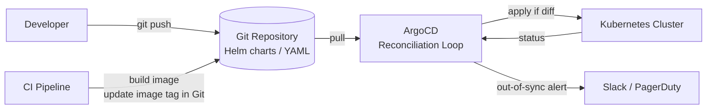

# Cloud Architecture Patterns
{: .no_toc }

<details open markdown="block">
  <summary>Table of Contents</summary>
  {: .text-delta }
1. TOC
{:toc}
</details>

Cloud architecture patterns answer "how should we structure what we build?" rather than "what Kubernetes object do we use?" The Well-Architected Framework gives a structured vocabulary for trade-off discussions. Serverless challenges the assumption that every workload needs a container. Infrastructure as Code makes infrastructure reproducible and auditable. GitOps closes the loop — Git becomes the single source of truth for both application code and the infrastructure it runs on. Container security ensures the workloads themselves are hardened, not just the cluster around them.

---

## AWS Well-Architected Framework

The AWS Well-Architected Framework (and its GCP/Azure equivalents) provides a structured way to evaluate architecture decisions across six pillars. In interviews, use these pillars to demonstrate that you think about trade-offs systematically rather than just picking technologies.

### The Six Pillars

| Pillar | Core Question | Key Trade-off |
|:-------|:-------------|:--------------|
| **Operational Excellence** | Can we run and improve the system reliably? | Automation cost vs manual flexibility |
| **Security** | Are we protecting data and systems appropriately? | Friction added by controls vs risk of not having them |
| **Reliability** | Does the system recover from failures automatically? | Redundancy cost vs availability |
| **Performance Efficiency** | Are we using resources efficiently for the workload? | Optimization complexity vs good-enough simplicity |
| **Cost Optimization** | Are we eliminating waste without sacrificing capability? | Upfront commitment vs pay-as-you-go flexibility |
| **Sustainability** | Are we minimizing environmental impact? | Energy efficiency vs performance |

### Operational Excellence Patterns

```yaml
# Key practices:
# 1. Infrastructure as Code (no manual console changes)
# 2. Observability: metrics, logs, traces from day one
# 3. Runbooks automated as code (Lambda / SSM Automation)
# 4. Deployment automation: zero-touch deploys via CI/CD

# AWS Systems Manager: automated runbook for restarting an unhealthy service
# No SSH required — SSM Agent runs on EC2 instances and executes commands via API
aws ssm send-command \
  --document-name "AWS-RunShellScript" \
  --instance-ids "i-0abc1234" \
  --parameters commands=["systemctl restart order-service"]
```

### Reliability Patterns

| Pattern | Mechanism | AWS Service |
|:--------|:----------|:------------|
| **Multi-AZ** | Redundant resources across availability zones | RDS Multi-AZ, ALB, EKS node groups across AZs |
| **Auto Scaling** | Replace failed instances automatically | EC2 Auto Scaling, EKS node groups, ECS service auto scaling |
| **Circuit Breaker** | Stop cascade failures at the service level | Resilience4j in application code; App Mesh at mesh level |
| **Backup & Restore** | RPO-aligned snapshots | RDS automated backups, EBS snapshots, S3 versioning |
| **Health Checks** | Remove unhealthy instances from rotation | ALB target group health checks, Route 53 health checks |

---

## Serverless

### When Serverless Fits

Serverless (AWS Lambda, Google Cloud Functions, Azure Functions) eliminates server management. The runtime is provisioned per invocation; you pay for execution time only.

**Ideal use cases:**
- Event-driven processing: S3 upload triggers image resizing, DynamoDB stream triggers downstream sync
- Scheduled jobs: nightly data export, weekly report generation
- Webhook handlers: GitHub webhooks, Stripe payment events, low-to-medium RPS
- Glue code: orchestrating SaaS APIs, transforming data between services

**Where serverless fails:**
- **Long-running processes:** Max execution time is 15 minutes (Lambda). Batch jobs that run for hours need ECS Fargate or EC2.
- **High RPS with steady traffic:** Above ~100 RPS, Lambda costs more than containers. At 1,000 RPS sustained, the per-invocation cost dwarfs a reserved container.
- **Warm connection pools:** Lambda functions are stateless. Each invocation may open a new DB connection. RDS Proxy mitigates this but adds latency.
- **Complex local debugging:** Reproducing Lambda execution environments locally requires SAM or LocalStack; standard IDEs don't attach naturally.

### The JVM Cold Start Problem

A Java Lambda function's first invocation after a period of inactivity requires: JVM startup + class loading + Spring context initialization. This can take 1–5 seconds — unacceptable for synchronous user-facing APIs.

```
Lambda lifecycle:
  Cold start (first invocation or after scale-out):
    Download code → Start JVM → Load classes → Init Spring context → Handle request
    ↑ 2–5 seconds for Spring Boot

  Warm invocation (same container reused):
    Handle request only
    ↑ <50ms
```

**Mitigation options:**

```java
// Option 1: AWS Lambda SnapStart (Java 21+)
// Initializes the function once, snapshots the JVM state to S3 (Firecracker microVM snapshot),
// and restores the snapshot on cold starts. Reduces cold start to ~200ms.
// Enable in Lambda configuration: SnapStart = PublishedVersions
// Code must be idempotent at init time — no randomness, no timestamp captures during init

@SpringBootApplication
public class OrderLambdaApplication implements ApplicationRunner {
    // Move all init code to ApplicationRunner.run() (called after snapshot restore)
    // NOT to static blocks or @PostConstruct (called only during snapshot creation)
}
```

```xml
<!-- Option 2: Quarkus Lambda — compile to native image (GraalVM) -->
<!-- Cold start: ~20ms, binary ~50MB -->
<dependency>
    <groupId>io.quarkus</groupId>
    <artifactId>quarkus-amazon-lambda</artifactId>
</dependency>

<!-- Build native image:  mvn package -Pnative -Dquarkus.native.container-build=true -->
```

```yaml
# Option 3: AWS Lambda Provisioned Concurrency
# Pre-warm N function instances; they are always initialized and ready.
# Cost: pay for provisioned concurrency hours regardless of invocations.
ProvisionedConcurrencyConfig:
  ProvisionedConcurrentExecutions: 5   # keep 5 warm instances at all times
```

| Mitigation | Cold start latency | Cost | Complexity |
|:-----------|:-------------------|:-----|:-----------|
| Vanilla Spring Boot | 2–5s | No extra | Low |
| Lambda SnapStart | ~200ms | No extra | Low (annotation + idempotent init) |
| Quarkus native | ~20ms | No extra | High (native build pipeline) |
| Provisioned concurrency | 0ms (always warm) | Pay per warm instance-hour | Low |

### Spring Boot on Lambda (AWS Lambda Web Adapter)

```java
// The AWS Lambda Web Adapter allows running a standard Spring Boot HTTP server as a Lambda.
// Lambda sends HTTP events to the adapter; it proxies to the local server on port 8080.
// No Lambda-specific Handler code needed — existing Spring Boot app runs unchanged.

// Dockerfile for Lambda Web Adapter:
```

```dockerfile
FROM public.ecr.aws/docker/library/amazoncorretto:21-alpine
COPY --from=public.ecr.aws/awsguru/aws-lambda-adapter:0.8.1 /lambda-adapter /opt/extensions/lambda-adapter
ENV PORT=8080
COPY target/order-service.jar /app/order-service.jar
ENTRYPOINT ["java", "-XX:TieredStopAtLevel=1", "-jar", "/app/order-service.jar"]
```

---

## Infrastructure as Code

Infrastructure as Code (IaC) means infrastructure is defined in files, version-controlled in Git, reviewed like application code, and applied via automation — never through the AWS console.

### Terraform

Terraform uses HCL (HashiCorp Configuration Language) to declare infrastructure resources. It maintains a **state file** that maps the declared resources to their actual cloud IDs.

```hcl
# Order service ECS + ALB + RDS infrastructure

terraform {
  required_providers {
    aws = { source = "hashicorp/aws", version = "~> 5.0" }
  }
  # State stored in S3 with DynamoDB locking — never use local state in teams
  backend "s3" {
    bucket         = "my-terraform-state"
    key            = "production/order-service/terraform.tfstate"
    region         = "us-east-1"
    dynamodb_table = "terraform-locks"
    encrypt        = true
  }
}

# ECS Task Definition for Spring Boot order service
resource "aws_ecs_task_definition" "order_service" {
  family                   = "order-service"
  network_mode             = "awsvpc"
  requires_compatibilities = ["FARGATE"]
  cpu                      = "1024"   # 1 vCPU
  memory                   = "2048"   # 2 GB
  execution_role_arn       = aws_iam_role.ecs_execution.arn
  task_role_arn            = aws_iam_role.order_service_task.arn

  container_definitions = jsonencode([{
    name      = "order-service"
    image     = "${aws_ecr_repository.order_service.repository_url}:${var.image_tag}"
    essential = true
    portMappings = [{ containerPort = 8080, protocol = "tcp" }]
    environment = [
      { name = "SPRING_PROFILES_ACTIVE", value = "production" }
    ]
    secrets = [
      { name = "DB_PASSWORD", valueFrom = aws_secretsmanager_secret.db_password.arn }
    ]
    logConfiguration = {
      logDriver = "awslogs"
      options = {
        "awslogs-group"  = aws_cloudwatch_log_group.order_service.name
        "awslogs-region" = "us-east-1"
        "awslogs-stream-prefix" = "order-service"
      }
    }
  }])
}

# Auto Scaling for the ECS service
resource "aws_appautoscaling_policy" "order_service_cpu" {
  name               = "order-service-cpu-scaling"
  policy_type        = "TargetTrackingScaling"
  resource_id        = "service/${aws_ecs_cluster.main.name}/${aws_ecs_service.order_service.name}"
  scalable_dimension = "ecs:service:DesiredCount"
  service_namespace  = "ecs"

  target_tracking_scaling_policy_configuration {
    target_value       = 70.0
    predefined_metric_specification {
      predefined_metric_type = "ECSServiceAverageCPUUtilization"
    }
    scale_in_cooldown  = 300
    scale_out_cooldown = 60
  }
}
```

**Terraform workflow:**

```bash
terraform init       # download providers; configure backend
terraform plan       # preview changes — shows what will be created/modified/destroyed
terraform apply      # apply the plan; modifies real infrastructure
terraform destroy    # tear down all resources (destructive — use with care)
```

### AWS CDK (Cloud Development Kit)

CDK lets you define infrastructure using a general-purpose programming language (Java, Python, TypeScript). The CDK synthesizes CloudFormation templates; you get the full CDK Construct library plus your IDE's type safety and autocompletion.

```java
// CDK Stack: order service infrastructure defined in Java
public class OrderServiceStack extends Stack {

    public OrderServiceStack(final Construct scope, final String id, final StackProps props) {
        super(scope, id, props);

        // VPC with public and private subnets across 3 AZs
        Vpc vpc = Vpc.Builder.create(this, "OrderServiceVpc")
            .maxAzs(3)
            .natGateways(1)
            .build();

        // RDS PostgreSQL instance in private subnet
        DatabaseInstance db = DatabaseInstance.Builder.create(this, "OrderDatabase")
            .engine(DatabaseInstanceEngine.postgres(PostgresInstanceEngineProps.builder()
                .version(PostgresEngineVersion.VER_16_2)
                .build()))
            .instanceType(InstanceType.of(InstanceClass.T4G, InstanceSize.MEDIUM))
            .vpc(vpc)
            .vpcSubnets(SubnetSelection.builder().subnetType(SubnetType.PRIVATE_WITH_EGRESS).build())
            .multiAz(true)
            .storageEncrypted(true)
            .deletionProtection(true)
            .build();

        // ECS Fargate service behind an ALB
        ApplicationLoadBalancedFargateService service =
            ApplicationLoadBalancedFargateService.Builder.create(this, "OrderService")
                .vpc(vpc)
                .cpu(1024)
                .memoryLimitMiB(2048)
                .desiredCount(3)
                .taskImageOptions(ApplicationLoadBalancedTaskImageOptions.builder()
                    .image(ContainerImage.fromEcrRepository(
                        Repository.fromRepositoryName(this, "OrderRepo", "order-service"),
                        imageTag))
                    .containerPort(8080)
                    .environment(Map.of("SPRING_PROFILES_ACTIVE", "production"))
                    .secrets(Map.of("DB_PASSWORD",
                        Secret.fromSecretsManager(db.getSecret(), "password")))
                    .build())
                .build();

        // Grant the ECS task role read access to the DB secret
        db.getSecret().grantRead(service.getTaskDefinition().getTaskRole());
    }
}
```

**Terraform vs CDK:**

| Aspect | Terraform | AWS CDK |
|:-------|:----------|:--------|
| Language | HCL (declarative DSL) | Java/Python/TypeScript |
| Multi-cloud | Excellent — 3,000+ providers | Primarily AWS (CDK for Terraform adds multi-cloud) |
| Type safety | Limited (HCL) | Full IDE support |
| State management | Explicit state file | CloudFormation handles state |
| Learning curve | Moderate | Higher (abstractions hide CloudFormation details) |
| Ecosystem maturity | Mature (10+ years) | Newer but growing fast |
| When to choose | Multi-cloud, ops-heavy teams, existing Terraform investment | AWS-only teams, developers who prefer code over DSL |

---

## GitOps

GitOps extends the Infrastructure as Code principle: **Git is the single source of truth for both application and infrastructure state**. A GitOps agent (ArgoCD, FluxCD) continuously reconciles the cluster against the declared state in Git. If someone `kubectl apply`-s a change directly to production, the agent detects drift and reverts it.



### ArgoCD Application

```yaml
# ArgoCD Application CR: declares what Git repo+path to sync to what cluster+namespace
apiVersion: argoproj.io/v1alpha1
kind: Application
metadata:
  name: order-service
  namespace: argocd
spec:
  project: default
  source:
    repoURL: https://github.com/example/k8s-manifests
    targetRevision: HEAD
    path: services/order-service/overlays/production
    helm:
      valueFiles:
        - values-production.yaml
  destination:
    server: https://kubernetes.default.svc
    namespace: production
  syncPolicy:
    automated:
      prune: true       # delete resources that were removed from Git
      selfHeal: true    # revert manual changes (drift correction)
    syncOptions:
      - CreateNamespace=true
      - ServerSideApply=true
    retry:
      limit: 5
      backoff:
        duration: 5s
        maxDuration: 3m
        factor: 2
```

**GitOps rollback:** To revert a bad deployment, `git revert` the commit that changed the image tag. ArgoCD detects the Git state changed and applies the previous version. No `kubectl rollout undo` needed — the rollback is itself an auditable Git commit.

### Directory Structure for GitOps

```
k8s-manifests/
  services/
    order-service/
      base/
        deployment.yaml
        service.yaml
        hpa.yaml
      overlays/
        staging/
          kustomization.yaml       # patches: 2 replicas, staging image tag
          values-staging.yaml
        production/
          kustomization.yaml       # patches: 10 replicas, production image tag
          values-production.yaml
  infrastructure/
    monitoring/
    networking/
    cert-manager/
```

---

## Container Security

Container images are the attack surface. A minimal, hardened image limits what an attacker can do if they achieve code execution inside a container.

### Multi-Stage Builds and Distroless Images

```dockerfile
# Multi-stage build: build in a full JDK image; run in a minimal runtime image

# Stage 1: Build (never shipped to production)
FROM eclipse-temurin:21-jdk-alpine AS builder
WORKDIR /build
COPY pom.xml .
# Cache the Maven dependency layer separately (only re-runs when pom.xml changes)
RUN mvn dependency:go-offline -q
COPY src ./src
RUN mvn package -DskipTests -q

# Stage 2: Extract layers for optimal caching
FROM eclipse-temurin:21-jdk-alpine AS extractor
WORKDIR /app
COPY --from=builder /build/target/order-service.jar app.jar
RUN java -Djarmode=layertools -jar app.jar extract

# Stage 3: Runtime — distroless image (no shell, no package manager, no OS utilities)
FROM gcr.io/distroless/java21-debian12:nonroot
WORKDIR /app

# Copy Spring Boot layers in dependency order (least→most frequently changed)
# Docker caches layers — only changed layers are re-pushed
COPY --from=extractor /app/dependencies/ ./
COPY --from=extractor /app/spring-boot-loader/ ./
COPY --from=extractor /app/snapshot-dependencies/ ./
COPY --from=extractor /app/application/ ./

# nonroot variant: runs as UID 65532 (not root)
# distroless: no bash, no sh, no apt, no curl — minimal CVE surface
EXPOSE 8080
ENTRYPOINT ["java", "org.springframework.boot.loader.launch.JarLauncher"]
```

**Why distroless:**
- No shell means an attacker with RCE cannot run arbitrary commands interactively
- No package manager means no `apt install netcat` lateral movement
- Fewer OS packages = fewer CVEs in vulnerability scans
- Image is ~50% smaller than the equivalent JDK image

### Non-Root User in Kubernetes

```yaml
spec:
  securityContext:
    runAsNonRoot: true
    runAsUser: 1000
    runAsGroup: 1000
    fsGroup: 1000         # files created in mounted volumes are owned by this group
  containers:
    - name: order-service
      securityContext:
        allowPrivilegeEscalation: false   # cannot gain more privileges than parent process
        readOnlyRootFilesystem: true       # container filesystem is immutable
        capabilities:
          drop:
            - ALL                          # drop all Linux capabilities
          add:
            - NET_BIND_SERVICE             # re-add only if binding to port < 1024
```

### Image Scanning in CI/CD

```yaml
# .github/workflows/build.yml
- name: Build container image
  run: docker build -t order-service:${{ github.sha }} .

- name: Scan for vulnerabilities (Trivy)
  uses: aquasecurity/trivy-action@master
  with:
    image-ref: order-service:${{ github.sha }}
    format: sarif
    severity: HIGH,CRITICAL
    exit-code: 1      # fail the build on HIGH or CRITICAL CVEs
    ignore-unfixed: true
```

### Admission Controllers

An Admission Controller is a Kubernetes webhook that intercepts API requests and can accept, reject, or mutate them. Use for enforcing security policies cluster-wide.

**OPA Gatekeeper** enforces policies like "all containers must run as non-root" before any pod is admitted:

```yaml
# ConstraintTemplate: define the policy schema
apiVersion: templates.gatekeeper.sh/v1
kind: ConstraintTemplate
metadata:
  name: requirenonroot
spec:
  crd:
    spec:
      names:
        kind: RequireNonRoot
  targets:
    - target: admission.k8s.gatekeeper.sh
      rego: |
        package requirenonroot
        violation[{"msg": msg}] {
          container := input.review.object.spec.containers[_]
          not container.securityContext.runAsNonRoot
          msg := sprintf("Container %v must set runAsNonRoot: true", [container.name])
        }

---
# Constraint: apply the policy to all namespaces except kube-system
apiVersion: constraints.gatekeeper.sh/v1beta1
kind: RequireNonRoot
metadata:
  name: require-non-root-containers
spec:
  match:
    kinds:
      - apiGroups: [""]
        kinds: ["Pod"]
    excludedNamespaces: ["kube-system"]
```

---

## Key Takeaways for Interviews

1. **Use Well-Architected pillars to structure trade-off discussions.** When asked "how would you make this reliable?", enumerate the reliability pillar controls: multi-AZ, auto-scaling, circuit breakers, backups. This shows systematic thinking.
2. **Serverless is not free — it is a different cost model.** For bursty, event-driven, low-RPS workloads, it is cheaper than containers. For sustained high-RPS, containers win on cost. The JVM cold start problem is real and has three mitigations: SnapStart, native image, provisioned concurrency.
3. **Terraform state is sacred.** A corrupted or lost Terraform state file is an operational disaster — you lose the mapping between declared resources and cloud resource IDs. Always store state in S3 + DynamoDB locking, never locally.
4. **GitOps makes infrastructure auditable.** Every change is a Git commit with an author, a timestamp, and a PR review. Rollback is `git revert`. Drift is detected and corrected automatically. Direct `kubectl apply` to production is a policy violation.
5. **Distroless images are not just smaller — they are a security control.** No shell means an attacker with RCE cannot execute arbitrary commands. Every OS package removed is a potential CVE removed from the scan report.
6. **Admission controllers are the last line of enforcement.** Even if a developer forgets `runAsNonRoot: true`, OPA Gatekeeper rejects the pod before it is ever scheduled. Defense in depth: fix it in code, enforce it in the pipeline, block it at admission.

---

## References

- [AWS Well-Architected Framework](https://docs.aws.amazon.com/wellarchitected/latest/framework/welcome.html)
- [AWS Lambda SnapStart](https://docs.aws.amazon.com/lambda/latest/dg/snapstart.html)
- [Terraform Documentation](https://developer.hashicorp.com/terraform/docs)
- [AWS CDK Java Reference](https://docs.aws.amazon.com/cdk/api/v2/java/index.html)
- [ArgoCD Getting Started](https://argo-cd.readthedocs.io/en/stable/getting_started/)
- [Google Distroless Images](https://github.com/GoogleContainerTools/distroless)
- [OPA Gatekeeper](https://open-policy-agent.github.io/gatekeeper/)
- [Trivy Container Scanner](https://aquasecurity.github.io/trivy/)
