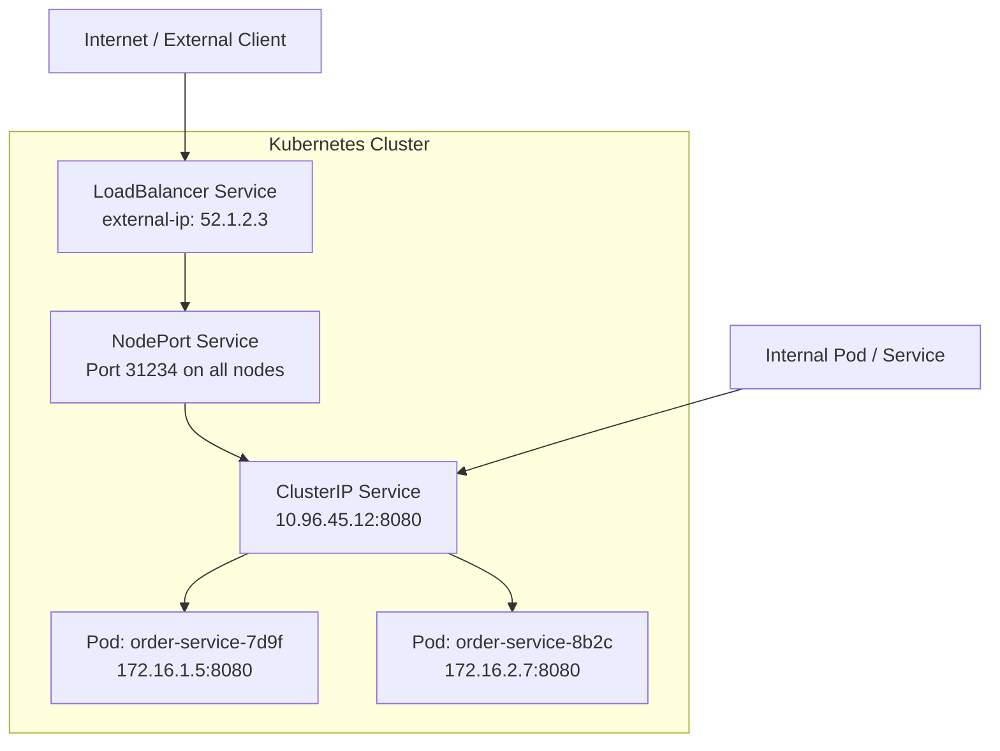

# Kubernetes Deep Dive
{: .no_toc }

<details open markdown="block">
  <summary>Table of Contents</summary>
  {: .text-delta }
1. TOC
{:toc}
</details>

Kubernetes is a container orchestration platform that automates deployment, scaling, and recovery of containerized workloads. Understanding it deeply means knowing not just the API objects but the mechanics underneath: how the scheduler places pods, why requests and limits behave differently for CPU vs memory, why StatefulSets are not Deployments with PVCs, and how the Operator pattern extends Kubernetes to manage complex stateful systems declaratively.

---

## Architecture

### Control Plane Components

```
┌─────────────────────────────────────────────────────────────────┐
│                        Control Plane                            │
│                                                                 │
│  ┌──────────────┐  ┌──────────────┐  ┌──────────────────────┐  │
│  │  API Server  │  │  Scheduler   │  │ Controller Manager   │  │
│  │  (kube-      │  │  (kube-      │  │  - ReplicaSet ctrl   │  │
│  │  apiserver)  │  │  scheduler)  │  │  - Node ctrl         │  │
│  │              │  │              │  │  - Endpoints ctrl    │  │
│  └──────┬───────┘  └──────┬───────┘  └──────────────────────┘  │
│         │                 │                                     │
│  ┌──────▼───────────────────────────────────────────────────┐   │
│  │                        etcd                              │   │
│  │             (distributed key-value store)                │   │
│  └──────────────────────────────────────────────────────────┘   │
└─────────────────────────────────────────────────────────────────┘

┌──────────────────────┐  ┌──────────────────────┐
│      Worker Node     │  │      Worker Node     │
│  ┌────────────────┐  │  │  ┌────────────────┐  │
│  │    kubelet     │  │  │  │    kubelet     │  │
│  │  kube-proxy    │  │  │  │  kube-proxy    │  │
│  │ Container RT   │  │  │  │ Container RT   │  │
│  │ (containerd)   │  │  │  │ (containerd)   │  │
│  │  ┌──────────┐  │  │  │  │  ┌──────────┐  │  │
│  │  │   Pod    │  │  │  │  │  │   Pod    │  │  │
│  │  └──────────┘  │  │  │  │  └──────────┘  │  │
│  └────────────────┘  │  │  └────────────────┘  │
└──────────────────────┘  └──────────────────────┘
```

| Component | Role |
|:----------|:-----|
| **API Server** | The single entry point for all cluster state. Every `kubectl` command, controller, and kubelet communicates through the API server. Validates and persists objects to etcd. |
| **etcd** | The cluster's brain — a strongly consistent distributed key-value store holding all cluster state. Every resource (pods, configs, secrets) is stored here. Lose etcd without a backup = lose the cluster. |
| **Scheduler** | Watches for unscheduled pods. Selects the best node by filtering (do nodes meet resource requests, node selectors, taints?) then scoring (prefer nodes with more spare capacity, pod affinity, etc.). |
| **Controller Manager** | Runs a suite of reconciliation loops. Each controller watches the desired state (API server) and drives actual state toward it: ReplicaSet ensures N replicas exist, Node controller marks nodes NotReady when health checks fail. |
| **kubelet** | Agent on every node. Receives pod specs from the API server and ensures the containers are running. Reports node and pod status back. |
| **kube-proxy** | Maintains iptables / IPVS rules on each node that implement Service load balancing. Not a proxy in the traditional sense — it configures kernel-level packet routing. |

### Pod Scheduling Flow

```
kubectl apply -f order-service-deployment.yaml
        │
        ▼
1. API Server validates + persists Deployment to etcd
        │
        ▼
2. ReplicaSet controller creates Pod objects (status: Pending, no nodeName)
        │
        ▼
3. Scheduler watches for Pending pods → selects node:
   a. Filter: enough CPU/memory? PVC available? Toleration matches taint?
   b. Score: bin-packing vs spreading, affinity rules, image already cached
   c. Bind: writes nodeName to Pod spec
        │
        ▼
4. kubelet on selected node watches for pods with its nodeName
   → pulls container image → starts containers via containerd
        │
        ▼
5. kubelet reports pod status → Running
```

---

## Workload Resources

### Deployment (Stateless Services)

Deployments are for **stateless** workloads where pods are interchangeable. Rolling updates replace pods gradually, and rollback reverts to a previous ReplicaSet.

```yaml
apiVersion: apps/v1
kind: Deployment
metadata:
  name: order-service
  namespace: production
spec:
  replicas: 3
  selector:
    matchLabels:
      app: order-service
  strategy:
    type: RollingUpdate
    rollingUpdate:
      maxSurge: 1          # allow 1 extra pod during update (4 total briefly)
      maxUnavailable: 0    # never reduce below 3 healthy pods
  template:
    metadata:
      labels:
        app: order-service
    spec:
      containers:
        - name: order-service
          image: registry.example.com/order-service:v2.1.0
          ports:
            - containerPort: 8080
          resources:
            requests:
              cpu: "500m"
              memory: "512Mi"
            limits:
              cpu: "2"
              memory: "1Gi"
          readinessProbe:
            httpGet:
              path: /actuator/health/readiness
              port: 8080
            initialDelaySeconds: 15
            periodSeconds: 5
          livenessProbe:
            httpGet:
              path: /actuator/health/liveness
              port: 8080
            initialDelaySeconds: 30
            periodSeconds: 10
            failureThreshold: 3
```

```bash
# Rollback to previous version if the new deployment causes errors
kubectl rollout undo deployment/order-service
kubectl rollout undo deployment/order-service --to-revision=3
kubectl rollout history deployment/order-service
```

### StatefulSet (Stateful Services)

StatefulSets give pods **stable, persistent identities**: a predictable name (`kafka-0`, `kafka-1`, `kafka-2`), a stable DNS hostname, and a dedicated PVC that follows the pod across rescheduling.

Use for: databases, Kafka brokers, Zookeeper, Elasticsearch nodes — anything that has state tied to a specific instance identity.

```yaml
apiVersion: apps/v1
kind: StatefulSet
metadata:
  name: kafka
  namespace: production
spec:
  serviceName: kafka-headless    # required: points to the headless service for DNS
  replicas: 3
  selector:
    matchLabels:
      app: kafka
  template:
    metadata:
      labels:
        app: kafka
    spec:
      containers:
        - name: kafka
          image: confluentinc/cp-kafka:7.6.0
          ports:
            - containerPort: 9092
          env:
            - name: KAFKA_BROKER_ID
              valueFrom:
                fieldRef:
                  fieldPath: metadata.name   # "kafka-0", "kafka-1", "kafka-2"
            - name: KAFKA_ZOOKEEPER_CONNECT
              value: "zookeeper-0.zookeeper-headless:2181,zookeeper-1.zookeeper-headless:2181"
          volumeMounts:
            - name: kafka-data
              mountPath: /var/lib/kafka/data
  volumeClaimTemplates:
    - metadata:
        name: kafka-data
      spec:
        accessModes: ["ReadWriteOnce"]
        storageClassName: gp3
        resources:
          requests:
            storage: 100Gi
        # Each pod (kafka-0, kafka-1, kafka-2) gets its own PVC:
        # kafka-data-kafka-0, kafka-data-kafka-1, kafka-data-kafka-2
        # PVCs survive pod deletion — data is not lost when kafka-0 is rescheduled
```

```
StatefulSet pod identity:
  kafka-0 → hostname: kafka-0.kafka-headless.production.svc.cluster.local
  kafka-1 → hostname: kafka-1.kafka-headless.production.svc.cluster.local
  kafka-2 → hostname: kafka-2.kafka-headless.production.svc.cluster.local
```

**Key StatefulSet behaviors:**
- Pods are created in order (0, 1, 2) and deleted in reverse (2, 1, 0)
- A pod is not started until its predecessor is Running and Ready
- PVCs are NOT deleted when the StatefulSet is deleted — manual cleanup required (data protection)

### DaemonSet (Per-Node Agents)

DaemonSets ensure exactly one pod runs on every node (or a subset via node selectors). Used for infrastructure agents that must run on every node.

```yaml
apiVersion: apps/v1
kind: DaemonSet
metadata:
  name: filebeat
  namespace: kube-system
spec:
  selector:
    matchLabels:
      app: filebeat
  template:
    metadata:
      labels:
        app: filebeat
    spec:
      tolerations:
        # Run on control plane nodes too (normally tainted to reject user workloads)
        - key: node-role.kubernetes.io/control-plane
          effect: NoSchedule
      containers:
        - name: filebeat
          image: docker.elastic.co/beats/filebeat:8.13.0
          volumeMounts:
            - name: varlog
              mountPath: /var/log
              readOnly: true
            - name: varlibdockercontainers
              mountPath: /var/lib/docker/containers
              readOnly: true
      volumes:
        - name: varlog
          hostPath:
            path: /var/log
        - name: varlibdockercontainers
          hostPath:
            path: /var/lib/docker/containers
```

Use cases: Filebeat/Fluentd (log collection), Prometheus node-exporter (node metrics), CNI plugins (Calico, Cilium), intrusion detection agents.

| Resource | Identity | Scaling | Storage | Use case |
|:---------|:---------|:--------|:--------|:---------|
| **Deployment** | Ephemeral, interchangeable | Any replica count | Shared volumes only | Stateless services |
| **StatefulSet** | Stable (ordered names + DNS) | Ordered scale up/down | Dedicated PVCs per pod | Databases, brokers |
| **DaemonSet** | One per node | Scales with cluster | Host path or shared | Node-level agents |

---

## Resource Management

### Requests vs Limits

Kubernetes resource management has two distinct controls per container:

- **Request:** The minimum guaranteed allocation. The scheduler uses requests to decide if a node has enough room. A pod's requests must fit on the node or it stays Pending.
- **Limit:** The maximum a container can consume. Exceeding the limit triggers throttling (CPU) or OOMKill (memory).

```
                CPU                         Memory
  
  Request:  Scheduling guarantee.      Scheduling guarantee.
            Pod is placed on a node    Pod is placed on a node
            with this much available.  with this much available.
  
  Limit:    Throttled (cgroups).       OOMKilled (process killed).
            Container gets less CPU    Pod is restarted.
            but keeps running.
```

**CPU throttling** is graceful — the container runs slower. **Memory OOMKill** is abrupt — the pod is killed and restarted. Never set a memory limit below the application's working set.

```yaml
resources:
  requests:
    cpu: "500m"      # 0.5 vCPU guaranteed; scheduler only places pod if 0.5 vCPU is free
    memory: "512Mi"  # 512 MiB guaranteed
  limits:
    cpu: "2"         # burst up to 2 vCPU; throttled beyond this
    memory: "1Gi"    # killed if heap + metaspace + direct buffer exceeds 1 GiB
```

**Quality of Service (QoS) classes:**
- **Guaranteed:** requests == limits for all containers → never evicted under memory pressure (except OOM)
- **Burstable:** requests < limits → evicted after BestEffort pods under memory pressure
- **BestEffort:** no requests or limits set → first to be evicted

### Horizontal Pod Autoscaler (HPA)

HPA scales replica count based on observed metrics (CPU, memory, or custom metrics via the Metrics API).

```yaml
apiVersion: autoscaling/v2
kind: HorizontalPodAutoscaler
metadata:
  name: order-service-hpa
spec:
  scaleTargetRef:
    apiVersion: apps/v1
    kind: Deployment
    name: order-service
  minReplicas: 2
  maxReplicas: 20
  metrics:
    - type: Resource
      resource:
        name: cpu
        target:
          type: Utilization
          averageUtilization: 70    # scale out when avg CPU across pods > 70% of request
    - type: Resource
      resource:
        name: memory
        target:
          type: Utilization
          averageUtilization: 80
  behavior:
    scaleUp:
      stabilizationWindowSeconds: 60    # wait 60s before scaling up again
      policies:
        - type: Pods
          value: 4
          periodSeconds: 60             # add max 4 pods per minute
    scaleDown:
      stabilizationWindowSeconds: 300   # wait 5 min before scaling down (avoid flapping)
```

### KEDA — Event-Driven Autoscaling

HPA only knows about CPU and memory. KEDA (Kubernetes Event-Driven Autoscaling) extends the HPA interface to scale on external signals: Kafka consumer lag, SQS queue depth, Redis list length, Prometheus queries.

```yaml
apiVersion: keda.sh/v1alpha1
kind: ScaledObject
metadata:
  name: order-processor-scaler
spec:
  scaleTargetRef:
    name: order-processor
  minReplicaCount: 1
  maxReplicaCount: 50
  triggers:
    - type: kafka
      metadata:
        bootstrapServers: kafka.production:9092
        consumerGroup: order-processor-group
        topic: orders
        lagThreshold: "100"     # 1 replica per 100 messages of lag
        # If lag = 1000, KEDA scales to 10 replicas
```

**Why KEDA over HPA for queue consumers:** CPU utilization is a lagging indicator for consumers. A consumer can sit at 20% CPU while Kafka lag grows to 100,000 messages because it is I/O-bound waiting on DB writes. KEDA scales on the actual business signal — message backlog.

### Vertical Pod Autoscaler (VPA)

VPA adjusts the requests/limits of running pods based on observed usage, right-sizing containers over time. It does not scale replica count.

```yaml
apiVersion: autoscaling.k8s.io/v1
kind: VerticalPodAutoscaler
metadata:
  name: order-service-vpa
spec:
  targetRef:
    apiVersion: apps/v1
    kind: Deployment
    name: order-service
  updatePolicy:
    updateMode: "Auto"    # "Auto" = evict and restart pods with new requests/limits
                          # "Off" = recommendation only, no automatic changes
  resourcePolicy:
    containerPolicies:
      - containerName: order-service
        minAllowed:
          cpu: "100m"
          memory: "256Mi"
        maxAllowed:
          cpu: "4"
          memory: "4Gi"
```

**VPA limitation:** VPA and HPA cannot both manage CPU/memory on the same deployment (they conflict). A common pattern: use VPA in recommendation mode to inform the right initial requests, then use HPA for replica scaling.

---

## Networking

### Service Types



| Type | Reachable from | Use case | How |
|:-----|:--------------|:---------|:----|
| **ClusterIP** | Inside cluster only | Service-to-service communication | Virtual IP + iptables rules via kube-proxy |
| **NodePort** | Outside cluster (via any node IP) | Dev/testing; direct node access | Exposes port 30000–32767 on every node |
| **LoadBalancer** | Internet (via cloud LB) | Production external traffic | Cloud provider creates NLB/ALB; points to NodePort |
| **ExternalName** | Inside cluster | Map a service name to an external DNS | CNAME DNS alias |

### Ingress

An Ingress is an L7 routing rule. An Ingress Controller (NGINX, Traefik, AWS ALB Ingress) watches Ingress resources and configures itself to route HTTP/HTTPS traffic.

```yaml
apiVersion: networking.k8s.io/v1
kind: Ingress
metadata:
  name: api-ingress
  annotations:
    nginx.ingress.kubernetes.io/rewrite-target: /
    nginx.ingress.kubernetes.io/rate-limit: "100"
    cert-manager.io/cluster-issuer: letsencrypt-prod   # auto-provision TLS cert
spec:
  ingressClassName: nginx
  tls:
    - hosts:
        - api.example.com
      secretName: api-tls-cert    # cert-manager writes the TLS cert here
  rules:
    - host: api.example.com
      http:
        paths:
          - path: /orders
            pathType: Prefix
            backend:
              service:
                name: order-service
                port:
                  number: 8080
          - path: /inventory
            pathType: Prefix
            backend:
              service:
                name: inventory-service
                port:
                  number: 8080
```

### Network Policies

By default, every pod can communicate with every other pod in the cluster. NetworkPolicies are the pod-level firewall. Without them, a compromised frontend pod can reach the payment database directly.

```yaml
# Isolate the order-service: only accept traffic from the api-gateway namespace
apiVersion: networking.k8s.io/v1
kind: NetworkPolicy
metadata:
  name: order-service-ingress-policy
  namespace: production
spec:
  podSelector:
    matchLabels:
      app: order-service
  policyTypes:
    - Ingress
    - Egress
  ingress:
    - from:
        - namespaceSelector:
            matchLabels:
              kubernetes.io/metadata.name: api-gateway   # only from api-gateway namespace
        - podSelector:
            matchLabels:
              app: order-processor                        # or from order-processor in same namespace
      ports:
        - protocol: TCP
          port: 8080
  egress:
    - to:
        - podSelector:
            matchLabels:
              app: postgres                              # can reach postgres
      ports:
        - protocol: TCP
          port: 5432
    - to:
        - namespaceSelector:
            matchLabels:
              kubernetes.io/metadata.name: kafka         # can reach kafka namespace
      ports:
        - protocol: TCP
          port: 9092
    # Allow DNS resolution
    - ports:
        - protocol: UDP
          port: 53
```

---

## Storage

### PV / PVC / StorageClass

```
StorageClass (cluster admin)
  → defines: provisioner, volume type (gp3, io2), reclaim policy
  
PersistentVolumeClaim (developer)
  → requests: "give me 50Gi with ReadWriteOnce from StorageClass gp3"
  
PersistentVolume (created by StorageClass provisioner)
  → the actual AWS EBS volume, GCP PD, or NFS share
  → bound 1:1 to a PVC
```

```yaml
# StorageClass: dynamically provision AWS EBS gp3 volumes
apiVersion: storage.k8s.io/v1
kind: StorageClass
metadata:
  name: gp3
provisioner: ebs.csi.aws.com
parameters:
  type: gp3
  iops: "3000"
  throughput: "125"
reclaimPolicy: Retain      # don't delete the EBS volume when PVC is deleted
volumeBindingMode: WaitForFirstConsumer  # provision volume in the same AZ as the pod
allowVolumeExpansion: true

---
# PVC: developer requests storage
apiVersion: v1
kind: PersistentVolumeClaim
metadata:
  name: postgres-data
  namespace: production
spec:
  storageClassName: gp3
  accessModes:
    - ReadWriteOnce     # only one pod can mount at a time (typical for block storage)
  resources:
    requests:
      storage: 50Gi

---
# Pod mounting the PVC
spec:
  containers:
    - name: postgres
      image: postgres:16
      volumeMounts:
        - name: data
          mountPath: /var/lib/postgresql/data
  volumes:
    - name: data
      persistentVolumeClaim:
        claimName: postgres-data
```

**Access modes:**
- `ReadWriteOnce` (RWO): one node mounts read-write (block storage: EBS, local SSD)
- `ReadOnlyMany` (ROX): many nodes mount read-only (NFS, object storage)
- `ReadWriteMany` (RWX): many nodes mount read-write (NFS, EFS, CephFS)

---

## Helm

Helm is the package manager for Kubernetes. It templates YAML manifests and manages releases — install, upgrade, rollback, and uninstall — as atomic operations.

```
my-order-service/            # Helm chart
  Chart.yaml                 # chart metadata: name, version, appVersion
  values.yaml                # default values — override per environment
  templates/
    deployment.yaml
    service.yaml
    configmap.yaml
    hpa.yaml
    _helpers.tpl             # named template fragments (shared across templates)
```

```yaml
# values.yaml
replicaCount: 3
image:
  repository: registry.example.com/order-service
  tag: "v2.1.0"
  pullPolicy: IfNotPresent
resources:
  requests:
    cpu: "500m"
    memory: "512Mi"
  limits:
    cpu: "2"
    memory: "1Gi"
autoscaling:
  enabled: true
  minReplicas: 2
  maxReplicas: 20
  targetCPUUtilizationPercentage: 70
config:
  database:
    url: "jdbc:postgresql://postgres:5432/orders"
  kafka:
    bootstrapServers: "kafka:9092"
```

```yaml
# templates/deployment.yaml
apiVersion: apps/v1
kind: Deployment
metadata:
  name: {{ include "order-service.fullname" . }}
  labels:
    {{- include "order-service.labels" . | nindent 4 }}
spec:
  {{- if not .Values.autoscaling.enabled }}
  replicas: {{ .Values.replicaCount }}
  {{- end }}
  selector:
    matchLabels:
      {{- include "order-service.selectorLabels" . | nindent 6 }}
  template:
    spec:
      containers:
        - name: {{ .Chart.Name }}
          image: "{{ .Values.image.repository }}:{{ .Values.image.tag }}"
          imagePullPolicy: {{ .Values.image.pullPolicy }}
          resources:
            {{- toYaml .Values.resources | nindent 12 }}
          env:
            - name: SPRING_DATASOURCE_URL
              value: {{ .Values.config.database.url | quote }}
            - name: DB_PASSWORD
              valueFrom:
                secretKeyRef:
                  name: {{ include "order-service.fullname" . }}-db-secret
                  key: password
```

```bash
# Deploy to staging with overridden values
helm upgrade --install order-service ./my-order-service \
  --namespace staging \
  --create-namespace \
  --values ./values-staging.yaml \
  --set image.tag=v2.2.0 \
  --wait --timeout 5m

# Rollback if the upgrade caused issues
helm rollback order-service 1 --namespace staging
```

---

## Operators

The Operator pattern extends Kubernetes with domain-specific automation. An Operator is a controller that watches a Custom Resource Definition (CRD) and takes actions to reconcile actual state with desired state — automating what a human operator would do.

### CRD and Custom Resource

```yaml
# The custom resource a developer writes (desired state)
apiVersion: kafka.strimzi.io/v1beta2
kind: Kafka
metadata:
  name: production-kafka
  namespace: kafka
spec:
  kafka:
    replicas: 3
    storage:
      type: persistent-claim
      size: 100Gi
      class: gp3
    config:
      offsets.topic.replication.factor: 3
      transaction.state.log.replication.factor: 3
  zookeeper:
    replicas: 3
    storage:
      type: persistent-claim
      size: 10Gi
      class: gp3
```

The Strimzi Kafka Operator watches `Kafka` resources and creates: a StatefulSet for Kafka brokers, a StatefulSet for ZooKeeper, Services, ConfigMaps, PVCs, and NetworkPolicies — all from a single, high-level `Kafka` manifest. Scaling, rolling upgrades, and certificate rotation are automated.

### Writing a Simple Operator (Spring-based)

```java
// A Java operator using the java-operator-sdk framework
// Watches DatabaseBackup CRs and triggers backup jobs

@ControllerConfiguration(namespaces = WATCH_ALL_NAMESPACES)
public class DatabaseBackupReconciler implements Reconciler<DatabaseBackup> {

    private final KubernetesClient kubernetesClient;
    private final BackupJobFactory jobFactory;

    @Override
    public UpdateControl<DatabaseBackup> reconcile(DatabaseBackup resource,
                                                     Context<DatabaseBackup> context) {
        DatabaseBackupSpec spec = resource.getSpec();
        DatabaseBackupStatus status = resource.getStatus();

        // Desired state: a backup job should exist for this schedule
        // Actual state: check if the job already ran today
        Optional<Job> existingJob = findTodaysJob(resource.getMetadata().getName());

        if (existingJob.isEmpty()) {
            Job job = jobFactory.createBackupJob(spec.getDatabase(), spec.getDestination());
            kubernetesClient.batch().v1().jobs()
                .inNamespace(resource.getMetadata().getNamespace())
                .resource(job).create();

            resource.setStatus(DatabaseBackupStatus.builder()
                .phase("Running")
                .lastScheduledTime(Instant.now())
                .build());
            return UpdateControl.patchStatus(resource);
        }

        return UpdateControl.noUpdate();
    }
}
```

**Real-world operators:** Strimzi (Kafka), Zalando Postgres Operator, Prometheus Operator, cert-manager, ArgoCD, Vault Agent Injector.

---

## Key Takeaways for Interviews

1. **Requests are for scheduling; limits are for enforcement.** CPU over-limit → throttled (still running). Memory over-limit → OOMKilled (pod restarted). Size memory limits above the JVM's max heap + metaspace + off-heap headroom.
2. **StatefulSet ≠ Deployment + storage.** The key difference is identity: StatefulSet pods have stable DNS hostnames and dedicated PVCs that survive pod deletion. Databases need this; stateless services do not.
3. **KEDA fills the gap HPA cannot.** CPU is a poor signal for queue consumers — the queue can grow while CPU stays low. KEDA scales on the actual work signal: Kafka lag, SQS depth, Prometheus query result.
4. **NetworkPolicies are deny-by-default only if you have at least one.** An empty cluster with no NetworkPolicies allows all pod-to-pod traffic. Apply a default-deny policy and then explicitly permit required flows.
5. **VolumeClaimTemplates in StatefulSets create PVCs per pod.** These PVCs are NOT deleted when you delete the StatefulSet — this is intentional data protection. Manual cleanup required.
6. **Helm releases are atomic, versioned, and rollback-able.** This is the key operational advantage over raw YAML: `helm rollback` reverts all resources in the release to a previous state in one command.
7. **Operators codify operational knowledge.** What a human DBA does to upgrade a Postgres major version — coordinate replicas, check replication lag, promote the new primary — an Operator does automatically, triggered by a CRD update.

---

## References

- *Kubernetes in Action* — Marko Luksa (2nd Ed, Manning)
- [Kubernetes Official Documentation](https://kubernetes.io/docs/)
- [KEDA Documentation](https://keda.sh/docs/)
- [Strimzi Kafka Operator](https://strimzi.io/)
- [Helm Documentation](https://helm.sh/docs/)
- [java-operator-sdk](https://javaoperatorsdk.io/)
- [cert-manager](https://cert-manager.io/docs/)
